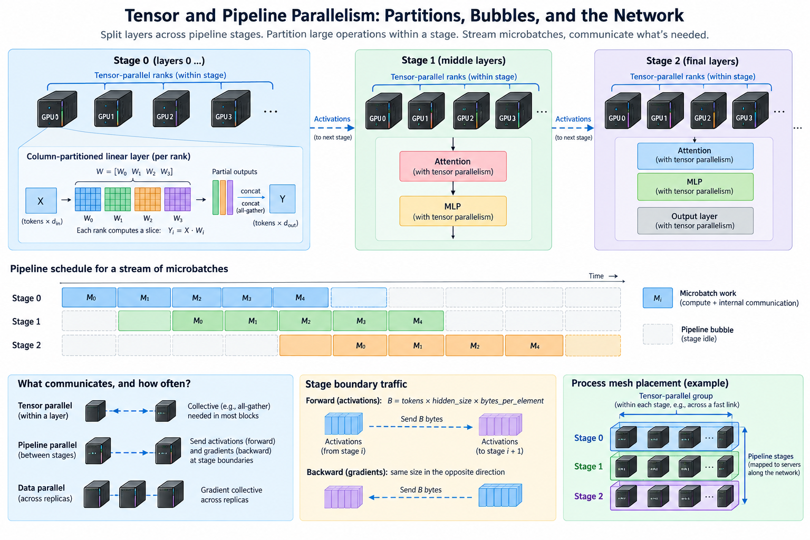
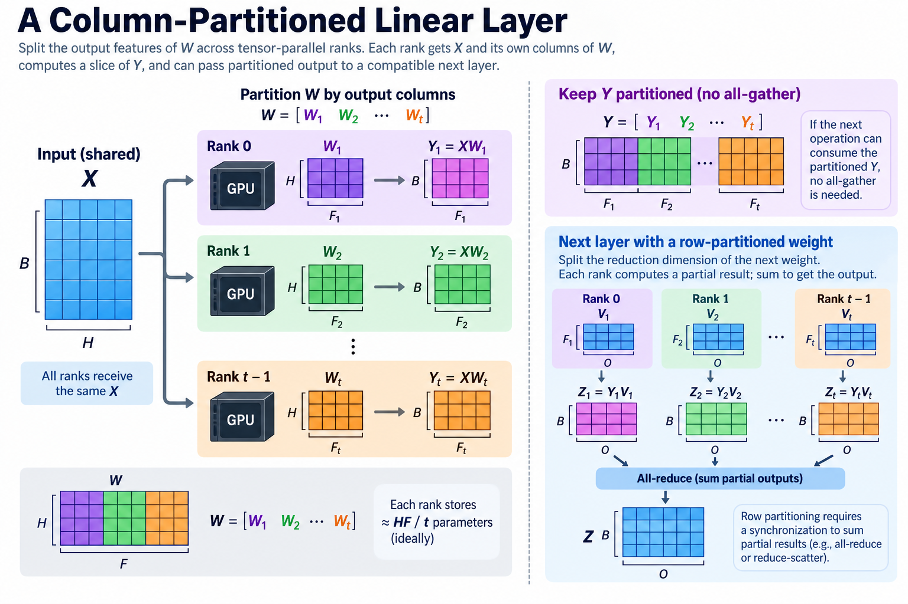
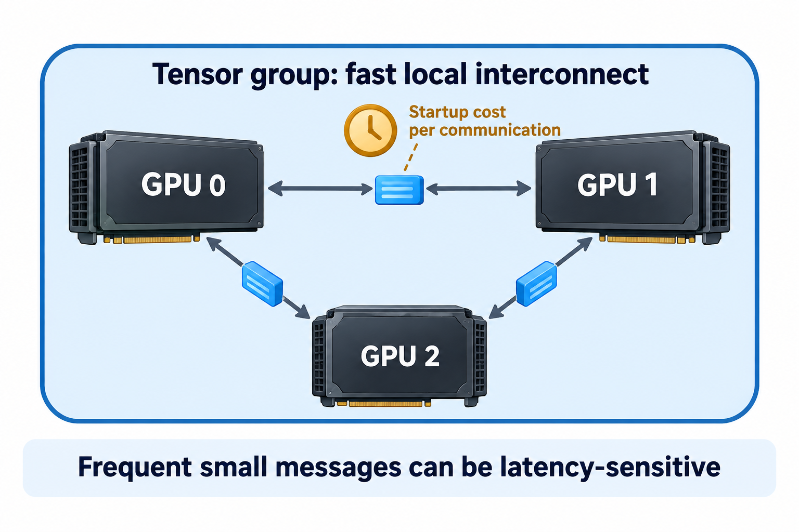
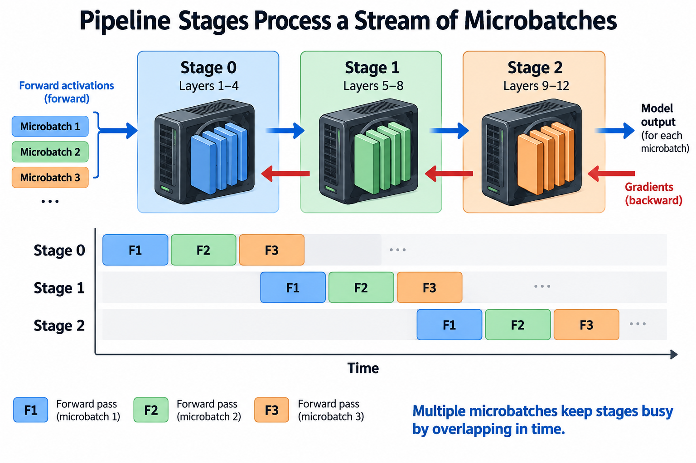

## Overview

When a model cannot be trained efficiently by replicating a complete instance, there are several ways to divide the work, and 2 of them run through this article: tensor parallelism splits operations inside layers, while pipeline parallelism assigns different layers to different stages, and both let multiple devices cooperate on one logical model, but their communication patterns and scheduling constraints are different.

A tensor-parallel rank may need a collective during nearly every block. A pipeline stage communicates at boundaries between layer ranges and can execute different microbatches concurrently with other stages. Combining the strategies requires 3 things: where tensors are partitioned, when their partial results must be combined, and how the process layout maps to physical links.

We will derive 3 things, a matrix-partition example, a balanced pipeline bubble model, and a boundary-traffic calculation. These are analytical models. Actual implementations can fuse collectives, partition activations, interleave stages, and overlap communication in ways that require a more detailed trace.

## Deep dive

### 1. Distinguish the computation being divided

Data parallelism assigns different training examples to replicas, tensor parallelism assigns different parts of one layer’s arithmetic to cooperating ranks, and pipeline parallelism assigns different layer ranges to stages that process a stream of microbatches. These 3 dimensions can coexist in a process mesh.

The distinction matters for ownership and communication. A data-parallel gradient collective combines contributions from different examples, a tensor-parallel collective combines or distributes the pieces needed to evaluate 1 model operation, and a pipeline transfer carries activations or their gradients from 1 stage to its neighbor.

Sharding optimizer state is another ownership decision. It need not coincide with either the tensor partition or the pipeline stage boundary. Describe the complete layout rather than assuming the term “distributed” identifies 1 algorithm. The same device count can represent very different memory budgets and traffic patterns.

Start from the logical computation, meaning matrix shapes, layer dependencies, batch and sequence dimensions, and gradient flow, then assign those objects to ranks, because starting instead with a desired GPU count and only later discovering which collectives it requires can produce an expensive or infeasible layout.

### 2. Work a column-partitioned linear layer

Consider a linear transformation Y equal to XW, with X shaped B by H and W shaped H by F, and partition the output-feature columns of W among t tensor-parallel ranks so that rank i computes its corresponding output slice using W_i.

$$
W=[W_1\;W_2\;\cdots\;W_t],
\qquad
Y_i=XW_i,
\qquad
Y=[Y_1\;Y_2\;\cdots\;Y_t].
$$

Each rank needs X and its own parameter slice. If the next operation can consume the partitioned output, a full all-gather of Y may not be needed. A compatible 2nd linear transformation can instead use a row partition and combine partial results at the appropriate point.

For a row-partitioned matrix product, splitting the reduction dimension gives partial outputs whose sum forms the final result, and that sum adds a synchronization dependency, often expressed with all-reduce or a reduce-scatter followed by later distribution, so the exact collective depends on the activation layout maintained between operations.

For an H by F weight matrix, ideal parameter storage falls to about HF divided by t elements per rank. Arithmetic also partitions ideally, but startup and communication do not necessarily fall with t. Increasing tensor degree eventually makes small local operations and frequent synchronization dominate. The best degree is a workload and topology decision.

### 3. Account for tensor-parallel communication frequency

A Transformer block contains operations whose tensor layouts can be chosen to reduce unnecessary gathers. Those layouts require carefully matched backward communication as well. A forward partition that appears efficient in isolation can introduce an expensive gradient dependency later.

A simple latency model for K communication operations in one microstep is

$$
T_{\mathrm{communication}}\approx\sum_{k=1}^{K}\left(\alpha_k+\frac{S_k}{\beta_k}\right),
$$

where alpha is startup, S is payload under the chosen convention, and beta is effective throughput. This is a schematic critical-path contribution before overlap, not an exact collective algorithm formula.

Small tensor-parallel messages can be latency-sensitive because the schedule synchronizes repeatedly. A network with excellent bulk bandwidth may still produce poor step time if each operation pays a large startup cost or crosses a slow topology boundary. Measure the actual sizes and rank groups rather than substituting 1 large all-reduce benchmark.

Place frequently communicating tensor groups within the fastest feasible local interconnect domain when the model and resource constraints allow it. That is a reasoned starting point, not a guarantee that every optimal layout follows 1 rule. Memory capacity, expert placement, and total group dimensions can force tradeoffs that need complete measurements.

### 4. Pipeline stages process a stream of microbatches

A pipeline assigns consecutive or otherwise scheduled layer ranges to p stages. Forward activations move toward later stages; gradients flow backward. 1 microbatch by itself leaves most stages waiting while it progresses, while several microbatches let different stages work concurrently.

A simple flush schedule first fills the forward pipeline, then runs backward and eventually drains it, while a 1-forward-1-backward schedule can alternate operations after a warmup, which reduces the number of retained activations compared with storing an entire forward flush, and interleaved schedules give ranks multiple logical chunks and can reduce bubbles at additional scheduling and communication cost.

The schedule determines when an optimizer update is legal, since gradients for the intended accumulation interval must be complete and synchronized as required, and some pipeline algorithms change weight-version semantics or maintain multiple versions, which makes them learning-algorithm choices as well as systems choices.

Use an implementation whose update semantics match the desired reference. It is not enough that each stage computes a plausible forward and backward operation independently. The complete schedule must preserve the intended parameter version, loss weighting, and gradient accumulation.

### 5. Derive the balanced flush bubble model

For a simple balanced pipeline with m microbatches and p stages, a commonly used schematic utilization model is

$$
U\approx\frac{m}{m+p-1},
\qquad
B_{\mathrm{bubble}}\approx\frac{p-1}{m+p-1}.
$$

The model assumes comparable stage times and a specific fill-and-drain interpretation. It does not capture arbitrary interleaving, unequal forward and backward costs, communication stalls, or optimizer timing. Its useful lesson is that more microbatches amortize the fixed p-1 stages of fill and drain.

With p equal to 8 and m equal to 32, the estimated bubble fraction is 7 divided by 39, about 17.9%. Increasing m to 128 gives 7 divided by 135, about 5.2%. That change also increases the accumulation interval unless other batch dimensions change.

You cannot raise the microbatch count without considering memory and the intended training batch: a flush schedule may keep more activations as more microbatches remain in flight, smaller microbatches can lower local compute efficiency, and gradient accumulation affects optimizer-update frequency and loss scaling. Report these changes when using a larger m to improve pipeline utilization.

### 6. Stage imbalance can dominate the bubble

Dividing layers equally does not necessarily divide execution time equally, and 6 factors can make some layer ranges more expensive than others: embeddings, output projections, attention lengths, expert routing, checkpoint recomputation, and communication. The slowest stage limits steady-state throughput.

If stage durations are c_i, an idealized steady-state microbatch interval is bounded below by the largest c_i. With stages taking 4, 4, 7, and 4 milliseconds, the interval cannot be 4 milliseconds just because most stages achieve it. The 7-millisecond stage creates waiting upstream and downstream.

Balance stages using measured representative workloads, including backward and recomputation. Parameter count is useful for storage placement but is not a complete proxy for stage execution cost. Variable sequence lengths can also change the balance, so evaluate the admitted workload distribution rather than 1 unusually short batch.

A profiler timeline should show stage activity and boundary transfers together. Distinguish 4 causes, namely waiting for incoming activations, waiting for outgoing buffer reuse, delayed gradients, and local kernels, because all 4 can appear as idle GPU time while pointing to different scheduling changes.

### 7. Derive pipeline boundary bytes

Suppose a boundary transfers a hidden-state activation with microbatch size B, sequence length L, hidden width H, and b-byte elements. The raw payload is

$$
S_{\mathrm{boundary}}=BLHb.
$$

For B equal to 2, L equal to 4096, H equal to 4096, and b equal to 2, the payload is 64 MiB. A corresponding backward gradient can create another similar-sized transfer, depending on partitioning and representation. Multiply by the number of microbatches and relevant boundaries to understand aggregate traffic.

This calculation does not assume every implementation transfers the complete replicated activation: sequence or tensor partitioning can change the boundary shape, while compression, fused communication, or layout conversions can change both the bytes and the additional work. Inspect the actual tensors transmitted by the schedule.

Boundary bandwidth matters when the transfer cannot finish inside available overlap, startup matters when many small microbatches generate many transfers, and shared links can carry tensor, data, or expert-parallel traffic at the same time. An isolated point-to-point benchmark is a useful component check, but it does not prove complete pipeline performance.

### 8. Build and place the process mesh deliberately

A simple combined layout has 3 degrees, d for data, t for tensor, and p for pipeline, with total rank count d times t times p. For additional expert or context dimensions, specify whether they replace, factor, or overlap parts of those groups. Multiplying every named parallelism degree blindly can double-count ranks.

Define each of the 3 process groups and identify its dominant messages: tensor groups often communicate frequently within blocks, pipeline groups exchange boundary states, and data groups synchronize parameter gradients or state shards. Map these groups onto local and scale-out links with attention to bandwidth, startup, and contention.

Keep the layout description with the experiment configuration. A rank-number permutation can change physical routes without changing the logical model code. Conversely, moving from 1 node type to another can change the best factorization. Topology-aware placement is part of the method, not an incidental launch detail.

Before a long run, test every relevant collective and point-to-point route with representative payloads. Check correctness and timeout behavior across the actual ranks. A process mesh that launches successfully can still contain an unintended slow path that only appears during the full schedule.

### 9. Compare complete feasible schedules

Start with a small correctness reference whose full model fits, validate the partitioned update under the same loss and accumulation convention, then check activation and gradient shapes at boundaries, including the longest supported sequence and any padding masks.

For the target workload, report 4 numbers: per-rank peak memory, useful tokens per optimizer step, complete step time, and observed stage or tensor-group imbalance. Compare feasible layouts rather than a replicated baseline that would not fit. Include warmup, compilation, and communication initialization separately from steady-state timing where they matter.

Tune tensor degree, pipeline stage count, microbatch size, and microbatch count as interacting choices. Increasing 1 dimension can reduce local storage while increasing communication or bubbles. A trace and a transparent byte model make that tradeoff easier to explain than a table of device counts alone.

The final selection should satisfy capacity and supported workload limits while preserving training behavior. A configuration that produces more kernel activity but fewer useful optimizer updates is not necessarily an improvement. Evaluate the end-to-end learning schedule rather than treating parallelism as a collection of independent speedup multipliers.

## Conclusion

Tensor parallelism partitions operations and creates collective dependencies, while pipeline parallelism partitions layers and creates a fill, steady-state, and drain schedule. Their costs depend on tensor shapes, stage balance, microbatches, and physical placement.

Write the partitions and dependencies explicitly, derive the important bytes and bubbles, then verify the resulting update and timeline. Combining parallelism dimensions works best when their communication groups are designed as one complete process mesh.

### Sources

- [Megatron Core pipeline parallel API](https://docs.nvidia.com/megatron-core/developer-guide/latest/apidocs/core/core.pipeline_parallel.schedules.html): scheduling implementations and interleaved/non-interleaved execution.
- [Shoeybi et al., Megatron-LM](https://arxiv.org/abs/1909.08053): tensor partitioning for large language-model training.
- [Huang et al., GPipe](https://arxiv.org/abs/1811.06965): microbatch pipelines and fill/drain analysis.
- [Narayanan et al., Efficient Large-Scale Language Model Training on GPU Clusters](https://arxiv.org/abs/2104.04473): combined parallelism and pipeline scheduling.
