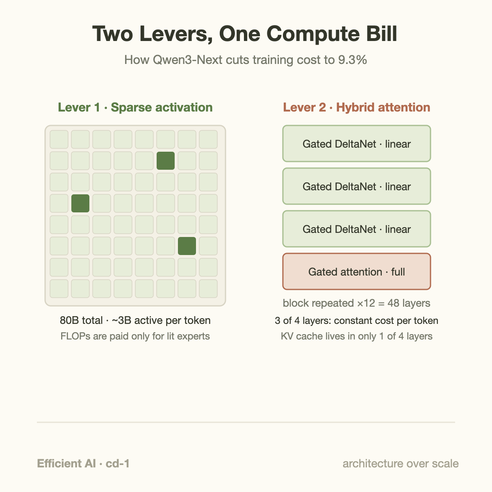
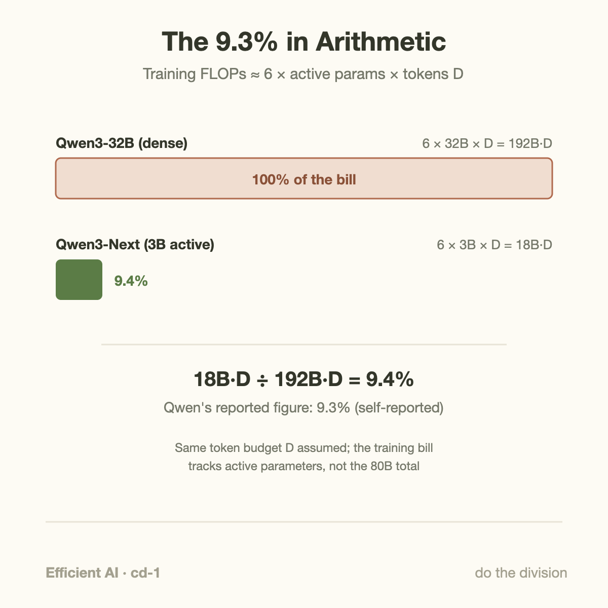
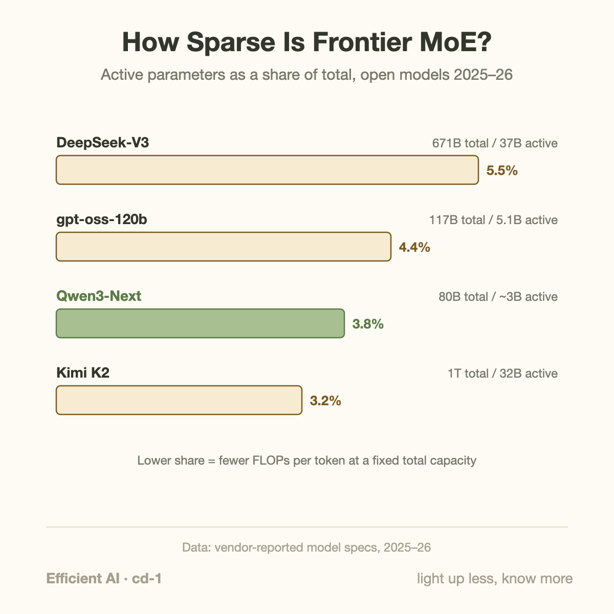

9.3 percent. That is the share of Qwen3-32B's training compute the Qwen team says it took to train Qwen3-Next-80B-A3B, a model they report as matching or beating the dense 32B model across their benchmark suite. Not half the compute. Not a quarter. Less than a tenth, for the same class of quality — with more than 10x the inference throughput once the context grows past 32K tokens.

Those are vendor numbers, published on Qwen's own blog, and we should treat them that way: self-reported, on benchmarks the vendor selected. But the claim is not magic, and that is exactly why it is worth unpacking. The 9.3% figure falls out of two architectural decisions that anyone can reason about with pencil and paper. This article does that arithmetic.

## Where the compute actually goes

Start with what a training bill is made of. For a transformer trained on $D$ tokens with $N$ parameters touched per token, the standard approximation for training compute is:

$$C \approx 6 \cdot N \cdot D$$

The 6 covers one forward pass (2 FLOPs per parameter per token, one multiply and one add) plus the backward pass (roughly twice the forward). This approximation, popularized by the OpenAI scaling-laws work, ignores attention's context-dependent term, which is fine at short contexts and increasingly not fine at long ones. So a model's compute bill has two knobs:

1. **How many parameters does each token actually touch?** In a dense model, every token flows through every weight. $N$ equals total parameter count, full stop.
2. **How much does each token pay to look at the tokens before it?** In standard attention, token number 50,000 compares itself against all 49,999 predecessors. That cost is invisible in the $6ND$ formula but grows quadratically with context length, and it dominates at the long contexts modern training runs and agentic workloads use.

Qwen3-Next attacks both knobs at once. That is the whole trick.

**Lever 1: sparse activation.** Qwen3-Next is a mixture-of-experts (MoE) model with 80 billion total parameters, of which only about 3 billion activate for any given token. An MoE layer replaces the transformer's single feed-forward block with many parallel "expert" blocks and a small router network that picks a few experts per token. The model's total capacity — the amount of knowledge it can store — scales with all 80B parameters. The compute per token scales only with the ~3B that fire. Capacity and compute, which a dense model welds together, come apart.

**Lever 2: hybrid linear attention.** Three out of every four layers replace standard attention with Gated DeltaNet, a linear-attention variant. Instead of storing every past token's key and value and comparing each new token against all of them, a linear-attention layer maintains a fixed-size state — think of it as a running summary matrix — that gets updated once per token. Cost per token: constant, regardless of whether the context holds 1K tokens or 256K. The remaining one layer in four keeps standard (gated) attention, for reasons we will get to, because pure linear attention has a known weakness.

Neither lever is new on its own. MoE dates to the 1990s and returned at scale with Google's sparsely-gated LSTM work in 2017. Linear attention has a five-year paper trail. What Qwen3-Next demonstrates is that stacking both, aggressively, holds up at frontier quality — and that the savings multiply rather than interfere.

## The worked example: deriving 9.3% by hand

Take the $6ND$ approximation and compare the two models on the same token budget $D$.

**Dense Qwen3-32B.** Every token touches all 32B parameters:

$$C_{dense} = 6 \times 32\text{B} \times D = 192\text{B} \times D \text{ FLOPs}$$

**Qwen3-Next-80B-A3B.** Every token touches only the ~3B active parameters (the router, shared expert, attention, and embeddings are all inside that figure):

$$C_{next} = 6 \times 3\text{B} \times D = 18\text{B} \times D \text{ FLOPs}$$

Divide:

$$\frac{18}{192} = 0.094 = 9.4\%$$

Qwen reports 9.3%. The back-of-envelope lands within a tenth of a percentage point of the official number. That is not a coincidence, and it is the single most useful thing to internalize about MoE economics: **the training bill tracks active parameters, not total parameters.** An 80B-total model with 3B active costs roughly what a 3B dense model costs to push a token through. The other 77B parameters sit in memory, waiting for the router to call on them, contributing capacity but not FLOPs.

Two honest caveats. First, this assumes comparable token budgets; if the two models saw different data volumes, the ratio shifts accordingly, and Qwen has not published a full FLOP accounting. Second, matching quality at 9.4% of the FLOPs is the claim doing the heavy lifting. Scaling folklore long held that sparse models need far more total parameters to match dense quality (Qwen3-Next uses 2.5x) and that training them stably at high sparsity is hard. The interesting news is not the division above; it is that the division survived contact with a benchmark suite.

Now the second lever, which the $6ND$ formula hides. At 32K context and beyond, standard attention's quadratic term stops being a rounding error. For inference the pain shows up as the KV cache: a standard attention layer must keep keys and values for every past token. Try illustrative numbers: a 48-layer model storing 2 KB of KV per token per layer (in FP16) needs 96 KB per token across a fully standard stack, which at a 128K context is about 12.6 GB per sequence, before you serve a second user. Cut standard attention to 12 of 48 layers and the cache drops to about 3.1 GB; the 36 DeltaNet layers hold small fixed-size states whose memory does not grow with context at all. That is where the reported >10x long-context prefill and decode throughput comes from, and it compounds with the MoE savings: fewer FLOPs per token, and each token drags far less memory traffic behind it. If you want the mechanical intuition for why the KV cache exists in the first place, [Attention in Plain Words](/blog/attention-in-plain-words/) builds it from scratch.

## Going deeper: why keep any full attention at all?

If linear attention is so cheap, why not use it everywhere? Because the fixed-size state is a lossy summary. Standard attention is exact retrieval: token 50,000 can look up token 17 verbatim, which is what you need for copying a serial number out of a document, matching a bracket 40K tokens back, or needle-in-a-haystack recall. Linear attention compresses history into a state matrix of constant size, and information theory is unforgiving about what a constant-size state can hold from an unbounded stream. Pure linear-attention models score well on perplexity and fall over on exact-recall tasks.

The hybrid is therefore not a compromise; it is a division of labor. DeltaNet layers handle the bulk of sequence mixing cheaply. The periodic full-attention layers act as precise random-access memory over the context. Qwen's ablation-driven 3:1 ratio says you need less exact retrieval than a uniform stack provides, but you cannot drop it to zero. IBM reached a similar design point independently with Granite 4.0, interleaving Mamba-2 and transformer layers 9:1 and claiming (their own charts) over 70% serving-RAM reduction at long context. Different linear-time operator, same architectural verdict.

The "gated" in Gated DeltaNet matters too. The delta rule updates the state selectively, overwriting the slot associated with the current key rather than adding on top of everything, and the gate lets the model decay stale state. Both mechanisms fight the mushing-together that plagued earlier linear attention. This is the same lineage of ideas we saw when [RNNs and LSTMs hit their wall](/blog/rnn-lstm-and-the-wall/): gates deciding what to keep and what to forget, now rebuilt inside a parallel-trainable operator.

There is a stability story underneath as well, and it is easy to miss. High-sparsity MoE training historically suffered from router collapse and loss spikes, each spike costing a rollback and wasted GPU-days. Qwen3-Next ships a bundle of unglamorous fixes (zero-centered layernorm weights and careful router normalization among them) aimed precisely at spike-free training. Moonshot's Kimi K2 makes the same point at larger scale: 1 trillion total parameters, 32B active — a 3.2% activation ratio — trained on 15.5 trillion tokens with, per the technical report, zero loss spikes, credited largely to the MuonClip optimizer. Stability is an efficiency feature. A run that never restarts is a run whose every FLOP counts, which is [goodput by another name](/blog/goodput-vs-utilization/).

Zoom out across 2025-26 open releases and the direction is unmistakable. DeepSeek-V3 activates 5.5% of its parameters, OpenAI's gpt-oss-120b about 4.4%, Qwen3-Next 3.8%, Kimi K2 3.2%. Each generation lights up a smaller fraction of a larger whole, and quality keeps climbing anyway.

## Common misconceptions

**"3B active means it's basically a 3B model."** No. Per-token compute matches a 3B dense model; capacity does not. Different tokens route to different experts, so across a document the model draws on far more than 3B distinct parameters. Benchmarks bear this out: 3B-class dense models do not touch Qwen3-32B, while Qwen3-Next reportedly does. The correct mental model is a library with 80B books and a rule that any single question may consult only 3B of them. The library's usefulness is set by the collection, not the per-question quota.

**"Linear attention has replaced full attention."** It has not, and Qwen3-Next is itself the counterexample: the team kept full attention in 25% of layers after ablations, precisely because pure linear stacks fail at exact recall. Every credible production hybrid (Qwen3-Next, Granite 4.0, the various Jamba-family models) retains some full-attention or full-KV layers. The honest headline is that full attention became a seasoning rather than the base, not that it disappeared.

**"9.3% training compute means ~10x cheaper for users, verified."** Two errors in one sentence. Training savings and inference savings are different quantities; the inference win here comes mostly from the KV-cache and throughput side, is context-length dependent, and total-parameter memory (80B weights must live somewhere, [and memory is the scarce resource](/blog/blackwell-to-rubin-memory-math/)) partially offsets it. And "verified" overstates things: the 9.3% figure, the benchmark parity, and the >10x throughput are all Qwen's own measurements. They are plausible and consistent with the arithmetic above, corroborated in direction by independent labs, but no neutral party has audited them.

## What this does to the scaling narrative

For a few years the field's working assumption was that capability tracked training FLOPs along smooth power laws, so the leaderboard belonged to whoever bought the most compute. Qwen3-Next and its cohort complicate that story in a specific way: the scaling laws still hold, but architecture keeps shifting the constant in front. A 10x improvement in capability-per-FLOP is worth the same, on the leaderboard, as a 10x bigger cluster, and 2025-26 delivered it through model design rather than procurement: extreme sparsity, hybrid attention, and (per Kimi K2) optimizers that eliminate wasted restarts. DeepSeek's V3.2-Exp closed the economic loop publicly by shipping sparse attention and a same-day 50%+ API price cut.

This matters most because the industry is running into a wall that money cannot quickly fix: power. With grid interconnect queues running five to seven years, the marginal frontier model increasingly gets trained inside a fixed energy envelope, and capability-per-FLOP becomes capability-per-megawatt. Architecture is the one lever that improves it without waiting on a substation. It also feeds back into hardware: sparse, hybrid models change what chips should be good at (memory capacity for resident experts, less HBM bandwidth burned on KV traffic), which is exactly the co-design loop this series keeps circling. The [transformer's original all-attention design](/blog/transformer-architecture-in-one-picture/) was itself a bet on what 2017 hardware did well; Qwen3-Next is the same bet re-placed for 2026.

The 9.3% model is not the end state. It is one clean, public data point on a curve the whole field is now racing down: how little of a model can you light up, and how little of the past can you store exactly, before quality notices?

## Takeaway

- Training compute tracks **active** parameters, not total: $6ND$ with $N = 3\text{B}$ versus $32\text{B}$ predicts 9.4%, within a hair of Qwen's reported 9.3% — the claim is arithmetic plus a quality result, not magic.
- The two levers multiply: MoE sparsity cuts FLOPs per token, hybrid linear attention cuts the context-dependent cost and shrinks the KV cache roughly 4x at a 3:1 ratio, driving the reported >10x long-context throughput.
- Every headline number here is vendor-reported; the trend, though, is corroborated across independent labs (Kimi K2 at 3.2% activation, Granite 4.0's 9:1 hybrid, DeepSeek's DSA price cut), and it points at capability-per-FLOP as the metric that now moves the frontier.

## Sources

- Qwen team, "Qwen3-Next: Towards Ultimate Training & Inference Efficiency" — [qwen.ai blog](https://qwen.ai/blog?id=4074cca80393150c248e508aa62983f9cb7d27cd&from=research.latest-advancements-list)
- Kimi Team, "Kimi K2: Open Agentic Intelligence" — [arXiv:2507.20534](https://arxiv.org/abs/2507.20534)
- DeepSeek, "DeepSeek-V3.2-Exp release: sparse attention and API price reduction" — [api-docs.deepseek.com](https://api-docs.deepseek.com/news/news250929/)
- IBM, "Granite 4.0: hyper-efficient, high-performance hybrid models" — [ibm.com](https://www.ibm.com/new/announcements/ibm-granite-4-0-hyper-efficient-high-performance-hybrid-models)
- Kaplan et al., "Scaling Laws for Neural Language Models" — [arXiv:2001.08361](https://arxiv.org/abs/2001.08361)
- Yang, Kautz, Hatamizadeh, "Gated Delta Networks: Improving Mamba2 with Delta Rule" (ICLR 2025)

*Part of the **Efficient AI & Co-Design** series. Previous: [Blackwell to Rubin memory math](/blog/blackwell-to-rubin-memory-math/). Next up in Co-Design Cases: how DeepSeek's sparse attention turned an architecture change into a same-day price cut.*
