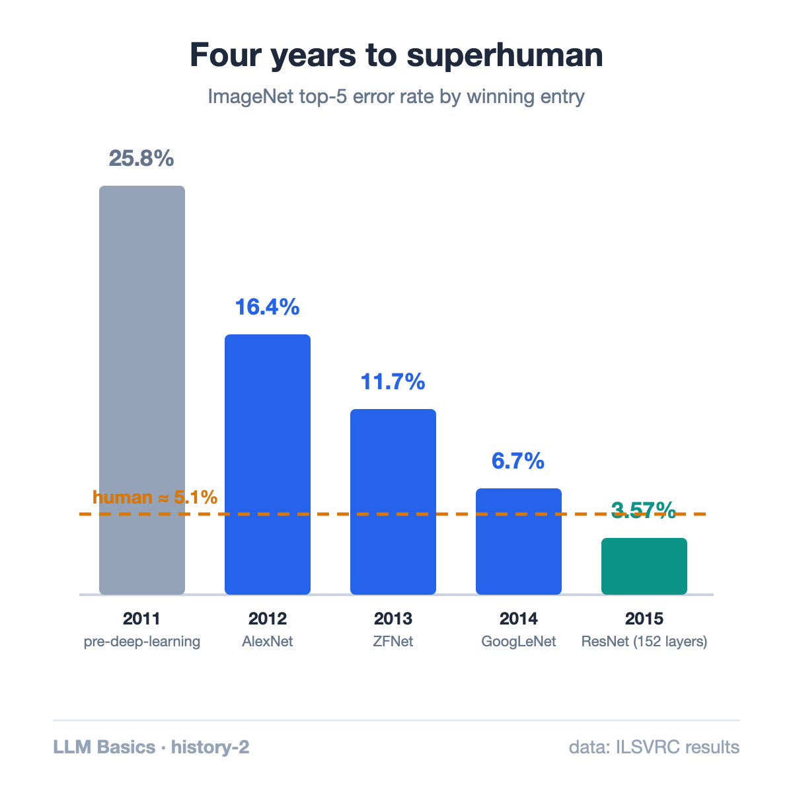
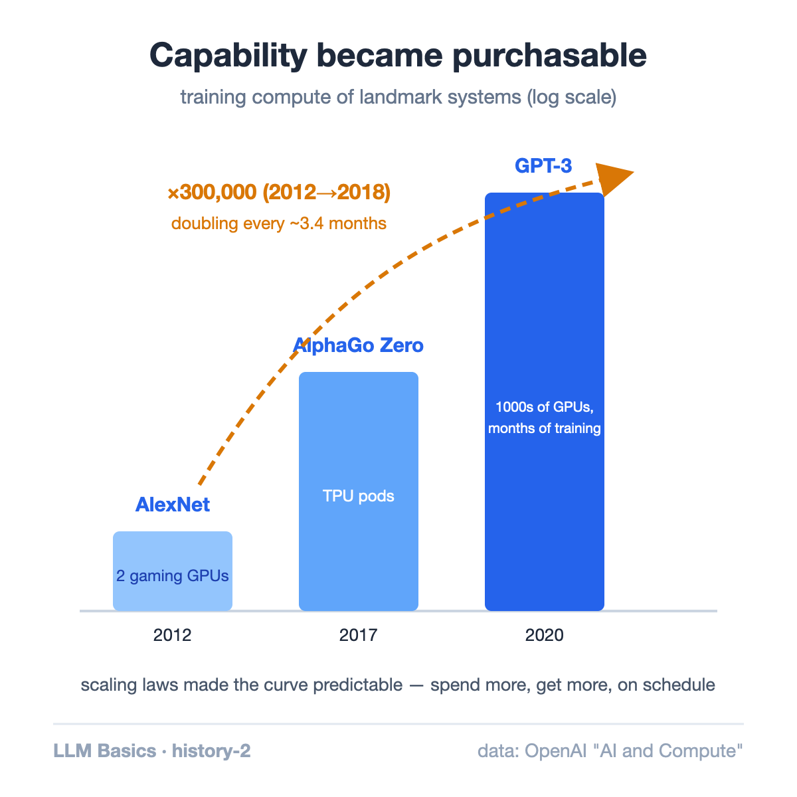

Between 2012 and 2018, the compute used to train the largest AI models grew more than **300,000-fold** — doubling roughly every 3.4 months, [by OpenAI's estimate](https://openai.com/research/ai-and-compute). Moore's law, for comparison, doubles every two years.

[Last article](/blog/how-ai-models-came-about/) ended in 2012, with AlexNet proving that a 26-year-old algorithm plus GPUs could crush four decades of hand-crafted approaches. This one covers what happened next: the decade in which that proof compounded into ChatGPT.

## 2012–2015: The vision gold rush

AlexNet's 11-point ImageNet win triggered a stampede. Every year, deeper networks cut the error further: VGG (2014) pushed to 19 layers, then Microsoft's [ResNet](https://arxiv.org/abs/1512.03385) (2015) introduced a trick — skip connections — that made *152-layer* networks trainable and drove ImageNet top-5 error to **3.57%**. The commonly cited human benchmark on the same task: about 5.1%. Three years after "computers can barely see," a network out-classified humans on the benchmark that defined seeing.

The pattern to notice: no new learning principle appeared. Depth, data, and architectural tricks to keep gradients flowing — the 1986 loop, scaled harder.

## 2016: The Go moment

Board-game Go was supposed to be decades away — its search space dwarfs chess, and intuition seemed essential. In March 2016, DeepMind's [AlphaGo beat Lee Sedol 4–1](https://www.nature.com/articles/nature16961), watched by an estimated 200+ million people. In game two, its move 37 — a shoulder hit no professional would play — was initially judged a mistake, then recognized as brilliant.

Technically, AlphaGo was deep networks (for intuition) plus search (for calculation) plus reinforcement learning (improving by playing itself). Culturally, it did something bigger: it moved "neural networks can do things we thought required human judgment" from a research claim to a televised fact.

## 2017: The architecture that ate the field

The next bottleneck was language. The recurrent networks of the era read text one word at a time, which made them both weak at long-range context and — the fatal flaw — impossible to parallelize across thousands of GPUs.

Google's 2017 paper ["Attention Is All You Need"](https://arxiv.org/abs/1706.03762) deleted recurrence entirely. Its Transformer processes every word *simultaneously*, each attending to all others. Two consequences followed: better handling of context, and — the historically decisive one — training that scales almost perfectly with more hardware. The architecture fit the machines. (How attention itself works gets a full article later in this series.)

## 2018–2020: Scale becomes the strategy

With a parallelizable architecture, one question remained: what happens if you just make it bigger? OpenAI's GPT series answered empirically:

- **GPT-1** (2018): 117M parameters — coherent sentences
- **GPT-2** (2019): 1.5B — coherent pages
- **GPT-3** (2020): [175B](https://arxiv.org/abs/2005.14165) — working code, translation, essays, from a model trained only to predict the next word

The eerie part was captured by OpenAI's ["scaling laws"](https://arxiv.org/abs/2001.08361): model performance improved as a smooth, predictable function of compute, data, and parameters. You could draw the line and see where more scale would land you. Capability had become, to an unsettling degree, *purchasable*.

## 2022: The interface moment

GPT-3.5 wrapped in a chat box launched in November 2022 as ChatGPT and reached an estimated 100 million users in two months — the fastest-adopted consumer product in history at the time. Nothing fundamental had changed in the model that month. What changed was access: the decade of compounding, suddenly behind a text box anyone could type into.

## The loop underneath the decade

Look back at the four milestones and one structure repeats: **a capability barrier assumed to need human-style intelligence → falls to the 1958 learning loop, run at a scale nobody had tried.** Vision (2015), intuition (2016), language (2020), conversation (2022).

That's also why this decade set up the *hardware* era this blog spends most of its time in. When capability follows compute predictably, whoever computes cheapest wins — and the frontier of AI becomes, in large part, an efficiency problem. Which is exactly where the story goes next.

## Takeaway

- 2012–2022 added no new learning principle. It scaled the guess-error-adjust loop ~300,000× in compute and let architecture (ResNet's skip connections, the Transformer's parallelism) remove the obstacles to scaling.
- Scaling laws made capability predictable from compute — turning AI progress into an economics problem.
- Every "only humans can do this" line of the decade — seeing, intuition, language — fell the same way. The pattern is the lesson.

## Sources

- He et al. (2015). ["Deep Residual Learning for Image Recognition"](https://arxiv.org/abs/1512.03385) (ResNet, 3.57%)
- Silver et al. (2016). ["Mastering the game of Go with deep neural networks and tree search"](https://www.nature.com/articles/nature16961), *Nature*
- Vaswani et al. (2017). ["Attention Is All You Need"](https://arxiv.org/abs/1706.03762)
- Brown et al. (2020). ["Language Models are Few-Shot Learners"](https://arxiv.org/abs/2005.14165) (GPT-3)
- Kaplan et al. (2020). ["Scaling Laws for Neural Language Models"](https://arxiv.org/abs/2001.08361)
- OpenAI (2018). ["AI and Compute"](https://openai.com/research/ai-and-compute)

---

*Part of the **Fundamental of LLM** series. Previous: [How AI models came about](/blog/how-ai-models-came-about/). Next: what a neural network really is — neurons, weights, and layers.*
