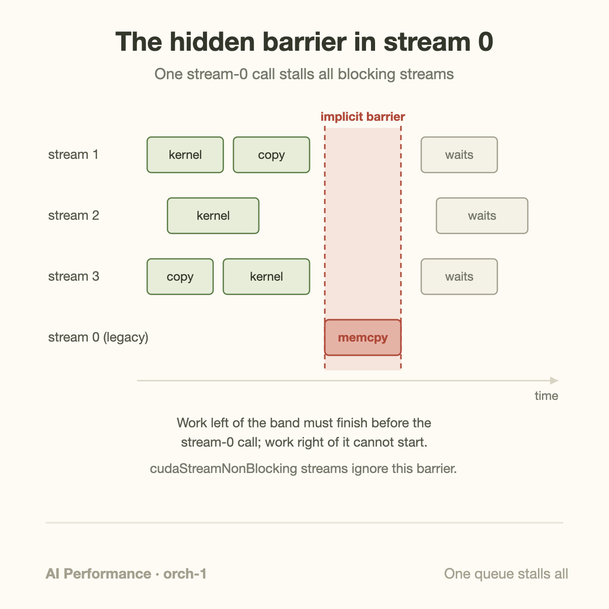
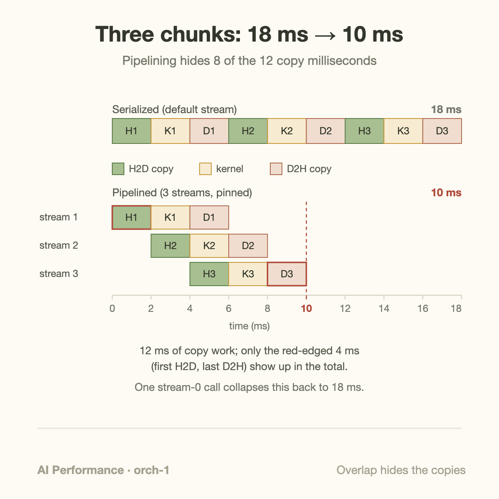

Nine GPU operations. Serialized, they take 18 ms. Pipelined across three streams, the same nine operations take 10 ms. And one `cudaMemcpy` issued on the wrong stream, anywhere in your process, snaps you right back to 18. That wrong stream has a name: the legacy default stream, also known as stream 0 or the NULL stream, and it is not a stream so much as a device-wide synchronization primitive wearing a stream costume.

This article is about what the default stream actually does, why "async" copies silently stop being async, and how the classic three-way overlap of transfer and compute works. If prefill/decode mechanics or latency metrics are new territory, start with [how an LLM generates text](/blog/how-an-llm-generates-text/); here we stay down at the CUDA runtime level.

## What a stream actually is

A CUDA stream is an ordered work queue. Everything you submit to a stream (kernel launches, memory copies, memset calls) executes in submission order within that stream. Across *different* streams, the hardware is free to run work concurrently, subject to resources. Streams are how you express independence to the GPU: "these two operations don't depend on each other, overlap them if you can."

The hardware that exploits this independence is real and specific. A modern data-center GPU has compute units (the SMs) plus several dedicated DMA copy engines. The copy engines move data across PCIe or NVLink without occupying a single SM. That means three things can genuinely happen in the same nanosecond: a host-to-device (H2D) copy on one copy engine, a kernel on the SMs, and a device-to-host (D2H) copy on another copy engine. You can confirm your GPU's engine count via `cudaDeviceProp::asyncEngineCount`; anything data-center-class from the last decade reports at least 2.

But concurrency requires that you *ask* for it. If you never create a stream, every call lands in the default stream, and the default stream has legacy semantics that date back to CUDA's earliest days.

## The barrier hiding in stream 0

The CUDA programming guide defines the legacy default stream's behavior precisely, and it is brutal. A command issued to the NULL stream:

1. does not begin executing until **all previously issued work in all blocking streams** on that device has completed, and
2. blocks **all subsequently issued work in all blocking streams** until it completes.

In other words, every single call on the legacy default stream is wrapped in an implicit device-wide barrier. It is `cudaDeviceSynchronize` semantics smuggled into an innocent-looking kernel launch.



Here is the part that bites people in production: the trap composes across your entire process. You carefully build a multi-stream pipeline, and then a third-party library, a logging helper, or a debug `cudaMemcpy` someone added in a hurry launches on stream 0. Your pipeline doesn't error. It doesn't warn. Every stream quietly drains before that call and quietly waits after it. In a profiler trace you see your beautiful overlap collapse into a picket fence, and nothing in the code diff looks suspicious because a bare kernel launch (`kernel<<<grid, block>>>()` with no fourth argument) is the most natural line of CUDA anyone writes.

There's a second trap layered on top. Streams you create with plain `cudaStreamCreate()` are **blocking streams**: they participate in the barrier semantics above. To opt out, you must create them with `cudaStreamCreateWithFlags(&s, cudaStreamNonBlocking)`. A non-blocking stream ignores the legacy default stream entirely, in both directions. Most CUDA codebases that care about overlap use non-blocking streams everywhere and treat any bare launch as a code-review bug.

## The three-way overlap

The canonical use of streams is pipelining data transfers against compute, described in Mark Harris's classic NVIDIA developer blog posts on overlapping data transfers. The recipe has three mandatory ingredients:

- **Chunked work.** Split the data into N pieces so copy of chunk *i+1* can run while chunk *i* computes.
- **One stream per in-flight chunk**, created non-blocking, with each chunk's H2D copy, kernel, and D2H copy issued into the same stream so their internal order is preserved.
- **Pinned host memory**, allocated with `cudaMallocHost` or `cudaHostAlloc`.

The pinned-memory requirement is not a performance nicety, it is a correctness condition for asynchrony. The GPU's DMA engine reads host memory by physical address. Pageable memory can be moved or evicted by the OS at any time, so the driver cannot safely DMA from it. Instead, `cudaMemcpyAsync` from pageable memory degrades: the runtime stages the data through an internal pinned buffer, and the call loses its asynchronous character with respect to the host and its ability to overlap. Your code still says "Async"; your timeline says otherwise. (The staging path is also simply slower: a pageable H2D copy runs at roughly half the pinned bandwidth on typical PCIe systems because of the extra host-side memcpy.)

## Worked example: three chunks, by hand

Take a concrete workload: 3 chunks, and on our hypothetical GPU each chunk costs 2 ms to copy in (H2D), 2 ms to process (kernel), and 2 ms to copy out (D2H). Total copy work is 12 ms, total compute is 6 ms.

**Serialized** (everything on the default stream, or pageable memory forcing serialization):

```text
H1 K1 D1 H2 K2 D2 H3 K3 D3  →  9 × 2 ms = 18 ms
```

**Pipelined** (three non-blocking streams, pinned buffers, one H2D engine + one D2H engine + SMs):

| time (ms) | 0–2 | 2–4 | 4–6 | 6–8 | 8–10 |
|-----------|-----|-----|-----|-----|------|
| H2D engine | H1 | H2 | H3 | | |
| SMs | | K1 | K2 | K3 | |
| D2H engine | | | D1 | D2 | D3 |

Read the timeline column by column. At 2–4 ms, chunk 2 is copying in while chunk 1 computes. At 4–6 ms all three engines are busy at once: H3 copying in, K2 computing, D1 copying out. End-to-end: **10 ms instead of 18 ms**.

Now do the copy-time accounting, because this is the number that generalizes. The pipeline runs 10 ms and contains 6 ms of compute. So only 4 ms of the 12 ms of copy work is *exposed* (visible in the end-to-end time): the very first H2D (nothing to overlap with yet) and the very last D2H (nothing left to overlap with). The other 8 ms of copying is *hidden* behind compute or behind the other copy engine. In steady state with enough chunks, exposed copy time approaches just the pipeline fill and drain, and the end-to-end time approaches max(copy-in, compute, copy-out) per chunk times N. Deeper pipelines amortize the ramps; that is why inference servers chunk weight uploads and activations rather than moving one giant buffer.



One `cudaMemcpy` on stream 0 between chunk boundaries and the table above degenerates back to the serial line. The barrier drains the H2D engine, the SMs, and the D2H engine before it runs, then holds all three idle until it finishes. That is the entire thesis of this article in one sentence.

## Going deeper: events, and the modern escape hatches

Suppose stream B genuinely needs a result produced in stream A. The lazy fix is `cudaDeviceSynchronize()`, which stalls the host and every stream. The surgical fix is a **CUDA event**:

```cpp
cudaEventCreateWithFlags(&ev, cudaEventDisableTiming);
cudaEventRecord(ev, streamA);            // marker after the producer
cudaStreamWaitEvent(streamB, ev, 0);     // only B waits, only for ev
```

`cudaStreamWaitEvent` makes stream B wait for exactly one point in stream A's timeline, entirely on the device, with no host round trip and no effect on streams C through Z. The `cudaEventDisableTiming` flag matters: timing events carry timestamp bookkeeping, and disabling it makes record/wait measurably cheaper. Events are the dependency edges of a hand-built execution graph; streams are the nodes' lanes. (When the graph is static across iterations, you can capture the whole thing and replay it, which is exactly what CUDA Graphs do.)

Two more escape hatches complete the picture:

**Per-thread default streams.** Compiling with `nvcc --default-stream per-thread` (or defining `CUDA_API_PER_THREAD_DEFAULT_STREAM` before including the headers) replaces the single legacy NULL stream with one default stream per host thread, and these behave like regular non-blocking streams. Introduced in CUDA 7, this is the cheapest way to de-fang old code you can recompile but not rewrite. The explicit handles `cudaStreamLegacy` and `cudaStreamPerThread` let you name either behavior directly.

**Stream-ordered allocation.** The barrier isn't only in launches and copies: `cudaMalloc` and especially `cudaFree` can synchronize the device, because the driver must ensure no in-flight work touches memory being remapped. `cudaMallocAsync`/`cudaFreeAsync` (CUDA 11.2+) make allocation a stream-ordered operation against a memory pool, removing one of the most common accidental syncs in inference servers that allocate per request.

A note on frameworks: PyTorch issues work to its "current stream," which by default *is* the legacy default stream. That is a deliberately safe choice, and it is why naive PyTorch code shows no copy/compute overlap; `torch.cuda.Stream`, `non_blocking=True` copies, and pinned tensors exist precisely to buy back the pipeline described above.

## Common misconceptions

**"`cudaMemcpyAsync` is asynchronous, the name says so."** Only from pinned memory. From pageable memory the runtime stages through an internal pinned buffer and the copy will not overlap with kernels; depending on direction and size the call can even block the host for most of the transfer. The function name describes the API contract you *can* get, not the one you always get. Check any profiler trace: pageable "async" copies sit rigidly between kernels.

**"More streams means more speed."** Streams express independence; they don't create resources. Copy/compute overlap is bounded by the number of copy engines (typically one per direction that matters), and kernel/kernel overlap only happens when a kernel leaves SMs idle. Two large GEMMs that each saturate the GPU will run back to back no matter how many streams you spread them across. Past the point where every engine is busy, extra streams add launch overhead and scheduling noise, nothing more.

**"I created my streams with `cudaStreamCreate`, so I'm isolated from stream 0."** No. Plain `cudaStreamCreate` returns a *blocking* stream that fully participates in the legacy default stream's barrier, in both directions. Isolation requires `cudaStreamNonBlocking` at creation time (or per-thread default stream compilation). This is arguably the nastiest of the three because the code looks like it did the right thing.

## Why this matters beyond one GPU

Zoom out and the default stream is a miniature of the central problem in performance engineering: work that could proceed in parallel, silently serialized by a convenience default. It is the same failure mode as a "100% utilized" cluster whose GPUs are mostly waiting, which is the subject of [Goodput: your 100% utilized cluster is mostly wasted](/blog/goodput-vs-utilization/), just at microsecond scale instead of job scale. The three-way overlap is also the memory wall in action: moving bytes costs as much as computing on them, so you hide the movement, the same economics covered in [The Memory Wall](/blog/the-memory-wall-latency-numbers/) and [From DRAM to HBM](/blog/from-dram-to-hbm/). And the reason overlap is possible at all traces back to the GPU being a throughput machine with independent engines rather than one fast serial pipe, the theme of [CPU vs GPU](/blog/cpu-vs-gpu-latency-vs-throughput-machines/).

Streams and events are also the vocabulary for everything that comes next in this topic. Multi-GPU communication overlap, NCCL scheduling, and inference engines interleaving prefill and decode all reduce to the same primitives: independent queues, explicit dependencies, no device-wide syncs on the hot path.

## Takeaway

- The legacy default stream wraps every call in an implicit device-wide barrier: it waits for all blocking streams and blocks them afterward, and plain `cudaStreamCreate` streams are blocking. Use `cudaStreamNonBlocking` (or per-thread default streams) and treat bare `<<<>>>` launches as review findings.
- Copy/compute overlap needs all three ingredients: chunked work, non-blocking streams, and pinned host memory; pageable memory silently demotes `cudaMemcpyAsync` to a staged, non-overlapping copy.
- In the 3-chunk example, pipelining hides 8 of 12 copy milliseconds and cuts end-to-end time from 18 ms to 10 ms; only the pipeline fill and drain stay exposed. Cross-stream ordering belongs to `cudaEventRecord`/`cudaStreamWaitEvent`, never `cudaDeviceSynchronize` on the hot path.

## Sources

- NVIDIA, *CUDA C++ Programming Guide*, "Asynchronous Concurrent Execution" and default-stream semantics: https://docs.nvidia.com/cuda/cuda-c-programming-guide/
- Mark Harris, "How to Overlap Data Transfers in CUDA C/C++", NVIDIA Developer Blog: https://developer.nvidia.com/blog/how-overlap-data-transfers-cuda-cc/
- Mark Harris, "How to Optimize Data Transfers in CUDA C/C++", NVIDIA Developer Blog: https://developer.nvidia.com/blog/how-optimize-data-transfers-cuda-cc/
- Mark Harris, "GPU Pro Tip: CUDA 7 Streams Simplify Concurrency", NVIDIA Developer Blog: https://developer.nvidia.com/blog/gpu-pro-tip-cuda-7-streams-simplify-concurrency/
- NVIDIA, *CUDA Runtime API* reference (streams, events, `cudaMallocAsync`): https://docs.nvidia.com/cuda/cuda-runtime-api/

*Part of the **AI Performance Engineering** series. Previously: [Every Hyperscaler Ships Inference Silicon Now](/blog/hyperscaler-inference-silicon/). Next: [CUDA Graphs: Record Once, Replay Forever](/blog/cuda-graphs-record-once-replay-forever/).*
