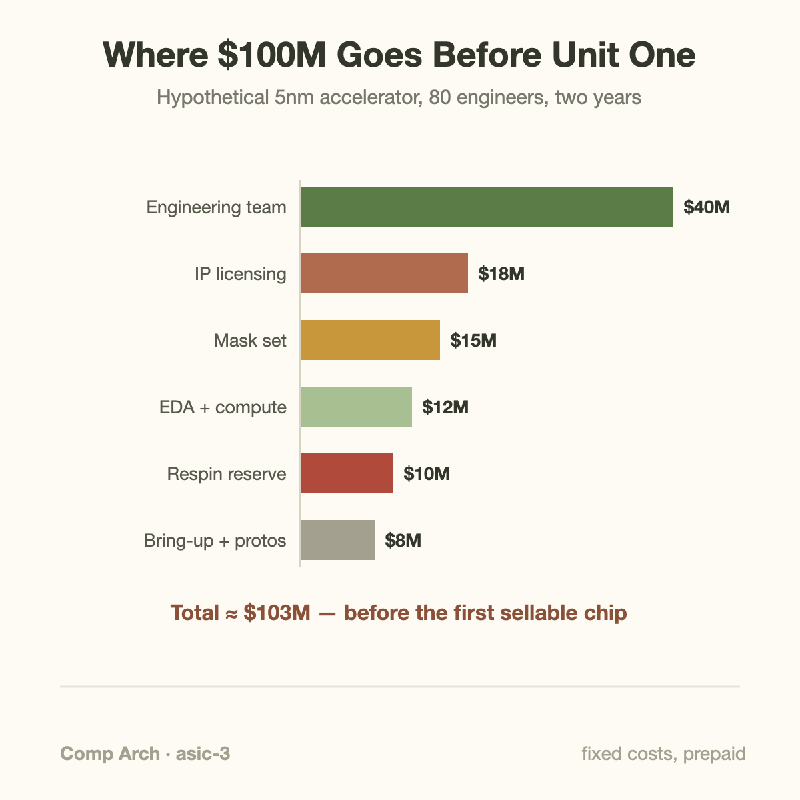
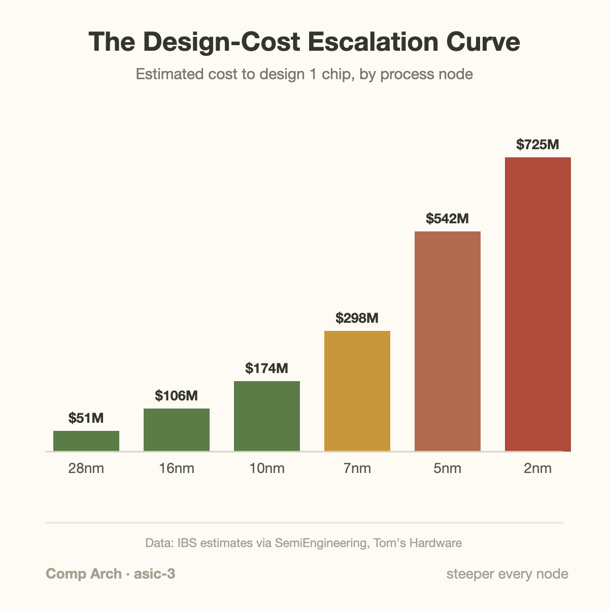
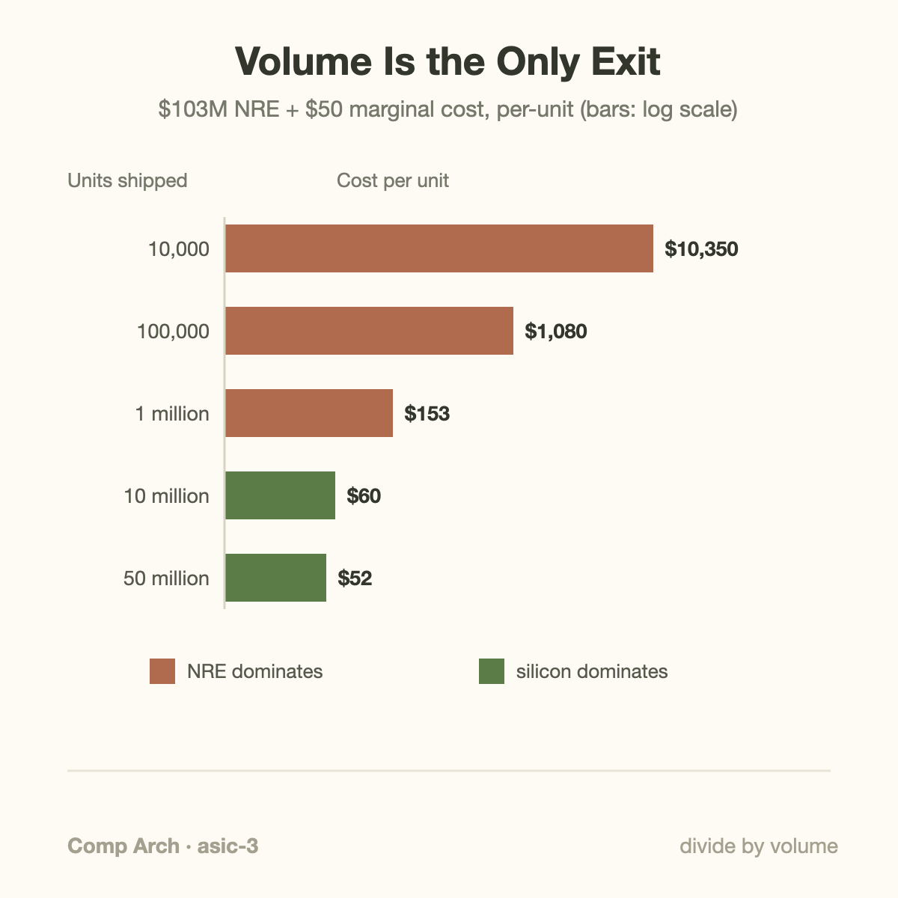

$542 million. That is the figure International Business Strategies (IBS) attached to designing a single 5nm chip back in 2018, and by 2023 the same firm was quoting $725 million for 2nm. Those numbers are estimates, they are contested, and analysts have argued a disciplined team can come in far lower. But even the skeptics' numbers sit north of $100 million, and every dollar of it is spent before the first working chip exists.

This is the strangest economic fact about the semiconductor industry: the product costs a fortune to create and almost nothing to copy. Once the design is done and the masks are made, each additional good chip adds wafer, yield-loss, packaging, and test expense; that recurring cost can be substantial for large accelerators. Everything interesting about the business — who can afford to build chips, why old process nodes never die, why hyperscalers design their own accelerators while everyone else buys — falls out of that 1 asymmetry.

## The vocabulary of spending money on nothing

A quick tour of the terms, because the cost structure lives in them.

A **tapeout** is the moment a design team declares the chip finished and sends the final layout file to the fab. The name is a fossil: engineers once literally taped photographic film masters, and later shipped magnetic tape. Today it means uploading a GDSII or OASIS file, a complete geometric description of every transistor and wire, to TSMC or Samsung or Intel Foundry.

**NRE**, non-recurring engineering, is the accounting term for everything spent getting to tapeout and through bring-up. It is "non-recurring" because you pay it once regardless of whether you build 10 chips or 10 million. Its opposite is the **recurring cost**: the per-unit price of wafers, packaging, and test.

A **mask set** is the stack of quartz-and-chrome (or, for EUV, reflective multilayer) plates the fab uses to pattern each layer of the chip. A leading-edge process needs 70 to 80 of them, and they are made to order for your design and useless for anyone else's.

A **respin** is what happens when the silicon comes back broken in a way software cannot patch. You fix the design, buy a fresh mask set, and wait months for new wafers.

**EDA** (electronic design automation) tools are the software the design team lives in: simulators, synthesis engines, place-and-route, timing signoff. 3 companies (Synopsys, Cadence, Siemens EDA) dominate the market, and licenses are priced accordingly.

**IP licensing** covers the blocks you buy rather than build: an Arm CPU core, a PCIe controller, a DDR PHY, standard cell libraries. Almost no modern chip is designed from scratch; a typical SoC is a shopping cart of licensed blocks stitched together with your own secret sauce.

With the vocabulary in place, we can build a budget.

## A worked example: budgeting a 5nm accelerator

Suppose you are a well-funded startup building an AI inference accelerator on a 5nm-class process. Nothing exotic, 1 die, aiming for a 2-year schedule from architecture to tapeout. Let's price it line by line.

**People.** A credible team for a chip like this is around 80 engineers: architects, RTL designers, verification engineers (typically the largest single group), physical design, DFT (design-for-test), plus firmware and bring-up. At a fully loaded cost of $250,000 per engineer per year in a US or European hub:

> 80 engineers × 2 years × $250K = **$40M**

Verification alone will consume perhaps 40 of those 80 heads. The industry rule of thumb is that verifying a chip costs as much as or more than designing it, because the design has to be right the first time. There is no patch Tuesday for transistors.

**EDA licenses and compute.** Big-3 EDA seats run in the low-to-mid 6 figures per year when you account for the full flow (simulation, synthesis, place-and-route, signoff, emulation time). A team this size, plus the compute farm for regression runs and physical design iterations, plausibly spends:

> **$12M** over the project

**IP licensing.** You need PCIe Gen5, LPDDR or HBM PHYs, high-speed SerDes, a management CPU core, memory compilers, and standard cell libraries tuned for the process. License fees plus royalty prepayments for a 5nm portfolio:

> **$18M**

**The mask set.** SemiAnalysis puts advanced mask sets beyond $10M at 7nm and heading toward $40M at 3nm-class nodes; industry surveys commonly quote $15-20M for a full 5nm set. Take the middle:

> **$15M**

**Prototypes, packaging, and bring-up.** Engineering wafer lots, package substrate design, test program development, lab equipment, and the months of post-silicon debug:

> **$8M**

**Respin reserve.** First-silicon-perfect chips exist but you cannot bet the company on being 1. A metal-layer respin (fixing only the wiring layers) costs a few million; a full-layer respin means a new mask set plus a quarter of schedule. Prudent budgeting reserves:

> **$10M**

Total: **$103 million**, and not 1 sellable chip yet. The number is deliberately conservative. Stretch the schedule to 3 years, add a second die, or slip into a full respin plus a market delay, and you are on the road to the IBS figures.

Notice what the chart says: the mask set, famous as it is, is only about 15% of the bill. The dominant cost is people, and the second biggest is licensed IP. Chip design is a payroll problem with a photolithography deposit attached.

## The escalation curve

The scary part is not the level, it is the slope. IBS's per-node estimates, quoted everywhere in the industry (and worth flagging: they are 1 firm's model, published at different times, and other analysts such as Gartner have produced figures roughly half as large for the same nodes), run like this: about $51M to design a 28nm chip, $106M at 16nm, $298M at 7nm, $542M at 5nm, and $725M at 2nm.

Why does each node cost more? 3 compounding reasons. Transistor budgets grow, so there is simply more design to do and verify; a 2nm flagship carries tens of billions of transistors. Physical effects get nastier, so tools run longer, rules multiply (the design rule manual at leading nodes runs to thousands of pages), and signoff needs more corners and more margin analysis. And the ecosystem costs rise in lockstep: IP vendors charge more for ported blocks because their own porting costs exploded, and EUV masks cost several times what optical masks did.

The consequence is a brutal filter. If your chip cannot justify 9 figures of NRE, the leading edge is not for you, no matter how much you would enjoy the transistors.

## Volume: the only exit

Here is where the asymmetry pays off. NRE is fixed; wafers are marginal. Per-unit cost is:

> cost per unit = (NRE ÷ volume) + marginal cost

Take our $103M chip and assume $50 of marginal cost per good die (wafer, packaging, test, yield loss folded in). Run the volumes:

- **10,000 units:** $103M/10K + $50 = **$10,350** per chip. This is a research prototype, not a product.
- **100,000 units:** $1,030 + $50 = **$1,080**. Viable only at luxury margins.
- **1 million units:** $103 + $50 = **$153**. Now it looks like a sellable part.
- **10 million units:** $10.30 + $50 = **$60.30**. NRE is a rounding error; silicon dominates.
- **50 million units:** $52.06. The 100-million-dollar design cost has vanished into 2 dollars.

This arithmetic explains most of the industry's structure in 1 line. Apple can use the newest node first because it ships over 200 million iPhones a year, so even a half-billion-dollar design program amortizes to a couple of dollars per device. NVIDIA justifies leading-edge tapeouts because data center GPUs carry enormous gross margins, which is the other escape hatch: if you cannot divide NRE by a big volume, divide it by a big price. Google's TPU program works because Google is both designer and customer, capturing the margin a vendor would have taken across millions of deployed chips. And a mid-sized company shipping 200,000 units of a specialized part stays on 28nm or 16nm forever, because at their volume the mature node's 5-10x lower NRE beats any power or density win the new node offers.

The unit-cost equation also reveals when a node change pays. Let $$F$$ be fixed design cost, $$N$$ shipped good units, and $$c$$ recurring cost per good packaged unit. Then

$$
C_u=F/N+c,\qquad N_*=(F_a-F_m)/(c_m-c_a).
$$

Here subscripts $$a$$ and $$m$$ mean advanced and mature alternatives. The crossover requires $$c_m>c_a$$ and assumes equal usable functionality, delivery dates, and quality. Suppose the advanced design costs $103 million plus $50 per unit, while a hypothetical mature alternative costs $25 million plus $90 per unit. Their costs meet at 1,950,000 units: each costs approximately $102.82 per unit. Below that volume the cheaper design program wins; above it the lower recurring cost wins.

This is a decision method, not a foundry price quotation. Reuse existing IP and derivative verification to lower the fixed term, then estimate realistic lifetime shipments rather than peak annual demand. If the mature part needs more power or chips per workload, replace unit cost with cost per delivered function. Packaging and yield can make recurring cost large, particularly for big accelerators, so “almost nothing to copy” is an inadequate production budget. Delay risk changes the denominator: a respin that misses a market window may reduce shipments as well as add cash expense. Compare scenarios rather than assuming all cost uncertainty lives in the mask invoice.

## Going deeper: why a respin hurts more than its invoice

The respin reserve deserves a closer look, because its true cost is not the mask set.

When first silicon arrives, the bring-up team runs it through boot, functional tests, and characterization across voltage and temperature. Bugs sort into bins. The benign ones have software or firmware workarounds. The next tier can be fixed in metal only: because transistors live in the base layers and wiring in the metal layers above, a logic bug that can be patched by rewiring costs only the metal masks, maybe $1-3M, and a few weeks, which is exactly why designers sprinkle spare gates (unused, pre-placed logic cells) across the die as insurance. The fatal tier touches the base layers: a broken memory cell, a mis-sized driver, an architectural flaw. That is an "all-layer" respin: full mask set, full wafer cycle time of roughly a quarter, and a market window sliding away while your competitor ships.

The invoice might read $20M. The real damage is the schedule. 6 months late into a product cycle can halve lifetime volume, and as the arithmetic above shows, halving volume nearly doubles the NRE burden on every unit you do sell. This is why verification eats half the team: every simulation dollar is buying down the probability of the most expensive quarter of your company's life.

It is also why the fabless model exists at all. TSMC spends roughly $30 billion a year on capital equipment, an NRE-like fixed cost so vast that no single product could carry it. The foundry amortizes fabs across hundreds of customers exactly the way each customer amortizes masks across millions of units. It is fixed-cost sharing, stacked 2 levels deep.

## The counterpoint that proves the rule: a $75 tapeout

If the fixed-cost story is right, there should be a cheat: share the fixed costs widely enough and tapeout becomes cheap. It exists, and it is called Tiny Tapeout.

Matt Venn's project books a slot on a multi-project wafer shuttle, splits 1 mask set and 1 wafer run across hundreds of independent designs, and sells tiles of silicon (about 160 × 100 micrometers each) for roughly €70 apiece, plus a few 100 euros for the dev board that carries your chip home. Hobbyists, students, and university classes have taped out thousands of designs this way on 130nm-class processes, using the open-source OpenROAD/OpenLane flow, so the EDA line item is 0 too.

Nothing about the physics got cheaper. The mask set for that shuttle still cost what mask sets cost; the wafer still ran through the same fab. What changed is the denominator: hundreds of designs sharing 1 set of fixed costs, on a mature node where those fixed costs are thousands of times lower than at 2nm. Tiny Tapeout is the amortization equation run in reverse, and the fact that it lands at pizza-money prices is the cleanest demonstration that chip cost was never really about the silicon.

## Common misconceptions

**"The silicon is the expensive part."** Marginal silicon is startlingly cheap. Even a leading-edge wafer priced around $20,000 yields hundreds of mobile-sized dies, putting raw silicon in the tens of dollars per chip. The $100M+ is design labor, verification, IP, tools, and masks, spent before wafer 1. If silicon itself were the cost, Tiny Tapeout's €70 tile could not exist.

**"Those $500M design-cost figures are hard numbers."** They are 1 consultancy's model, and analysts disagree by a factor of 2 or more; SemiEngineering documented Gartner estimating a 5nm design near $280M against IBS's $542M, and actual cost depends enormously on chip complexity, team location, derivative reuse, and whether you count software. Use the curve's shape (steep, compounding, real) rather than any single point as gospel.

**"Newer node always wins, so old nodes are dying."** The overwhelming majority of chip designs each year tape out on mature nodes, and foundries keep 28nm, 40nm, and even 180nm lines busy for decades. For a microcontroller shipping 500K units, a 28nm-class NRE in the tens of millions divides down to sane numbers where a 3nm NRE never would, and the older node may also win on analog behavior, voltage tolerance, and cost per wafer. Nodes don't die; they retire into the volume business.

## Where this sits in the bigger picture

This cost structure is the invisible hand behind topics we've covered elsewhere in this series. The reason an [ML performance engineer](/blog/what-does-an-ml-performance-engineer-do/) exists as a job is that the chips they optimize embody hundreds of millions in NRE, so squeezing 20% more [goodput](/blog/goodput-vs-utilization/) from deployed silicon is worth serious salary. The generational cadence we traced in the [Blackwell-to-Rubin memory math](/blog/blackwell-to-rubin-memory-math/) is paced partly by these economics: each generation must ship in volumes and at margins that clear a growing NRE bar, which is why new GPUs launch at the prices they do. And the microarchitectural richness inside [a modern CPU](/blog/what-a-cpu-actually-does/) is only affordable because CPUs amortize their design cost across hundreds of millions of sockets.

Next in this thread: why AI workloads, with their regular, dense, predictable computation, are the best-case customer for this whole cost structure, and why every hyperscaler concluded the NRE was worth paying.

## Takeaway

- A leading-edge chip's cost is almost entirely fixed and prepaid: roughly 40% people, with IP, EDA, masks ($15-20M at 5nm-class nodes), and respin reserves making up the rest, before any unit ships.
- Per-unit cost is NRE ÷ volume + marginal cost, so the same $100M design is a $10,000 prototype at 10K units and a $60 commodity at 10M units; volume (or margin) is the only exit.
- Per-node design costs roughly double every generation by IBS's much-quoted estimates ($51M at 28nm to $725M at 2nm), which is why the leading edge belongs to giant-volume or giant-margin products, and why shared shuttles like Tiny Tapeout can sell a real tapeout for the price of dinner.

## Sources

- SemiEngineering, "What Will That Chip Cost?" (IBS vs. Gartner design-cost estimates per node): https://semiengineering.com/what-will-that-chip-cost/
- SemiAnalysis, "The Dark Side of the Semiconductor Design Renaissance" (mask set and fixed-cost escalation): https://newsletter.semianalysis.com/p/the-dark-side-of-the-semiconductor
- Tom's Hardware, "Firm Estimates a 2nm Chip Now Costs $725 Million to Design" (IBS 2nm estimate): https://www.tomshardware.com/news/firm-estimates-a-2nm-chip-now-costs-dollar725-million-to-design
- Tiny Tapeout, pricing and shuttle model: https://tinytapeout.com/
- The OpenROAD Project (open-source RTL-to-GDSII flow): https://theopenroadproject.org/

*Part of the [Computer Architecture & ASIC](/series/comp-arch/) learning path. Browse its published articles by topic.*
