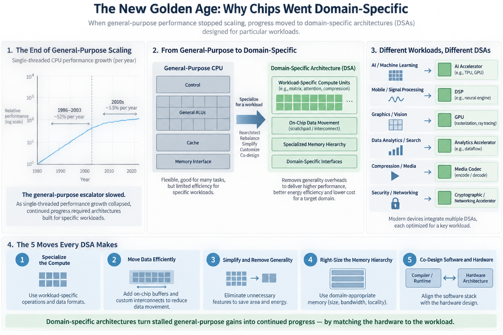
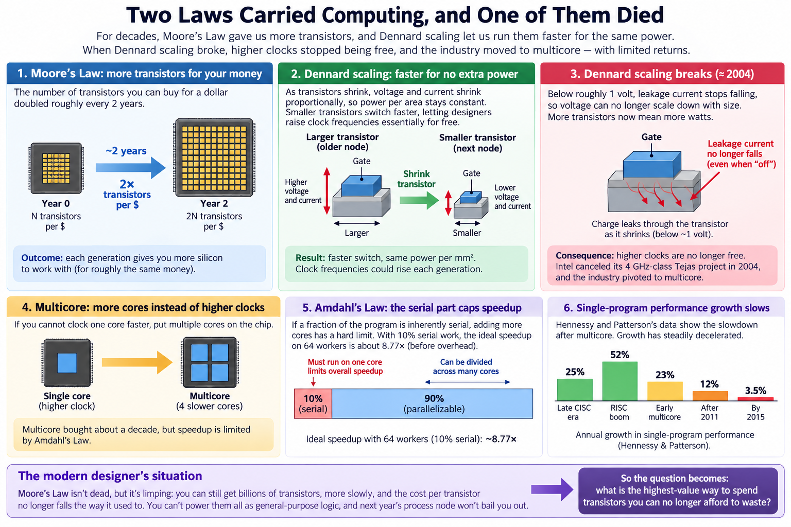
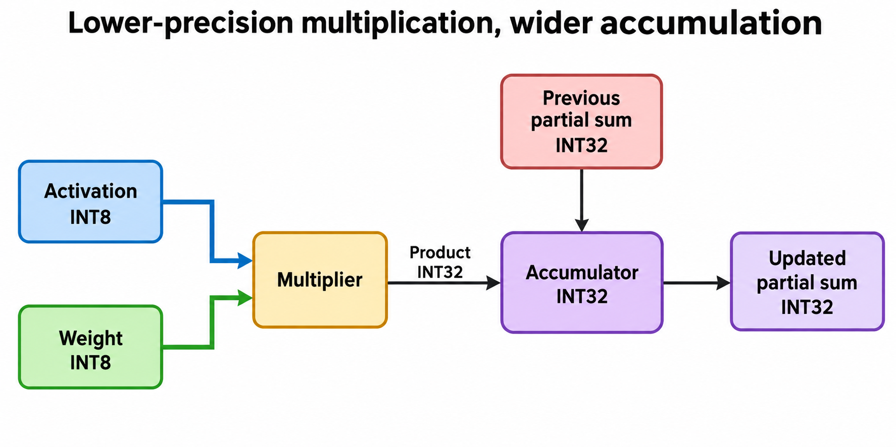
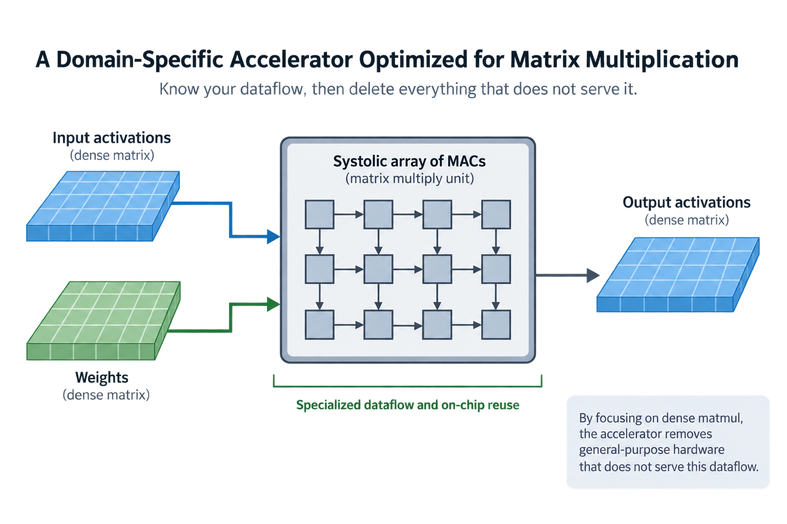

## Overview

Between 1986 and 2003, single-threaded CPU performance improved about 52% per year. By the mid-2010s, John Hennessy and David Patterson measured the rate at roughly 3.5% per year. At that pace, the doubling that used to arrive every eighteen months now takes 2 decades.

That collapse is the subject of their 2018 Turing Award lecture, "A New Golden Age for Computer Architecture," and it explains almost everything strange about modern silicon: why Google builds its own chips, why your phone has a "neural engine," why NVIDIA's biggest jumps come from new number formats rather than new clocks. When the general-purpose escalator stops, the only way up is to build a staircase for 1 specific workload. The industry's name for that staircase is the **domain-specific architecture**, or DSA.

## Deep dive

### 2 laws carried computing, and one of them died

For 4 decades, 2 empirical laws did the heavy lifting. **Moore's Law** said the number of transistors you could buy for a dollar doubled roughly every 2 years. **Dennard scaling**, described by Robert Dennard and colleagues in 1974, said something subtler and arguably more important: as transistors shrink, their voltage and current shrink proportionally, so the *power per square millimeter of silicon stays constant*. Shrink the transistor and you get a faster switch that costs no extra power. Chip designers could raise clock frequencies every generation essentially for free.

Dennard scaling broke around 2004. Below roughly 1 volt, transistor leakage current (charge that trickles through a transistor even when it is "off") stops falling, so voltage could no longer scale down with size. From then on, more transistors meant more watts. Intel canceled its 4 GHz-class Tejas project that year and the industry pivoted to multicore: if you cannot clock 1 core faster, ship 4 slower ones.

Multicore bought about a decade, but it runs into **Amdahl's Law**: speedup is capped by whatever fraction of the program is serial. If 10% of baseline time is inherently serial, the ideal fixed-work model gives about 8.77× speedup on 64 workers, before overhead. Hennessy and Patterson's chart of single-program performance tells the whole story in 1 line: 25% annual growth in the late CISC era, 52% during the RISC boom, 23% in the early multicore years, 12% after 2011, and about 3.5% by 2015.

Moore's Law, meanwhile, is not dead but it is limping: transistor counts still rise, more slowly, and the cost per transistor no longer falls the way it used to. So the modern designer's situation is peculiar. You can still *get* billions of transistors. What you cannot do is power them all as general-purpose logic, and you cannot expect next year's process node to bail you out. The question becomes: what is the highest-value way to spend transistors you can no longer afford to waste?

### Where the energy actually goes

The answer starts with an uncomfortable accounting exercise. Mark Horowitz's ISSCC 2014 numbers for a 45 nm chip are the standard reference. An 8-bit integer addition costs about 0.03 picojoules. A 32-bit addition, 0.1 pJ. A 32-bit floating-point multiply, 3.7 pJ. Reading 32 bits from a small 8 KB SRAM, about 10 pJ. Fetching those bits from DRAM instead: 1,300 to 2,600 pJ.

And here is the killer: on a big out-of-order CPU core, the full cost of executing 1 instruction (fetch, decode, rename, schedule, predict, retire, the whole apparatus we walked through in [What a CPU Actually Does](/blog/what-a-cpu-actually-does/)) lands around 70 pJ by Horowitz's estimate. If that instruction is an 8-bit add, the arithmetic you actually wanted is 0.03 pJ of the 70. Less than 1 twentieth of 1 percent of the energy went into the math. The rest paid for *flexibility*: the machinery that lets the same core run a compiler, a web server, or a physics simulation.

Flexibility was a fantastic deal while Dennard scaling paid the power bill. Now it is the single biggest line item, which suggests a blunt strategy: for a workload you understand deeply, strip the flexibility out and spend the recovered energy on arithmetic. That is the entire intellectual content of the DSA movement. The rest is engineering.

### A worked example: the TPU's arithmetic, by hand

Google's first Tensor Processing Unit, described by Norman Jouppi and colleagues at ISCA 2017, is the canonical DSA, and its headline numbers can be reproduced on the back of an envelope.

The TPU v1 is built around a systolic array: a 256 × 256 grid of multiply-accumulate (MAC) units through which data flows in lockstep, each unit multiplying an 8-bit activation by an 8-bit weight and passing partial sums to its neighbor.

**Step 1: peak throughput.** The grid holds 256 × 256 = 65,536 MAC units. Each MAC performs 2 operations per cycle (1 multiply, 1 add). The chip runs at 700 MHz. So peak throughput is 65,536 × 2 × 0.7 × 10⁹ = 9.17 × 10¹³ operations per second, or about 92 TOPS. That matches the paper exactly, and notice what it did *not* require: an advanced process (28 nm, old even in 2015) or a high clock (700 MHz, a fifth of a contemporary Xeon).

**Step 2: an idealized energy ratio.** Using 40 watts as an illustrative busy-power value and assuming useful execution at peak, 40 J/s ÷ 9.2 × 10¹³ ops/s ≈ 0.43 pJ per operation, or roughly 0.9 pJ per complete MAC. Raw 8-bit arithmetic costs about 0.23 pJ per MAC (0.2 for the multiply, 0.03 for the add), so that hypothetical whole-chip ratio is only a few times the cited arithmetic estimate. It is not a measured cross-process overhead decomposition. On the CPU above, the overhead multiplier was around 300x.

**Step 3: the counterfactual.** Suppose you tried to hit 92 TOPS with 1 CPU instruction per MAC at 70 pJ each. That is 4.6 × 10¹³ MACs/s × 70 pJ ≈ 3,200 W of instruction overhead alone. Even with 256-bit SIMD amortizing 1 instruction over 32 8-bit MACs, you are still burning around 100 W on pure bookkeeping, more than the whole TPU, before the first multiply happens.

The TPU escapes because of a design choice that looks almost comically retro: CISC-style instructions. A single `MatrixMultiply` instruction launches the whole array for hundreds of cycles. With a batch of 256, 1 fetched-and-decoded instruction triggers 256 × 256 × 256 ≈ 16.7 million MACs. Instruction overhead does not vanish; it gets amortized by a factor of millions.

In production, Jouppi's team reported the TPU ran inference 15 to 30 times faster than the contemporary Haswell CPU and K80 GPU, at 30 to 80 times better TOPS per watt. Those are 2015 comparisons against 2015 hardware (GPUs have since closed much of the gap by becoming more DSA-like themselves), but the shape of the win is what matters, because it came from architecture, not process.

Energy efficiency must use delivered operations, not peak capacity. Let $$P$$ be measured power in watts and $$R_u$$ the rate of useful operations actually completed per second. Then

$$
e_u=\frac{P}{R_u}.
$$

At an illustrative 40 watts and 92 trillion useful operations per second, the ratio is about 0.435 picojoules per operation. At the same power but 20 trillion useful operations per second, it is 2 picojoules. Dividing busy power by an unreachable peak is therefore an optimistic bound, not a measured production efficiency.

The DSA method changes several terms together: instruction granularity amortizes control, smaller formats reduce arithmetic and traffic, and local storage reduces expensive movement. To identify an architectural improvement, compare the same workload and numerical requirements on the baseline, measuring total joules to completion. Operation-energy estimates from 1 process cannot be divided into whole-chip measurements from another as if all conditions matched. Precision changes also require an accuracy check. Specialization buys an efficient supported operating envelope; poor tile utilization or unsupported operators can erase the apparent arithmetic advantage.

### Going deeper: the 5 moves every DSA makes

Hennessy and Patterson distill the DSA recipe into 5 guidelines, and once you know them you will see them in every accelerator datasheet.

**1. Use dedicated, software-managed memories.** A CPU cache is a guessing machine: tag lookups, associative searches, and coherence traffic all spend energy deciding *where data might be*. If the dataflow is known at compile time (and for a matrix multiply, it perfectly is), a scratchpad the compiler fills explicitly does the same job for a fraction of the energy. The TPU's 24 MB unified buffer is exactly this.

**2. Drop the microarchitectural heroics.** Out-of-order execution, speculation, and branch prediction earn their silicon when programs are unpredictable. A neural network's inner loop is the most predictable code on Earth. Spend that area on more MACs.

**3. Match the parallelism to the domain.** SIMD, systolic, VLIW: pick the simplest form that fits the workload's structure, not the most general.

**4. Shrink the data types.** Dropping from 32-bit floating point to 8-bit integers cuts multiplier energy by more than 10x and, just as importantly, moves 4x more operands per byte of precious memory bandwidth. This is the same lever the FP8 and FP4 formats pull in modern training chips, which we costed out in [Blackwell to Rubin memory math](/blog/blackwell-to-rubin-memory-math/).

**5. Co-design with a domain-specific software layer.** The TPU is unprogrammable without TensorFlow's graph compiler; a P4 switch chip is meaningless without P4. The language guarantees the regularity the hardware bet on.

The common thread is that every guideline trades *generality you were paying for but not using* for throughput and energy. A DSA is not a better CPU. It is a machine that refuses to be a CPU.

### The DSAs already in your pocket

This is not a datacenter-only story. A modern phone SoC is a museum of the same idea. There is an NPU for neural inference (Apple quotes 35 TOPS for the A17 Pro's Neural Engine; treat that as a vendor self-reported figure). There is a fixed-function video block, the only reason 4K decode sips milliwatts instead of draining your battery in an hour of software decoding. There is an image signal processor for the camera pipeline, and dedicated AES hardware encrypting storage at line rate. Die-shot analyses of recent Apple SoCs count dozens of accelerator blocks around a shrinking share of general-purpose core area.

The same pattern scaled up: YouTube transcodes video on Google's custom VCU chips (the Argos project), for which Google reported 20 to 33 times better performance per total cost of ownership than its CPU baseline, again a self-reported number, but directionally consistent with everything above. Networking has P4 switch ASICs. Bitcoin mining went CPU to GPU to FPGA to full ASIC in 5 years, a speedrun of the entire argument.

### Common misconceptions

**"Chips went specialized because Moore's Law died."** Not quite, and the distinction matters. Transistor counts are still growing; what died is Dennard scaling, the guarantee that you could *power* those transistors at full generality. If Moore's Law alone had failed, we would just have stagnation; because it half-survives while Dennard is gone, we get billions of transistors looking for an energy-efficient job. Specialization is that job.

**"Accelerators win with faster clocks or exotic manufacturing."** The TPU v1 refutes this by itself: 700 MHz on a 28 nm process, both markedly *worse* than the Haswell Xeons it outran by 15 to 30x. DSA wins come from parallelism, amortized control, short data types, and data movement, not from frequency. If anything, DSAs clock low on purpose, because energy scales roughly with the square of voltage and low frequency permits low voltage.

**"Everything will get its own chip now."** Specialization has a steep entry fee. You need a workload big enough to justify tens of millions of dollars of design cost, stable enough to survive the 2-to-3-year gap between architectural freeze and silicon, and a software stack to make the chip usable. Video encoding qualifies. Your niche simulation probably does not, which is why FPGAs and GPUs (semi-specialized, reprogrammable) occupy the huge middle ground. And stability is the trap: TPU v1's design was frozen before transformers existed. It did fine because matrix multiply stayed the universal currency, but that was partly luck.

### The lottery, and the bigger picture

That last point deserves its own paragraph, because Sara Hooker gave it a name: **the hardware lottery**. Her argument is that research ideas succeed or fail partly on how well they fit the hardware of their day, not on merit alone. Deep learning itself languished for 2 decades until GPUs, built for an entirely different domain, happened to be a good fit; we traced that accident in [CNN: How Machines Learned to See](/blog/cnn-how-machines-learned-to-see/). The catch is that DSAs sharpen the lottery. When the world's compute is optimized for dense matrix multiplication, algorithms that need sparsity, dynamic control flow, or irregular memory access start every race 20 meters behind, and it was no coincidence that the architecture which conquered NLP, the [transformer](/blog/transformer-architecture-in-one-picture/), is the one that is almost pure matmul. Specialization is a ratchet: hardware chases the winning algorithm, and the algorithm wins harder because the hardware chases it.

For this series, the DSA is where all the parallel-architecture threads meet. SIMD amortized 1 instruction over a vector; GPUs amortized control over thousands of threads; the systolic array amortized memory access over a grid of MACs. The DSA is the general principle behind all 3: know your dataflow, then delete everything that does not serve it. It also reframes the performance engineer's job. When speedups come from fitting workloads onto opinionated silicon rather than from waiting for faster cores, the person who understands both sides of the boundary becomes the bottleneck resource, which is a large part of [what an ML performance engineer does](/blog/what-does-an-ml-performance-engineer-do/) all day.

Hennessy and Patterson call this a *golden age* without irony. Architecture stagnated for years because the general-purpose CPU was unbeatable; now that it grows 3% a year, wild ideas get funded again. Next in this series we follow the logic to its endpoint: what it actually takes to design and ship an ASIC.

## Conclusion

- Dennard scaling ended around 2004 and the cited historical single-thread performance chart had slowed to roughly 3.5% annual improvement by the mid-2010s, so the era of free speedups from process shrinks is over; specialization is the remaining path.
- A DSA wins on energy accounting: a CPU spends ~70 pJ of control overhead per ~0.03-3.7 pJ operation, while the TPU amortizes 1 instruction over millions of MACs, landing within 3-4x of the raw cost of its arithmetic.
- The 5 DSA moves are scratchpads over caches, no speculation, domain-matched parallelism, small data types, and hardware-software co-design; their cost is the hardware lottery, where silicon frozen years in advance decides which algorithms get to be cheap.

### Sources

- Hennessy, J. & Patterson, D., "A New Golden Age for Computer Architecture," Communications of the ACM, 2019. https://cacm.acm.org/research/a-new-golden-age-for-computer-architecture/
- Jouppi, N. et al., "In-Datacenter Performance Analysis of a Tensor Processing Unit," ISCA 2017. https://arxiv.org/abs/1704.04760
- Hooker, S., "The Hardware Lottery," 2020. https://arxiv.org/abs/2009.06489
- Horowitz, M., "Computing's Energy Problem (and what we can do about it)," ISSCC 2014.
- Dennard, R. et al., "Design of Ion-Implanted MOSFETs with Very Small Physical Dimensions," IEEE Journal of Solid-State Circuits, 1974.
- Ranganathan, P. et al., "Warehouse-Scale Video Acceleration: Co-design and Deployment in the Wild," ASPLOS 2021.

*Part of the [Computer Architecture & ASIC](/series/comp-arch/) learning path. Browse its published articles by topic.*
