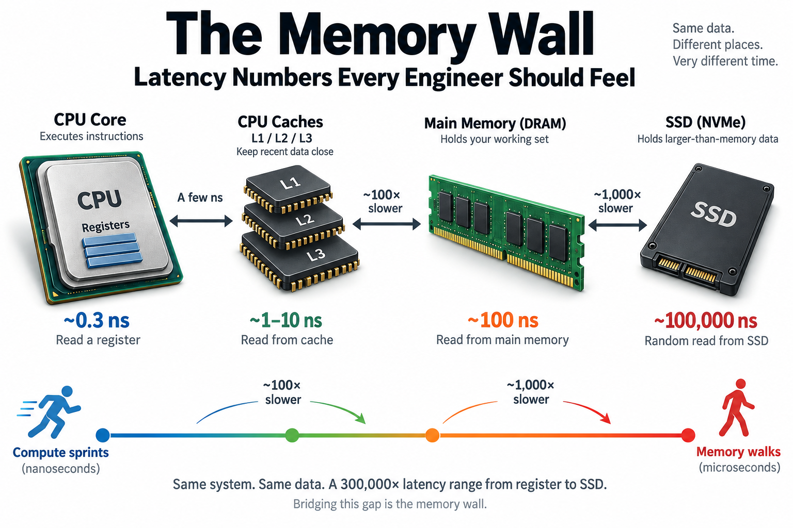
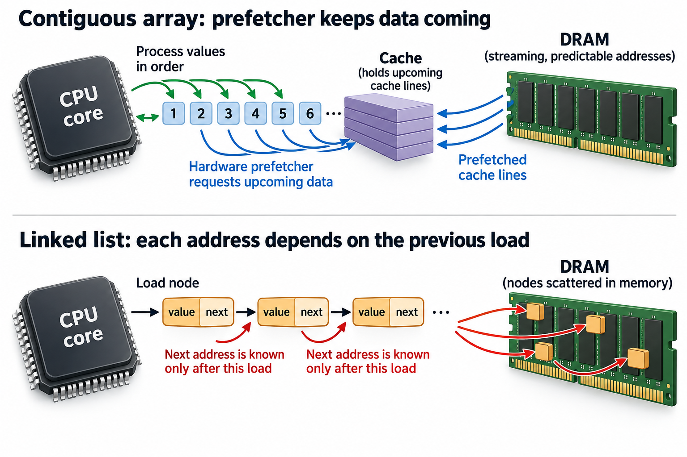
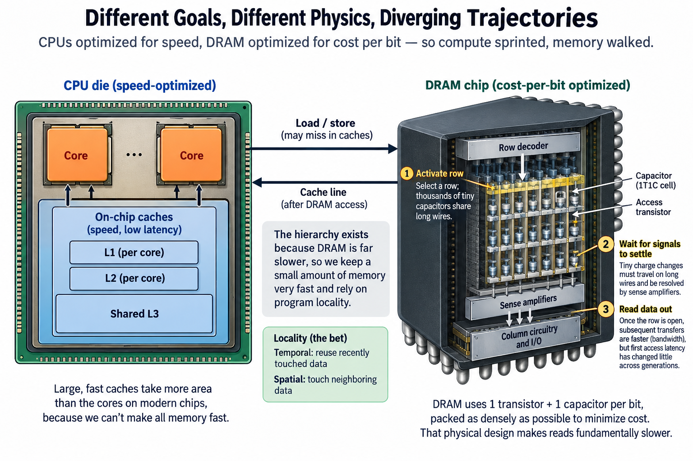
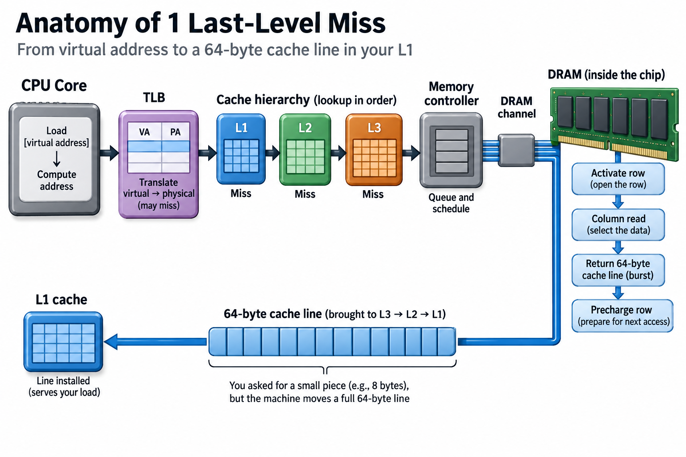

## Overview

Reading a value from a CPU register takes about 0.3 nanoseconds. Reading the same value from main memory takes about 100 nanoseconds, roughly 300 times longer. A random read from an SSD costs another 1,000 times on top of that. Those 3 numbers explain more real-world performance mysteries than any profiler feature I know. Most engineers have never sat down and felt how big the ratios actually are.

This article is about building that feel. We'll walk the canonical latency table, rescale it to human time, count exactly what 1 cache miss costs in wasted arithmetic, look at why the gap exists in the first place, and end with the place the memory wall bites hardest today: generating tokens from a large language model.

## Deep dive

### The table, and why it looks the way it does

Every working systems engineer eventually memorizes some version of this table. It descends from a slide Jeff Dean showed at Google in 2009 ("Numbers Everyone Should Know"). Peter Norvig had published a version earlier. Colin Scott later turned it into an interactive chart that extrapolates the trends year by year. The rough 2020s values:

| Operation | Latency |
|---|---|
| Register access | ~0.3 ns |
| L1 cache hit | ~1 ns |
| L2 cache hit | ~4 ns |
| L3 cache hit | ~10–20 ns |
| Main memory (DRAM) | ~100 ns |
| NVMe SSD random read | ~100 µs |
| Disk seek (HDD) | ~10 ms |
| Network round trip, same continent | ~150 ms |

2 things to notice before the numbers blur together. First, each tier is not a little slower than the 1 above it. The steps are factors of 4 to 1,000. Second, the table spans 9 orders of magnitude, from 0.3 nanoseconds to 150 milliseconds. Human intuition is terrible at 9 orders of magnitude, which is why the rescaling trick below is worth doing at least once in your life.

Quick vocabulary so nothing is taken on faith. A *register* is one of a few dozen storage slots inside the CPU core itself, physically adjacent to the arithmetic units. A *cache* is a small, fast memory on the CPU die that keeps copies of recently used data. L1, L2, and L3 are successively larger and slower levels of it. *DRAM* (dynamic random-access memory) is main memory, the "16 GB of RAM" in your laptop, sitting centimeters away across a bus. An *SSD* stores bits in flash cells and is persistent; DRAM forgets everything at power-off. *Latency* is how long 1 access takes from request to data. *Bandwidth* is a different quantity: how many bytes per second you can stream. Confusing the 2 is the most common memory-performance mistake there is. We'll come back to that.

### Scaled to human time

Multiply everything by a billion, so 1 nanosecond becomes 1 second. Now the table reads like this:

- **Register: 0.3 seconds.** A blink. The data is in your hand.
- **L1 cache: 1 second.** Grabbing a pen from your desk.
- **L2 cache: 4 seconds.** Reaching a book on the shelf behind you.
- **Main memory: 100 seconds.** Almost 2 minutes. You walk down the hall, find the room, unlock it, pull the file. Every single time.
- **NVMe SSD: about 28 hours.** The file is in another city. You drive there, sleep over, and drive back.
- **Disk seek: about 4 months.** The file is on a container ship.
- **Cross-continent network round trip: about 5 years.** You mail a letter and wait for a reply through 2 elections.

The step that should reorganize your programming instincts is the third 1. A modern out-of-order core can start several instructions every cycle, but only when the operands are on-chip. The moment it needs a value from DRAM, your CPU stands in the hallway for 2 subjective minutes. It can do that millions of times per second without any profiler line saying "waiting."

### A worked example you can do on paper

Take a 3 GHz core. 1 cycle is 1/3 of a nanosecond. Suppose it can complete 2 integer additions per cycle, which is conservative for anything shipped in the last decade. That's 6 additions per nanosecond. A single last-level cache miss to DRAM costs about 100 ns, so:

**1 DRAM miss ≈ 100 ns × 6 adds/ns = 600 additions thrown away.**

Now stretch that into a real workload. You want to sum 10 million 4-byte integers, 40 MB of useful values. Assume the working set exceeds the effective cache available to this run.

**Case 1: the integers sit in a contiguous array.** DRAM latency barely matters here, because the access pattern is predictable. The hardware prefetcher spots the sequential stride and requests cache lines before the core asks for them. The cost is then set by bandwidth, not latency. At a sustained 20 GB/s for a single core, streaming 40 MB takes 40 MB ÷ 20 GB/s = **2 milliseconds**. The arithmetic itself (10M adds at 6 per ns) would take 1.7 ms, so compute and memory are nicely overlapped.

**Case 2: the same integers live in a linked list whose nodes were allocated over time and are scattered across the heap.** Each node's address is only known after the previous node is loaded. The prefetcher is blind, and every step is a dependent DRAM access. The cost is now latency times count:

10,000,000 nodes × 100 ns = 10⁹ ns = **1 full second.**

Same data, same number of additions, same big-O complexity. The linked list is 500 times slower, purely because of *where the bytes are* and *whether the next address is predictable*. This is why "cache-friendly data layout" is not a micro-optimization. It is routinely worth more than any algorithmic constant you will ever shave.

Latency limits throughput when too few accesses can overlap. Let $$Q$$ be simultaneous independent memory requests, $$\ell$$ their average service latency, and $$b$$ useful bytes per completed request. A steady-state upper bound is

$$
\beta_u\le\frac{Qb}{\ell}.
$$

For a dependent list reading 4 useful bytes per node with $$Q=1$$ and $$\ell=100$$ nanoseconds, useful throughput is at most 40 MB/s. 10 million values therefore take at least 1 second in this simplified model. If 16 genuinely independent streams sustain the same latency, the concurrency bound rises to 640 MB/s of useful payload, until another resource limits it.

The trick behind prefetching and memory-level parallelism is moving from “discover the next address after the previous load” to having multiple requests ready together. Array layout makes that possible; a dependent pointer chain often does not. A request may transfer a whole cache line while only 4 bytes are used, so physical bus traffic exceeds useful payload. Measure both dependencies and bytes transferred. The 2-millisecond array estimate above is a bandwidth floor under its assumed 20-GB/s service rate, not a universal measured 500× application speedup.

### Why the wall exists: compute sprinted, memory walked

None of this was inevitable. In 1980 a DRAM access cost a handful of CPU cycles and the hierarchy barely mattered. Then the trajectories split. Hennessy and Patterson's textbook has the famous chart. Single-core processor performance grew around 52% per year from the mid-80s to the early 2000s, while DRAM latency improved around 7% per year. Compound those for 2 decades and you get a gap of several 100 times. The industry saw it coming, and Wulf and McKee named it in their 1995 paper "Hitting the Memory Wall."

Why couldn't DRAM keep up? Because DRAM is optimized for a different objective: cost per bit. A DRAM cell is 1 transistor and 1 capacitor, packed as densely as physics allows. Reading it means selecting a row, letting thousands of tiny capacitors dump their charge onto long wires, and waiting for sense amplifiers to resolve those faint signals into digital ones. Those analog settling times are set by wire capacitance and cell physics, and they have barely moved: the core row-activation and column-access delays have hovered around 13–15 ns across DDR2, DDR3, DDR4, and DDR5, and each generation transfers data faster once a row is open, which is a bandwidth win, while first-access latency in nanoseconds has stayed close to flat for 20 years. David Patterson generalized the pattern in a 2004 CACM article: across memory, disk, and network alike, latency lags bandwidth, roughly quadratically.

So architects stopped waiting for DRAM and built around it. That is the entire reason the memory *hierarchy* exists: since you can't make all memory fast, you make a little memory fast and bet on locality, the empirical fact that programs reuse recently touched data (temporal locality) and touch neighbors of recently touched data (spatial locality), and caches are that bet cast in silicon, taking up more area on a modern die than the cores do.

### Going deeper: anatomy of 1 miss, and how CPUs fight back

Follow 1 load instruction that misses everywhere. The core computes a virtual address and translates it through the TLB, a small cache of page mappings. Missing *there* adds a page-table walk on top. The L1 lookup fails in a nanosecond or so, L2 in a few more, L3 in 10 to 20. The request enters the memory controller's queue and gets scheduled onto a DRAM channel. Then the chip executes its little protocol: activate the row (~14 ns), issue the column read (~14 ns), burst the 64-byte cache line back, eventually precharge the row for the next access. Add queueing and the trip across the chip, and you arrive at the ~100 ns headline number. Note the useful payload. You asked for maybe 8 bytes, and the machine moved 64, because betting on spatial locality means always fetching a full line.

The core does not simply stand still for those 100 ns. Out-of-order execution keeps a window of a few 100 in-flight instructions and executes whatever is independent of the missing load. That reliably hides an L2 miss. It may not hide a long dependent DRAM miss. At 3 GHz, 100 ns is ~300 cycles, and with several instructions per cycle the miss punches a hole of over a 1000 issue slots, far more than any realistic window can fill with independent work. So the machine layers on more tricks: prefetchers that recognize stride patterns, memory-level parallelism (a core can keep a dozen or more misses in flight at once, which is why *independent* random accesses hurt far less than a *dependent* pointer chase), and simultaneous multithreading, which fills stall holes with another thread's instructions. Every one of these is a workaround for the same underlying number. When people say modern CPU architecture is mostly about the memory system, this is what they mean.

There is an energy version of the wall too, and it decides chip architecture as much as the time version. In Mark Horowitz's much-cited ISSCC 2014 numbers, a 32-bit add costs about 0.1 picojoules while fetching 64 bits from DRAM costs on the order of a nanojoule. That is a ratio of several 1000. Moving data costs vastly more than computing on it, in joules as well as nanoseconds.

### The memory wall, at datacenter scale: LLM decode

Here is the modern punchline. When a large language model generates text, it produces 1 token at a time. Each new token's computation must read essentially every weight of the model once, while performing only about 2 floating-point operations per weight read. That ratio, FLOPs per byte moved, is called arithmetic intensity, and at batch size 1 it sits around 1–2. Many modern accelerator arithmetic paths need intensity in the hundreds to approach peak. The threshold depends on precision and memory interface.

Concretely: a 70-billion-parameter model at 16-bit precision is 140 GB of weights. An NVIDIA H100 offers 3.35 TB/s of HBM bandwidth (vendor-reported, like all peak specs). The floor for 1 decode step is

140 GB ÷ 3.35 TB/s ≈ 42 ms per token, or about **24 tokens per second**,

no matter that the same chip advertises near a petaflop of tensor throughput. During single-stream decode the multipliers idle at under 1% utilization; the workload is a pure bandwidth play. This is exactly the linked-list lesson at warehouse scale: performance set by data movement, with compute along for the ride.

This is a counterfactual single-interface illustration: 140 GB of BF16 weights does not fit an 80 GB H100 SXM. A deployable sharded or quantized configuration needs its own traffic and communication budget.

The entire modern inference stack is a response to this. Batching lets N concurrent requests share 1 read of the weights, multiplying arithmetic intensity by N. Quantization to 8 or 4 bits shrinks the bytes that must move. KV caches, speculative decoding, HBM stacked ever higher and wider: all of it is memory-wall engineering. It's why I keep insisting that [an ML performance engineer's job](/blog/what-does-an-ml-performance-engineer-do/) is mostly moving bytes, why [goodput and utilization tell such different stories](/blog/goodput-vs-utilization/) on decode-heavy fleets, and why the [Blackwell-to-Rubin roadmap is best read as memory math](/blog/blackwell-to-rubin-memory-math/) rather than FLOPs math. And if the pipeline mechanics of a core stalling on a load are fuzzy, the picture in [What a CPU Actually Does](/blog/what-a-cpu-actually-does/) is the prequel to this article.

### Common misconceptions

**"DDR5 is way faster than DDR4, so memory latency is improving."** Faster here means bandwidth. DDR5 moves more bytes per second through prefetching wider chunks and running the interface faster. But the time from a cold request to first data is still governed by row activation and sensing, around 14 ns internally and ~80–100 ns load-to-use, essentially unchanged since DDR2. If your workload is a dependent pointer chase, a DDR5 upgrade does approximately nothing.

**"The CPU's out-of-order magic hides memory latency, so I don't need to think about it."** It hides *some*. A few 100 instructions of lookahead cover an L2 or often an L3 miss. A DRAM miss is a 300-cycle, 1000-slot bubble. A window cannot cover it when the available instructions share the same dependency. Measure a workload that misses to DRAM every 30 instructions and you'll find the core spending well over half its time stalled, while `top` cheerfully reports 100% CPU, and the workaround that actually works, memory-level parallelism, only helps when your accesses are independent, which is a property of *your data structure*, not of the hardware.

**"SSDs are so fast now that RAM barely matters."** An NVMe flash read at ~100 µs is a genuine miracle next to a 10 ms disk seek. It is also a 1000 times slower than DRAM. In human scale: 2 minutes versus 28 hours. Any system that treats flash as "slightly slower memory" gets destroyed by this ratio, rather than treating it as a different tier with its own access-size and queueing rules. That is precisely why databases still obsess over buffer pools, and why "it fit in RAM" remains the best performance fix in the industry.

## Conclusion

- The hierarchy steps are multiplicative cliffs: ~1 ns L1, ~100 ns DRAM, ~100 µs SSD. 1 DRAM miss forfeits several 100 additions. Layout and access patterns routinely beat algorithmic constants.
- The wall is physics plus economics: DRAM optimizes cost per bit, so its latency has been nearly flat for decades while bandwidth (and compute) compounded. Caches, prefetchers, and out-of-order execution are all workarounds for that 1 flat line.
- LLM decode is the memory wall wearing a datacenter badge: ~2 FLOPs per byte means token rate is bandwidth divided by model bytes. Judge accelerators, batching schemes, and quantization through that lens first.

### Sources

- Colin Scott, "Latency Numbers Every Programmer Should Know" (interactive): https://colin-scott.github.io/personal_website/research/interactive_latency.html
- Ulrich Drepper, *What Every Programmer Should Know About Memory* (2007): https://people.freedesktop.org/~lkml/cpumemory.pdf
- W. A. Wulf and S. A. McKee, "Hitting the Memory Wall: Implications of the Obvious," *ACM SIGARCH Computer Architecture News* 23(1), 1995. DOI: 10.1145/216585.216588
- J. L. Hennessy and D. A. Patterson, *Computer Architecture: A Quantitative Approach*, 5th ed., Morgan Kaufmann, 2012 (processor to DRAM gap figure).
- D. A. Patterson, "Latency Lags Bandwidth," *Communications of the ACM* 47(10), 2004.
- M. Horowitz, "Computing's Energy Problem (and what we can do about it)," ISSCC 2014 keynote (operation energy table).

*Part of the [Computer Architecture & ASIC](/series/comp-arch/) learning path. Browse its published articles by topic.*
