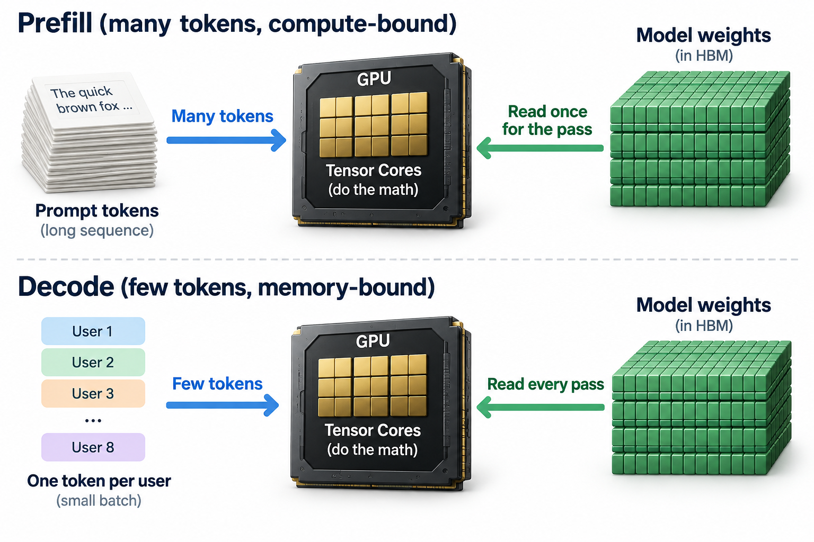
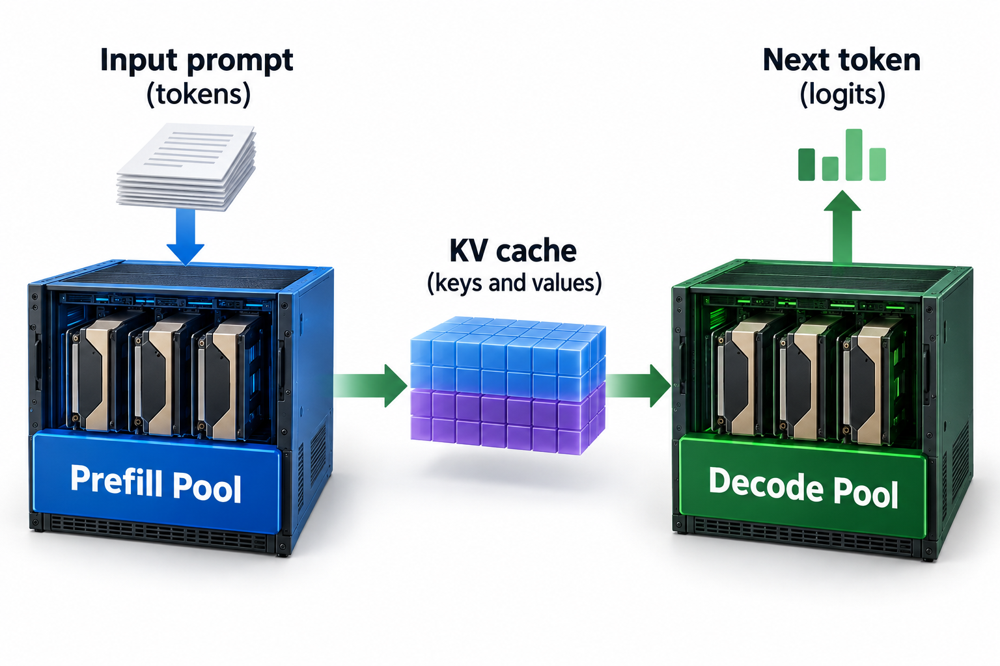

In September 2025, NVIDIA announced a datacenter GPU with no HBM on it at all: the Rubin CPX, 30 petaFLOPS of NVFP4 compute fed by 128 GB of GDDR7, the same memory family that ships in gaming cards. 22 months earlier, the core idea behind that chip lived in 2 academic papers, one of which had just been rejected from its first conference. That is, by a comfortable margin, the fastest trip from serving-systems paper to dedicated silicon the industry has recorded, and the story of how it happened is the cleanest co-design case study we have.

The idea is called prefill/decode disaggregation, and once you see why it works, you will not be able to unsee it in every inference bill you pay.

## 1 request, 2 very different jobs

When an LLM serves a request, it does 2 things that look superficially similar and are mechanically opposite.

**Prefill** is what happens to your prompt. The model ingests all the input tokens at once, in parallel, and builds up the *KV cache*: the stored key and value vectors for every token at every layer, which is what lets later tokens attend to earlier ones without recomputing them. Prefill ends when the model emits its first output token, so the latency you feel here is called **TTFT**, time to first token.

**Decode** is everything after that. The model generates 1 token, appends it to the KV cache, and uses the updated cache to generate the next 1. 1 token per pass, strictly sequential. The latency you feel here is **TPOT**, time per output token, which sets how fast the response streams.

Both phases run the same weights through the same matrix multiplies. The difference is how much work each pass gets to amortize. Prefill processes thousands of tokens per pass, so every weight it loads from memory gets used thousands of times. Decode processes 1 token per user per pass, so a weight loaded from memory gets used once per user in the batch. That single asymmetry decides everything downstream.

The standard way to reason about it is *arithmetic intensity*: how many floating-point operations you perform per byte you move from memory. Every chip has a ridge point, the intensity at which it stops being limited by memory bandwidth and starts being limited by compute. Work above the ridge is compute-bound; work below it is memory-bound. Prefill sits far above the ridge. Decode sits far below it. Running both on the same GPU means the chip is the wrong shape for at least one of them at all times.

## A worked example you can do by hand

Take a 70B-parameter model with weights quantized to 8 bits, so the weights occupy about 70 GB, served on an H100 SXM: roughly 990 TFLOPS of dense BF16 compute and 3.35 TB/s of HBM bandwidth. Divide those and you get the chip's ridge point: 990e12 / 3.35e12 ≈ **295 FLOPs per byte**. A transformer performs roughly 2 FLOPs per parameter per token, so 1 token costs about 140 GFLOPs.

**Prefill a 2,048-token prompt.** Total work: 2,048 × 140 GFLOPs ≈ 287 TFLOPs. The weights get read from HBM roughly once for the whole pass, about 70 GB. Arithmetic intensity: 287e12 / 70e9 ≈ **4,100 FLOPs per byte**, 14 times above the ridge. Time if compute-limited: 287 / 990 ≈ 290 ms. Time if memory-limited: 70 / 3,350 ≈ 21 ms. Compute wins by 14x, so prefill is compute-bound, and the tensor cores are the resource that matters.

**Decode with a batch of 8 users.** Each pass produces 8 tokens (1 per user) for 8 × 140 GFLOPs ≈ 1.1 TFLOPs of work, but it still has to stream all 70 GB of weights through the chip. Intensity: 1.1e12 / 70e9 ≈ **16 FLOPs per byte**, nearly 20 times *below* the ridge. The memory floor is the same 21 ms per pass, during which the compute units could have done 990 × 0.021 ≈ 21 TFLOPs but actually do 1.1. That is 5% utilization. The tensor cores you paid for are idle 95% of the time; the HBM you paid for is the entire product.

**Now colocate them.** Suppose the scheduler slots that 2,048-token prefill into the same batch as your decode pass, which is what every serving engine did before 2024. The combined iteration takes about 290 ms instead of 21 ms. Every user mid-generation watches their next token take 14x longer than it needed to. This is not a contrived corner case: the SGLang team measured TPOT inflation of **2x to 30x** under colocation on production-shaped workloads. Chunked prefill, the standard mitigation, softens the spikes by slicing prompts into pieces, but it converts 1 big stall into many small ones rather than removing the interference.

The punchline of the arithmetic: prefill wants FLOPs and barely touches bandwidth; decode wants bandwidth and barely touches FLOPs. Serving both from 1 SKU means buying the most expensive resource in the datacenter, HBM, and letting 1 phase waste it while the other phase starves the tensor cores.

## The 24 months

What makes this a co-design story rather than just a good idea is the speed and completeness of the pipeline that followed.

**Late 2023 to mid 2024: the papers.** Splitwise (Microsoft and UW, arXiv November 2023, ISCA '24) and DistServe (UCSD and collaborators, arXiv January 2024, OSDI '24) independently proposed the same move: run prefill and decode on *separate GPU pools* and ship the KV cache from 1 to the other. DistServe reported up to 4.5x more requests served within latency targets, or 10x tighter latency targets at the same rate. The DistServe retrospective notes, with some relish, that the paper was initially rejected; reviewers doubted that transferring gigabytes of KV cache between machines could ever be worth it.

**2024 to 2025: adoption across major engines.** The doubt did not survive contact with production. Within about 18 months, disaggregated serving went from contrarian to a supported architecture in NVIDIA Dynamo, vLLM, SGLang, TensorRT-LLM, llm-d, and Mooncake, plus the in-house stacks at DeepSeek, Meta, and Perplexity. Mooncake, the serving platform behind Moonshot's Kimi, is the essential companion piece: once prefill and decode are separate services, the KV cache becomes a first-class object that has to live somewhere, so Mooncake gave it a storage hierarchy spanning cluster DRAM and SSD, and took Best Paper at FAST '25, a *storage* conference. That detail tells you how far the idea traveled: an inference scheduling trick had become a storage-systems problem.

**September 2025: the benchmark.** MLPerf Inference v5.1 included, for the first time, official submissions using disaggregated serving. NVIDIA's GB300 NVL72 results on DeepSeek-R1 credited disaggregation via Dynamo with roughly **1.5x per-GPU throughput** over aggregated serving on interactive workloads. Those are vendor-run submissions under MLCommons rules, so treat the exact multiplier as NVIDIA's framing, but the significance is structural: the industry's canonical benchmark now scores a scheduling architecture, not just a chip.

**September 2025 to 2026: the silicon.** The same month, NVIDIA announced Rubin CPX, slated for late 2026: a GPU built *only* for the prefill side. It pairs high NVFP4 throughput with 128 GB of GDDR7 at roughly 2.1 TB/s, versus the standard Rubin's 288 GB of HBM4 at roughly 10 TB/s. That is the worked example above, cast in silicon. Prefill runs at 4,100 FLOPs per byte, so why solder 5-figure HBM stacks onto a chip whose workload will never be bandwidth-limited? NVIDIA claims about 6x long-context throughput for 2.25x added compute in mixed racks (again, vendor numbers), and the NVL144 CPX rack pairs CPX prefill chips with HBM-rich Rubin decode chips, with the KV cache handed off between them. A scheduling observation from a rejected paper had rewritten the SKU list.

## Going deeper: the KV cache handoff

The reviewers' original objection deserves a real answer, because it is the mechanism that makes or breaks the whole design. Disaggregation means that after prefill finishes, the KV cache must move to a decode GPU. How big is that transfer, and why doesn't it eat the winnings?

For our 70B model, a typical configuration (80 layers, grouped-query attention with 8 KV heads of dimension 128, FP8 cache) stores about 160 KB per token: 2 vectors × 80 layers × 8 heads × 128 dims × 1 byte, per token. A 2,048-token prompt therefore produces roughly 335 MB of KV cache. Over a 400 Gb/s (50 GB/s) datacenter link, that is about 7 ms, hidden under the 290 ms prefill by streaming layers as they complete: layer 1's KV can be in flight while layer 2 is still computing. Inside an NVLink domain at hundreds of GB/s, the transfer approaches a rounding error. Implementations can overlap part of the transfer, but exposed delay depends on link contention, setup, and cache readiness.

2 more mechanisms fall out once the phases are separate, and they are where the production wins actually come from.

First, *independent scaling and parallelism*. Prefill instances can use tensor parallelism tuned for TTFT while decode instances tune for throughput, and an operator can shift the ratio of prefill to decode GPUs hour by hour as traffic changes shape. A summarization-heavy morning (long prompts, short answers) wants a prefill-heavy fleet; an agentic afternoon (short follow-ups against cached context, long generations) wants the opposite. Colocation forces 1 compromise configuration on both.

Second, *KV reuse across requests*. Once the cache is a named, transferable object, it can be stored and hit again. Multi-turn chats and agent loops resend nearly identical prefixes constantly; Mooncake-style tiering means a returning conversation pulls its prefix cache from DRAM or SSD instead of recomputing it, converting prefill FLOPs into a storage read. This is the same economics you can see on public price sheets, where cached input tokens sell for a fraction of fresh ones.

## The transfer must earn its place on the critical path

Let cache handoff size be $$M_{KV}$$ bytes, effective link bandwidth $$B_l$$ bytes per second, setup time $$t_s$$, and useful transfer overlap $$t_o$$ seconds. A simple exposed-delay model is

$$
t_{\mathrm{handoff}}\approx t_s+\max(0,M_{KV}/B_l-t_o).
$$

For 335 MB at 50 GB per second, raw transfer takes 6.7 milliseconds. 4 milliseconds of genuine overlap leaves 2.7 milliseconds plus setup. Using peak link bandwidth or overlapping against work that itself needs the transferred cache overstates the benefit.

Splitting workers improves the request only if removed interference exceeds exposed handoff and coordination costs. Compared with 1 shared scheduling pool, separate pools permit independent batching and provisioning. They introduce a queue between stages, cache ownership, routing, and failure-recovery machinery. Measure transfer completion and first decode launch on the same clock, then vary prompt length and offered load. Short prompts can lose because coordination dominates; long prompts can benefit when prefill would otherwise interrupt streaming. Support in an engine demonstrates that the design is available, not that it is every deployment's default. Later dedicated prefill hardware is consistent with this workload distinction; a public timeline alone does not prove direct causation from 1 paper to a chip design.

## Common misconceptions

**"Disaggregation makes every request faster."** No. It adds a transfer step, so a single isolated request is marginally *slower* than on a colocated engine. What improves is tail behavior under concurrent load: decode iterations stop stalling behind other users' prefills, so P99 TPOT collapses and goodput (requests completing within their latency targets) rises. DistServe's headline was 4.5x more *SLO-compliant* throughput, not 4.5x lower single-request latency. If you serve 1 user, disaggregation buys you nothing.

**"Chunked prefill already solved this."** Chunked prefill slices long prompts into pieces and interleaves them with decode, which caps the worst single stall. But the interference is still there, spread thin: every iteration containing a chunk is still slower than a pure decode step, and tuning chunk size trades TTFT against TPOT rather than winning both. The measured 2 to 30x TPOT inflation range is precisely why the frameworks that shipped chunked prefill also added disaggregation support.

**"Rubin CPX has cheap memory, so it's a budget GPU."** Backwards. CPX is a *specialization*, not a downgrade. Prefill at 4,100 FLOPs per byte cannot use HBM's bandwidth; pairing 30 PFLOPS with GDDR7 removes the single most expensive, supply-constrained component (HBM stacks and their advanced packaging) from a chip whose workload never needed it. The decode-side Rubin keeps every gigabyte of HBM4 and puts it to full use. The pair together is the point: silicon finally matches the 2 shapes of the workload.

## Why this case matters beyond serving

This series keeps returning to 1 loop: software finds structure in the workload, exploits it, proves the win, and the win migrates downward into hardware. FlashAttention chased the memory hierarchy; quantization formats grew tensor-core support; here, a scheduling insight crossed the software/hardware boundary in under 2 years. The direction of causation is worth savoring: serving engines redesigned NVIDIA's product line, not the other way around.

It also reframes 2 themes from earlier articles. The prefill/decode split is the workload-level twin of the capacity-versus-bandwidth tension in [the Blackwell-to-Rubin memory math](/blog/blackwell-to-rubin-memory-math/): once you know decode is the bandwidth customer, holding capacity flat while tripling bandwidth, and then splitting off a bandwidth-poor prefill chip, are the same decision made at 2 scales. The reason disaggregation wins benchmarks is exactly the [goodput versus utilization](/blog/goodput-vs-utilization/) distinction: colocated engines can post beautiful utilization while missing latency targets, and MLPerf v5.1's SLO-constrained scenarios finally score the thing that matters. The KV cache mechanics trace straight back to [how attention works](/blog/attention-in-plain-words/) and [the transformer architecture](/blog/transformer-architecture-in-one-picture/): the cache exists because keys and values from earlier tokens are reusable, and disaggregation is what happens when systems engineers take that reusability seriously as an infrastructure object.

And if you want a picture of what [ML performance engineers](/blog/what-does-an-ml-performance-engineer-do/) actually do all day, this is it: notice that 2 phases of 1 workload sit on opposite sides of a roofline, do the division, and follow the consequences until they become a chip.

## Takeaway

- Prefill and decode are opposite workloads sharing 1 engine: on an H100, a 2,048-token prefill runs at ~4,100 FLOPs/byte (compute-bound) while a batch-8 decode runs at ~16 (memory-bound, ~5% compute utilization), and colocating them inflates TPOT 2 to 30x.
- The fix traveled from arXiv (Splitwise, November 2023; DistServe, January 2024) to adoption across major frameworks in ~18 months, to official MLPerf v5.1 submissions (~1.5x, vendor-reported) and a dedicated prefill chip class (Rubin CPX, GDDR7 instead of HBM) in about 2 years.
- The enabling mechanism is treating the KV cache as a first-class, transferable, storable object; the transfer the original reviewers feared hides under prefill compute, and Mooncake-style tiering turns repeated prefixes into storage reads instead of FLOPs.

## Sources

- Zhong et al., *DistServe: Disaggregating Prefill and Decoding for Goodput-optimized Large Language Model Serving*, OSDI 2024 — https://arxiv.org/abs/2401.09670
- Patel et al., *Splitwise: Efficient Generative LLM Inference Using Phase Splitting*, ISCA 2024 — https://arxiv.org/abs/2311.18677
- Hao AI Lab, *DistServe retrospective: from rejected paper to default architecture* — https://haoailab.com/blogs/distserve-retro/
- LMSYS, *SGLang on GB200 NVL72, part 2* (TPOT inflation measurements) — https://lmsys.org/blog/2025-09-25-gb200-part-2/
- Qin et al., *Mooncake: A KVCache-centric Disaggregated Architecture for LLM Serving*, FAST 2025 Best Paper — https://arxiv.org/abs/2407.00079
- NVIDIA, *Rubin CPX announcement* — https://nvidianews.nvidia.com/news/nvidia-unveils-rubin-cpx-a-new-class-of-gpu-designed-for-massive-context-inference

*Part of the [Efficient AI & Co-Design](/series/efficient-ai/) learning path. Browse its published articles by topic.*
