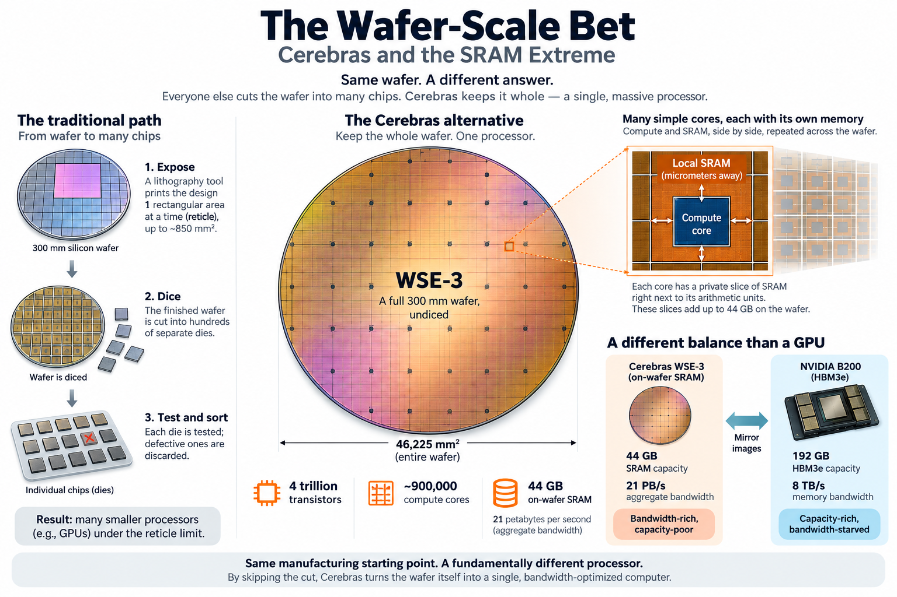
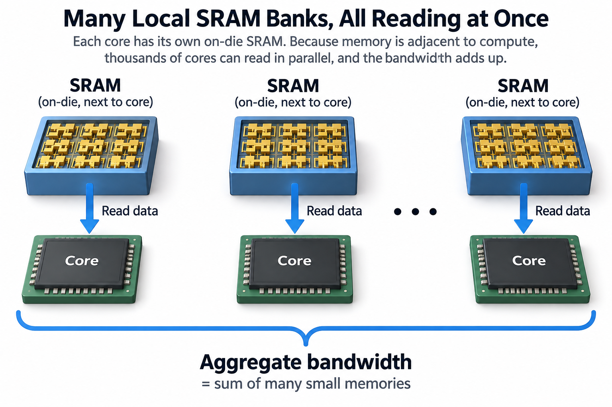
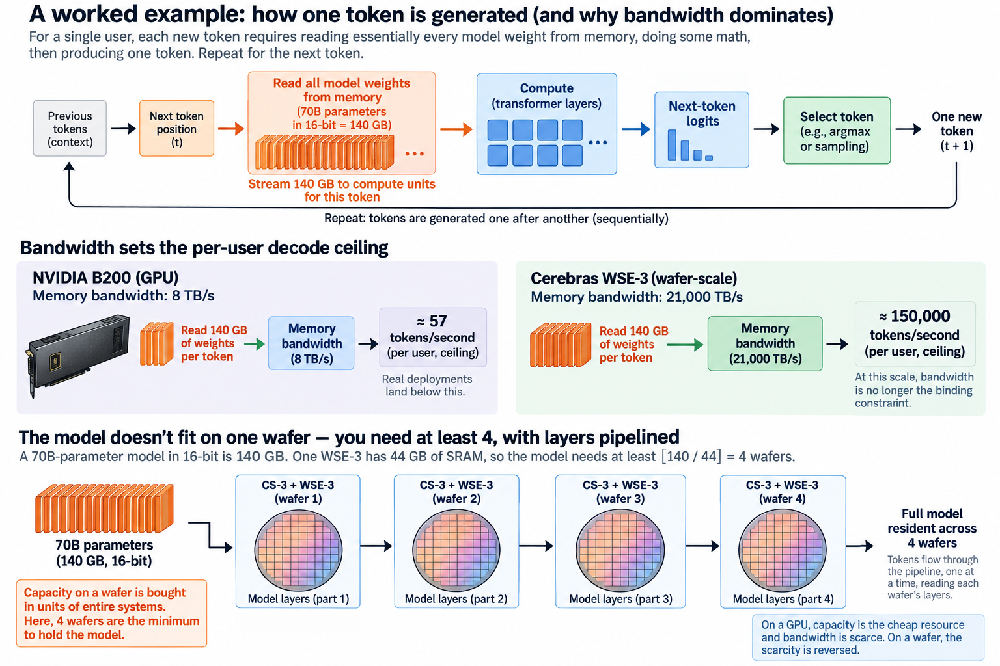
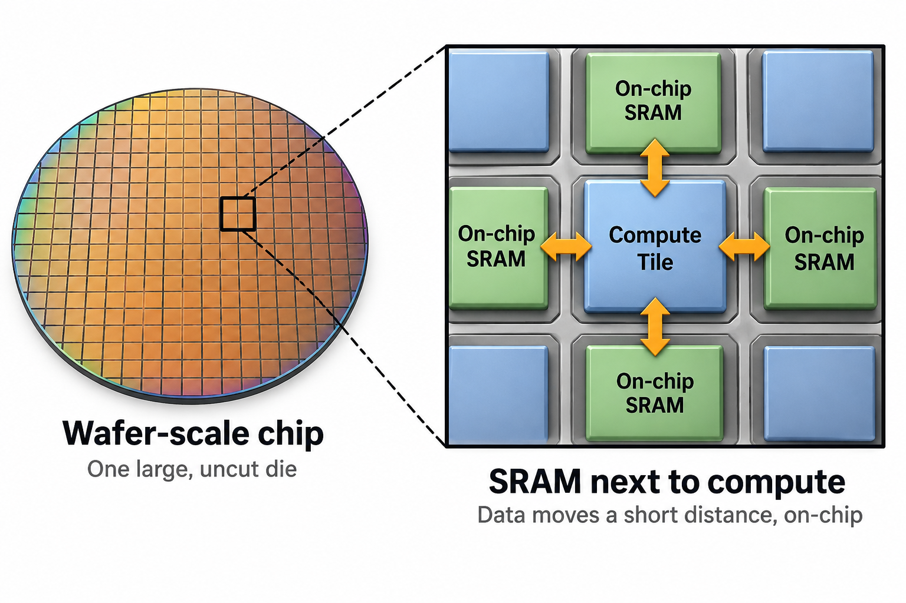

## Overview

46,225 square millimeters. That is the silicon area of the Cerebras Wafer-Scale Engine 3 (WSE-3), the largest chip ever sold. It is roughly 57 times the area of the biggest GPU die NVIDIA has shipped. It exists because Cerebras looked at a step every other chipmaker performs, slicing the finished wafer into hundreds of separate chips, and simply refused to do it.

Every processor you own began life on a circular slab of silicon about 300 mm across. A lithography machine projects the chip's pattern onto that wafer 1 rectangular exposure at a time. The exposure window, called the **reticle**, tops out around 850 mm², which is why big GPU dies all cluster just under that size. Afterward the fab dices the wafer into individual dies, tests each one, and discards the defective ones. The wafer is scaffolding; the die is the product.

Cerebras keeps the whole wafer as 1 part. The WSE-3, built on TSMC's 5 nm process, packs 4 trillion transistors into about 900,000 small compute cores. Each core owns a private slice of memory sitting micrometers from its arithmetic units. Those slices add up to the 2 numbers this article orbits: **44 GB of on-wafer SRAM, readable at an aggregate 21 petabytes per second** (Cerebras's own spec, like all peak figures here).

Set that against the flagship GPU profile from [the first article in this series](/blog/blackwell-to-rubin-memory-math/): an NVIDIA B200 carries 192 GB of HBM3e at 8 TB/s. The wafer has less than a quarter of the capacity and about 2,600 times the bandwidth. It is the precise mirror image of a GPU: bandwidth-rich and capacity-poor, where the GPU is capacity-rich and, by comparison, bandwidth-starved.

## Deep dive

### Why SRAM flips the ratio

The mirror image is not a styling choice. It falls straight out of 2 memory technologies.

**SRAM** (static RAM) stores each bit in a loop of about 6 transistors, fabricated on the same die as the logic that uses it. Reads are fast, and because the memory is physically adjacent to compute, thousands of cores can each read their own bank at once. Aggregate bandwidth becomes the *sum* of 1 million tiny memories. That is how 21 PB/s happens: not 1 heroic memory channel, but 900,000 ordinary ones added together.

**DRAM**, the technology inside HBM stacks, stores each bit as charge on a capacitor with a single access transistor. It is several times denser and far cheaper per bit, but it must be manufactured on its own specialized dies. Data then has to cross from those dies into the processor through a package interface with a limited number of wires. HBM is the industry's best compromise. Stack the DRAM, park it millimeters from the GPU on a silicon interposer, and widen the interface to thousands of pins. Even so, the flagship result is 8 TB/s.

The trade is symmetric and unforgiving. HBM's density buys the GPU 192 GB but throttles it at the package boundary. SRAM's proximity buys Cerebras 3 orders of magnitude more bandwidth, but at 6 transistors per bit, even a dinner-plate-sized chip holds only 44 GB. Neither side gets to cheat physics. They just picked opposite ends of the same lever.

### A worked example you can do on paper

Why does bandwidth dominate this discussion at all? Because of how [transformers generate text](/blog/transformer-architecture-in-one-picture/). Producing 1 token requires streaming essentially every active model weight through the compute units, and the model produces tokens 1 after another. For a single user, decode is a memory-reading exercise with some math attached.

Take a 70B-parameter dense model in 16-bit precision. The numbers:

- **Bytes per token:** 70B parameters × 2 bytes = **140 GB** read per generated token, per user (the KV cache adds more; ignore it for round numbers).
- **B200 ceiling:** 8 TB/s ÷ 140 GB ≈ **57 tokens/second** for one user. Not a software limitation but an arithmetic 1. Real deployments land below it.
- **WSE-3 ceiling:** 21,000 TB/s ÷ 140 GB ≈ **150,000 tokens/second**. At that point memory bandwidth simply stops being the binding constraint. Compute per token, the sequential dependency between tokens, and communication take over long before you approach the ceiling.

Then comes the other side of the mirror. 140 GB of weights do not fit in 44 GB of SRAM. This model needs at least **⌈140 / 44⌉ = 4 wafers**, with layers pipelined across CS-3 systems (the boxed product around each wafer). On a GPU, capacity is the cheap resource and bandwidth is the scarce 1. On a wafer, the scarcity is reversed: you buy capacity in units of entire wafer-scale systems.

That is the whole architecture in 1 division and 1 ceiling function. Everything else is consequences.

### Capacity is a floor, locality is the method

If weight storage is $$M_w$$ bytes and each wafer has usable local memory $$M_s-M_r$$ after reserving $$M_r$$ bytes for runtime state, a necessary capacity condition is

$$
N_{\min}=\left\lceil\frac{M_w}{M_s-M_r}\right\rceil.
$$

A 140 GB weight payload with 44 GB per wafer and 4 GB reserved needs at least 4 wafers. An 800 GB payload needs at least 19 even with 0 reservation, since 18 provide only 792 GB. These decimal-unit calculations are capacity floors, not vendor deployment specifications.

The innovation is distributing weights and computation near many SRAM banks. Aggregate SRAM bandwidth does not make those banks 1 globally accessible memory channel. Mapping must balance stages and communicate activations between them. A pipeline's steady-state rate is constrained by its slowest stage, so adding bank bandwidth at another stage may produce no gain. Evaluate per-stage bytes, compute, link traffic, and bubbles rather than dividing whole-model bytes by the sum of every bank's peak bandwidth. Compared with an HBM design, locality can reduce repeated external weight traffic. The tradeoffs include mapping complexity, capacity expansion, and inter-wafer communication. A headline bandwidth ratio cannot tell you the usable model-level speedup.

### The number Cerebras leads with

Cerebras reports serving Llama 4 Maverick at **2,500 tokens/second per user**, which it claims is more than double a DGX B200 system. Maverick is a 400B-parameter mixture-of-experts model with 17B active parameters per token. Both figures are vendor-reported, so treat them as a manufacturer's best foot forward. But the roofline math says the *shape* of the claim is credible. At 16-bit, 17B active parameters mean 34 GB per token, so a single B200 caps at about 235 tokens/second per user. Even 8 of them with flawless tensor parallelism (64 TB/s aggregate) cap near 1,900. To go faster for one user at that precision, you need bandwidth GPUs do not have. SRAM machines do.

Notice also what the capacity math says: 400B total parameters is 800 GB at 16-bit, at least 19 wafers of SRAM before overheads. Cerebras serves big models by spreading layers across many CS-3 systems. The speed is real engineering. So is the hardware bill behind it.

Single-stream speed is not a vanity metric in 2026. Reasoning models think in chains of sequential tokens, and agents run loops of generate-act-observe. None of that parallelizes across the batch dimension for the user who is waiting. When the product is 1 long chain of thought, tokens/second *per user* is the latency of intelligence.

### Going deeper: keeping a wafer alive

Saying "just don't cut the wafer" skips the 3 problems that made wafer-scale integration a graveyard of attempts. Gene Amdahl's Trilogy Systems burned roughly a quarter billion 1980s dollars on it.

**Stitching.** The lithography machine still exposes 1 reticle-sized rectangle at a time. A wafer is a grid of dozens of these fields, separated by thin scribe lines where the dicing saw would normally cut. Cerebras patterns wires *across* the scribe lines, so adjacent fields connect with on-die density and latency instead of package-level links. The chip is 1 uniform fabric of identical tiles. A message crosses field boundaries without knowing they exist.

**Yield.** A 300 mm wafer always carries defects, and a conventional design that big would yield 0 working parts. Cerebras's answer is granularity. With ~900,000 tiny identical cores, you add roughly 1% spares, map out the cores that test defective, and let the fabric route around them. A flaw that would kill an entire GPU die costs Cerebras a few cores in 1 million. Redundancy improves yield. Public descriptions do not imply a 100% manufacturing yield.

**Power and packaging.** 1 wafer-scale chip draws on the order of 20 kW. The CS-3 therefore pairs it with a water-cooled cold plate and a custom mounting system that absorbs the thermal-expansion mismatch between a silicon wafer and the board it presses against. Delivering ~20,000 amps at low voltage into a single part is its own engineering subplot.

Capacity gets solved by systems design rather than silicon. For **training**, Cerebras streams weights. Parameters live in an external MemoryX appliance and flow through the wafer layer by layer, so the SRAM holds activations while model size scales past the on-wafer limit. For **inference**, latency rules out streaming weights per token, so models are partitioned layer-wise across multiple systems in a pipeline. Either way, the design says the quiet part aloud: on-wafer memory is a bandwidth resource, not a capacity resource.

### Common misconceptions

**"You can't manufacture a wafer-sized chip: yield would be zero."** True for a monolithic design, and it is why wafer-scale integration failed for 40 years. It stops being true when the architecture is a sea of small redundant cores. Defects get mapped out and routed around, converting yield from a pass/fail lottery per die into a ~1% capacity tax per wafer. Cerebras has shipped 3 generations this way. Manufacturability is the solved part of the story.

**"44 GB of memory means it can only run small models."** The 44 GB is per wafer, not per deployment. Weight streaming (training) and layer pipelining across systems (inference) let Cerebras run 70B, 400B, and larger models. The company serves trillion-parameter-class MoE models across clusters of CS-3s. The honest limitation is economic, not existential: capacity arrives in increments of a whole wafer-scale system, so the capacity-per-dollar math is brutal compared with HBM. That, not impossibility, is the real constraint.

**"2,500 tokens/s/user means Cerebras beats GPUs, full stop."** It means Cerebras wins *1 regime*: minimum latency for a single stream. A GPU serving a batch of 200 users reads the weights once per step and shares that 140 GB stream across everyone. Its cost per token can therefore be far lower, even while each individual user gets tokens more slowly. Which machine "wins" depends on whether your product sells latency or throughput. That is the same distinction [goodput vs utilization](/blog/goodput-vs-utilization/) draws between what a system does and what a customer receives. Vendor benchmarks, Cerebras's included, are always measured in the regime that flatters the architecture.

### 1 axis, pushed to the end

Zoom out and the WSE-3 stops looking like an oddity and starts looking like a data point: the far end of a spectrum every accelerator sits on. Memory close to compute is fast and small. Memory far from compute is big and cheap. NVIDIA's Rubin CPX puts 128 GB of inexpensive GDDR7 on a prefill-specialized GPU because prefill barely needs bandwidth. Flagship HBM parts hold the middle. Groq builds SRAM-only chips at normal die size (230 MB each) and gangs hundreds together. Cerebras takes the same SRAM bet and scales the die to the wafer. Nobody is wrong. They are answering different sub-questions of "what does serving a model actually cost?"

The bet's weak flank is the part specs never show: ecosystem. GPUs come with CUDA, PyTorch-native everything, a decade of kernels, and [a job market of people who tune them](/blog/what-does-an-ml-performance-engineer-do/). A wafer needs its own compiler stack, and every new model architecture needs porting before it runs well. Cerebras's countermove is to sell tokens instead of silicon, through an API where the exotic hardware hides behind an OpenAI-compatible endpoint. That is a tacit admission that the hardest part of a new chip is everything around the chip.

What makes the WSE-3 worth studying is not that it wins. It is that it is *legible*. 1 decision, never cut the wafer, mechanically produces everything else: the PB/s bandwidth, the 44 GB ceiling, the yield trick, the 20 kW cold plate, the multi-system pipelines, the single-stream speed records, and the capacity economics. Few chips let you trace cause to effect that cleanly.

## Conclusion

- The WSE-3 gets 21 PB/s by making memory and compute the same piece of silicon, with 900,000 cores each reading local SRAM. It pays for that with a 44 GB per-wafer capacity that makes big models a multi-system, multi-million-dollar affair.
- Single-user decode speed is bandwidth ÷ bytes per token: ~57 tok/s for a 70B FP16 model on 1 B200, 6-figure ceilings on wafer SRAM. Cerebras's vendor-reported 2,500 tok/s/user on Llama 4 Maverick is the regime where that math shines.
- Every accelerator picks a point on the memory distance-versus-density lever: GDDR7 prefill parts, HBM flagships, SRAM wafers. Match the machine to whether you are selling latency or cost per token.

### Sources

- Cerebras: [Cerebras Inference: 3x faster](https://www.cerebras.ai/blog/cerebras-inference-3x-faster) (WSE-3 SRAM specs; Llama 4 Maverick 2,500 tok/s/user, vendor-reported)
- Introl: [Cerebras Wafer-Scale Engine & CS-3 architecture guide](https://introl.com/blog/cerebras-wafer-scale-engine-cs3-alternative-ai-architecture-guide-2025)
- Cerebras Systems: "Cerebras Announces WSE-3" press release, March 2024 (46,225 mm², 4T transistors, 900k cores, TSMC 5nm)
- Sean Lie: "Cerebras Architecture Deep Dive: First Look Inside the Hardware/Software Co-Design for Deep Learning," *IEEE Micro*, 2023 (cores, fabric, weight streaming)
- NVIDIA: [GB300 NVL72 specifications](https://www.nvidia.com/en-us/data-center/gb300-nvl72/) (B200-class HBM3e capacity/bandwidth)
- Glenn Lockwood: [Rubin R200 spec compilation](https://www.glennklockwood.com/garden/processors/r200) (GPU memory roadmap context)

---

*Part of the [Efficient AI & Co-Design](/series/efficient-ai/) learning path. Browse its published articles by topic.*
