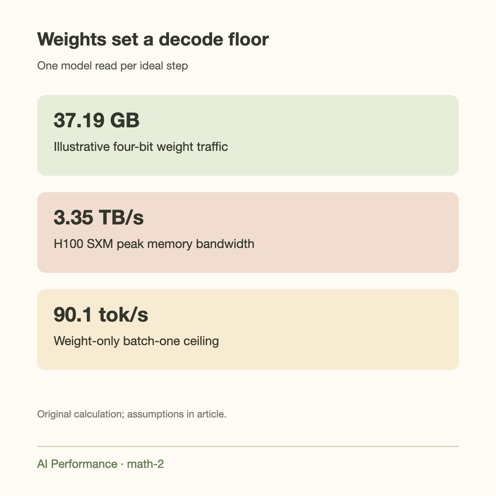
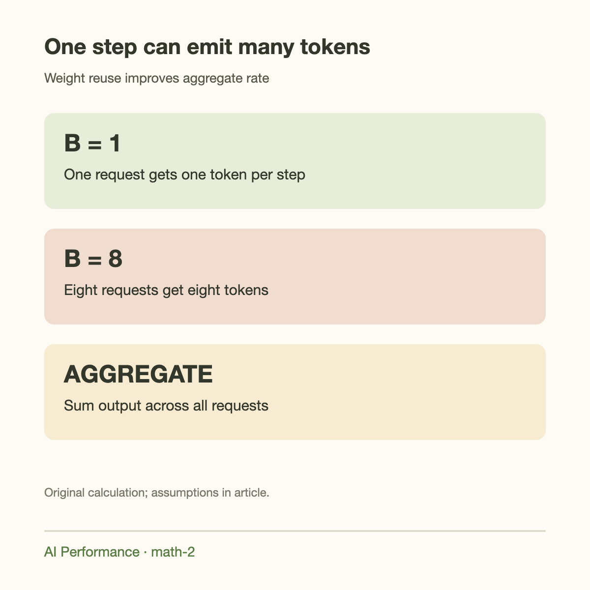
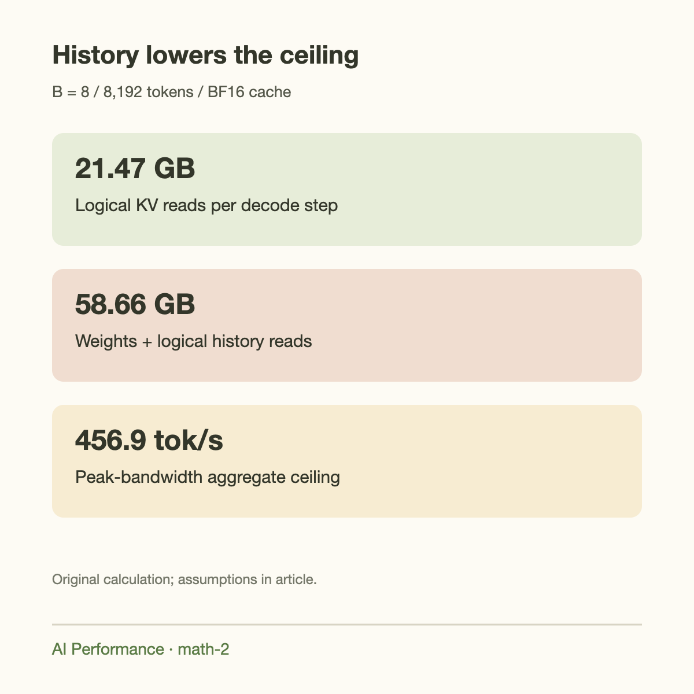

23.9 output tokens per second is the bandwidth-only ceiling for reading 140 GB of weights once per decode step through a 3.35 TB/s memory interface. That number is not a measured H100 result. It is the answer to a deliberately simplified question: how many complete weight reads can memory perform each second?

The calculation is useful precisely because its assumptions are visible. It can reject an implausible claim, explain why batching changes aggregate throughput, and identify when cache traffic matters. It cannot describe a deployment that does not fit in memory, or replace a benchmark with the actual checkpoint, kernels, and request distribution.

We use NVIDIA's specified H100 SXM bandwidth as a hardware input and a rounded dense 70B model as the workload. Since its BF16 weights exceed 1 H100's memory, the 23.9 figure is a counterfactual bandwidth illustration. A practical 1-GPU example will instead use an illustrative 4-bit representation. Keep that distinction explicit when quoting any ceiling.

## Start from a time lower bound

Let memory traffic per decode step be $$D$$ bytes and attainable memory bandwidth be $$\beta$$ bytes per second. Then the memory service time satisfies

$$
t_{\mathrm{memory}}\ge\frac{D}{\beta}.
$$

If a step emits 1 token for each of $$B$$ active sequences, its aggregate output rate obeys

$$
R_{\mathrm{aggregate}}\le\frac{B\beta}{D}.
$$

For a batch of 1, aggregate rate and per-request streaming rate coincide. For a batch of 32, the aggregate rate counts 32 emitted tokens per step, while an individual request receives 1. Both metrics are legitimate, but they answer different questions.

This distinction is developed in [Tokens per Second: What It Means and What It Hides](../tokens-per-second-what-it-hides/). Here we focus on the physical model that supplies the denominator. A hardware bandwidth specification becomes meaningful only after describing which bytes cross that interface.

## Why weights dominate short-context decode

A dense transformer's linear layers multiply the current token's activation by learned matrices. With 1 active sequence, the operation resembles many matrix-vector products. Each weight participates in relatively little arithmetic before the next weight must arrive. The entire model is much larger than on-chip cache, so it cannot remain there between full decode steps.

As a first approximation, count 1 HBM read of each weight per step. For $$P$$ parameters at $$b_w$$ bytes per parameter,

$$
D_w=P b_w.
$$

This is a model for well-organized execution, not a law that every implementation reads each byte exactly once. Layout conversions, quantization metadata, intermediate writes, and inefficient kernels can increase traffic. Cache reuse or specialized execution paths can change some terms. The estimate works best as an explicit baseline for ordinary dense decode.

For 70 billion parameters at 2 bytes each, $$D_w=140\times10^9$$ bytes. With $$\beta=3.35\times10^{12}$$ bytes per second,

$$
t_w\ge41.79\ \mathrm{ms},\qquad R\le23.93\ \mathrm{tokens/s}.
$$

The model does not fit that single GPU in BF16. Using a bandwidth number from 1 device while quietly assuming capacity from 2 devices would make the example misleading. For a 2-GPU deployment, compute each shard's traffic and add communication constraints rather than carrying this number over unchanged.

## A feasible quantized illustration

Use the 4-bit format from [the memory-budget article](../does-llama-70b-fit-on-one-h100/): packed weights plus 4 metadata bytes per 128 weights. Its effective payload is 37.1875 GB for the rounded model.

Ignoring cache and all other traffic gives

$$
t_w\ge\frac{37.1875\times10^9}{3.35\times10^{12}}
=11.10\ \mathrm{ms},
$$

or 90.08 output tokens per second for a batch of 1. A nominal 4-bit payload without metadata would suggest 95.71 tokens per second. The 5-token difference is entirely accounting: it appears before discussing kernel efficiency.

Quantization does not guarantee that the engine reaches either ceiling. Some weight formats unpack or convert values as part of a fused GEMM. Their actual execution may have a different compute ceiling from dense BF16 Tensor Cores. Small shapes can underfill the device, and launch overhead is more noticeable as weight traffic shrinks. A smaller representation removes 1 constraint while potentially exposing another.

Introduce a measured bandwidth efficiency $$\eta_b$$ when available:

$$
\beta_{\mathrm{effective}}=\eta_b\beta_{\mathrm{peak}}.
$$

If an illustrative execution achieved 65% of peak, the weight-only ceiling would fall to about 58.6 tokens per second. That is a scenario calculation, not an empirical claim that H100 decode always achieves 65%. Measure the factor for the actual kernels and workload.

## Batching shares weight reads

For a batched linear layer, several token activations multiply the same weight matrix. A suitable GEMM can reuse weights across those rows. If weight traffic remains near 1 model read per step, increasing $$B$$ increases the number of emitted tokens without multiplying that weight traffic by $$B$$.

In the ideal weight-only regime,

$$
R_{\mathrm{aggregate}}\le\frac{B\beta}{D_w}.
$$

At batch 16, the quantized example's ideal aggregate ceiling is approximately 1,441 tokens per second. It does not mean 1 user receives 1,441 tokens per second. The ideal per-sequence rate remains around 90, and real per-sequence speed can decline as cache and compute work grow.

This simple model explains the economic appeal of continuous batching. A server can admit requests into available slots as others finish, keeping useful rows in the matrix multiplication. It also explains why a high aggregate benchmark can coexist with worse individual latency.

Weight reuse has limits. Large batches demand more arithmetic, activations, cache traffic, and resident state. The bandwidth-only line cannot grow forever because the compute ceiling eventually intervenes. Scheduling limits or memory capacity may stop the experiment before that crossing occurs.

## Add attention history

For a grouped-query model with 80 layers, 8 KV heads, head dimension 128, and a 2-byte cache, the cache payload is 327,680 bytes per retained token. Ordinary full-context attention must access past key and value state to evaluate the next token.

A transparent lower-bound traffic model for independent requests with histories $$S_i$$ is

$$
D_{KV}\approx c_{KV}\sum_i S_i.
$$

This assumes ideal sharing across query heads and counts logical K and V reads once. Actual traffic depends on the attention kernel, tiling, and memory hierarchy; it may be larger. Sliding-window or other attention mechanisms require a different history model.

For batch 16 with each history at 8,192 tokens, logical cache reads are approximately 42.95 GB per step. Add 37.1875 GB of weight traffic:

$$
D\approx80.14\ \mathrm{GB}.
$$

The bandwidth-only step time becomes about 23.92 ms. Aggregate throughput is at most about 669 tokens per second, and per-request streaming at most about 41.8 tokens per second. Those are already less than half the ideal weight-only batch result.

This particular batch also needs approximately 42.95 GB merely to store its BF16 cache, so it exceeds the worked 1-GPU memory budget in the preceding article once headroom is included. Traffic calculations do not establish capacity feasibility. A smaller batch, shorter histories, or different cache representation is required.

## A capacity-compatible example

Take batch 8 at 8,192 retained tokens per request. Its logical cache payload is 20 GiB, approximately 21.47 GB, which fits the illustrative 34.81 GB cache pool from the preceding article.

Weight plus logical cache reads total approximately 58.66 GB per step. Peak-bandwidth arithmetic gives 17.51 ms per step, 57.1 tokens per second per request, and 456.9 aggregate tokens per second. These remain ceilings: temporary traffic, kernel efficiency, sampling, and scheduling can lower the observed rates.

This is a useful pair of numbers to attach to a measurement. If observed streaming is 35 tokens per second and aggregate throughput is 280, the gap can be investigated. If someone claims 1,000 aggregate tokens per second for the same assumptions, inspect cache dtype, actual histories, prefix sharing, GPU count, and whether the metric counts input tokens as well as outputs.

## Going deeper: the compute ceiling

Dense linear-layer work is roughly 2 floating-point operations per parameter per token. 1 multiply and 1 add count as 2 operations. Let $$C$$ denote an appropriate attainable compute rate. Ignoring attention and other operations,

$$
t_{\mathrm{compute}}\gtrsim\frac{2PB}{C}.
$$

The combined idealized time is bounded below by the larger service demand:

$$
t_{\mathrm{step}}\gtrsim\max\left(\frac{D}{\beta},\frac{F}{C}\right).
$$

This is a roofline model. It assumes the resource demands can overlap sufficiently and ignores serial overheads. In actual execution, different kernels run sequentially and can have different limiting resources, so summing kernel times gives a better prediction than taking 1 maximum over the entire model.

NVIDIA's current H100 table lists BF16 Tensor Core throughput with a sparsity footnote. A dense workload cannot simply claim the sparse figure. More importantly, a 4-bit weight kernel's applicable execution ceiling depends on its actual arithmetic path. Use measured or format-appropriate throughput rather than inserting a convenient advertised TFLOPS value.

The final GPU Math article derives [the batch size at the compute-bound transition](../how-big-a-batch-before-compute-bound/). Its main lesson is that the transition is workload-dependent and can disappear when history traffic grows faster than useful arithmetic.

## Prefill is a different calculation

Prefill processes many prompt tokens together, creating large matrix multiplications with more weight reuse. Its arithmetic intensity can be far higher than 1-token decode. A prompt ingestion rate therefore cannot be inferred by dividing bandwidth by model weight size.

Attention work also grows with sequence length for ordinary full attention, though optimized algorithms avoid materializing a full score matrix in HBM. Long prompts may expose compute or workspace constraints that are absent in short decode. Separate input-token throughput, time to first token, output-token throughput, and time per output token in every report.

A serving system combines those phases under a scheduler. Chunked prefill may share the GPU with decode, so a request's streaming delay depends on work admitted between its steps. A clean single-phase ceiling is valuable for diagnosis, but production latency includes scheduling interference.

## Common misconceptions

**Peak bandwidth is observed bandwidth.** A specification describes a hardware capability. Kernels must generate enough well-coalesced traffic and hide latency to approach it. A theoretical ceiling is intentionally optimistic.

**Batch 16 makes each user 16 times faster.** It makes the step emit 16 tokens across users. Weight reuse improves aggregate throughput; individual streaming remains tied to step duration.

**A small checkpoint means short-context speed applies at 128k.** The checkpoint size stays fixed while attention history grows. Cache traffic can dominate even when quantized weights fit comfortably.

**All parameters are always active.** The rounded model here is dense. A mixture-of-experts model has different active weight traffic and routing behavior. Total parameter count alone cannot supply its per-token denominator.

## A practical benchmark record

Record checkpoint revision, weight format, cache dtype, GPU variant and count, batch policy, prompt-length distribution, output-length distribution, and whether prefixes are shared. Report both aggregate output throughput and a distribution of streaming intervals.

Compute the weight-only ceiling first, then add logical cache traffic and compare with measured memory traffic if profiling permits. A disagreement is useful information: it may expose a wrong model assumption or a software bottleneck. Do not turn the estimated efficiency factor into a constant carried across unrelated workloads.

## Takeaway

Bandwidth divided by bytes per decode step gives a useful ceiling. To use it responsibly, count weight metadata, distinguish per-user from aggregate throughput, and add history traffic. Confirm that the resulting workload fits before interpreting its rate.

For our illustrative quantized model, batch 8 at 8k histories has a peak-bandwidth ceiling near 457 aggregate output tokens per second, not the 721 suggested by weights alone. The difference is the KV cache, and longer histories increase it further.

To validate the ceiling, collect a steady interval after warmup and separate generated tokens from prompt tokens. Record the number of simultaneously decoding sequences and their context lengths. Then compare observed memory traffic with the assumed weight traffic. If throughput changes while the estimated weight bytes stay fixed, investigate batching, cache reads, kernel efficiency, or scheduling overhead. A bandwidth formula is most useful when it leads to a testable hypothesis. It should explain which measurement would confirm the proposed bottleneck and which observation would require a different model of the workload.

## Sources

- [NVIDIA H100 specifications](https://www.nvidia.com/en-us/data-center/h100/): peak memory bandwidth and sparsity-qualified compute rates.
- [NVIDIA matrix-multiplication performance guide](https://docs.nvidia.com/deeplearning/performance/dl-performance-matrix-multiplication/index.html): FLOP counting, arithmetic intensity, and implementation limits.
- [Meta Llama 3.1 model card](https://huggingface.co/meta-llama/Llama-3.1-70B-Instruct): model family and grouped-query attention.
- [vLLM paged-attention design](https://docs.vllm.ai/en/latest/design/paged_attention/): cached state and kernel access structure.
