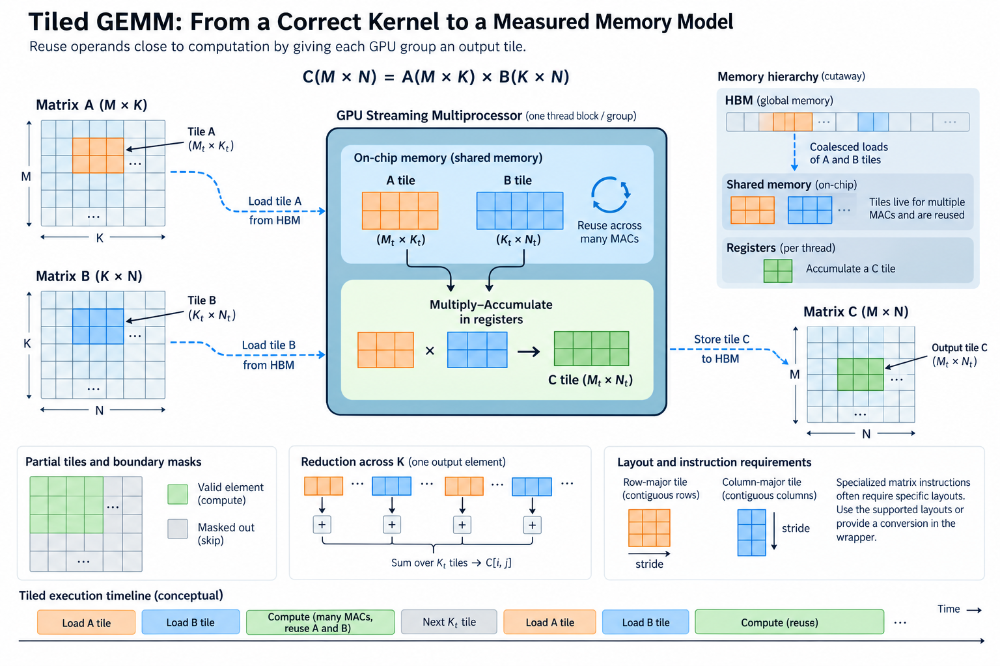
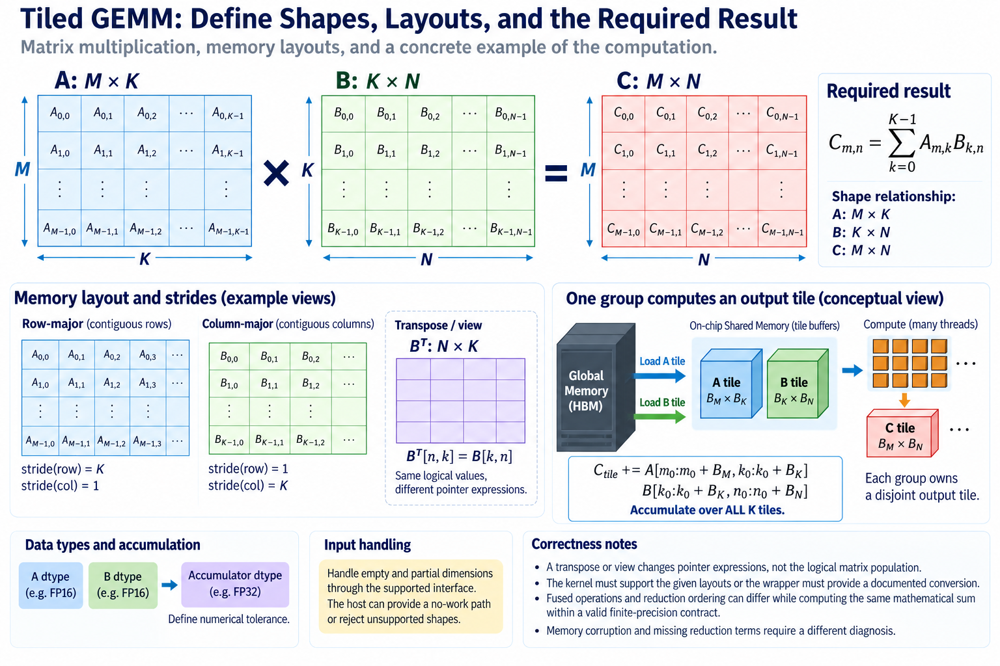
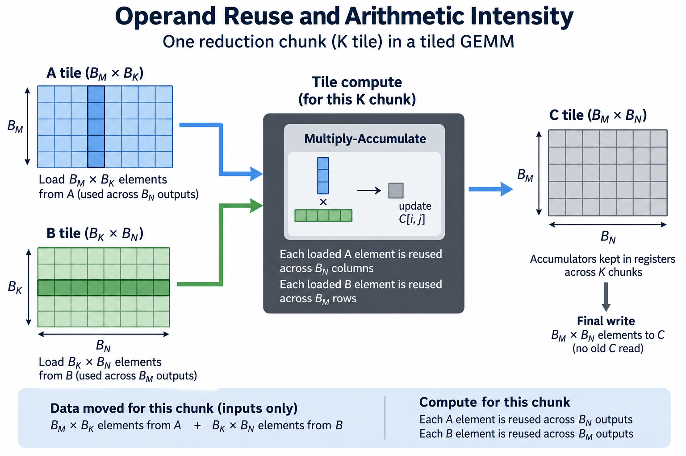
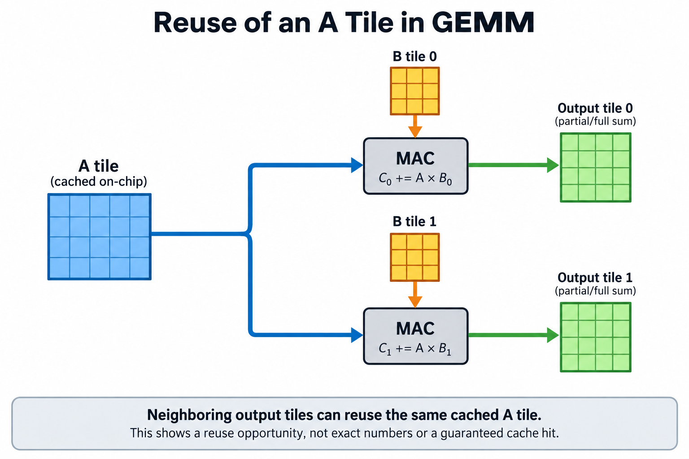
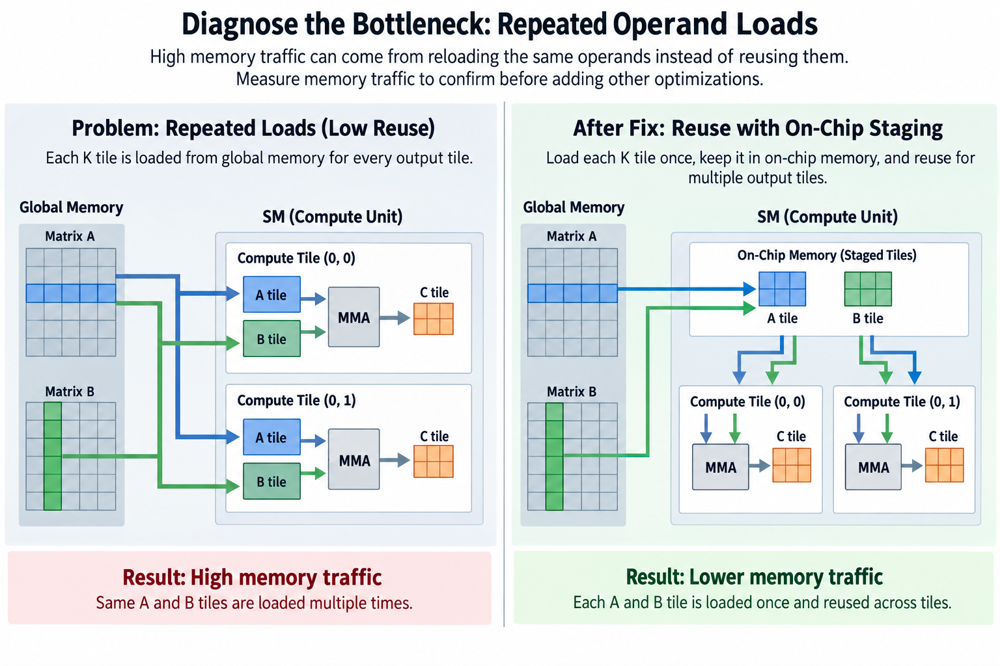

## Overview



Matrix multiplication becomes fast by reusing operands close to computation. A naive output-element kernel can repeatedly load values that neighboring threads also need. Tiling gives a group ownership of an output region and lets it reuse loaded input blocks across many multiply-accumulate operations.

Tiling is more than picking large dimensions. Output ownership, reduction boundaries, shared-buffer lifetime, accumulator storage, and numerical behavior must remain correct. A larger tile can improve reuse while exhausting registers or reducing the number of concurrent groups.

We will derive a tiled execution and its logical traffic model, then connect that model to measurement. Numerical examples are illustrative. For hardware-specific matrix instructions and supported layouts, follow current CUDA and library documentation.

## Deep dive

### 1. Define shapes, layouts, and the required result



Let A have shape M by K, B shape K by N, and C shape M by N. For the basic operation without an existing-output term,

$$
C_{m,n}=\sum_{k=0}^{K-1}A_{m,k}B_{k,n}.
$$

Record the actual storage strides and dtypes. A transpose or view changes pointer expressions without changing the logical matrix population. The kernel must support those layouts explicitly or the wrapper must provide a documented conversion.

Define accumulator precision and numerical tolerance. Fused operations and reduction ordering can differ from a sequential reference while computing the same mathematical sum within a valid finite-precision contract. Memory corruption and missing reduction terms require a different diagnosis.

Handle empty and partial dimensions through the supported interface. The host can provide a no-work path or reject unsupported shapes. A convenient square aligned benchmark does not establish correctness for all claimed inputs.

### 2. Begin from a correct scalar ownership baseline

A simple baseline assigns one output element to a thread and loops over K. It has clear ownership: one writer for C_m,n and a complete reduction over the required k positions. Bounds protect valid output rows and columns.

The baseline is useful for reference and diagnosis even if it is not fast. It separates the mathematical operation from later reuse, layouts, and specialized instructions. Preserve it or an equivalent suitable reference when developing the tiled path.

Count work before optimization. Under the usual multiply-plus-add counting convention, the operation has about 2MNK floating-point operations. The exact convention matters for small K and special forms, so state it in the report.

The scalar baseline can load the same A value for many output columns and the same B value for many rows. Caches may capture some reuse, but explicit tiling changes where and how that reuse is organized. A logical load count is not automatically physical HBM traffic.

### 3. Assign one group an output tile

Let a group own B_M output rows and B_N output columns. It traverses the reduction dimension in chunks of B_K. For tile origins m_0 and n_0, its accumulator update is

$$
C_{\mathrm{tile}}\mathrel{+}=A[m_0:m_0+B_M,k_0:k_0+B_K]\,B[k_0:k_0+B_K,n_0:n_0+B_N].
$$

Each group owns a disjoint output tile under the chosen grid. Within the group, threads or supported matrix operations distribute accumulator ownership. The mapping must cover every valid output exactly once or use an explicitly supported combining mechanism.

Mask tail rows and columns at global accesses. A partial reduction tile needs invalid k positions to contribute zero under the supported representation and operation. Final stores write only valid C positions.

The complete reduction is the union of consecutive k chunks covering 0 through K minus 1. This coverage argument is independent of the hardware schedule and provides a useful correctness proof before optimization.

### 4. Stage operands with two ownership boundaries

A cooperative group can load an A tile and a B tile into shared storage, then use them for the current multiply-accumulate work. The participating threads split the loads between them and guard the global boundaries.

The execution pattern is conceptually

```text
initialize output accumulators
for each reduction tile:
    cooperatively fill valid A and B entries; fill padding with zero
    establish supported fill-to-consume synchronization
    accumulate the tile product
    establish supported consume-to-reuse synchronization
store valid output entries
```

This pseudocode states the dependencies rather than a complete CUDA implementation. The two synchronization boundaries serve different purposes: readers need filled data, and the next producer must not overwrite data still being consumed.

A single barrier before computation does not necessarily protect reuse on the next iteration. Fast threads can otherwise begin overwriting a shared tile while slower consumers still read it. Tail threads must follow the required participation contract even when they have no valid global output.

### 5. Derive operand reuse and arithmetic intensity



For one reduction chunk, the tile performs about 2B_M B_N B_K FLOPs while loading B_M B_K plus B_K B_N elements. For b bytes per input element, the chunk's input-only intensity is

$$
I_{\mathrm{chunk}}\approx\frac{2B_MB_N}{b(B_M+B_N)}.
$$

B_K cancels in this simplified ratio. It still affects staging, synchronization frequency, and instruction efficiency, so cancellation does not make the reduction-tile size irrelevant.

Including one final output write with the same stored element width gives an approximate group-level model

$$
I_{\mathrm{tile}}\approx\frac{2B_MB_NK}{b\left(K(B_M+B_N)+B_MB_N\right)}.
$$

The assumptions include no old C read and reusable accumulators across K. Different output widths, scaling terms, or representations need adjusted bytes. FP32 accumulation does not imply FP32 storage; state the final output representation separately from the accumulator type. Cross-group cache reuse can further change physical traffic.

For B_M=B_N=128, K=4096, and b=2, the group performs 134217728 FLOPs and moves about 2129920 logical bytes under this model. Intensity is about 63 FLOPs per byte. The value explains reuse potential, not achieved hardware throughput.

### 6. Budget operand stages and accumulators separately

One shared operand stage requires approximately

$$
S_{\mathrm{stage}}=bB_K(B_M+B_N).
$$

For 128-by-128 output tiles, B_K=32, and 2-byte inputs, this is 16 KiB. Two operand stages require about 32 KiB before padding, barriers, and other storage. More stages can overlap movement and computation while consuming additional on-chip capacity.

The output has B_M B_N accumulators. At FP32 width, a 128-by-128 tile represents 64 KiB of accumulator values distributed through the supported execution mapping. That is an aggregate state budget, not a claim that one thread holds all values.

Registers also hold addresses, operands, loop state, and temporary results. The compiler's allocation and hardware granularity determine actual occupancy and spills. A source-level estimate helps explain pressure; check it against compiled resource usage.

Larger tiles can improve logical reuse while reducing concurrency. The best shape follows measured instruction efficiency and resource balance, not a universal preference for maximum tile area.

### 7. Specialized matrix instructions add layout requirements

Supported matrix instructions can perform dense tile arithmetic efficiently, but they impose shape, dtype, layout, and synchronization requirements. An implementation must transform staged operands into the expected representation and preserve accumulator ownership.

A naive scalar tile and a matrix-instruction tile can therefore have similar logical reuse with very different execution efficiency. The traffic model alone does not predict the complete result. Non-matrix arithmetic, layout conversion, and synchronization can limit the optimized path.

Use current supported libraries or APIs for the target architecture where appropriate. Preserve the executed kernel and configuration in comparisons. A high-level GEMM call can select different implementations based on shape, dtype, and layout.

Do not copy a hardware-specific pipeline to another architecture without checking support and semantics. The mathematical tiling identity transfers; the instruction and ownership machinery may not.

### 8. Verify partial tiles and numerical behavior

Use small deterministic matrices to check output ownership and reduction coverage. Include M, N, and K values that are not multiples of tile dimensions. Aligned square cases leave important boundary logic untested.

Compare with a suitable reference under tolerances appropriate to representation and accumulation. Test zero, large dynamic range, and cancellation where relevant to the contract. A tolerance should explain finite-precision behavior rather than hide missing terms.

Exercise repeated reduction tiles and buffer reuse. A kernel can pass K smaller than one tile while failing when shared storage is reused. Sanitizer and synchronization checks provide complementary evidence within their supported scopes.

For an illustrative exact small case, fill A with 1 and B with 2. Every valid output should be 2K before rounding considerations. Add a nonuniform pattern to reveal transposition or stride errors that uniform values can hide. The pair of tests separates simple coverage from layout association.

### 8-1. Work a reduction boundary by hand

Consider a 2-by-3 A matrix with rows 1, 2, 3 and 4, 5, 6. Let the 3-by-2 B matrix have rows 1, 0; 0, 1; and 1, 1. The required C rows are 4, 5 and 10, 11. With reduction width 2, the first tile contributes rows 1, 2 and 4, 5. The second tile contributes 3 to both entries of the first row and 6 to both entries of the second.

That second tile has only one valid reduction position. Its other staged position must contribute zero, not a value retained from the previous tile. This small calculation tests complete reduction coverage and consume-to-reuse behavior without relying on a large random matrix. It also shows why a kernel that passes a single full reduction tile can still fail the repeated partial-tile path.

### 9. Measure arithmetic, traffic, and execution together



Report elapsed device execution and the defined FLOP convention. Derived throughput is useful FLOPs divided by time. Keep warmup, compilation, allocation, and transfers separate unless the intended comparison includes them.

Inspect actual memory traffic, register usage, spills, occupancy, matrix-unit activity, and synchronization when testing a specific hypothesis. A lower HBM byte count can improve a memory-bound path while leaving a compute-bound path unchanged.

A simple roofline bound is

$$
P_{\mathrm{achieved}}\le\min(P_{\mathrm{compute}},B_{\mathrm{memory}}I),
$$

with intensity and bandwidth defined at a compatible memory level. Do not mix logical tile bytes with physical HBM bandwidth unless you account for cache and transaction behavior.

Sweep representative matrix shapes, not only one large square. Skinny matrices, small batches, and partial tiles can use different paths or provide less parallel work. Preserve actual layout and application frequency when ranking configurations.

Cache reuse across output groups is another reason to keep the memory level explicit. Neighboring output tiles can need overlapping A or B regions, and a cache may serve some repeated loads without another HBM transaction. The group-level logical model counts each group's requests, while device traffic measures what reaches the observed memory level. Neither count is wrong, but they answer different questions. Preserve working-set size and launch ordering when comparing candidates, because a changed temporal reuse pattern can affect cache behavior even with identical tile arithmetic. A reported intensity should name whether it uses logical requests, cache traffic, or HBM traffic.

### 10. Diagnose the bottleneck before adding another optimization



If traffic is high because operands are repeatedly loaded, reuse or cache organization is a strong hypothesis. If resource usage causes spills, a smaller tile can improve performance despite lower theoretical intensity. If synchronization dominates, staging and work partitioning deserve attention.

Measure one relevant change at a time. More pipeline stages, a different B_K, and a new accumulator mapping affect different mechanisms. Keep correctness and useful work constant so the timing result remains attributable.

A useful experiment table includes shape, dtype, tile dimensions, stages, compiled resource usage, physical traffic, duration, and correctness. It connects the theoretical model to the implementation the hardware actually executed.

## Conclusion

Tiled GEMM is a reuse algorithm constrained by ownership and on-chip state. Prove the output and reduction mapping, stage operands with valid lifetime, budget accumulators and buffers, and then measure the limiting resource. The fastest useful tile is the one that preserves the required product while fitting the hardware's execution balance.

### Sources

- [CUDA SIMT kernel programming](https://docs.nvidia.com/cuda/cuda-programming-guide/02-basics/writing-cuda-kernels.html).
- [CUDA advanced kernel programming](https://docs.nvidia.com/cuda/cuda-programming-guide/03-advanced/advanced-kernel-programming.html).
- [NVIDIA CUTLASS GEMM documentation](https://github.com/NVIDIA/cutlass/blob/main/media/docs/cpp/gemm_api.md).
