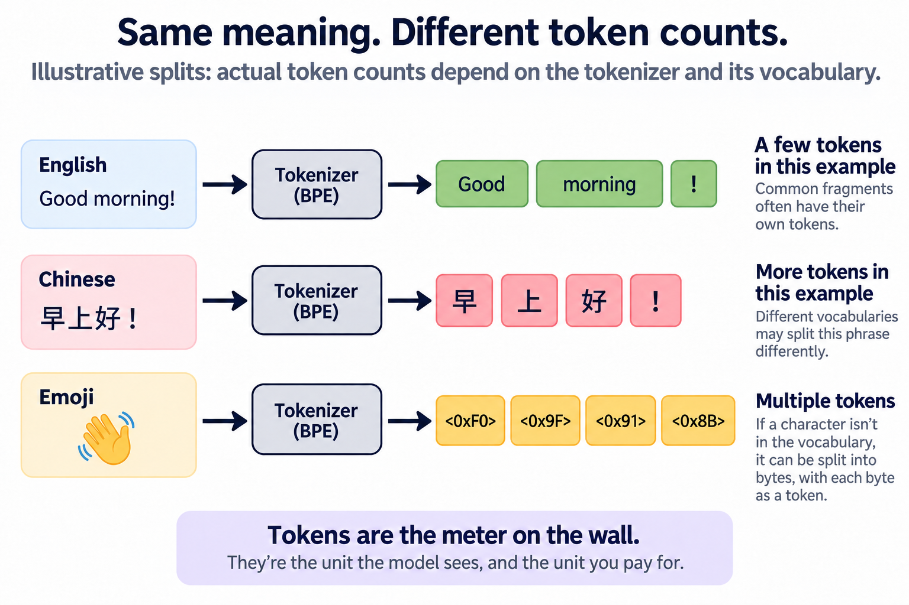
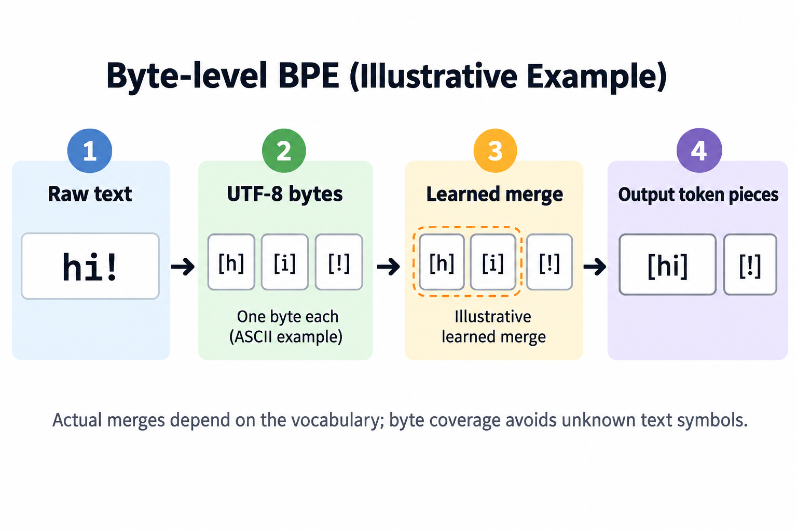

GPT-4's tokenizer ships with a vocabulary of 100,277 entries, and it reads the question *how many r's are in "strawberry"?* without receiving a single letter of the fruit. The quoted word arrives as 3 fragments — `str`, `aw`, `berry` — encoded as the integers 496, 675, and 15717. That single fact explains one of the most mocked failures in LLM history: models that write flawless poetry yet miscount the r's in a 10-letter word.

This article is about the machinery that produces those fragments. Tokenization is the first step of the [LLM lifecycle](/blog/pretraining-finetuning-rlhf/) and the least glamorous, but it quietly decides what a model can perceive, how much your API call costs, and why the same paragraph is cheaper in English than in Burmese.

## The problem: models eat numbers, not text

A neural network is arithmetic on vectors. Before any text reaches [the Transformer stack](/blog/transformer-architecture-in-one-picture/), it must become a sequence of integers, each of which indexes a row in a learned lookup table (the **embedding matrix**) to produce a vector. The component that converts text to integers is the **tokenizer**, and the units it produces are **tokens**.

The obvious designs both fail:

- **1 token per character.** Tiny vocabulary (a few hundred symbols), but sequences get brutally long: "tokenization" alone becomes 12 steps. Attention cost grows with sequence length, and the model wastes capacity relearning that t-h-e spells a common word, over and over.
- **1 token per word.** Short sequences, but the vocabulary explodes. English alone has hundreds of thousands of word forms; add typos, names, code, and other languages, and no fixed list suffices. Anything missing becomes an unknown-word token, a black hole that deletes information.

Every modern LLM lands in between: **subword tokenization**. Common words get 1 token each; rare words get built from reusable pieces. The dominant algorithm for choosing those pieces is **byte-pair encoding**, or BPE, adapted for NLP by Sennrich, Haddow, and Birch in 2016 from a 1994 compression trick.

The idea is almost embarrassingly simple: start with characters, then repeatedly glue together the pair of adjacent symbols that occurs most often in your training corpus. Each glue operation is a **merge rule**, and it gets recorded in order. Run 50,000 merges and you have a vocabulary of 50,000-ish fragments that reflect the actual statistics of text: `the`, `ing`, `tion` earn their slots; `zqx` never does.

## A worked example you can follow by hand

Here is BPE trained on a toy corpus, in the spirit of the example from Sennrich et al.'s original paper. Our corpus contains 4 words with counts:

| word | count |
|---|---|
| low | 5 |
| lower | 2 |
| newest | 6 |
| widest | 3 |

Write each word as characters plus an end-of-word marker `·`: `l o w ·`, `l o w e r ·`, `n e w e s t ·`, `w i d e s t ·`.

Now count adjacent pairs across the corpus, weighted by word counts. The pair `(e, s)` appears in *newest* (6 times) and *widest* (3 times): total 9. So do `(s, t)` and `(t, ·)`. Ties are broken by a fixed rule, so say `(e, s)` wins.

**Merge 1:** `e s → es`. Now *newest* is `n e w es t ·`.

Recount. The pair `(es, t)` occurs 9 times; the new symbol immediately participates in the next round.

**Merge 2:** `es t → est` (count 9).
**Merge 3:** `est · → est·` (count 9). We've built a suffix token meaning "-est at the end of a word."
**Merge 4:** `l o → lo` (count 7, from *low* and *lower*).
**Merge 5:** `lo w → low` (count 7).

5 merges, and the vocabulary already contains `low` and `est·` as single units. Now the payoff: tokenize **"lowest"**, a word that never appeared in the corpus. Start from characters `l o w e s t ·` and apply the merge rules in the order they were learned: `es`, then `est`, then `est·`, then `lo`, then `low`. Result: 2 tokens, `low` + `est·`.

The tokenizer composed a never-seen word from meaningful parts, no unknown-word token needed. That is the entire trick, and it scales: production tokenizers learn 50,000 to 200,000 merges from terabytes of text instead of 5 merges from 4 words.

## Why character counting can be difficult

Back to strawberry. After tokenization, the model receives 3 integer IDs, 1 per fragment. Each ID selects 1 row of the embedding matrix: a dense vector of a few thousand numbers that was *learned during training*. Nothing in that vector explicitly lists the letters inside the token. `berry` is not stored as b-e-r-r-y; it is stored as a point in meaning-space near `grape` and `jam`.

So when you ask "how many r's are in strawberry?", you are asking for a character-level operation through a token-level interface. Reversible token IDs preserve the text, and the model can learn spelling associations, and "berry has two r's" style trivia is thin in web text. Ask the same model to *spell the word out first* — s-t-r-a-w-b-e-r-r-y — and then count, and accuracy jumps, because spelling-out is a mapping it did see in training, and once each letter is its own token, counting can become easier. This is a learned capability problem influenced by representation; tokenization alone does not explain every counting failure.

The same lens explains other odd behaviors. Arithmetic wobbles partly because numbers split into arbitrary chunks: GPT-4's tokenizer groups digits in threes from the left, so `1000` arrives as `100` + `0`, a split that cuts straight across place value. Reversing a string is hard for the same reason counting is. None of this is mysterious once you know what the model actually receives.

## Tokens are the meter on the wall

Tokens aren't just the model's perceptual unit; they are the **billing and capacity unit** for the entire industry. API prices are quoted per million tokens, input and output separately. Context windows (128K, 200K, 1M) are token counts. Serving throughput is measured in [tokens per second](/blog/tokens-per-second-what-it-hides/), and the KV-cache memory that dominates [inference hardware planning](/blog/blackwell-to-rubin-memory-math/) grows with every token in the context.

For English prose, a useful rule of thumb from OpenAI's documentation: 1 token is roughly 4 characters or about ¾ of a word, so 1,000 tokens is on the order of 750 words. This very article weighs in around 3,000 tokens.

The rule of thumb collapses outside English. BPE vocabularies are learned from a training corpus, and those corpora are dominated by English. Frequent English fragments earn single tokens; text in less-represented languages gets shredded into smaller pieces, sometimes down to individual bytes. Petrov and colleagues measured this systematically in 2023: the *same content* can require up to **15× more tokens** in some languages than in English. Many non-Latin-script languages sit at 2-4×; a Chinese or Hindi sentence often costs double its English translation. Ahia and colleagues made the economic point bluntly in a paper titled "Do All Languages Cost the Same?": because APIs bill per token, speakers of tokenizer-unfriendly languages pay more money for the same request, get less effective context window, and wait longer for responses. A CJK character is 3 bytes in UTF-8; if it's rare enough to miss the vocabulary, it alone can consume 3 tokens.

Vendors have been closing the gap: OpenAI's o200k vocabulary and Llama 3's 128K-token vocabulary both improved non-English efficiency, and Meta reported (their own benchmark) that the new tokenizer uses up to 15% fewer tokens than Llama 2's on the same text. The asymmetry shrinks; it hasn't disappeared.

## Going deeper: bytes, regex, and the vocabulary dial

3 mechanisms below the surface are worth knowing.

**Byte-level BPE.** GPT-2 introduced a neat closure trick: run BPE not on characters but on *bytes*. The base alphabet is exactly 256 symbols, so every possible input (emoji, Klingon, corrupted binary) is representable with 0 unknown tokens. Merges then build multi-byte and multi-character tokens on top. This is what `tiktoken`, OpenAI's open-source tokenizer library, implements, and why nothing you paste into ChatGPT is ever "out of vocabulary."

**Pre-tokenization.** Before any merging, a regular expression splits raw text into chunks — roughly: word-like runs, number runs, punctuation, and leading spaces attached to the following word. Merges never cross chunk boundaries. This is why ` berry` (with a leading space) and `berry` are *different tokens* with different IDs, and why trailing whitespace at the end of a prompt can degrade completions: it strands the model on a token boundary it rarely saw during training. It also adds a twist to our headline example: ` strawberry` *with* its leading space is common enough to be a single vocabulary entry (ID 73700), so mid-sentence and unquoted, the fruit is 1 opaque block instead of 3. The letters are hidden either way. Special tokens like end-of-text markers are injected outside this machinery entirely; they are control signals, not text. (Google's SentencePiece library reaches similar ends differently, treating spaces as ordinary symbols so that tokenization is fully reversible without language-specific rules.)

**The vocabulary-size dial.** Why did GPT-2 pick ~50K tokens, GPT-4 ~100K, GPT-4o and Llama 3 ~128-200K? It's a genuine trade-off. A bigger vocabulary compresses text into fewer tokens: cheaper attention, more effective context, faster generation per unit of text. But every token needs an embedding row, and (in the output layer) a score computed at every generation step. At Llama 3's scale (128,256 tokens × 4,096 embedding dimensions) the input table alone is about 525 million parameters, and with an untied output projection the pair costs over 1 billion, a meaningful slice of an 8-billion-parameter model. Push the vocabulary too far and you also mint tokens so rare they're barely seen in training, which is how GPT-2/3 ended up with "glitch tokens" like ` SolidGoldMagikarp` — vocabulary entries (that 1 traced back to a Reddit username) whose embeddings were nearly untrained and triggered bizarre outputs. Vocabulary size, like everything in this series, is an engineering compromise, not a law.

## Vocabulary size changes both compression and model cost

For vocabulary size $$V$$ and embedding width $$d$$, the input table has

$$
P_{embed}=Vd,\qquad M_{embed}=Vds,
$$

where $$s$$ is bytes per stored weight. With 128,256 entries and width 4,096, that is 525,336,576 parameters, or about 1.051 GB in BF16. An untied output projection adds another table of that size; tying avoids duplicate weights but not the vocabulary scoring work.

A tokenizer producing 15 percent fewer tokens has length ratio 0.85. In an ideal dense all-pairs attention calculation, its pair-work ratio is $$0.85^2=0.7225$$, a 27.75 percent reduction. Linear projections shrink by only 15 percent, while a larger vocabulary can increase embedding storage and final scoring. Actual attention kernels and batching determine wall-clock savings.

The baseline tradeoff is therefore not simply words versus characters. Tokenization chooses an interface balancing sequence length, vocabulary cost, language coverage, and compositional learning. Reversible tokenization preserves the underlying text; it does not destroy letters. A model receiving token IDs can learn spelling associations, although character operations may be harder when boundaries hide convenient letter-level structure. Count errors are evidence of a learned capability limitation, not proof that recovering a token's characters is impossible. Evaluate multilingual compression and downstream tasks before choosing a vocabulary only by English token counts.

## Common misconceptions

**"Tokens are basically words."** Only for common English words. `dog` is 1 token, but "indivisible" splits into several, `2027` may split after the third digit, and 1 rare Chinese character can cost 3 tokens. Whitespace and capitalization matter too: `berry`, ` berry`, and `Berry` are 3 distinct IDs. Budgeting a prompt by word count will misestimate by 30% in English and by multiples elsewhere.

**"The strawberry fail proves LLMs can't reason."** It proves they can't *see letters*. Give the model the same question with the word pre-spelled into individual characters and the count usually comes out right; character-level models, and newer models trained with more spelling data and tool use, handle it too. A blind person failing a color-naming quiz tells you about their inputs, not their intelligence. There are real reasoning limits in LLMs, but letter-counting is a perception artifact, and treating it as a reasoning benchmark measures the tokenizer.

**"A bigger vocabulary is always better — just make every word a token."** The embedding and output layers scale linearly with vocabulary size, so 1 million-entry vocabulary would spend billions of parameters on lookup tables while starving the layers that do the thinking. Worse, tail tokens appear so rarely that their embeddings stay half-trained (the glitch-token failure mode), and the softmax over the vocabulary at every decoding step gets more expensive. Doubling vocabulary size only shaves sequence lengths by a modest percentage once common words are covered — diminishing returns against linearly growing cost.

## The bigger picture

Tokenization sits at the boundary between human text and everything else this series has covered. The token IDs it emits become embedding rows; those vectors flow through [attention](/blog/attention-in-plain-words/), where sequence length — set entirely by the tokenizer — determines the quadratic cost of every layer. Training, [gradient descent and backprop](/blog/how-models-learn/), never touches raw text at all; the tokenizer's output *is* the dataset. And when a trained model generates, it produces 1 token ID at a time, which is the subject of the next article.

It's also the part of the stack that is pure classical software (no learning at inference time, just a merge table and a regex), which makes it both refreshingly debuggable and dangerously easy to ignore. A surprising number of production LLM bugs (truncated context, doubled costs abroad, prompts that behave differently with a trailing space) are tokenizer bugs wearing a disguise.

## Takeaway

- LLMs never see words or letters: a BPE tokenizer greedily applies corpus-learned merge rules to split text into subword fragments, and the model receives only their integer IDs, which is why letter-counting inside a token fails.
- Tokens are the industry's meter: pricing, context windows, and throughput are all token-denominated, and English-centric vocabularies make identical content cost 2-15× more tokens in under-represented languages.
- Vocabulary size is a dial, not a virtue: larger vocabularies shorten sequences but grow embedding tables linearly and breed undertrained glitch tokens; every production tokenizer is a compromise.

## Sources

- Sennrich, Haddow & Birch (2016), *Neural Machine Translation of Rare Words with Subword Units* — [arXiv:1508.07909](https://arxiv.org/abs/1508.07909)
- Kudo & Richardson (2018), *SentencePiece: A simple and language independent subword tokenizer* — [arXiv:1808.06226](https://arxiv.org/abs/1808.06226)
- Petrov, La Malfa, Torr & Bibi (2023), *Language Model Tokenizers Introduce Unfairness Between Languages* — [arXiv:2305.15425](https://arxiv.org/abs/2305.15425)
- Ahia et al. (2023), *Do All Languages Cost the Same? Tokenization in the Era of Commercial Language Models* — [arXiv:2305.13707](https://arxiv.org/abs/2305.13707)
- OpenAI, *tiktoken* — [github.com/openai/tiktoken](https://github.com/openai/tiktoken)
- Andrej Karpathy, *Let's build the GPT Tokenizer* (2024 video lecture) — a full BPE implementation from scratch

---

*Part of the [LLM Foundations & Mathematics](/series/llm-basics/) learning path. Browse its published articles by topic.*
