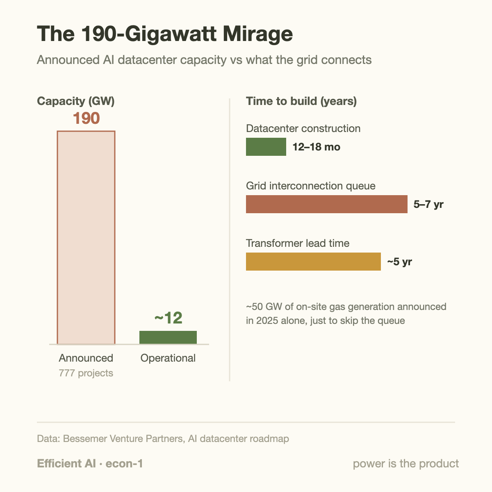
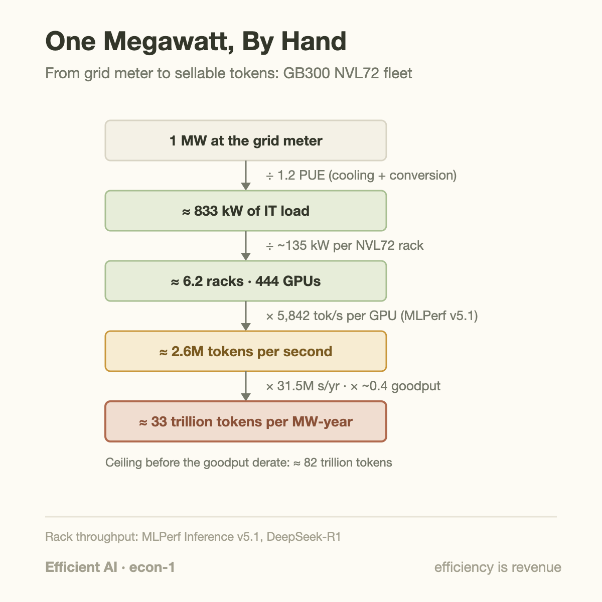
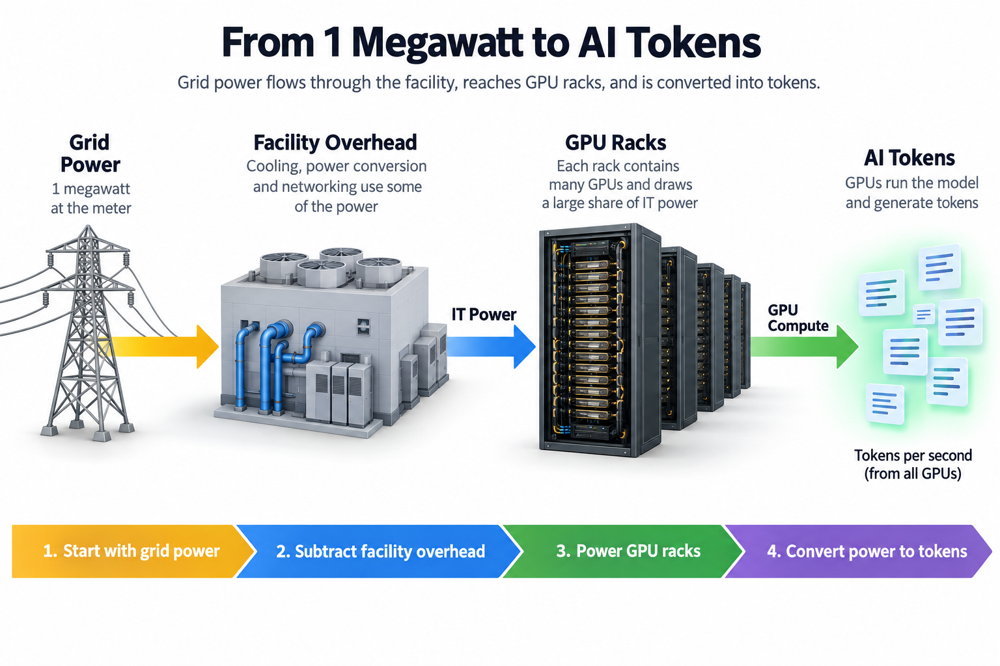
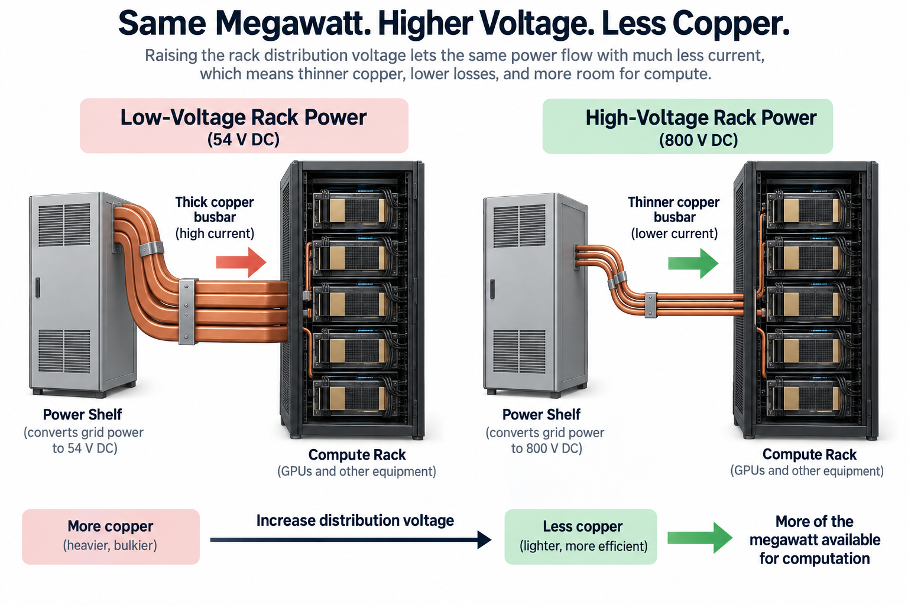

There are 190 gigawatts of announced AI datacenter capacity in the pipeline, spread across 777 projects. Roughly 12 gigawatts are actually operational. The gap between those 2 numbers, a factor of about 16, is the single most important fact in AI economics right now, and it explains a surprising amount of what chip vendors, cloud providers, and model labs have been doing for the past year.

The numbers come from Bessemer Venture Partners' roadmap of the AI datacenter stack, and the reason for the gap is not money or chips. It is the electrical grid. A modern AI datacenter goes from groundbreaking to racks-online in 12 to 18 months. Getting permission to draw hundreds of megawatts from the grid, a process called interconnection, takes 5 to 7 years in most US markets. The queue is so long that some operators have stopped waiting: about 50 GW of "behind-the-meter" gas generation, power plants built on-site specifically to bypass the grid, was announced in 2025 alone. Even the components have queues now. Lead times for large grid transformers have stretched to 5 years.

When an input becomes scarce, industries reorganize around the ratio of output to that input. Farming optimizes yield per acre. Mobile chips optimize performance per milliwatt of battery. AI infrastructure has found its version: tokens per megawatt. NVIDIA now markets it explicitly. Google frames every TPU generation around performance per watt. It is worth understanding exactly what this metric means, how to compute it, and what it changes.

## What tokens per megawatt actually measures

A token, for our purposes, is 1 unit of LLM output, roughly 3-quarters of an English word. Serving a model means converting electricity into tokens, and tokens are what customers pay for. So tokens per megawatt is a revenue density: given a fixed allocation of grid power, how much sellable output can you generate?

Note what the megawatt in the denominator represents. It is not an electricity bill. It is a *capacity*: the amount of power a site is permitted to draw at once, negotiated with a utility, secured through that 5-to-7-year queue. Power capacity has become the asset that gates growth, the way spectrum licenses gate telecom. You can buy more GPUs next quarter. You cannot buy more megawatts next quarter, not at the sites you already operate.

This inverts a decade of datacenter thinking. When power was cheap and available, you optimized cost per server and bought whatever electricity you needed. Now the megawatts are fixed and the question is how much business fits inside them. A chip that produces 2 times the tokens per watt does not just cut your power bill by half, which would be a minor line item. It doubles the revenue capacity of every site you own, without touching the interconnection queue.

## A worked example: 1 megawatt, by hand

Let's compute the tokens-per-megawatt of a current flagship system, using numbers you can check. The system is NVIDIA's GB300 NVL72, a rack-scale machine with 72 Blackwell Ultra GPUs that Azure deploys as a single unit. In MLPerf Inference v5.1, the first industry-audited benchmark round to include it, a GB300 NVL72 served DeepSeek-R1 at 5,842 tokens per second per GPU in the offline scenario.

Start with 1 megawatt at the grid meter.

**Step 1: subtract facility overhead.** Cooling, power conversion, and networking consume power that never reaches a GPU. The ratio of total facility power to IT power is called PUE (power usage effectiveness); a good modern AI facility runs around 1.2. So 1 MW at the meter yields 1,000 / 1.2 ≈ **833 kW of IT load**.

**Step 2: divide by rack power.** A GB300 NVL72 rack draws roughly 135 kW (NVIDIA's figures vary slightly by configuration; treat this as approximate). That gives 833 / 135 ≈ **6.2 racks**, or about 444 GPUs, per megawatt.

**Step 3: multiply by throughput.** At 5,842 tokens/s per GPU, 1 rack produces 72 × 5,842 ≈ 420,000 tokens/s, and our 6.2 racks produce about **2.6 million tokens per second per megawatt**.

**Step 4: annualize.** A year is about 31.5 million seconds, so the ceiling is 2.6M × 31.5M ≈ 8.2 × 10¹³, call it **82 trillion tokens per megawatt-year**.

That ceiling assumes the offline benchmark scenario: perfectly batched work, no latency constraints, no idle time. Real serving has interactive latency targets, uneven daily load, failures, and maintenance. If your fleet converts 40% of that ceiling into work customers actually accepted, a defensible planning number, you land near **33 trillion sellable tokens per megawatt-year**. At a round $1 per million output tokens, that single megawatt supports on the order of $33M of annual token revenue. The gap between the 82 and the 33 is exactly the goodput-versus-utilization distinction, and it is why serving efficiency is now a board-level topic rather than an engineering detail.

2 cautions on numbers like these. MLPerf figures are audited, but the marketing composites built on top of them are not: NVIDIA's "5x TPS per megawatt versus Hopper" and the "50x AI factory output" headline are vendor-constructed multiplications, not benchmark results. And any tokens-per-MW claim is model-dependent; a sparser or smaller model shifts every step of the calculation. The method is the durable part.

## Keep the power boundary in the equation

For a fleet-average estimate, let grid power be $$P_g$$ watts, facility overhead be $$\mathrm{PUE}$$, IT rack draw be $$P_r$$ watts, devices per rack be $$n$$, and measured compliant output per device be $$r$$ tokens per second. Then

$$
R_g=\frac{P_g}{\mathrm{PUE}\,P_r}nr.
$$

At 1 million watts, PUE 1.2, rack draw 135,000 watts, 72 devices, and 5,842 outputs per device-second, the result is approximately 2.596 million outputs per second. This uses 6.173 rack-equivalents. A single installation buying whole racks can fit only 6 within that budget; fractional racks describe averaging or planning, not an extra deployable machine.

The improvement over quoting accelerator efficiency alone is accounting for supporting power and service requirements. Use rack IT power consistently: add external network power only when excluded from that measurement. Multiplying a maximum throughput benchmark by a nameplate power allocation mixes operating points. Measure both at the same load and quality target. Better batching can improve this ratio while worsening individual token latency, so compliant output belongs in the numerator. Energy, capacity reservation, and facility overhead remain separate decisions even when reported in 1 ratio.

## Going deeper: where the watts actually go

If the megawatt is fixed, every watt spent on anything other than computation is revenue lost. Follow that logic through the stack and you can predict most of the current infrastructure roadmap.

**Power delivery.** Today's racks distribute power at 54 volts DC. Power equals voltage times current, so at 54 V, a 1 MW rack would need roughly 18,500 amps, and current is what dictates copper thickness. NVIDIA's engineers estimate a 1 MW rack at 54 V would need around 200 kg of copper busbar. Their answer is a transition to 800 VDC distribution: about 15x the voltage means the same conductor carries 85% more power in their design, with 45% less copper overall, and lower resistive losses along the way. This lands in production with the 2027 Kyber generation at 576 GPUs per rack. When a chip company starts publishing power-electronics roadmaps, the constraint has clearly moved.

**Networking.** Traditional pluggable optics burn power in the long electrical trace between switch ASIC and transceiver, roughly 22 dB of signal loss to overcome. Co-packaged optics move the conversion next to the ASIC, cutting that to about 4 dB, which NVIDIA reports as a 3.5x power-efficiency gain for the switch tier. Watts saved in optics are watts freed for GPUs; under a fixed envelope, that is a direct throughput increase.

**Memory.** SK hynix reports HBM4 delivers over 40% better power efficiency than HBM3e alongside its doubled interface width. Memory power was a rounding error in the CPU era; at 22 TB/s per package, it no longer is.

**Silicon itself.** Google's Ironwood TPU pods illustrate the scale: 9,216 chips per pod at roughly 10 MW, more power than many small towns. Google's headline metric for the part is not peak FLOPS but perf/watt, self-reported at 2x per generation and about 30x since 2018. Read vendor efficiency claims with appropriate salt, but notice what they choose to advertise. Peak FLOPS sells chips to buyers with unlimited power. Perf/watt sells chips to buyers who have run out.

The same pressure propagates upward into software and model design. 4-bit number formats, mixture-of-experts models that activate 3% of their weights per token, sparse attention, disaggregated serving: each is usually described as a cost or latency optimization, but under a fixed power envelope they are all the same move, more tokens through the same megawatts.

## Common misconceptions

**"The bottleneck is GPU supply."** It was, in 2023. Today a well-capitalized operator can get GPUs in months but a grid connection in years, which makes power the binding constraint in the economic sense: the one that determines output when relaxed. The 50 GW of announced behind-the-meter gas is the clearest evidence, since operators only build their own power plants when buying grid power is impossible on relevant timescales. Chips queue in quarters; interconnections queue in half-decades.

**"Perf/watt matters because electricity is expensive."** Electricity is actually a modest slice of AI serving cost; the capital cost of the hardware dominates, since a GPU depreciates faster than it consumes its own price in power. Perf/watt matters because power is *rationed*, not because it is pricey. Doubling perf/watt at a power-capped site doubles output and therefore revenue, an effect roughly an order of magnitude larger than the saved electricity. This is why vendors advertise tokens per megawatt rather than tokens per dollar of electricity.

**"190 GW announced means 190 GW is coming."** Announcements are free; interconnections are not. The 777 projects behind that figure include speculative land grabs, duplicate site options, and projects that will die in the queue. Even the buildable fraction arrives on grid timelines, not press-release timelines. Treat announced capacity the way you would treat a startup's "signed LOIs": an indicator of demand, not a forecast of supply. The operational number, about 12 GW, growing at the pace transformers and substations allow, is the real supply curve.

## The metric that reorders the stack

Tokens per megawatt is doing something quietly important: it gives every layer of the AI stack a common denominator. A 4-bit quantization scheme, a better attention kernel, a co-packaged optical switch, and an 800 V busbar are incommensurable in their native units. Expressed as tokens per megawatt, they compose into a single number that maps directly to revenue per site, which is why it is becoming the number that decides what gets built.

It also explains a pattern we have traced elsewhere in this series. The [Blackwell-to-Rubin memory math](/blog/blackwell-to-rubin-memory-math/) showed vendors holding capacity flat while pushing bandwidth, and bandwidth per watt is precisely where HBM4's efficiency gain bites. The [goodput versus utilization](/blog/goodput-vs-utilization/) distinction stops being an internal engineering metric and becomes the difference between 82 and 33 trillion sellable tokens on the same interconnection agreement. And it reframes the job description in [what an ML performance engineer does](/blog/what-does-an-ml-performance-engineer-do/): a 15% kernel speedup at a power-capped site is not a latency win, it is 15% more capacity from an asset with a 5-year replacement queue, which is why those engineers have become some of the most leveraged people in the industry.

The deeper shift is cultural. An industry that grew up maximizing peak performance, because power was assumed, is relearning the discipline of embedded systems, where the envelope comes first and everything is designed backward from it. Mobile chip designers have worked this way for 20 years. AI infrastructure is now, at gigawatt scale, doing the same.

## Takeaway

- Power, not silicon, is the binding constraint on AI buildout: 190 GW announced against ~12 GW operational, with datacenters built in 12–18 months but grid interconnections taking 5–7 years.
- Tokens per megawatt is a revenue-density metric. You can estimate it by hand: 1 MW ÷ PUE ÷ rack power × per-GPU throughput gives ~82T tokens/MW-year peak for a GB300 NVL72 fleet, and realistic goodput lands closer to ~33T.
- Under a fixed envelope, every efficiency gain, from 4-bit formats to 800 VDC busbars to co-packaged optics, is the same economic move: more sellable output per megawatt already secured. Perf/watt decides winners because it multiplies revenue, not because it trims the power bill.

## Sources

- Bessemer Venture Partners, "Roadmap: The AI Data Center Stack" — https://www.bvp.com/atlas/roadmap-the-ai-data-center-stack
- NVIDIA, "NVIDIA 800 V HVDC Architecture Will Power the Next Generation of AI Factories" — https://developer.nvidia.com/blog/nvidia-800-v-hvdc-architecture-will-power-the-next-generation-of-ai-factories/
- Google, "Ironwood: The first Google TPU for the age of inference" — https://blog.google/products/google-cloud/ironwood-tpu-age-of-inference/
- NVIDIA, "NVIDIA Blackwell Ultra Sets New Inference Records in MLPerf Debut" — https://developer.nvidia.com/blog/nvidia-blackwell-ultra-sets-new-inference-records-in-mlperf-debut/
- Microsoft Azure, "Microsoft Azure delivers the first large-scale cluster with NVIDIA GB300 NVL72" — https://azure.microsoft.com/en-us/blog/microsoft-azure-delivers-the-first-large-scale-cluster-with-nvidia-gb300-nvl72-for-openai-workloads/
- NVIDIA, "Scaling AI Factories with Co-Packaged Optics for Better Power Efficiency" — https://developer.nvidia.com/blog/scaling-ai-factories-with-co-packaged-optics-for-better-power-efficiency/

*Part of the [Efficient AI & Co-Design](/series/efficient-ai/) learning path. Browse its published articles by topic.*
