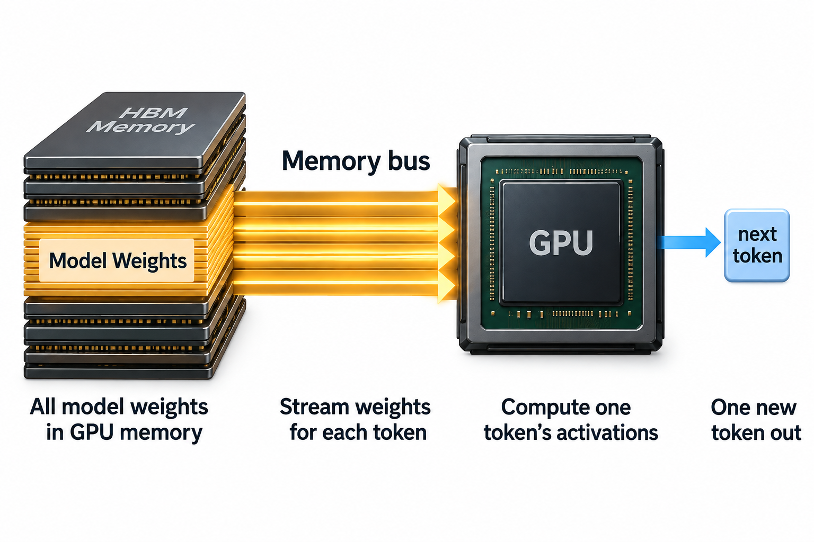
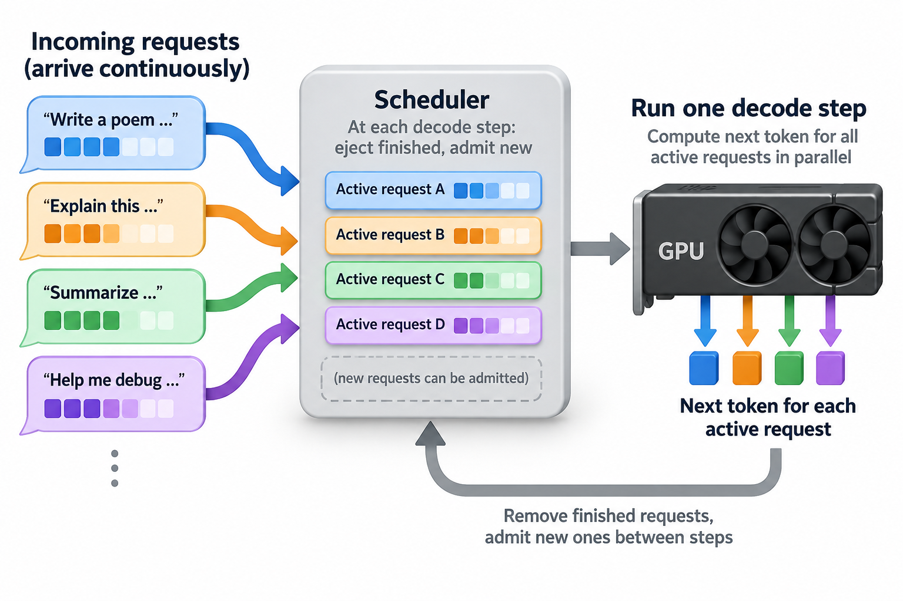

The same 8-billion-parameter model, under different serving configurations, can be honestly benchmarked at 24 tokens per second and at 6,600 tokens per second. These illustrative values describe different metric and deployment assumptions; comparing them requires those assumptions.

That 275× spread is why "tokens per second" is simultaneously the most quoted and the most misread number in LLM inference. This article closes out the basics series by unpacking what the metric actually measures, working through the arithmetic that sets its ceiling, and giving you a short checklist for reading any benchmark without being fooled.

## 1 metric, 2 questions

A token is the unit an LLM reads and writes: a word fragment of roughly 4 characters, so 100 tokens is about 75 English words. Tokens per second sounds like it should be 1 number. It's actually the answer to 2 different questions.

**Per-user throughput** asks: how fast does text stream onto *my* screen? If a model generates 30 tokens per second for you, that's about 22 words per second, comfortably faster than most people read. At 5 tokens per second, you're watching a slow typist.

**Aggregate throughput** asks: how many tokens does the *whole server* emit per second, summed across every user it's serving at once? This is the number that determines cost per token, which is why providers care about it intensely.

The highway analogy holds up well. Per-user throughput is the speed of 1 car. Aggregate throughput is cars passing a point per hour. A congested highway moves each car slower while moving far more cars in total, and an LLM server batching many requests behaves exactly the same way. When a vendor says "our system delivers 6,000 tokens per second," your first question should always be: per user, or per server?

2 more terms complete the vocabulary, because a request has 2 distinct phases. When your prompt arrives, the model first reads the entire thing in 1 parallel pass called **prefill**. Nothing streams during prefill; you're staring at a blank response. The wait is measured as **time to first token (TTFT)**. Then the model switches to **decode**, generating 1 token at a time, each new token appended to the context before the next is produced. The pace of this phase is measured as **time per output token (TPOT)**, and per-user tokens per second is just 1/TPOT.

The 2 phases stress the hardware differently. Prefill processes thousands of tokens in 1 shot, so it's rich in parallel arithmetic and tends to be limited by the GPU's compute rate. Decode produces a single token per step, and each step must read every model weight from memory to produce it. Almost no arithmetic per byte moved. Decode is limited by memory bandwidth, and that observation gives us the whole ceiling calculation.

## A worked example you can do on a napkin

Take Llama-3-8B in 16-bit precision on an NVIDIA H100. 2 spec-sheet numbers drive everything:

- Model weights: 8 billion parameters × 2 bytes = **16 GB**
- H100 memory bandwidth: **3,350 GB/s**

During decode with a single user, every generated token requires streaming all 16 GB of weights from memory through the chip. The best case is therefore:

> 3,350 GB/s ÷ 16 GB = **~209 tokens per second, per user, tops**

That is a hard ceiling set by physics, not software. Real engines hit maybe 60–70% of it after overheads, so ~130–150 tokens per second is an excellent single-user result, and the "24 tokens per second" figure from the opening line is what you might see on a smaller, cheaper GPU with a quarter of the bandwidth. Note what's absent from the formula: the H100's roughly 990 trillion FLOPS of 16-bit compute. During single-user decode, well over 90% of that arithmetic capacity sits idle. The memory bus is the bottleneck; the calculator is bored.

Now add batching. If 32 users' requests are decoded together, the GPU still reads the weights once per step, but that 1 read now produces 32 tokens, 1 per user. Same memory traffic, 32× the output:

> 209 steps/s × 32 tokens per step = **~6,700 aggregate tokens per second**

There's the other number from the opening line. Nothing about the model changed. The vendor quoting 6,600 and the reviewer measuring 150 are both describing this machine truthfully.

2 refinements complete the napkin math. First, **context length isn't free**. Each token in each user's context stores its attention keys and values in a KV cache (the same keys and values from [the attention article](/blog/attention-in-plain-words/)). For Llama-3-8B that's about 128 KB per token. With 32 users each carrying 4,000 tokens of context, the cache is 32 × 4,000 × 128 KB ≈ 16 GB, and every decode step must read it alongside the 16 GB of weights. Memory traffic doubles, so per-step speed halves to ~105 steps per second, dragging aggregate throughput down to ~3,350 tokens per second. A benchmark run at 128-token prompts will post roughly double the throughput of the same system at 4K prompts. Same hardware, same model, same software.

Second, **quantization moves the ceiling**. Compress the weights to 4-bit integers and they occupy ~4.5 GB instead of 16, so the single-user ceiling jumps to ~745 tokens per second. Quantized numbers aren't cheating, but a benchmark that quietly compares its INT4 build against a competitor's FP16 build is not measuring what it implies, and mild quality loss from aggressive quantization never shows up in a throughput chart.

And prefill? A 2,000-token prompt needs roughly 2 × 8B × 2,000 ≈ 32 trillion operations. At half of the H100's compute rate, that's ~65 milliseconds of TTFT. This is why long prompts feel like a pause before the streaming starts, and why prefill, unlike decode, actually does use all those FLOPS.

## Give the 2 rates distinct denominators

Over a wall-clock interval $$\Delta t$$, aggregate delivered output rate is

$$
R_{agg}=\frac{\sum_iN_i}{\Delta t}.
$$

For one request with at least 2 output tokens, its streaming rate after the first token is

$$
r_i=\frac{N_i-1}{t_{i,last}-t_{i,first}}.
$$

The timestamps are delivery times on the same clock; first-token waiting is intentionally outside this second denominator. A request producing 1 token has no observed inter-token rate. Specify whether the aggregate counter includes partially completed requests and whether the interval includes warmup or drain.

32 requests each streaming 40 tokens per second can contribute roughly 1,280 aggregate tokens per second while all remain active. That does not mean 1 request receives 1,280, nor does it imply the fleet sustains the rate over paid idle hours. The arithmetic is conditional on comparable active streams.

Compared with a single headline metric, these definitions expose batching's gain and its individual latency cost. Measure per-request streaming distributions separately from per-token gap distributions: long responses contribute more observations to the latter. Also report TTFT, accepted output, offered load, and model quality. A benchmark becomes interpretable when its counters and clocks are explicit, rather than when its numerator looks impressive.

## Going deeper: what a loaded server actually does

The clean batch-of-32 picture above assumes 32 requests that arrive together and finish together. Real traffic is messier: requests arrive continuously, with wildly different prompt and response lengths. Modern serving engines handle this with **continuous batching**, an idea introduced by the Orca system: instead of waiting for a whole batch to finish, the engine operates at the granularity of a single decode step, ejecting finished sequences and admitting new ones between steps. The vLLM project paired this with **PagedAttention**, which manages KV cache memory in small blocks the way an operating system pages RAM, so memory fragmentation stops limiting batch size.

The consequence for benchmark reading is that a real server's per-user speed *degrades gradually with load*. Each newly admitted request adds its KV cache to the memory traffic of every step and occasionally steals whole steps for its prefill, so everyone's TPOT stretches. Aggregate throughput climbs toward its ceiling while individual streams slow down. There is no single tokens-per-second figure for such a system, only a curve of per-user latency versus system load, and an honest benchmark shows the curve, not 1 flattering point on it.

This is also why serious evaluations report **percentiles** rather than averages. A p50 TPOT of 20 ms with a p99 of 200 ms means the median user sees smooth streaming while 1 user in 1 hundred watches the response stutter. Averages bury exactly the users who will tweet about you. The most useful summary metric to emerge from recent serving research (the DistServe paper is a good entry point) is **goodput**: the number of requests per second that *meet a stated latency target*, such as "TTFT under 200 ms and TPOT under 50 ms." Raw tokens per second counts a token that arrived after the user gave up and closed the tab. Goodput doesn't.

## Common misconceptions

**"A GPU with twice the FLOPS generates tokens twice as fast."** For single-user decode, FLOPS barely matter; the ceiling is bandwidth divided by bytes of weights, and the arithmetic units are mostly idle. A GPU upgrade that doubles compute but leaves bandwidth unchanged will speed up prefill and large-batch serving, yet do almost nothing for the streaming speed 1 user experiences. When Grace-Hopper-class marketing quotes enormous FLOPS gains, check the bandwidth line in the spec sheet before predicting decode speed.

**"Tokens per second is a property of the model."** No table can tell you "Llama-3-8B runs at X tokens per second," because X depends on the GPU's bandwidth, the batch size, the context length, the quantization format, and the serving engine. We just derived a 24-to-6,600 spread for one model on fixed hardware by varying only the deployment knobs. A model card can state parameter count and architecture; tokens per second belongs to a *system*, never to weights alone.

**"Optimizing aggregate throughput makes responses faster for users."** Usually the opposite. Pushing batch size up is the main lever for aggregate throughput and cost, and it works precisely by making each user share memory bandwidth with more neighbors, stretching everyone's TPOT. Providers deliberately pick an operating point that trades some user speed for a lot of cost efficiency. When a provider's streaming feels slower this month than last, their hardware likely didn't change; their batching policy did.

## How to read a benchmark honestly

Everything above compresses into 7 questions. If a published number doesn't answer them, the number is decoration.

1. **Per-user or aggregate?** A 100× ambiguity if unstated.
2. **What batch size / concurrency?** Batch 1 flatters latency; batch 256 flatters throughput.
3. **What prompt and output lengths?** Short contexts can double apparent speed.
4. **What precision?** FP16, FP8, and INT4 sit on different ceilings.
5. **Does the figure include TTFT,** or only steady-state decode? Excluding prefill flatters short responses enormously.
6. **Which percentile?** Mean, p50, or p99 under realistic load.
7. **Exactly what hardware, and how many of them?** "Runs at 3,000 tokens/s" means something very different on 1 GPU versus 8.

Vendor-published numbers, including every figure a hardware or API provider self-reports, should be treated as the best case across all 7 knobs simultaneously until an independent measurement says otherwise. That's not cynicism; it's just knowing which point on the curve marketing will choose.

## Where this leaves you

This article closes the loop the series opened. You've seen [what a neural network computes](/blog/what-is-a-neural-network/), how [attention lets tokens consult each other](/blog/attention-in-plain-words/), and how [the transformer assembles those pieces](/blog/transformer-architecture-in-one-picture/) into the models everyone now benchmarks. Tokens per second is where all of that meets physical hardware and real money, and you now know why the metric bends the way it does: decode is a memory-bandwidth problem, batching is a sharing problem, and honest measurement is a full-curve problem.

It's also the doorway to a different discipline. Squeezing more goodput out of the same silicon — overlapping prefill with decode, paging KV caches, choosing quantization formats, measuring what a "100% utilized" GPU actually accomplishes — is the day job described in [What Does an ML Performance Engineer Do?](/blog/what-does-an-ml-performance-engineer-do/), and the measurement mindset continues in [Goodput vs Utilization](/blog/goodput-vs-utilization/). If this article's napkin math felt satisfying, that series is where the napkin gets bigger.

## Takeaway

- Tokens per second answers 2 different questions: per-user streaming speed (capped by memory bandwidth ÷ bytes read per step) and aggregate server output (multiplied by batching). A 100×+ gap between them is normal, so always identify which one you're reading.
- The ceiling math fits on a napkin: weights ÷ bandwidth gives per-user decode speed, batching multiplies aggregate throughput at the cost of everyone's latency, and KV cache traffic makes long contexts measurably slower.
- Trust no benchmark that omits batch size, context length, precision, TTFT, percentile, and hardware count; prefer goodput (requests meeting a latency target) over raw token counts.

## Sources

- Kwon et al., "Efficient Memory Management for Large Language Model Serving with PagedAttention" (the vLLM paper), SOSP 2023 — [arxiv.org/abs/2309.06180](https://arxiv.org/abs/2309.06180)
- Zhong et al., "DistServe: Disaggregating Prefill and Decoding for Goodput-optimized Large Language Model Serving," OSDI 2024 — [arxiv.org/abs/2401.09670](https://arxiv.org/abs/2401.09670)
- Yu et al., "Orca: A Distributed Serving System for Transformer-Based Generative Models," OSDI 2022 (introduced continuous batching)
- vLLM documentation, metrics and performance sections — [docs.vllm.ai](https://docs.vllm.ai/)
- NVIDIA H100 Tensor Core GPU datasheet (memory bandwidth and FLOPS figures), NVIDIA Corporation
- Databricks engineering blog, "LLM Inference Performance Engineering: Best Practices" (Mosaic AI team)

*Part of the [LLM Foundations & Mathematics](/series/llm-basics/) learning path. Browse its published articles by topic.*
