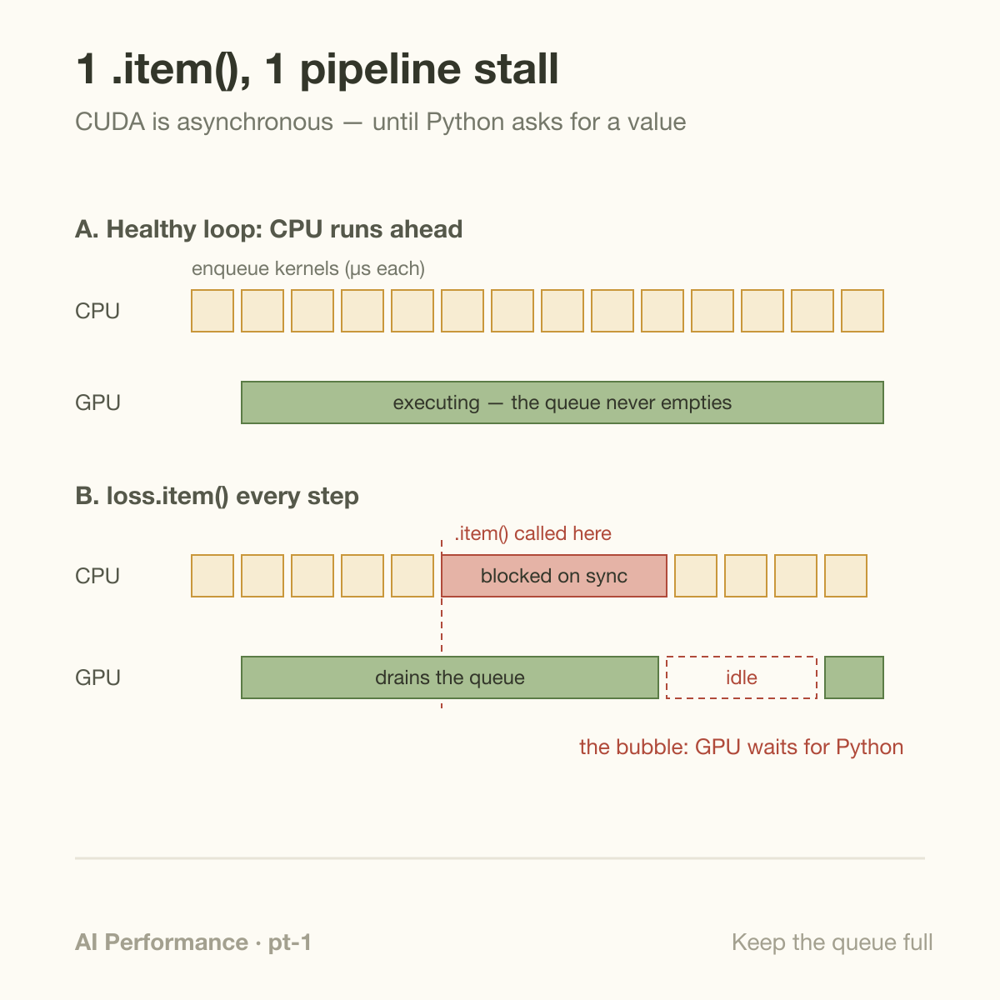
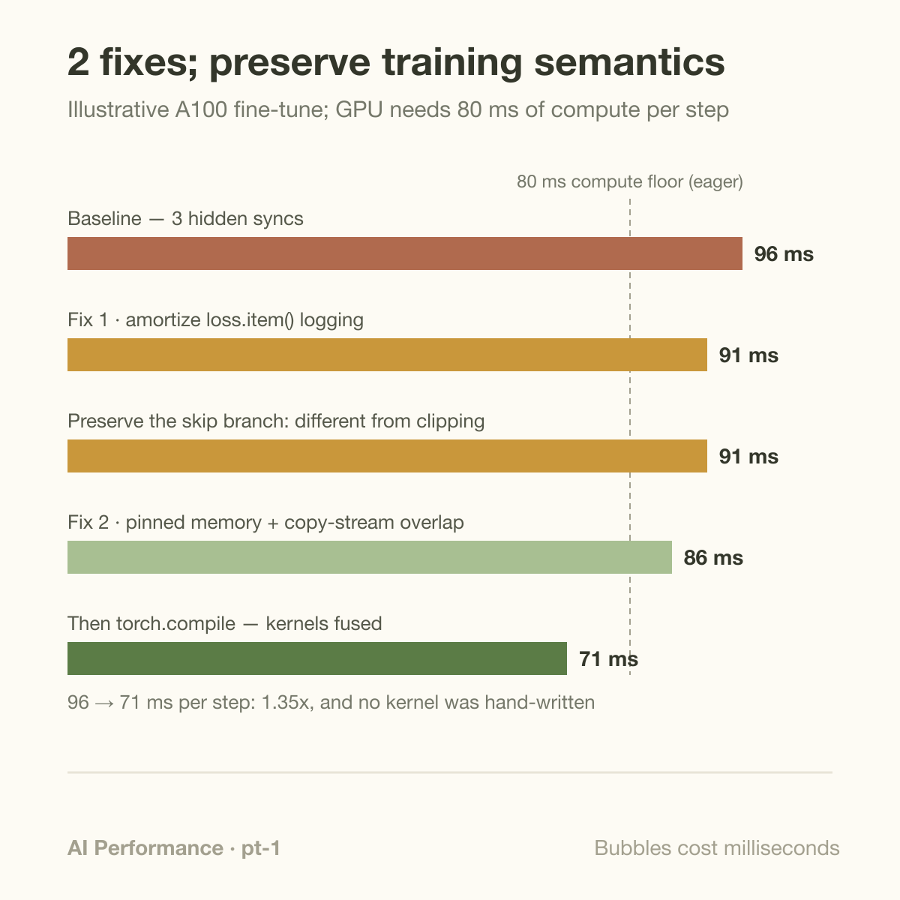
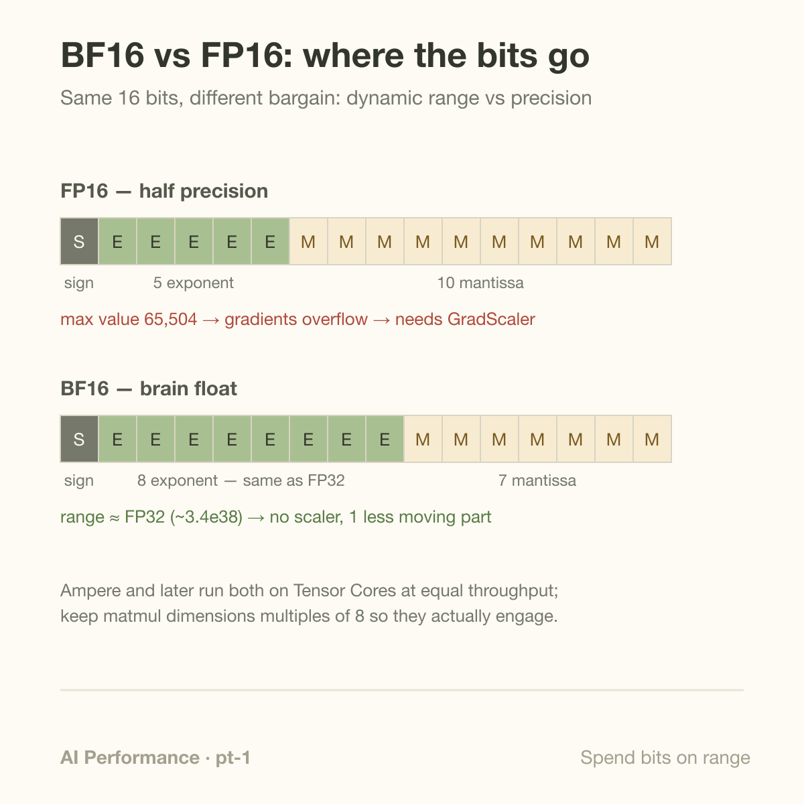

Across 180+ real-world models, adding 1 line, `model = torch.compile(model)`, produced a geomean speedup of 2.27x for inference and 1.41x for training on an NVIDIA A100. Those are the headline numbers from the PyTorch 2 paper (Ansel et al., ASPLOS 2024), measured on TorchBench, HuggingFace, and TIMM suites, not on cherry-picked kernels.

Here is the part that doesn't make the headline: the same afternoon you add that line, a single `loss.item()` in your logging code can hand a large slice of the win right back. Not by making any kernel slower. By making the GPU *wait*.

This article is about both halves: why 1 line of Python can be worth 1.4x, and why 3 innocent-looking lines elsewhere in your training loop can quietly serialize the whole machine.

## Why 1 line works at all

In eager mode, PyTorch is an interpreter. Many operations in eager Python code (`matmul`, `add`, `layer_norm`, `gelu`) dispatch separate kernels, although views can require no kernel and libraries may combine operations. Each launch costs a few microseconds of CPU-side work: Python dispatch, argument checking, driver call. A single transformer training step can easily issue a couple thousand launches.

2 costs follow. First, launch overhead itself: 2,000 launches at roughly 5 µs each is about 10 ms of pure CPU dispatch per step. Second, and usually worse, every op writes its output to HBM and the next op reads it back. 3 consecutive memory-bound elementwise ops means 3 full round-trips through DRAM for the same tensor. If you've read [The Memory Wall](/blog/the-memory-wall-latency-numbers/), you already know that traffic is the expensive part.

`torch.compile` attacks both. TorchDynamo captures your Python into an FX graph by hooking CPython's frame evaluation; TorchInductor then fuses chains of ops into generated Triton kernels and pre-plans the whole schedule. Those 3 elementwise ops become 1 kernel: 1 launch, 1 read, 1 write. Fewer launches, and far less HBM traffic. That is the entire trick, and it's worth 1.41x on average for training.

But compilation only optimizes the work *inside* the captured graph. It cannot save you from what your Python does between graphs. That's where the hidden synchronizations live.

## The contract you signed without reading

CUDA execution is asynchronous by default. When Python executes `y = x @ w`, PyTorch does not compute anything; it *enqueues* a kernel onto a CUDA stream and returns immediately, usually microseconds later. The GPU consumes the queue at its own pace. A healthy training loop looks like a 2-lane pipeline: the CPU lane runs ahead, keeping the queue full; the GPU lane never starves.



Certain operations break the contract because they need an answer *now*, and the answer lives on the GPU:

- **`tensor.item()`, `tensor.cpu()`, `tensor.numpy()`, `print(tensor)`, `float(tensor)`** — all must copy a value to host memory, which means the CPU blocks until every kernel that produces that value has finished.
- **Python control flow on tensor values** — `if grad_norm > 10:` calls `__bool__` on a CUDA tensor, which is an `.item()` in disguise.
- **Pageable host-to-device copies** — `batch.to("cuda")` from ordinary (non-pinned) memory is staged through a driver-owned pinned buffer and blocks the CPU for the duration; pageable staging can block host progress. `non_blocking=True` may avoid a framework-side wait, but reliable copy/compute overlap requires pinned storage, a suitable copy stream, and correct event dependencies.
- **`time.time()` around GPU code** — not a sync, but a lie enabled by asynchrony: you measure how long *enqueueing* took, microseconds, and conclude your matmul is free. The bill arrives at the next sync point, which your profile then blames. Correct timing uses `torch.cuda.Event(enable_timing=True)` pairs, or a `torch.cuda.synchronize()` before reading the clock.

The damage from a sync is not the sync call itself. It's the pipeline state afterward: the CPU waited for the queue to drain, so now the queue is empty, and the GPU sits idle while Python shuffles along re-enqueuing work. Every sync converts your run-ahead pipeline back into lockstep, 1 bubble at a time.

## Worked example: 3 syncs, found and fixed

Take a fine-tuning loop of a mid-size transformer on 1 A100. Forward, backward, and optimizer together enqueue about 2,000 kernels per step; at ~5 µs per launch that's 10 ms of CPU dispatch. The GPU needs 80 ms of compute per step. Since 10 ms < 80 ms, the CPU should run comfortably ahead and the wall-clock step should be ~80 ms.

Measured with CUDA events: **96 ms per step**. 16 milliseconds are missing. The loop:

```python
for batch in loader:
    batch = batch.to("cuda")                      # sync 3
    loss = model(batch).loss
    loss.backward()
    norm = clip_grad_norm_(model.parameters(), 1.0)
    if norm.item() > 10.0:                        # sync 2
        opt.zero_grad(); continue
    opt.step(); opt.zero_grad()
    pbar.set_postfix(loss=loss.item())            # sync 1
```

**Sync 1: `loss.item()` every step.** The CPU stalls until the entire forward and backward have executed, then the GPU drains and idles while tqdm formats a string. Under `torch.profiler` this shows up as a `cudaStreamSynchronize` slice followed by a gap in the GPU track, ~5 ms here. Fix: accumulate `loss.detach()` into a GPU-resident tensor and call `.item()` once every 50 steps. The sync still exists, but its cost is amortized 50x: 5 ms becomes 0.1 ms per step. **96 → 91 ms.**

**Sync 2: the gradient-norm branch.** `norm.item()` forces a full drain right between backward and optimizer step, the worst possible place, since it prevents any overlap between backward's tail and the optimizer's enqueue. The branch is not redundant: `clip_grad_norm_` returns the pre-clipping norm, and skipping an update above 10 differs from clipping and applying it. Preserve the branch unless an equivalent device-side optimizer path is implemented and verified. In this example its 5-millisecond wait remains. **91 ms stays 91 ms.**

**Sync 3: pageable input copies.** The batch is ~30 MB of features in ordinary pageable memory. The staged copy runs at roughly 6 GB/s effective and blocks the CPU: ~5 ms fully exposed at the top of every step. Fix: `DataLoader(..., pin_memory=True)` plus `batch.to("cuda", non_blocking=True)`. Pinned transfers run over PCIe at full rate through a copy engine, overlapped with the previous step's compute, so the exposed cost drops to ~0. **91 → 86 ms**, assuming the copy really overlaps on a separate stream.



2 semantics-preserving fixes in this illustrative budget: 96 → 86 ms, an 11.6% throughput gain. *Now* add `torch.compile`. Inductor fuses the memory-bound elementwise and normalization chains and the GPU-busy time drops from 80 to ~65 ms, squarely in the paper's training-speedup range. With the preserved 5-millisecond control dependency and roughly 1 millisecond of remaining costs, the illustrative final budget is **71 ms per step, 1.35x end-to-end**. Do it in the other order and you'd have compiled graphs idling behind the same 3 bubbles, and you would conclude, wrongly, that "compile doesn't help my model."

Separate submission throughput from synchronization costs. If H is host work to enqueue a step, D device work, and E unavoidable exposed dependencies, an ideal overlapped pipeline has the rough floor

$$
t_{\mathrm{step}}\gtrsim\max(H,D)+E,\qquad
\bar E_{\mathrm{logging}}\approx\frac{c_{\mathrm{sync}}}{K}.
$$

Here c_sync is a measured logging synchronization cost and K the number of steps between observations. A 5-millisecond synchronization every 50 steps contributes about 0.1 milliseconds per step on average, provided buffering and transfer costs are also counted. It still creates a longer individual logging step; average throughput and worst-step latency are different objectives.

Compilation changes dispatch and generated kernels. Removing a synchronization changes dependency placement. Test them independently with the same numerical algorithm, then together. Inspect graph breaks and recompilation counters as well as GPU gaps. Keep the eager reference for output and gradient comparisons. Data-dependent control flow, changing shapes, and alternative compiler backends can prevent the expected fusion; compilation is not evidence that every operation joined 1 graph.

## Going deeper: the same line breaks the graph 2 times

Here is the cruel symmetry: `loss.item()` doesn't just stall the pipeline at runtime. At *compile* time, it's also a *graph break*. TorchDynamo cannot trace a value flowing from a CUDA tensor into Python-land, so it splits your program into 2 smaller graphs with an eager-mode hop between them. Each fragment is fused separately; cross-fragment fusion opportunities are gone. 1 line, 2 penalties.

You can see both failure modes directly:

- `TORCH_LOGS="graph_breaks" python train.py` prints every break and the line that caused it. `torch.compile(model, fullgraph=True)` turns breaks into hard errors, useful as a CI gate.
- `torch.profiler` (or Nsight Systems) shows syncs as `cudaStreamSynchronize` / `cudaMemcpyAsync` slices on the CPU track with matching gaps in the GPU track. For a blunter instrument, `torch.cuda.set_sync_debug_mode("warn")` makes PyTorch warn on every implicit sync.

The stakes go up with `mode="reduce-overhead"`, which wraps decode-sized workloads in CUDA graphs: launch overhead for a whole region collapses to a single replay, but a sync inside the region prevents capture entirely. Clean async discipline is the entry fee for the bigger optimizations.

While you're auditing the loop, 2 more checks pay for themselves:

**BF16 over FP16.** Both are 16-bit, but FP16 spends its bits on mantissa (5-bit exponent, max value 65,504) while BF16 keeps FP32's 8-bit exponent and its ~3.4e38 range. FP16 training overflows without a `GradScaler`, an extra sync-prone moving part that periodically checks for infs. BF16 needs no scaler at all, and on Ampere and later it runs Tensor Cores at the same throughput as FP16. Unless you're on pre-Ampere hardware, `torch.autocast(dtype=torch.bfloat16)` is the simpler and more robust default.



**Verify Tensor Cores actually engage.** Half-precision alone doesn't guarantee it. NVIDIA's matmul performance guide recommends matrix dimensions that are multiples of 8 for FP16/BF16 (16 for INT8) so tiles align cleanly; misaligned shapes fall into tail-effect territory or slower kernels. This is why practitioners pad a 50,257-entry vocabulary to 50,304 (a multiple of 64) and see the output projection speed up. Confirm in the profiler: Tensor Core GEMMs carry kernel names with `hmma`/`s16816`-style fragments, and the profiler's "Tensor Cores Used" column should say yes for your big matmuls.

## Common misconceptions

**"torch.compile removes launch overhead, so a few `.item()` calls no longer matter."** Compile reduces the *number* of launches; it does nothing about a drained queue. Worse, each `.item()` inside the compiled region is a graph break, so you pay in fragmentation at compile time and in bubbles at runtime. The 2 problems compound; neither fixes the other.

**"I timed it with `time.time()` and the forward pass takes 2 ms."** You timed the enqueue. The kernels ran later, and their cost surfaced at the next sync, where your measurement blames whatever line happened to sync, classically "why is `.cpu()` so slow?" It isn't; it's paying everyone else's tab. Wrap the region in CUDA events, or synchronize before both clock reads, and re-measure before optimizing anything.

**"`non_blocking=True` makes my transfer async."** The flag removes a framework-side wait where supported; pageable staging may still block. Pinned host memory and a separate copy stream enable the usual overlap pattern, provided the compute stream waits for copy completion before using the data. The reverse direction has the opposite trap: a `non_blocking` device-to-host copy into pinned memory returns *before* the data has landed, so reading the buffer without a sync gives you stale bytes. The flag is a contract, not a magic word.

## The bigger picture

Hidden syncs are a miniature of the theme running through this whole series: peak hardware numbers mean nothing if the pipeline feeding the hardware stalls. A GPU that idles 15% of every step while Python formats a progress bar looks exactly like the waste [goodput](/blog/goodput-vs-utilization/) measures at cluster scale, only here the fix is 1 line, not a resilience strategy. And hunting for `cudaStreamSynchronize` slices in a profiler trace is precisely the day-to-day craft described in [What Does an ML Performance Engineer Actually Do?](/blog/what-does-an-ml-performance-engineer-do/) The tools change; the job, keeping the expensive unit busy, does not. When you benchmark the result, remember that a single throughput number can hide these bubbles entirely, a point [Tokens per Second: What It Hides](/blog/tokens-per-second-what-it-hides/) makes for inference.

The dependency also runs forward: stream discipline and sync-free inner loops are prerequisites for CUDA graph capture and for clean `reduce-overhead` compilation. Cheap hygiene now unlocks the expensive machinery later.

## Takeaway

- `torch.compile` is real: 2.27x inference / 1.41x training geomean across 180+ models, from fusing kernels and cutting launches. But it optimizes only what it captures; syncs and graph breaks live in your Python, outside its reach.
- The big 4 hidden syncs: `.item()`/`.cpu()` in the loop, tensor-valued `if` statements, pageable host transfers, and `time.time()` "measurements" that misattribute cost. Find them with `torch.profiler`, `TORCH_LOGS="graph_breaks"`, and `set_sync_debug_mode`.
- Default to BF16 (FP32's range, no GradScaler) and verify Tensor Cores engage: half-precision dtype plus dimension multiples of 8, confirmed by kernel names in the profiler, not assumed.

## Sources

- Ansel et al., "PyTorch 2: Faster Machine Learning Through Dynamic Python Bytecode Transformation and Graph Compilation," ASPLOS 2024. https://dl.acm.org/doi/10.1145/3620665.3640366
- PyTorch documentation, "CUDA semantics" (asynchronous execution, pinned memory, sync debug mode). https://pytorch.org/docs/stable/notes/cuda.html
- PyTorch documentation, `torch.compiler` (modes, graph breaks, TORCH_LOGS). https://pytorch.org/docs/stable/torch.compiler.html
- NVIDIA Deep Learning Performance Guide, "Matrix Multiplication Background" (Tensor Core dimension guidance). https://docs.nvidia.com/deeplearning/performance/dl-performance-matmul/index.html
- Tillet et al., "Triton: An Intermediate Language and Compiler for Tiled Neural Network Computations," MAPL 2019. https://dl.acm.org/doi/10.1145/3315508.3329973
- PyTorch Performance Tuning Guide (pinned memory, CUDA event timing). https://pytorch.org/tutorials/recipes/recipes/tuning_guide.html

*Part of the **AI Performance Engineering** series. Previous: [CUDA Graphs: Record Once, Replay Forever](/blog/cuda-graphs-record-once-replay-forever/). Next: profiling PyTorch with Kineto and the trace viewer.*
