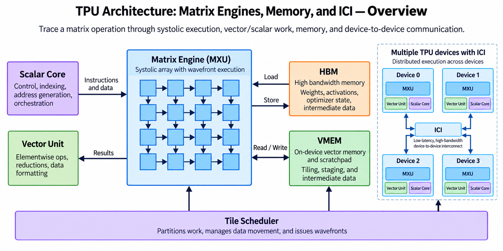
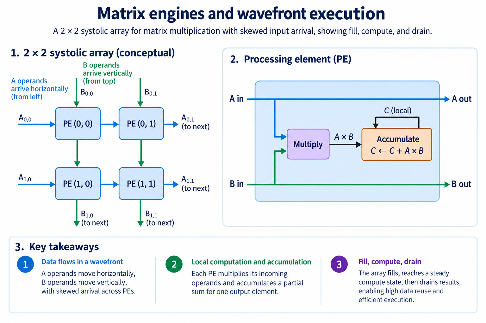
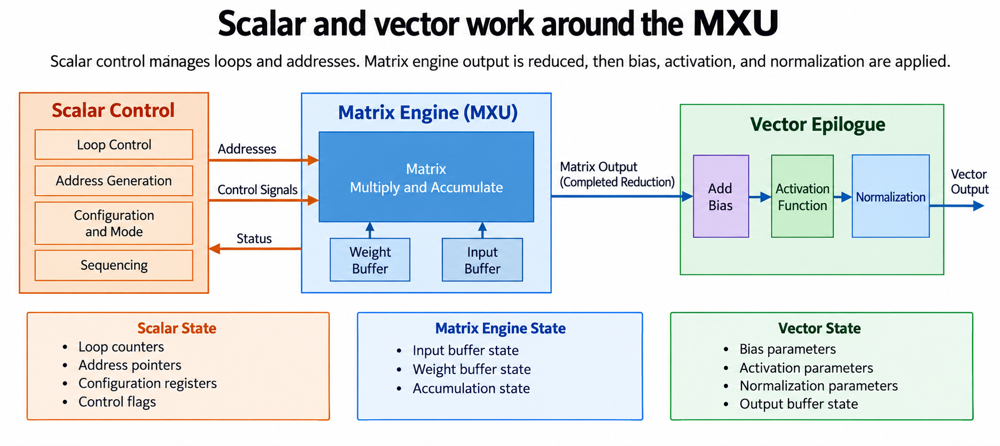
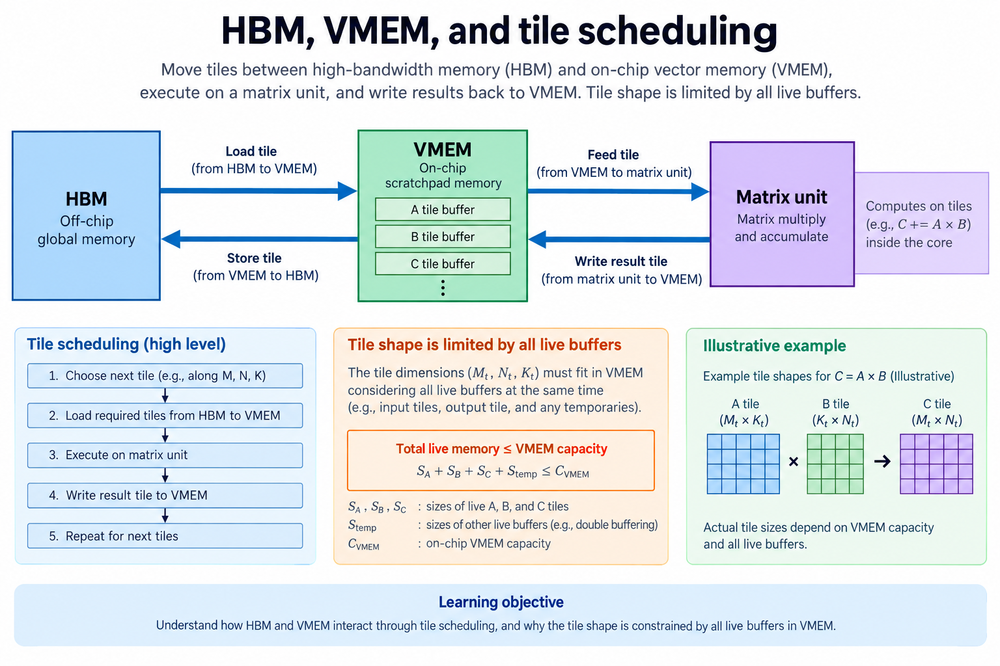
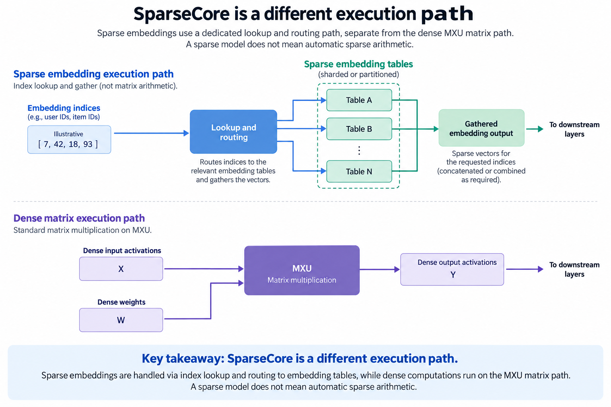
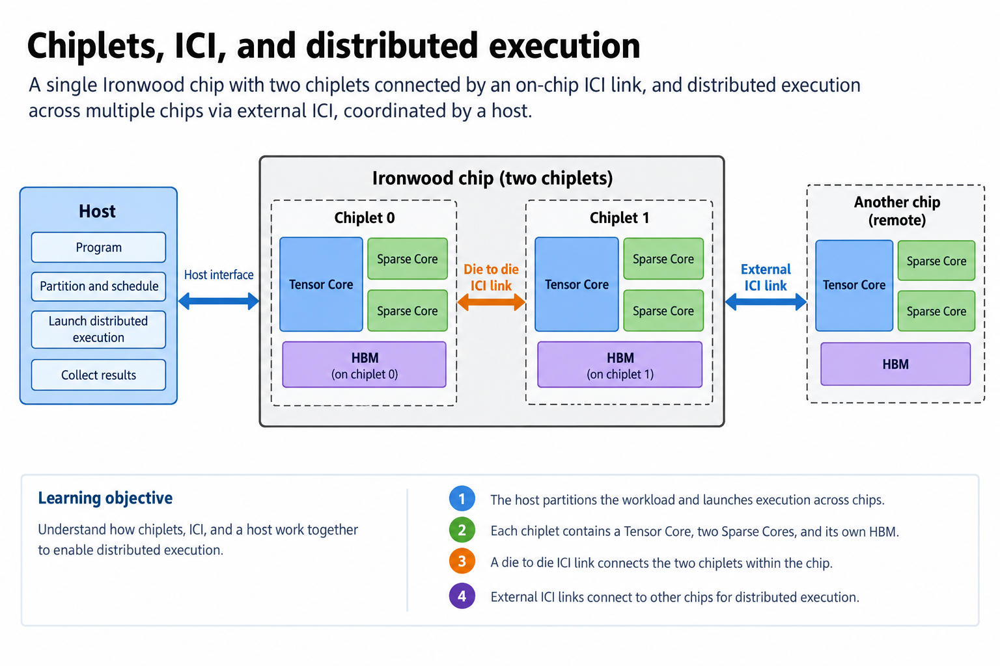

## Overview

A TPU calculates dense tensor operations with specialized matrix hardware surrounded by vector/scalar execution, a memory hierarchy and communication links. The overview shows these as separate responsibilities, because matrix multiplication is central but an actual neural-network layer also needs addressing, reductions, activations, data conversion and transfers, and understanding that surrounding work explains why two models can use the same TPU very differently.

This article builds on [systolic arrays](/blog/systolic-arrays-the-idea-inside-tpus/) and follows an operator from a mathematical expression to a distributed execution plan. The examples use small conceptual arrays so every contribution can be checked. They are not drawings of proprietary internal routing or benchmark results.

The product snapshot is checked on 2026-09-13, and Google's documentation identifies TPU7x as the first release within Ironwood and describes its two-chiplet programming model. That software-visible organization matters when counting devices and planning collectives. “One chip” and “one framework device” are therefore not interchangeable units in this generation.

## Deep dive

### Matrix engines and wavefront execution

The figure places a local accumulator at each intersection of two operand streams, where a value from a row of $$A$$ meets a value from a column of $$B$$, their product contributes to the local output, and operands continue toward neighboring processing locations, so timing the streams lets repeated products reuse short local routes rather than requiring every cell to fetch each operand independently from external memory.

For $$A=[[1,2],[3,4]]$$ and $$B=[[5,6],[7,8]]$$, the first output accumulates $$1\times5$$ followed by $$2\times7$$, yielding 19. The bottom-right output accumulates $$3\times6+4\times8=50$$. The array computes the same matrix multiplication as a software loop; it changes where operands move and where sums live. [Google's system architecture documentation](https://docs.cloud.google.com/tpu/docs/system-architecture-tpu-vm) describes TPU matrix units as systolic arrays.

In a conceptual output-stationary array with $$R$$ rows, $$C$$ columns and reduction length $$K$$, globally stepped operands require skew and fill/drain time. With inputs entering at step 0, the last multiplication arrives at step $$K+R+C-3$$. The number of occupied steps through that event is $$K+R+C-2$$. This model assumes one multiplication per active cell per step and no stalls. It is not a timing specification for Google's MXU.

For a 4×4 example with $$K=8$$, 128 useful MAC contributions occupy an ideal 14-step window with capacity for 224 cell-steps. The resulting utilization is $$128/224=4/7$$. Increasing $$K$$ amortizes fill and drain. Increasing dimensions without enough useful work can have the opposite effect. Commercial instruction scheduling and tiling add details, but the example makes array-shape mismatch visible before any peak comparison.

### Scalar and vector work around the MXU

The surrounding execution blocks handle work whose structure differs from a large matrix product: scalar control deals with instruction sequencing and addressing, while vector operations process elementwise arithmetic and reductions according to their supported instructions. Bias addition, activation functions and normalization involve these responsibilities even if a matrix engine produces the main intermediate tensor.

Consider a dense layer $$Y=\operatorname{ReLU}(AB+b)$$. The matrix stage produces the accumulated dot products. Bias $$b_j$$ is added to each element in output column $$j$$, then ReLU selects the nonnegative result. If an output is -3 and its bias is 5, activation produces 2. Reversing the order produces 5, because applying ReLU first discards the negative contribution. Correct scheduling follows the graph's semantics, not merely whichever engine is idle.

A compiler can sometimes fuse surrounding work to reduce intermediate transfers, but fusion is constrained by supported instructions, live memory and numerical ordering, a reduction that spans more elements than a local tile still needs coordination across tiles, and a scalar control operation can also create a dependency shared by many matrix instructions.

This produces an important utilization distinction: a matrix unit can be busy while an application still loses time to epilogues or collectives, or it can wait because the next tile needs a vector result. Profile the complete operator graph rather than asking only what fraction of time the MXU is active. [The documented TensorCore organization](https://docs.cloud.google.com/tpu/docs/system-architecture-tpu-vm) supplies the hardware categories, while the layer example here is an independent calculation.

### HBM, VMEM, and tile scheduling

The memory figure distinguishes HBM capacity from VMEM working storage: HBM holds tensors that exceed the small on-chip working set, while VMEM is a software-managed local resource used by compiled execution to keep operands near the engines. Transfers and buffer placement determine whether the engines can compute a tile without repeatedly returning to HBM.

Suppose a conceptual tile uses $$M_t=N_t=32$$ and $$K_t=64$$ with 2-byte inputs and 4-byte accumulators. An $$A$$ tile needs $$32\times64\times2=4,096$$ bytes; a $$B$$ tile needs another 4,096. The accumulated output needs $$32\times32\times4=4,096$$ bytes. That totals 12,288 bytes before alignment, temporary vectors or double buffering. Keeping a second pair of inputs live raises the example to 20,480 bytes.

This arithmetic explains why choosing the largest matrix tile is not always best. A larger tile increases reuse but also extends lifetimes and storage demand, the compiler may need space for an epilogue, transpose or reduction at the same time, and spilling or repeatedly refilling a tile can cancel an expected arithmetic benefit.

For Ironwood, [the TPU7x documentation](https://docs.cloud.google.com/tpu/docs/tpu7x) explicitly identifies VMEM as a smaller on-chip scratchpad and notes its importance to performance. Its comparison table labels HBM capacity in GiB, while explanatory prose uses GB. When making a capacity budget, preserve the source's unit convention and avoid silently mixing binary and decimal quantities.

A practical operator analysis records all simultaneously live tensors, their actual element types and their placement, then counts external bytes separately from local reads. Large HBM capacity lets larger models stay resident and high bandwidth speeds transfers, but neither guarantees a good VMEM schedule.

### SparseCore is a different execution path

The SparseCore figure follows indices and embedding records rather than a dense matrix wavefront. An embedding operation takes an index and retrieves a corresponding vector from a table, and its access pattern can be irregular, while updates or aggregation may require routing and handling repeated indices. The bottleneck can be memory access and data organization rather than multiplying every element in a rectangular tile.

For a toy table with 1,000 rows and vectors of 16 2-byte values, one requested vector carries 32 payload bytes. A batch of 20 distinct lookups carries 640 vector bytes before indices, metadata and implementation overhead. If the batch repeats an index, reusing a fetched vector may help; if requests scatter across ownership partitions, communication may dominate. These are illustrative traffic counts, not a measured SparseCore bandwidth.

A model with sparse data is not automatically eligible for every sparse execution path, since sparse embeddings, pruned dense weights and mixture-of-experts routing describe different operations, and a hardware unit optimized for lookup and embedding traffic does not mean arbitrary matrix zeros get the same acceleration.

Google documents SparseCores as dataflow processors for models using sparse embeddings and reports 4 SparseCores per TPU7x chip in [the architecture description](https://docs.cloud.google.com/tpu/docs/system-architecture-tpu-vm). Compiler configuration and operator support control how the path is used. The correct question is which graph operations are placed there and what transfers surround them. Keep that path separate from MXU utilization when explaining a recommendation model or another embedding-heavy workload.

### Chiplets, ICI, and distributed execution

The final figure shows the physical chip boundary and the framework-device boundary. [TPU7x documentation](https://docs.cloud.google.com/tpu/docs/tpu7x) describes 2 chiplets per chip, each chiplet has 1 TensorCore, 2 SparseCores and its own HBM, frameworks such as JAX expose 2 devices per chip, and die-to-die ICI communication uses collective operations. A model partition that previously treated one package as one device needs to respect that organization.

If a workload is divided across 4 physical chips in this programming model, it can encounter 8 framework devices, and that count alone does not describe the number of hosts, network adapters or usable memory pools. Software must place tensors on the correct devices and establish collectives whenever a partition crosses the relevant ownership boundary.

For a distributed matrix product, partitioning output columns can let each device compute a different part of $$C$$ while sharing or replicating $$A$$. Partitioning the reduction dimension instead produces partial outputs that must be summed. With $$K$$ split into two sets, $$C=A_0B_0+A_1B_1$$. Neither partial result is the final answer; a collective or equivalent reduction produces it. The arithmetic choice determines the communication requirement.

ICI links support communication between TPU resources; the data-center network serves a different scope in multislice execution. Do not substitute aggregate link bandwidth for a collective's sustained throughput. Message size, topology, contention and synchronization affect the result.

Ironwood is not an inference-only machine just because inference motivated prominent announcements. [Google's GKE documentation](https://docs.cloud.google.com/kubernetes-engine/docs/concepts/tpu-ironwood) states availability in Standard clusters and provides training recipes, so separate current availability, supported software and the architecture's durable execution model when selecting a deployment.

### A worked engineering decision

Suppose a serving request produces a small matrix while training produces a much larger batch. Both can call matrix multiplication, but their physical occupancy differs. The serving matrix may leave rows or columns of an MXU mapping unused, and its short reduction may spend a greater fraction of time entering and leaving the pipeline. The training matrix can provide enough independent tiles to amortize those effects. So the operator name alone is not enough to compare the 2 workloads.

Begin a compiler experiment by writing logical shapes, input and accumulation formats, transpose/layout requirements and the epilogue. Keep a numerical reference that includes the complete reduction. Inspect the compiler's partition and operation placement before looking at a device utilization percentage. A percentage has meaning only when its boundary and useful-work definition are known. It may count active hardware even when some executed work belongs to padded positions.

Next, separate an isolated device experiment from a multi-device one. Hold the per-device work constant and add a required collective to expose communication cost. Then increase total problem size while retaining the same partition strategy. These answer different questions: the first studies added synchronization at fixed local work, while the second studies scaling under more useful work. Record which quantities change rather than combining the results into a single scaling claim.

A sparse embedding-heavy model creates another decision, because its access patterns and specialized operations may benefit from hardware that a dense matrix diagram does not show, so check the selected TPU generation and supported compiler path instead of assuming that every workload reduces to the MXU. Ironwood documentation explicitly describes more than its tensor machinery. A complete explanation relates the model's operators to the device's actual resources and interconnect arrangement.

This article's diagrams are conceptual mappings, not recovered Google floorplans or measured utilization. The innovation is the combination of matrix-oriented execution, software-controlled placement and device communication. Whether that combination improves a particular application remains a shape, compiler and system question.

## Conclusion

TPU computation combines a regular matrix datapath with less regular surrounding work and explicit memory/communication planning. A small systolic trace explains arithmetic reuse; live-tile accounting explains VMEM pressure; graph partitioning explains why collectives appear.

When reading a TPU specification, first identify the unit being counted, chip, chiplet, framework device, host or slice, then map the model's matrix, vector and embedding operators to those resources and count required movement. The [FPGA array lesson](/blog/fpga-ai-array-1-build-a-4x4-systolic-array-and-trace-every-cycle/) implements a small educational version of the wavefront idea, so you can verify the timing and numerical behavior directly.

### Sources

- [Cloud TPU system architecture](https://docs.cloud.google.com/tpu/docs/system-architecture-tpu-vm)
- [TPU7x / Ironwood architecture](https://docs.cloud.google.com/tpu/docs/tpu7x)
- [Ironwood in GKE](https://docs.cloud.google.com/kubernetes-engine/docs/concepts/tpu-ironwood)
