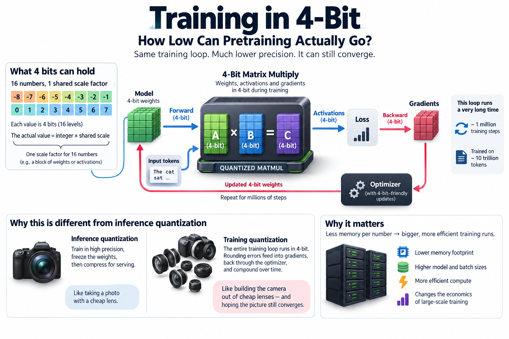
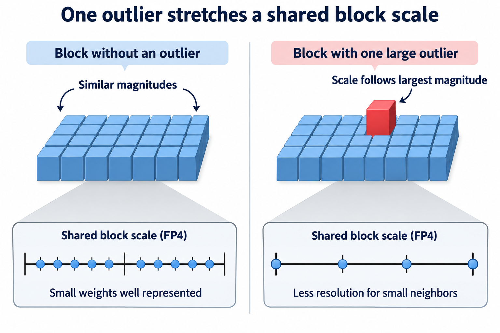
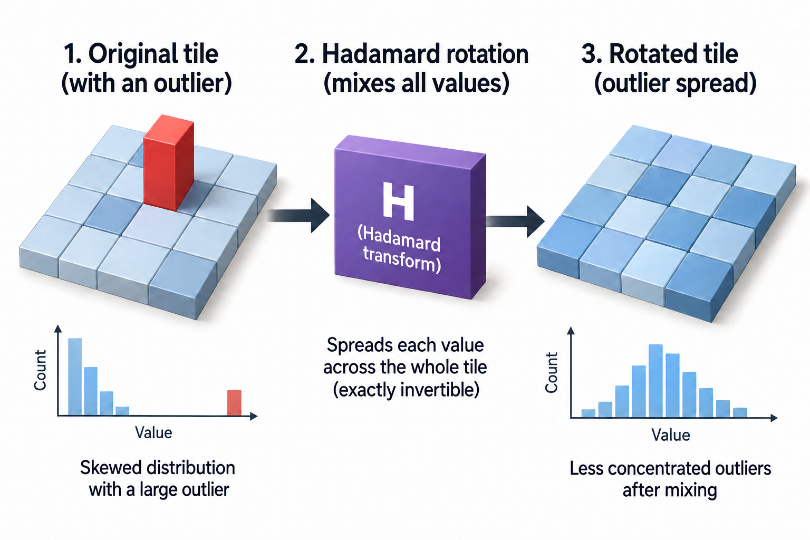
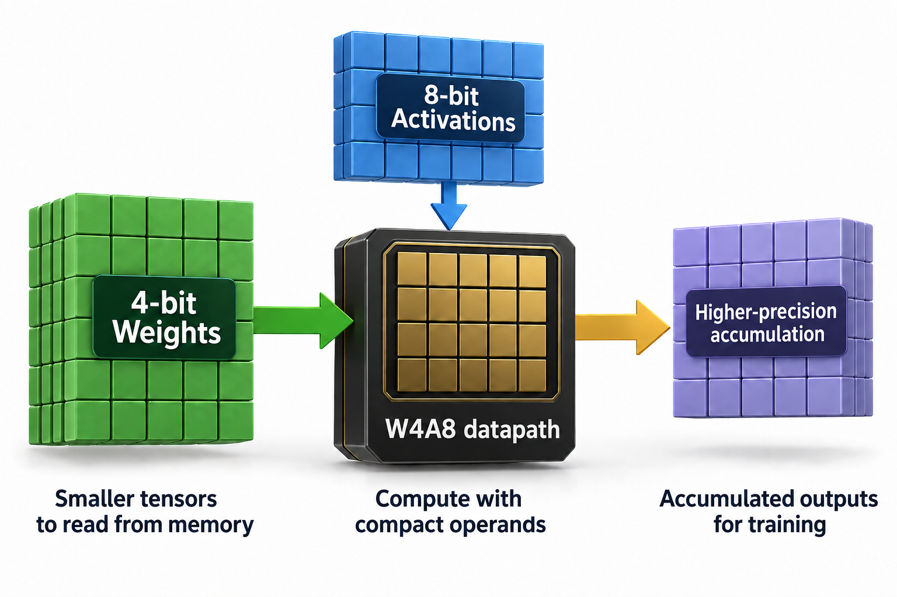

## Overview

16 numbers, 1 shared scale factor, 4 bits each. In late 2025, NVIDIA researchers pretrained a 12-billion-parameter model on 10 trillion tokens with its matrix multiplies running in that format. The loss curve sat on top of the FP8 baseline for the entire run ([arXiv 2509.25149](https://arxiv.org/abs/2509.25149)). That sentence would have been dismissed as fantasy 3 years ago.

Quantizing a model for *inference* is old news. You train in high precision, freeze the weights, and squeeze them into fewer bits for serving. OpenAI now ships gpt-oss natively in 4-bit MXFP4, straight from the factory. Quantizing *training* is a different problem entirely, because training is a feedback loop. Every rounding error you make in the forward pass gets baked into the gradients, fed back through the optimizer, and compounded across 1 million steps. Inference quantization is taking a photo with a cheap lens. Training quantization is building the camera out of cheap lenses and hoping the picture still converges.

This article is about why that loop breaks at 4 bits, and about the specific fixes that made a 10-trillion-token run survive it.

## Deep dive

### What 4 bits can actually hold

Start with the raw material. The FP4 format used here (E2M1: 1 sign bit, 2 exponent bits, 1 mantissa bit) can represent exactly 16 values:

**0, ±0.5, ±1, ±1.5, ±2, ±3, ±4, ±6**

That's it. There is no 2.5. There is no 5. The gaps between neighbors range from 0.5 near 0 to 2.0 at the top, so a single FP4 number carries substantial relative error away from zero. Near zero, relative error can be much larger. Nobody trains a model on numbers that coarse, at least not directly.

The trick that makes 4 bits usable is **block scaling**. Group nearby values, store 1 higher-precision scale factor per group, and let the 4-bit codes represent multiples of that scale. The 2 competing formats differ mainly in how they do this:

- **MXFP4** (the OCP open standard, what gpt-oss ships in): blocks of 32 values, each block scaled by an E8M0 factor, meaning the scale itself must be a power of 2.
- **NVFP4** (NVIDIA's format, native in Blackwell tensor cores): blocks of 16 values, each block scaled by an FP8 E4M3 factor, plus 1 FP32 scale for the whole tensor.

Smaller blocks mean each scale factor only has to cover 16 neighbors instead of 32, so it can hug the local distribution more tightly. A real-valued (rather than power-of-2) scale removes another rounding step. Those 2 choices are why NVFP4 is the format that made it into a serious pretraining run. NVIDIA reports the combination holds accuracy within about 1% of FP8 while using roughly 1.8x less memory for the quantized tensors. That is a vendor-measured figure, but one consistent with the published training curves.

If you want the blow-by-blow of the format war itself, that was the previous article in this series. Here we care about what happens when you push these formats into the training loop.

### A worked example you can check by hand

Take 1 NVFP4 block: 16 weights from some attention layer. Suppose the largest magnitude among them is 0.048. The encoder picks the block scale so that this maximum lands on 6, the top of the FP4 range:

**scale = 0.048 / 6 = 0.008**

Now every weight is divided by 0.008 and snapped to the nearest of the 16 FP4 values. Follow 4 of them:

| original | ÷ scale | nearest FP4 | dequantized | error |
|---|---|---|---|---|
| 0.021 | 2.625 | 3 | 0.024 | +14% |
| 0.012 | 1.5 | 1.5 | 0.012 | exact |
| 0.005 | 0.625 | 0.5 | 0.004 | −20% |
| −0.033 | −4.125 | −4 | −0.032 | −3% |

Errors of 10–20% on individual weights sound alarming, but they partly cancel when summed inside a matrix multiply. That holds as long as they do not line up with important features. The cancellation is conditional, not guaranteed: correlated error and clipping can survive a matrix multiply. This is why block scaling exists, and why you still have to measure model quality directly.

Now poison the block. Keep the same 16 weights but let one of them be 0.48, 10 times larger than anything else. Outliers like this are not hypothetical. Transformer activations and gradients grow them constantly, and a handful of channels can sit orders of magnitude above the rest. The scale must stretch to cover the outlier:

**scale = 0.48 / 6 = 0.08**

The outlier itself encodes perfectly. Everything else in the block gets crushed:

| original | ÷ scale | nearest FP4 | dequantized | error |
|---|---|---|---|---|
| 0.021 | 0.2625 | 0.5 | 0.040 | +90% |
| 0.012 | 0.15 | 0 | 0.000 | lost |
| 0.005 | 0.0625 | 0 | 0.000 | lost |
| −0.033 | −0.4125 | −0.5 | −0.040 | +21% |

2 weights flushed to 0, 1 inflated by 90%. 1 extreme value spent the block's entire dynamic range on itself and left nothing for its 15 neighbors. During inference you can hunt outliers offline and special-case them. During training, they appear and move every step, in tensors you never materialize for inspection. This is failure mode number 1.

Failure mode number 2 is subtler and belongs to the gradients. As training converges, gradient magnitudes shrink. Sooner or later, huge numbers of gradient values are smaller than half the smallest representable step in their block. Round-to-nearest sends every one of them to 0, deterministically, step after step. The optimizer goes blind to exactly the fine corrections that late-stage training is made of. In [how models learn](/blog/how-models-learn/) we walked through why gradient descent lives or dies on those accumulated small signals. Round-to-nearest at 4 bits quietly deletes them.

### Going deeper: the 3 fixes

The NVFP4 pretraining recipe ([arXiv 2509.25149](https://arxiv.org/abs/2509.25149)) is essentially a targeted counter to each failure mode.

**1. Random rotations to dissolve outliers.** Before quantizing, the recipe applies a Hadamard transform. That transform is a cheap structured rotation that mixes every value in a tile into every output. A lone spike of 0.48 among small values becomes, after rotation, a spread of moderate values across the whole tile. The distribution turns approximately Gaussian, which is the shape block scaling handles best. The rotation is exactly invertible, so the matrix multiply computes the same mathematical result. You pay a little compute to buy a distribution the format can afford. The recipe applies this where outliers bite hardest, on the tensors feeding the weight-gradient computation.

**2. Stochastic rounding to unbias the gradients.** Do not round to the nearest representable value. Round *up or down at random, with probability proportional to proximity*. Concretely: a gradient sitting at 0.1 in scale units, between representable neighbors 0 and 0.5, rounds to 0.5 with probability 0.1/0.5 = 20% and to 0 with probability 80%. The expected value is 0.5 × 0.2 = 0.1, exactly right. Any single update is wrong, but across millions of steps the errors average out instead of piling up in 1 direction. Round-to-nearest would have returned 0 every single time, a 100% bias on that value forever.

**3. Consistency and selective precision.** A tensor gets quantized along rows in the forward pass and along columns in the backward pass. If those 2 quantized views disagree, the gradient no longer matches the function being differentiated. The recipe uses 2D block scaling on weights so both passes see the same quantized tensor. And a small minority of numerically sensitive layers, notably the linear layers in the final blocks of the network, simply stay in BF16. The authors report that switching those few layers to higher precision was the difference between a run that tracks FP8 and one that drifts away late in training.

That last point deserves emphasis: even in a "4-bit training" run, the skeleton of the loop stays in high precision. Master weights stay in FP32, optimizer moments keep their full width, and the loss and softmax are computed in high precision too. What runs in NVFP4 is the big GEMMs, the matrix multiplies that consume the overwhelming majority of training FLOPs. That is where the money is, so that is where the bits come out.

With all 3 fixes in place, here is the paper's headline result. A 12B hybrid Mamba-Transformer pretrained on 10T tokens in NVFP4 matches the FP8 baseline's loss curve throughout, with downstream task accuracy comparable at the end (MMLU-pro within about a point). This is the first public demonstration of 4-bit pretraining at that token scale. It turns "can it be done" into a settled question.

### What stochastic rounding actually guarantees

Suppose a normalized scalar $$x$$ lies between adjacent representable values $$a$$ and $$b$$. Stochastic rounding chooses the upper value with probability

$$
\Pr(Q(x)=b)=\frac{x-a}{b-a},\qquad \mathbb E[Q(x)]=x.
$$

The complementary probability selects the lower value. For a value 0.1 between 0 and 0.5, the upper choice occurs with probability 0.2. The expected rounded value is therefore 0.1, whereas deterministic nearest rounding would always return 0. Its conditional variance is

$$
\operatorname{Var}(Q(x))=(x-a)(b-x)=0.04.
$$

These are normalized units. Multiplying by a block scale multiplies variance by that scale squared. Unbiasedness applies inside the representable range with the stated randomization. Clipping outliers breaks that guarantee, and nonlinear optimizer updates need not preserve it.

This explains the method more precisely than saying quantization errors cancel. Deterministic rounding can systematically erase small updates. Stochastic rounding preserves their expectation at the cost of added variance. Block scaling and outlier handling control the range, while the optimizer and accumulation precision determine how noise propagates. You still need to check training quality against a higher-precision baseline, across seeds and downstream tasks. Unbiased local rounding is a useful mechanism, not a convergence theorem or proof that every 4-bit recipe is lossless.

### Common misconceptions

**"4-bit training means the whole model lives in 4 bits."** No. The 4-bit part is the matrix-multiply inputs: weights, activations, and gradients as they flow through the GEMMs. Master weights, optimizer states, accumulations, norms, and a few sensitive layers stay in FP32/BF16. The point is that GEMMs dominate the FLOP and memory-traffic budget, so quantizing only them still captures most of the win. A checkpoint from this run is not 4 bits per parameter on disk.

**"Quantized training must produce a worse model; you're just trading quality for cost."** The 10T-token run is the direct counterexample. The NVFP4 loss curve tracks FP8 end to end, not "close enough," but within noise, with the gap on downstream evals around a percentage point. The reason it isn't a trade-off is that the fixes attack *bias*, not just noise. Unbiased noise in gradients is something SGD already tolerates by design. Minibatch sampling injects far more variance than rounding does. What kills runs is systematic bias: outlier-crushed blocks and always-rounded-down gradients. That is precisely what Hadamard transforms and stochastic rounding remove.

**"We already had 4-bit training: QLoRA."** Different animal. QLoRA *freezes* a 4-bit copy of a pretrained model and trains small high-precision adapter matrices on top. The 4-bit weights never receive a gradient update. It's an inference-style quantization cleverly reused to make fine-tuning fit on small GPUs. NVFP4 pretraining updates every parameter from random initialization through 10T tokens with 4-bit compute in the loop. The frozen base avoids updating its quantized weights, but adapter training still has moving activations, gradients, and its own numerical constraints.

### Why this moves the cluster economics

Follow the hardware. Blackwell tensor cores execute FP4 at 2 times the rate of FP8. Blackwell Ultra's headline 15 dense PFLOPS is an NVFP4 number. On the memory side, 4-bit tensors halve the bytes a GEMM must stream against FP8. Memory traffic, as we saw in [the Blackwell-to-Rubin memory math](/blog/blackwell-to-rubin-memory-math/), is the resource that's actually scarce this generation. A format that halves both the FLOP cost and the byte cost of the dominant kernel is, to a first approximation, a claim that the same cluster can train on 2 times the tokens in the same time and power envelope. Real speedups land below 2x, since non-GEMM work, communication, and the BF16 islands don't shrink. But the direction is unambiguous. With grid interconnects now the binding constraint on AI buildout, tokens-per-megawatt is the metric that 4-bit training directly improves.

The silicon is committing in both directions. AWS's Trainium3 builds a hardware W4A8 path (4-bit weights, 8-bit activations) that the company says doubles effective weight-load rate with no software overhead. That is a vendor claim, but one that tells you where the roadmap points. When formats show up as dedicated datapaths in training chips from 2 vendors, the bet has left the research phase. It's the co-design loop this series keeps returning to. The numerics recipe was designed for Blackwell's block-scaled tensor cores, and the next chips are being designed around the recipe. Whether your organization catches that win in practice is a different question, one of keeping real work flowing through those tensor cores, which is the [goodput problem](/blog/goodput-vs-utilization/) in a new costume, and squarely the kind of thing [ML performance engineers](/blog/what-does-an-ml-performance-engineer-do/) get paid to chase.

How much lower can it go? The honest answer is that below 4 bits, the 16-value grid stops looking like arithmetic and starts looking like coding theory. Today's fixes also lean hard on high-precision scales and accumulators that don't shrink with the payload. 4 bits may be near the floor for this style of quantization. But "FP8 pretraining is conservative" is now a sentence you can say with a straight face, and it wasn't in 2024.

## Conclusion

- 4-bit *training* is harder than 4-bit inference because rounding errors feed back through gradients and compound; the 2 killers are outliers stretching block scales and small gradients rounding to 0 forever.
- The NVFP4 recipe beats both with Hadamard rotations (reshape the distribution), stochastic rounding (unbiased in expectation), and selective BF16 for scales, accumulators, and a few sensitive layers, and it matched FP8 loss at 12B params / 10T tokens.
- The payoff is economic: FP4 doubles tensor-core throughput and halves GEMM memory traffic versus FP8, so validated 4-bit pretraining converts directly into tokens-per-dollar and tokens-per-megawatt, which is why Blackwell and Trainium3 are wiring it into silicon.

### Sources

- NVIDIA et al., *Pretraining Large Language Models with NVFP4*. [arXiv:2509.25149](https://arxiv.org/abs/2509.25149)
- NVIDIA Developer Blog, *NVFP4 Trains with the Precision of 16-Bit and the Speed and Efficiency of 4-Bit*. [developer.nvidia.com](https://developer.nvidia.com/blog/nvfp4-trains-with-precision-of-16-bit-and-speed-and-efficiency-of-4-bit/)
- NVIDIA Developer Blog, *Inside NVIDIA Blackwell Ultra: The Chip Powering the AI Factory Era*. [developer.nvidia.com](https://developer.nvidia.com/blog/inside-nvidia-blackwell-ultra-the-chip-powering-the-ai-factory-era/)
- OpenAI, *Introducing gpt-oss*. [openai.com](https://openai.com/index/introducing-gpt-oss/)
- AWS, *AI Chip: AWS Trainium* (Trainium3 W4A8; vendor-reported figures). [aws.amazon.com](https://aws.amazon.com/ai/machine-learning/trainium/)
- Rakshit Aralimatti, *MXFP4 explained* (Hugging Face blog). [huggingface.co](https://huggingface.co/blog/RakshitAralimatti/learn-ai-with-me)

---

*Part of the [Efficient AI & Co-Design](/series/efficient-ai/) learning path. Browse its published articles by topic.*
