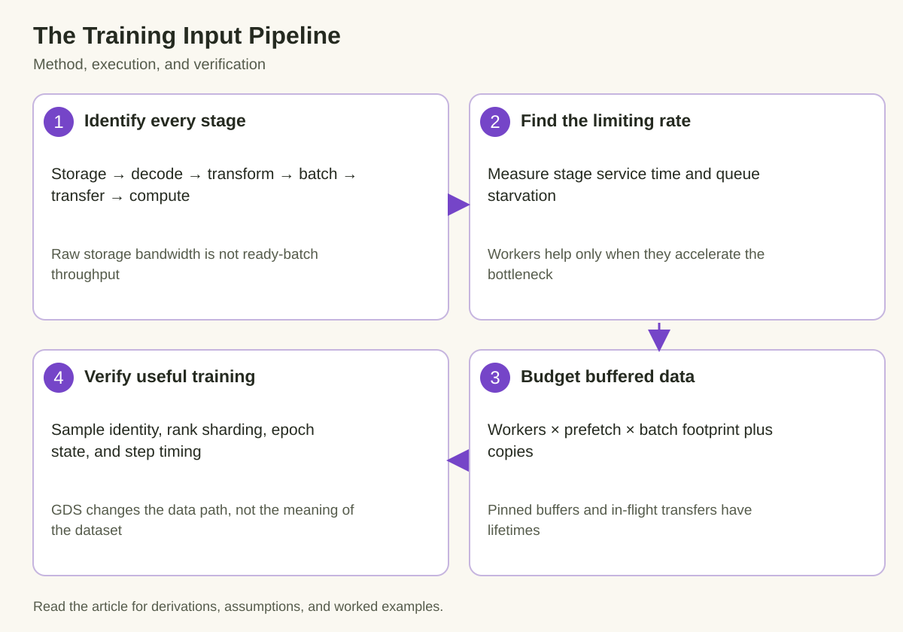

A training GPU can wait for data while the storage device appears fast and CPU utilization appears high. The missing distinction is between raw bytes read and a batch ready for device computation. Parsing, decompression, augmentation, collation, and host-to-device transfer all sit between those events.

The input pipeline should be treated as an execution program with rates, queues, memory budgets, and correctness requirements. Increasing workers or prefetch depth helps only when it addresses the limiting stage or absorbs relevant variability. It can also increase memory pressure and contention.

We will derive a steady-state pipeline model, budget buffered batches, and examine pinned memory and GPUDirect Storage. Numerical examples are illustrative. DataLoader options and supported storage paths should be verified for the installed runtime and platform.

## 1. Draw the complete path from a sample to computation

*The diagram connects the mechanism to its execution and verification. The derivation below defines the quantities and assumptions.*

Start with storage access, then identify decoding, transforms, sample grouping, collation, host buffering, transfer, and GPU consumption. Some stages may be fused, cached, or moved to the device. The diagram should describe the actual workload rather than an idealized generic loader.

Measure bytes and time at meaningful boundaries. Compressed file bytes, decoded sample bytes, and model-input tensor bytes can differ greatly. A storage benchmark can report excellent raw bandwidth while decompression produces batches too slowly for the GPU.

Keep sample identity and dataset semantics beside the performance model. A loader that skips expensive records, changes sequence lengths, or duplicates samples can appear faster while changing useful training work. Count actual samples or tokens reaching the optimizer.

Record cache state. A dataset that fits in the page cache can behave differently from cold remote reads. Both cases may matter, but a warm-cache result should not be presented as a raw-storage guarantee for a larger deployment.

Storage layout also affects the program. Many small files can expose metadata and request overhead, while larger record containers can support more efficient sequential reads. Random sample access may require additional indexing or read amplification within a container. Measure useful decoded samples per second alongside physical bytes read so a format that reads more data to produce the same batch is visible. Caching or offline preprocessing can reduce repeated work, but their preparation cost and storage footprint belong in the deployment record. Preserve the intended sampling distribution when reorganizing records; improved locality should not silently replace the training data policy.

## 2. Derive the steady-state bottleneck approximation

For stages with effective batch service times t_j and sufficient overlap, an ideal pipeline's steady-state interval is bounded by its slowest stage:

$$
t_{\mathrm{batch}}\gtrsim\max_j t_j,\qquad G_{\mathrm{batches}}\lesssim1/\max_jt_j.
$$

Startup can include the sum of stages before the first batch reaches computation. Steady-state overlap changes later intervals. The bound assumes adequate buffering and resources; stages sharing CPU, memory, storage, or interfaces can interfere and violate a simple independent-stage prediction.

For illustrative times of 40 milliseconds reading, 20 decoding, 15 transforming, 10 transferring, and 50 computing, serial execution takes 135 milliseconds. An adequately provisioned independent pipeline could approach a 50-millisecond interval after startup. The calculation explains the opportunity, not a promised measured speedup.

Measure queue occupancy and starvation to test the model. If ready batches disappear before each GPU step, upstream supply is insufficient or too variable. If queues remain full and GPU timing is unchanged, increasing loader concurrency may add resource cost without improving training.

## 3. Workers increase capacity only under the right conditions

Multiple workers can parallelize independent sample reads and preprocessing. Their useful scaling depends on storage concurrency, CPU availability, transform cost, and shared memory bandwidth. A worker count is not itself a throughput model.

A simplified stage with per-worker rate g and w workers has aggregate rate at most w times g before shared limits. Once a storage target or memory path saturates, more workers can increase contention rather than useful supply. Measure throughput and tail behavior as workers increase.

Dataset representation also affects memory. Worker processes can retain or replicate portions of dataset state depending on process model and object behavior. Large Python metadata structures can therefore influence capacity independently of batch tensors.

Preserve multiprocessing context and initialization behavior in reports. Startup, serialization, process creation, and persistent-worker settings can affect cold and steady-state costs differently. Changing them can also alter how dataset state and randomness are initialized.

## 4. Prefetch is a queue budget, not free performance

Let w be workers, f the configured batches prefetched per worker under the runtime's semantics, and m the batch-buffer footprint. A first-order queued-data estimate is

$$
M_{\mathrm{queue}}\approx wfm.
$$

The total process footprint can also include worker state, decoded samples, collation buffers, pinned copies, and in-flight device transfers. Some representations share storage or are reused, so inspect actual allocation behavior rather than adding every logical object blindly.

For w=8, f=2, and m=64 MiB, queued batches alone account for about 1 GiB under this model. A separate pinned representation and other buffers can increase the total. More prefetch can therefore trade GPU starvation for host-memory pressure.

Prefetch absorbs variability only if average upstream supply can keep up. A permanently slower producer eventually empties any finite queue. Increasing queue depth can delay the visible stall while leaving the steady-state bottleneck unchanged.

## 5. Size buffering for the variability it must absorb

Suppose compute consumes one batch every t_c and upstream production occasionally pauses for J. A rough number of ready batches needed to bridge that pause is

$$
q\gtrsim\lceil J/t_c\rceil.
$$

For an illustrative 200-millisecond interruption and 50-millisecond consumption interval, about 4 ready batches bridge the interruption under the simple model. The estimate omits concurrent production and changing batch costs, but it connects a queue budget to an observed jitter scale.

Measure the interruption distribution and memory cost before selecting q. A queue large enough for every extreme event may be expensive, while too little buffering can expose frequent ordinary jitter. The operating choice follows the service or training objective.

Inspect recovery after interruptions. If producers never refill the queue because their mean rate barely matches consumption, bursts can create recurring starvation. Additional average production capacity may matter more than a larger initial buffer.

## 6. Pinned memory changes the transfer path and its constraints

Pinned host memory can support efficient asynchronous host-to-device transfer under the runtime's supported behavior. It is different from ordinary pageable memory and consumes a host resource whose allocation and lifetime matter.

A nonblocking transfer request does not by itself prove useful overlap. The device must have independent work available, dependencies must permit concurrent execution, and the buffers must remain valid until the transfer's consumer boundary. Streams and events establish the required ordering in supported designs.

A simple transfer budget is

$$
t_{\mathrm{copy}}\approx\alpha_{\mathrm{copy}}+D/B_{\mathrm{H2D}},
$$

where D is transferred bytes and B_H2D achieved bandwidth. Many tiny tensors can expose startup repeatedly, while collated contiguous inputs can change the transfer pattern. Measure actual copies rather than estimating from only the final batch's logical size.

Do not reuse a source buffer while an outstanding transfer still reads it. Similarly, the GPU consumer must wait on the required transfer event. A fast loader that violates ownership can create intermittent corruption that disappears under diagnostic synchronization.

## 7. GPUDirect Storage does not perform the whole input pipeline

GPUDirect Storage provides supported data paths that can move storage data into GPU memory without the traditional CPU bounce-buffer sequence. Its applicability depends on storage, filesystem, software, and platform support.

The data still needs interpretation. Compression, record parsing, augmentation, and model-specific tensor construction do not disappear merely because the storage path is direct. A format whose decoding remains CPU-bound can limit training even when raw transfer improves.

Compare the complete ready-input path. Direct storage can reduce host traffic or free CPU resources, but its setup, alignment, buffering, and supported fallback behavior matter. A raw device-read benchmark establishes only part of the application's execution program.

Label the actual path and cache conditions. A library request for direct I/O is not evidence that every read used the intended route. Use supported diagnostics and workload measurements to verify the mechanism before attributing a training speedup to GDS.

## 8. Distributed input correctness is a performance requirement

Different ranks must receive the intended dataset partitions and sampling behavior. Map-style samplers and iterable datasets have different sharding responsibilities. Worker-level and rank-level partitioning must not accidentally duplicate or omit records.

Record sample identifiers in a small deterministic test and verify expected coverage across ranks and workers. Include epoch transitions and restart behavior. A loader can pass one batch test while repeating the same subset each epoch or changing data progress after recovery.

Random transforms need an explicit reproducibility policy. Worker initialization, persistent state, and epoch changes can affect random streams. Exact replay may require preserving additional state; a valid but different future sample stream should be distinguished from bitwise continuation.

Options that drop incomplete batches change the processed population. They can be appropriate for the method, but performance reports should count the actual useful samples or tokens. Faster epochs caused by omitting work are not equivalent to faster execution of the same training program.

## 9. Use traces to distinguish starvation from device execution

Capture loader wait, transfer events, and GPU computation on compatible timelines. If the device waits before each transfer, inspect producer supply. If transfers are ready but computation waits on dependencies, inspect the device scheduling path.

Correlate batch cost with record properties such as compressed size, sequence length, and transform class. A small number of expensive records can create tails that average storage throughput hides. Bucketing or preprocessing can change this distribution, but also changes the method and should be evaluated accordingly.

Sweep workers, prefetch depth, and transfer configuration while preserving input distribution and compute work. Stop increasing a control when useful throughput plateaus or memory and tail behavior worsen. The purpose is to find a feasible operating point, not maximize every concurrency setting.

Measure sustained steps after warmup and include startup separately where relevant. Keep CPU utilization, host memory, storage demand, and GPU starvation alongside useful-token throughput. These measurements explain whether a gain comes from greater supply, absorbed jitter, or a changed data population.

## 10. Preserve a reproducible input-pipeline record

Record dataset version and format, sample distribution, cache state, workers, prefetch semantics, process model, collation, pinning, transfer path, rank sharding, and observed memory. Preserve representative batch and step timing.

A useful report separates raw-read throughput, ready-batch throughput, and training throughput. A change can improve one without improving the others. Include correctness and coverage evidence so the performance denominator remains trustworthy.

For an illustrative investigation, increasing workers from 4 to 8 might eliminate ready-queue starvation while increasing to 16 produces no further training gain and doubles host-memory pressure. That supports choosing 8 for the tested workload, not declaring 8 universally optimal. A later faster compute kernel can shift the limiting rate and require another sweep.

The training input pipeline is a chain of useful transformations with finite rates and buffer ownership. Workers provide capacity, prefetch absorbs variability, pinned memory supports a transfer path, and GDS can remove particular staging work. Their value is established by correct, sustained useful training progress rather than by isolated raw bandwidth or an arbitrarily large queue.

## Sources

- [PyTorch data loading documentation](https://docs.pytorch.org/docs/stable/data.html).
- [NVIDIA GPUDirect Storage overview](https://docs.nvidia.com/gpudirect-storage/overview-guide/index.html).
- [PyTorch CUDA asynchronous execution and memory guidance](https://docs.pytorch.org/docs/stable/notes/cuda.html).
