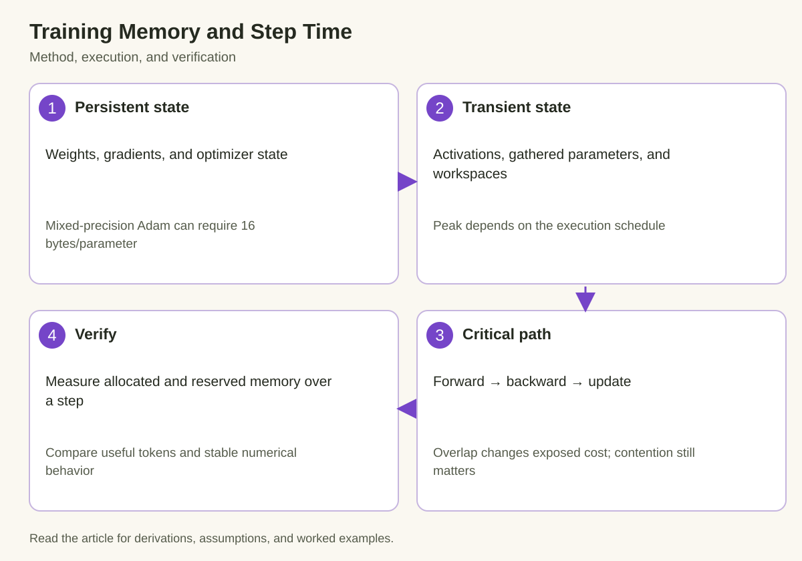

A model with 7 billion parameters does not require only 14 GB to train because its inference weights fit in that space. Training retains additional state, creates intermediate tensors, and performs operations whose temporary allocations can overlap. A deployment that fits for generation can fail before the first optimizer update. Conversely, a careful sharding or recomputation schedule can train a model that would never fit as a fully replicated training instance.

The useful question is therefore precise: which tensors must exist on each device at the same instant, and which operations determine how quickly that device can finish a step? Memory capacity and execution time interact, but they are different constraints. An optimization that reduces persistent optimizer state can leave an activation peak unchanged. A schedule that reduces the peak can introduce enough communication to make useful training slower.

This article builds a transparent accounting model for a hypothetical dense model with mixed-precision Adam. The numbers are illustrative, rather than measured GPU results. The method applies more broadly if you replace the state sizes with the actual optimizer, precision policy, parameter layout, and execution schedule used by your framework.

## 1. Separate the objects before counting bytes

*The diagram connects the mechanism to its execution and verification. The derivation below defines the quantities and assumptions.*

Parameters are the values used during the forward computation. Gradients record derivatives accumulated during backward. Optimizer state stores information needed for future updates. Adam commonly maintains a first moment and a second moment for each optimized parameter. Some mixed-precision implementations also maintain a higher-precision master copy of the parameters. These objects can use different numerical representations.

Activations are intermediate values required to compute gradients. Their shapes depend on batch size, sequence length, hidden dimensions, and layer implementation. Saved tensors are not simply every tensor created during forward: automatic differentiation retains what its backward rules require, and fused operations or recomputation can change that set. Attention implementations also differ in whether they materialize large score matrices.

Temporary workspaces, communication buffers, and materialized parameter shards form another category. They may be short-lived, but a short lifetime does not make their contribution to a peak disappear. A framework can prefetch the next layer while computing the current layer, causing 2 allocations that look separate in source code to coexist on the device.

Finally, allocator reservation differs from live tensor allocation. A caching allocator may keep freed blocks available for reuse. Reserved memory can exceed allocated memory without indicating a leak. Fragmentation and non-framework allocations can nevertheless reduce the space available for the next operation. Record what each reported memory quantity actually measures.

## 2. Derive the persistent-state budget

Let P be the number of parameters on the logical model. Denote bytes per parameter for compute weights, gradients, master weights, first moments, and second moments by b_w, b_g, b_m, b_1, and b_2. A fully replicated persistent budget is

$$
M_{\mathrm{persistent}}=P(b_w+b_g+b_m+b_1+b_2).
$$

One illustrative configuration uses 2-byte compute weights, 2-byte gradients, 4-byte master weights, and 4-byte values for each Adam moment. The total is 16 bytes per parameter. For 7 billion parameters, this produces 112 billion bytes of persistent state, about 104.3 GiB. A device with 80 GB of nominal memory cannot hold that complete replicated state, even before activations or runtime allocations.

This is a configuration example, not a universal Adam constant. Some systems accumulate gradients in higher precision, omit a separate master copy, compress optimizer state, or partition objects across ranks. Optimizer initialization may allocate its state lazily, so a measurement before the first update can substantially understate steady-state training memory. Inspect the actual state dictionaries and tensor dtypes after an optimizer step.

The accounting also explains why changing the compute-weight dtype alone is insufficient. Moving weights from 4 bytes to 2 bytes saves 2P bytes. If optimizer and gradient state dominate the total, that saving helps but does not halve training memory. The relevant denominator is the complete budget, not the single object highlighted by a precision setting.

## 3. Add the schedule-dependent peak

A useful per-rank model expresses peak memory as persistent state plus the largest concurrent transient allocation:

$$
M_{\mathrm{peak}}=M_{\mathrm{persistent,rank}}+
\max_t\left[M_{\mathrm{saved}}(t)+M_{\mathrm{workspace}}(t)+M_{\mathrm{materialized}}(t)+M_{\mathrm{communication}}(t)\right].
$$

The maximum is over execution time. Summing the independent maximum of every category can be overly pessimistic if those peaks occur at different times. Ignoring categories because they are transient can be dangerously optimistic. A timeline of allocation and release is the bridge between these extremes.

For a simple activation approximation, a saved hidden-state tensor with microbatch size B, sequence length L, hidden width H, and b-byte elements consumes BLHb bytes. If B is 2, L is 4096, H is 4096, and b is 2, one such tensor occupies 67,108,864 bytes, or 64 MiB. Saving several tensors per layer across many layers multiplies this amount. That calculation is a building block, not a full activation estimator.

An attention score tensor can add a separate quadratic term when it is materialized. Its shape includes batch, heads, query positions, and key positions. Memory-efficient exact attention methods avoid retaining the complete score matrix in high-bandwidth memory, changing the implementation budget without changing the mathematical attention result. Always connect a formula to the algorithm actually executing.

## 4. Gradient accumulation changes the microbatch constraint

Suppose the training objective uses an effective global batch containing B_global examples. With D data-parallel ranks, microbatch size B_micro per rank, and A accumulation microsteps, the nominal example count is

$$
B_{\mathrm{global}}=D\,B_{\mathrm{micro}}\,A.
$$

For sequence training, token counts and padding determine the more informative work budget. Equal example counts can contain very different numbers of useful tokens. If sequences have unequal lengths, also distinguish padded tokens processed by kernels from valid tokens entering the loss.

Gradient accumulation allows a smaller microbatch to contribute to a larger optimizer batch. After each microstep, gradients accumulate into buffers that remain live until the update. Activations for completed microsteps can usually be released before the next forward pass, provided the implementation does not retain entire graphs unnecessarily. Persistent state therefore stays roughly fixed while activation requirements can fall.

The time consequences depend on scheduling. Smaller microbatches may reduce matrix efficiency and increase repeated launch overhead. Synchronizing gradients after every microstep can also introduce communication that an accumulation-aware schedule would defer. Conversely, deferring synchronization requires correct framework usage and compatible control flow across ranks. Measure the resulting optimizer-step time rather than assuming accumulation is free.

## 5. Model step time independently of capacity

A sequential baseline decomposes an optimizer step into forward work, backward work, synchronization, and update work. An overlapped schedule changes which components are exposed on the critical path:

$$
T_{\mathrm{step}}\approx T_{\mathrm{forward}}+T_{\mathrm{backward}}+
T_{\mathrm{communication,exposed}}+T_{\mathrm{update}}+T_{\mathrm{other,exposed}}.
$$

The expression is an approximation because communication can slow simultaneous compute through shared resources. If the backward timer increases when collectives run concurrently, replacing total communication time with a small exposed tail does not capture the whole tradeoff. Compare the complete baseline and changed steps using the same workload and precision policy.

For a coarse dense-model training estimate, linear-layer work is often approximated by 6PT FLOPs per optimizer step, where T is the number of processed training tokens. This counts roughly one forward computation and its backward derivatives. Attention arithmetic, padding, recomputation, auxiliary losses, and implementation overhead can require additional accounting. The estimate is a scale model rather than a proof of achieved device utilization.

If P is 7 billion and T is 262,144 tokens, the approximation gives about 1.10×10^16 FLOPs. Dividing by an assumed sustained aggregate rate produces a compute-time estimate. The assumed rate must match numerical precision and include only relevant operations; using a sparse peak for dense computation or adding unlike peak quantities creates a misleading floor.

## 6. Sharding and recomputation address different terms

Optimizer-state sharding partitions persistent objects across ranks. Gradient sharding partitions another persistent or accumulated object. Parameter sharding reduces the retained local weight set, but layers may gather full parameters before computing. These strategies can substantially reduce steady-state memory while introducing temporary materialization and communication peaks.

Activation checkpointing instead saves a smaller set of intermediate values and recomputes omitted values during backward. It primarily changes saved-activation memory and computation. It does not automatically shard Adam moments or reduce model weights. The 2 approaches are complementary because they target different terms in the budget.

A useful planning table therefore records both the object affected and the new cost introduced. Parameter sharding adds all-gather dependencies. Optimizer offload adds host memory and transfer requirements. Recomputation adds forward-like arithmetic. More aggressive prefetch can improve overlap while increasing the number of concurrently materialized tensors. The right configuration is the one that satisfies capacity while improving the actual training objective.

## 7. Measure one complete steady-state step

Warm up enough iterations to initialize optimizer state, compile relevant graphs, and stabilize the representative execution path. Reset peak-memory statistics immediately before a defined measurement interval. Record allocated and reserved peaks, device-level usage where available, and the timing boundary of the optimizer step. Synchronize only where required to make the measured interval meaningful.

Log the model configuration, numerical representations, microbatch size, sequence lengths, accumulation factor, rank layout, attention implementation, checkpoint policy, and optimizer variant. Without this metadata, a quoted training-memory number is difficult to reproduce or compare. A memory reduction caused by changing the workload is a different claim from a reduction at fixed useful work.

Inspect several iterations rather than only the first successful one. Variable-length inputs can produce intermittent peaks, asynchronous work can shift timing between iteration boundaries, and allocator behavior can depend on earlier shapes. Deliberately include the longest admitted sequence and the largest supported microbatch when evaluating capacity guarantees.

For performance, report valid training tokens per second alongside step time. A configuration that performs less useful training work can appear faster while making less progress. Where objective or optimizer changes affect convergence, also examine training quality at a comparable token or compute budget. Hardware throughput is necessary evidence, but it is not the complete learning result.

## 8. Use failures to refine the model

An out-of-memory failure near the optimizer update suggests a different missing object than a failure during attention forward. A failure at a parameter all-gather may identify concurrent materialization rather than persistent state. These observations help locate the omitted term, but they do not prove it without allocation evidence and controlled changes.

Change one mechanism at a time where practical. Reduce the microbatch to test activation sensitivity. Disable a prefetch option to test overlapping gathered parameters. Compare optimizer state after initialization to the predicted byte count. Keep the rest of the workload fixed, and record whether the change moved the peak or merely changed allocator reservation.

Do not fill every remaining byte when planning production training. Runtime changes, occasional longer inputs, debugging instrumentation, and recovery paths can introduce additional demand. Choose headroom based on observed variation and supported workload limits. An arbitrary reserve percentage is less defensible than a measured worst-case budget with explicit assumptions.

## Takeaway

Training memory is a time-dependent inventory of objects, not a multiple of inference weights chosen from memory. Count persistent state by representation and ownership, then inspect the concurrent activation, workspace, communication, and materialization peak. Connect each optimization to the term it changes and the new work it introduces.

Capacity answers whether a step can execute. Critical-path timing and useful-token throughput answer whether the resulting schedule is efficient. Keeping those questions separate makes sharding, accumulation, recomputation, and offload much easier to evaluate honestly.

## Sources

- [PyTorch DistributedDataParallel documentation](https://docs.pytorch.org/docs/stable/generated/torch.nn.parallel.DistributedDataParallel.html): replicated training, gradient synchronization, and accumulation considerations.
- [PyTorch CUDA memory management notes](https://docs.pytorch.org/docs/stable/notes/cuda.html#cuda-memory-management): allocated versus reserved memory and allocator behavior.
- [Rajbhandari et al., ZeRO](https://arxiv.org/abs/1910.02054): partitioning optimizer state, gradients, and parameters.
- [PyTorch activation checkpointing](https://docs.pytorch.org/docs/stable/checkpoint.html): recomputation and saved-activation tradeoffs.
