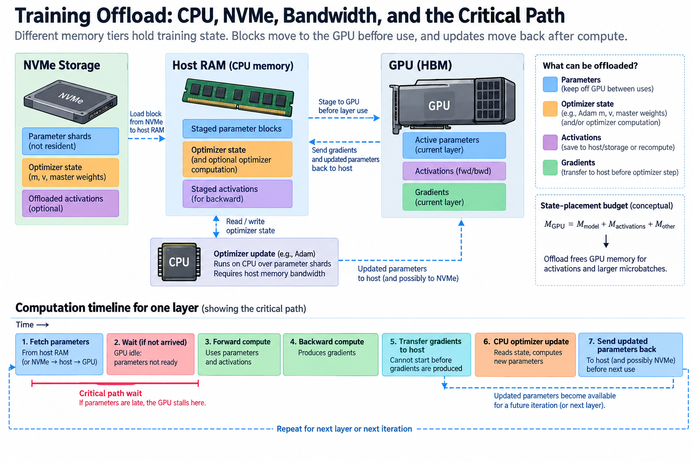
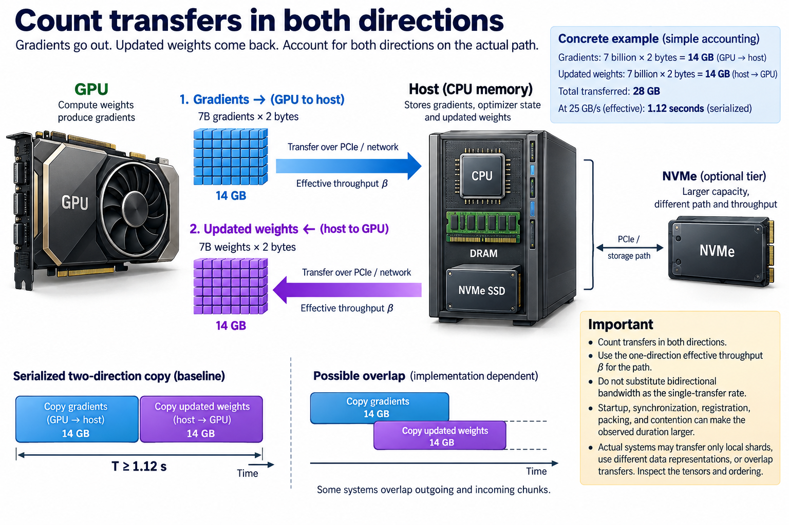

Training offload uses host memory or storage to retain state that would otherwise occupy GPU memory. It can make a large model trainable on a smaller accelerator set, or leave more device capacity for activations and microbatches. The memory saving is real, but the displaced bytes still have to be stored, transferred, and sometimes updated elsewhere.

The engineering problem is to place those operations on a dependency timeline. Gradients cannot be transferred before they are produced. Updated parameter values cannot return before the optimizer has computed them. A parameter shard needed for the next layer cannot arrive after that layer has already stalled waiting for it.

We will distinguish optimizer offload from parameter offload, derive transfer and CPU-bandwidth bounds, and work an illustrative mixed-precision Adam example. The numbers are explicit assumptions rather than measured hardware results. Replace them with effective bandwidth and state sizes from the actual machine before making a capacity or throughput decision.

## 1. Identify exactly what is being offloaded

*Overview of the article’s core mechanism. The following sections explain the objects, relationships, equations, assumptions, and worked examples shown here.*

Optimizer offload places selected optimizer state and possibly optimizer computation in host memory. For Adam, the first and second moments and any master-weight copy can be large. Keeping them off the GPU removes an important persistent-state contribution while allowing compute weights to remain available for forward and backward.

Parameter offload places some parameter values outside GPU memory between uses. The execution schedule must fetch the values required by an upcoming operation and release them when safe. Combining parameter sharding with offload can reduce device retention further, but adds materialization and transfer dependencies.

Activation offload is a different mechanism: saved tensors move to another memory tier and return when backward needs them. It trades host capacity and transfers against saved GPU activation memory. Activation recomputation instead recreates those values with extra arithmetic. Comparing the 2 requires knowing both transfer cost and replay cost.

NVMe offload adds a storage tier beyond host DRAM. It increases available capacity but introduces another service path, buffering requirement, and latency distribution. A storage device’s advertised sequential bandwidth is not automatically the throughput achieved by the application’s access sizes, concurrency, filesystem, and shared workload.

## 2. Derive a state-placement budget

Let P be logical parameter count, D the state-sharding degree, and o bytes of optimizer-related state per parameter. Ideal optimizer-state device retention falls by P o divided by D when that local shard moves fully to host memory. Host retention increases by the corresponding amount.

For an illustrative mixed-precision Adam configuration with 4-byte master weights and 2 separate 4-byte moments, o equals 12. A 7-billion-parameter model has 84 GB of this state before sharding. With D equal to 8 and balanced ownership, the local shard is about 10.5 GB per rank.

Those numbers are not a complete host-memory budget. Gradient buffers, parameter staging, pinned transfer buffers, application workers, page cache, runtime libraries, and checkpoint activity can coexist. Several ranks on one host share physical DRAM capacity, so multiplying per-rank shards and adding common services is necessary.

Likewise, the device still needs compute weights or the materialized working set, gradients according to the schedule, activations, and workspaces. Offloading one category does not eliminate the others. Count the largest concurrent allocation in both tiers rather than declaring capacity solved because persistent GPU state became smaller.

## 3. Count transfers in both directions

For a transfer of S bytes over a path with effective throughput beta, an optimistic service bound is

$$
T_{\mathrm{copy}}\ge\frac{S}{\beta}.
$$

Startup, synchronization, registration, packing, and contention can make the observed duration larger. The bound must use the relevant direction and path. Bidirectional headline bandwidth cannot be substituted as the one-direction rate of a single transfer.

Suppose 7 billion gradients use 2 bytes each and 7 billion updated compute weights also use 2 bytes each. Moving the gradients out and the weights back transfers 28 GB in total. At an assumed effective 25 GB/s, a serialized two-direction copy budget is at least 1.12 seconds.

A sharded implementation may transfer only local owned slices or use a different data representation. Some systems overlap outgoing and incoming chunks. The example is therefore a deliberately simple accounting baseline. Inspect the actual tensors and ordering to determine the byte volume and concurrency used by a particular offload method.

## 4. The CPU optimizer has a bandwidth bill

Moving optimizer computation to the CPU does not make it negligible. An Adam update reads gradients, master weights, first moments, and second moments, then writes updated master weights and moments. Each parameter update can create substantial DRAM traffic even before temporary conversions or additional implementation passes.

For the illustrative representation with 2-byte gradients and 4-byte master and moment values, an idealized single-pass read/write count is 26 bytes per parameter: 14 read and 12 written. For 7 billion parameters, that is 182 GB of DRAM traffic.

With an assumed effective optimizer memory bandwidth of 200 GB/s, the traffic alone gives a lower bound near 0.91 seconds. This is not a CPU Adam benchmark. Vectorization, arithmetic, cache behavior, thread placement, casts, and extra passes can all change observed time.

$$
T_{\mathrm{update}}\gtrsim\max\left(\frac{\mathrm{DRAM\ bytes}}{\beta_{\mathrm{DRAM}}},\frac{\mathrm{optimizer\ operations}}{P_{\mathrm{CPU}}}\right).
$$

The expression separates bandwidth and arithmetic limits. A nominally powerful CPU can still underperform if the optimizer reads remote NUMA memory or competes with input workers and several other ranks for the same channels.

## 5. Work the sequential critical path

In a simple optimizer-offload schedule, backward produces gradients, gradients transfer to the host, the CPU updates its state, and updated compute weights transfer back before the next forward pass. Using the illustrative bounds above, the extra serialized service is at least about 2.03 seconds.

That number should not be added blindly to every real training step. An implementation can stream gradient chunks, begin CPU updates on ready chunks, and overlap different stages. Conversely, conversion and coordination overhead can make the observed exposed interval larger than the component lower bounds.

For chunk j, define readiness r_j, outgoing transfer duration a_j, CPU update duration u_j, and incoming transfer duration b_j. With one serial worker per stage, completion depends on both the preceding stage and the previous chunk occupying that worker. The schedule is a staged pipeline, not a sum of independent operations free to start whenever convenient.

A useful steady-state bound for balanced chunks is the largest stage service time, plus pipeline fill and drain. The last updated chunk can remain exposed after backward ends. Measure chunk readiness and completion timestamps to identify which stage limits the pipeline and how much of the tail reaches the next forward pass.

## 6. Parameter offload moves the dependency into layers

When parameters are not retained on the GPU, each layer or sharding unit needs a fetch before compute. Prefetch can overlap the next unit’s transfer with the current unit’s arithmetic. Too little lookahead exposes transfer latency. Too much lookahead materializes several units and consumes the capacity offload was intended to save.

A local memory constraint can be written schematically as retained device state plus active and prefetched units plus activation and workspace peak. The exact storage can involve aliasing or buffer reuse, so measure lifetimes rather than summing duplicate representations automatically.

Access frequency matters. A parameter unit may be needed during forward, recomputation, and backward. Retaining it longer can reduce transfers at greater device-memory cost. Releasing it aggressively can increase host or storage traffic. The useful policy depends on when the unit will be used again and whether another tier can supply it in time.

Align offload units with compute and sharding boundaries initially. Then refine when traces show dominant stalls or wasted materialization. A policy based only on parameter size can miss expensive repeated accesses created by activation checkpointing or pipeline interleaving.

## 7. NVMe adds capacity and another pipeline stage

Storage-backed offload commonly stages data through host memory before the GPU can consume it. The path may include storage reads, host buffering, transfer preparation, and a device copy. Compatible direct-I/O mechanisms can alter this path, but support and behavior must be verified for the actual stack.

If a unit of S bytes must move through independent serial tiers, its unoverlapped service includes each tier’s startup and transfer duration. In steady state, pipelining can approach the slowest tier’s throughput, provided enough buffering and concurrency exist. It cannot exceed that tier simply because another link is faster.

Buffer count, request size, alignment, filesystem behavior, and competing checkpoint writes can change effective storage throughput. Random small requests and large sequential requests represent different workloads. Benchmark the access pattern produced by the offload scheduler rather than one unrelated disk test.

Storage latency variation also affects tails. A rare slow read can stall the next required layer even when average bandwidth appears sufficient. Record percentiles and complete-step variability, and evaluate whether prefetch headroom absorbs those delays under the supported workload.

## 8. NUMA locality and pinned buffers matter

Host memory belongs to a physical topology. A CPU optimizer running on one socket while its state resides on another can consume inter-socket bandwidth and experience higher latency. GPU transfers can likewise follow different paths depending on CPU affinity and memory placement.

Place host state, optimizer threads, and transfer buffers deliberately. Pinned memory can support efficient asynchronous copies, but pinned allocations consume host resources and should not be treated as unlimited. Several ranks sharing one root complex can contend even if each individual GPU copy benchmark looks healthy.

Input processing and checkpoint writing use the same host and storage resources. An offload benchmark run without those services can exaggerate production performance. Include the representative concurrent workload when evaluating the chosen configuration.

Correct synchronization also governs buffer reuse. A host or device staging buffer cannot be overwritten while a transfer or kernel still reads it. Events and completion signals establish ownership transitions. Avoid fixing lifetime bugs with indiscriminate global synchronization, because that can hide races while destroying the intended overlap schedule.

## 9. Compare feasibility and useful throughput honestly

Offload can be valuable even when fixed-work step time increases: it can make training possible on available resources. The honest comparison is between feasible configurations with documented device and host capacity, not against an unoffloaded instance that cannot execute.

Measure peak memory in every tier, exposed transfer time, CPU update time, complete optimizer-step time, and useful training tokens. Verify the optimizer update and numerical representations against a manageable reference. Precision changes or different loss weighting must be documented as changes to the training configuration.

Sweep chunk size, prefetch depth, thread placement, and buffer count in small controlled experiments. Too-small chunks pay startup and scheduling overhead; too-large chunks delay readiness and increase transient memory. The best setting balances the actual compute, transfer, and update stages.

Finally, test checkpoint and recovery behavior with the offloaded state. A training job that fits and runs steadily can still fail when saving gathers state or when restart recreates temporary buffers differently. Capacity planning should include supported operational paths, not only the middle of a successful iteration.

## Takeaway

Offload changes where training state lives and sometimes where updates execute. It replaces GPU retention with host or storage capacity, transfer service, and new scheduling dependencies. Streaming can hide some work, but the final required state still has a critical path.

Count the bytes in every tier, measure effective throughput under contention, and connect each chunk to its producer and consumer. Evaluate offload as a complete feasible training design rather than a free memory-reduction switch.

## Sources

- [DeepSpeed ZeRO-Offload tutorial](https://www.deepspeed.ai/tutorials/zero-offload/): optimizer offload and CPU update implementation.
- [Ren et al., ZeRO-Offload](https://arxiv.org/abs/2101.06840): heterogeneous training-state placement and computation.
- [Rajbhandari et al., ZeRO-Infinity](https://arxiv.org/abs/2104.07857): memory hierarchy and storage-backed training.
- [PyTorch CUDA notes](https://docs.pytorch.org/docs/stable/notes/cuda.html): asynchronous copies, pinned memory, and stream synchronization.
