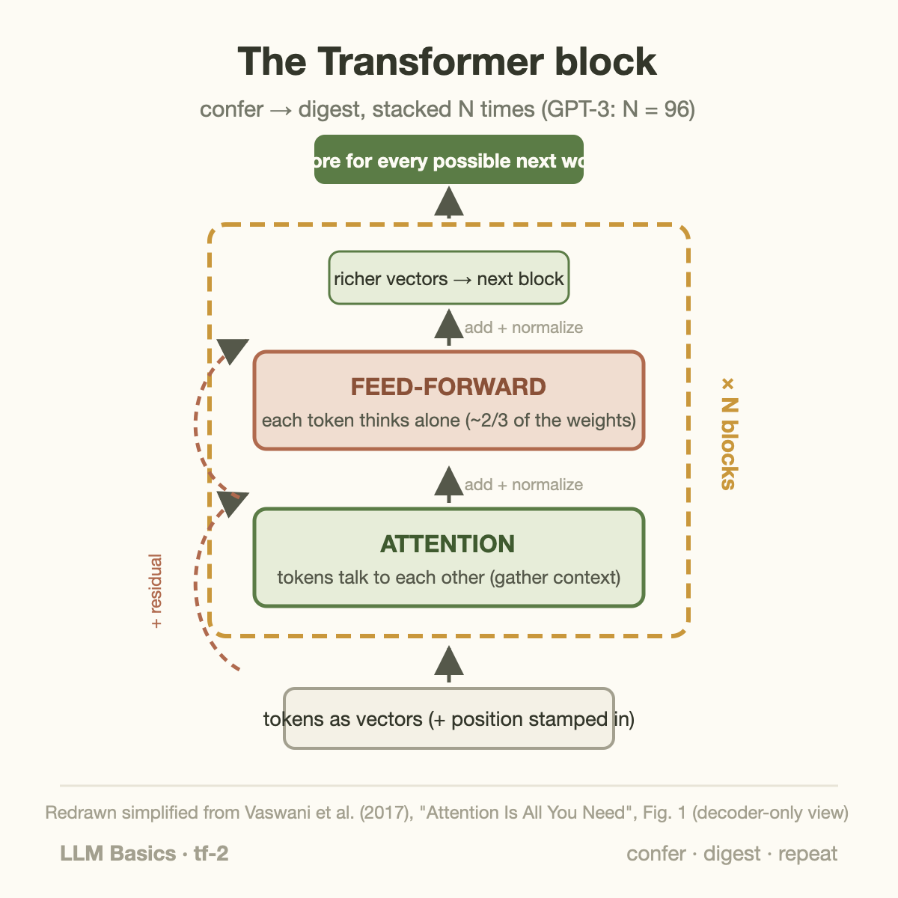
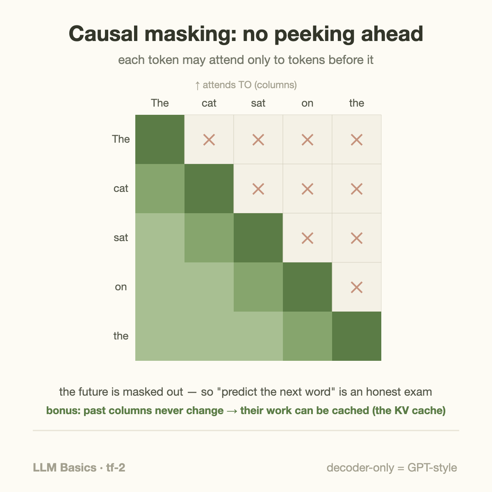

GPT-3 is 96 copies of the same block, stacked. Llama, Claude, Gemini, DeepSeek — different sizes, same block. Learn one diagram and you've read the blueprint of essentially every modern language model.

[Last article](/blog/attention-in-plain-words/) explained attention, the star mechanism. This one assembles the full machine around it — and explains *why* each supporting part exists, because every part earns its place.

## The block

A Transformer is: turn words into number-vectors, push them through **N identical blocks**, and read a prediction off the end. Each block does just two operations, in order:

**1. Attention — the tokens talk to each other.** Every token gathers relevant context from every other token, as covered last time. After this step, *it* knows it means "the animal."

**2. Feed-forward — each token thinks alone.** A small two-layer network (the plain [multiply-add-squash kind](/blog/what-is-a-neural-network/)) processes each token *individually*, no cross-talk. If attention is the meeting, feed-forward is everyone going back to their desk to digest what they heard. Unglamorous, but it holds roughly two-thirds of the model's weights — much of an LLM's "knowledge" is widely believed to live here.

That alternation — gather context, process it, gather again with sharper questions, process again — repeated dozens of times, is the entire computational story. Early blocks resolve grammar and reference; later blocks handle increasingly abstract relationships. Votes about votes, one more time.

## The supporting cast (each solves a real failure)

Three more components appear in the diagram, and none is decoration:

- **Positional information.** Attention treats input as an unordered set — "dog bites man" and "man bites dog" would look identical. Fix: stamp each token's position into its vector before the blocks. (How you stamp it matters for long documents; modern models use rotary variants — a later series covers this.)
- **Residual connections.** Every block's output is *added to* its input rather than replacing it — each block writes edits onto a running document instead of rewriting from scratch. This is ResNet's skip-connection trick, and it's what lets gradients flow through 96 blocks without [vanishing](/blog/rnn-lstm-and-the-wall/). Without residuals, deep Transformers simply don't train.
- **Normalization.** Keeps each layer's numbers in a healthy range so training stays stable across dozens of blocks. Bookkeeping, but load-bearing bookkeeping.

## Walking one token through the stack

Let's trace the sentence "The keys to the cabinet ___" through a decoder-only model predicting the blank, to make the machinery concrete:

1. **Tokens become vectors.** Each word (really, each token — [a later article](/blog/what-is-a-neural-network/) covers tokenization) is looked up in a learned table, yielding, say, a 12,288-number vector (GPT-3's width). Position stamps go in.
2. **Block 1, attention:** *keys* gathers that it's a plural noun heading the subject; *cabinet* gathers that it sits inside a prepositional phrase. Shallow grammar resolves first.
3. **Block 1, feed-forward:** each token digests its gathered context alone — reweighting its own features in light of what it just learned.
4. **Blocks 2–95:** the alternation repeats, each round working with richer inputs. Somewhere in the middle blocks, the representation above *cabinet* has effectively encoded "the grammatical subject is *keys*, plural, despite the singular noun nearby" — the classic agreement trap.
5. **The final vector above the blank** is multiplied against the token table one last time, scoring every word in the vocabulary. *are* outscores *is*, and — a detail that surprises people — this final scoring layer is often the *same matrix* that embedded the tokens at step 1, used in reverse.

Two structural facts fall out of this walk. First, **width × depth is the whole size story**: GPT-3 is 96 blocks of width 12,288, and that's where the 175B weights live. Second, every one of those steps is matrix multiplication — which is why [the entire AI hardware industry](/blog/blackwell-to-rubin-memory-math/) is an arms race in exactly one operation.

## Where the compute goes (a preview of the economics)

A rough but honest accounting for a GPT-3-class block: the feed-forward layer holds ~two-thirds of the weights and, at short sequence lengths, ~two-thirds of the compute. Attention's weight share is smaller, but its cost **grows with the square of sequence length** while feed-forward grows linearly — so at long contexts, attention takes over the bill. That crossover explains a decade of engineering you'll meet in the other series: FlashAttention restructures the computation to dodge memory traffic, [DeepSeek's sparse attention](/blog/blackwell-to-rubin-memory-math/) prunes the all-pairs comparison, and the KV cache trades memory for recomputation. The architecture you're looking at *is* the cost model of modern AI.

## Common misconceptions

**"The Transformer was designed for chatbots."** It was built in 2017 for machine translation. The chatbot era required two additional bets that weren't obvious: that next-word prediction alone teaches broad competence (GPT-1's 2018 gamble), and that scale keeps paying ([the scaling laws](/blog/how-models-learn/)). The architecture enabled both; it anticipated neither.

**"Deeper blocks understand 'more abstract' things, like a neat hierarchy."** Directionally true, but real interpretability findings are messier: features smear across layers, some circuits span many blocks, and some late blocks do surprisingly mundane cleanup. Treat "early = syntax, late = semantics" as a useful cartoon, not a map.

**"N blocks means N different designs."** Every block is architecturally identical — same shapes, different learned weights. That uniformity is a *hardware feature*: one optimized kernel pipeline, run 96 times. Irregular architectures pay real performance taxes, which is one more reason regular ones keep winning.

## One blueprint, two famous variants

The 2017 original had two towers (an encoder reading the source sentence, a decoder writing the translation). The field then split it:

- **Encoder-only** (BERT-style): every token attends in both directions; great for *understanding* tasks like search and classification.
- **Decoder-only** (GPT-style): each token may only attend to tokens *before* it — because the training game is "predict the next word," and peeking ahead would be cheating. This is the variant that ate the world; when people say "LLM" today they almost always mean a decoder-only Transformer.

That "only look backward" rule, called causal masking, has a huge practical consequence: past tokens' computations can be cached and reused while generating — the KV cache that dominates the serving economics covered in [the performance series](/blog/goodput-vs-utilization/).

## What's changed since 2017 (and what hasn't)

If the blueprint is eight years old, is the picture above out of date? Remarkably little. Modern models (Llama-class, DeepSeek-class) still run the same confer-digest stack; the deltas are refinements you can now name in one line each:

- **Positions**: fixed sine-wave stamps gave way to *rotary embeddings* (RoPE), which encode relative distance and extrapolate better to long contexts
- **Normalization**: moved *before* each sub-layer (pre-norm) and simplified (RMSNorm) — deep stacks train more stably
- **Feed-forward**: gated variants (SwiGLU) squeeze more capability per weight
- **Attention**: grouped-query and latent variants (GQA, [DeepSeek's MLA](/blog/blackwell-to-rubin-memory-math/)) shrink the KV cache that serving pays for
- **The biggest fork — Mixture of Experts**: replace each block's feed-forward with many parallel "experts" and route each token to a couple of them. A 1T-parameter MoE might activate only ~32B weights per token — capability of the full library, compute bill of a branch visit

Every one of these is an *efficiency* edit — same blueprint, lower cost per unit of capability. That's worth noticing: post-2017 architecture research has largely been performance engineering wearing a research hat, which is exactly why this blog runs [a whole series on the co-design between models and silicon](/blog/blackwell-to-rubin-memory-math/).

## Takeaway

- The Transformer is one block — attention (tokens confer) + feed-forward (tokens digest), with residuals and normalization — stacked N times. GPT-3 is 96 of them.
- Every support part fixes a specific failure: positions restore word order, residuals let 96-deep gradients survive, normalization keeps training stable.
- Modern LLMs are decoder-only Transformers: attend-backward-only, which enables next-word training — and the KV caching that defines inference economics.

## Sources

- Vaswani et al. (2017). ["Attention Is All You Need"](https://arxiv.org/abs/1706.03762) (the block figure is redrawn simplified from Figure 1)
- He et al. (2015). ["Deep Residual Learning"](https://arxiv.org/abs/1512.03385) (residual connections)
- Alammar — ["The Illustrated GPT-2"](https://jalammar.github.io/illustrated-gpt2/) (decoder-only walkthrough)

---

*Part of the **Fundamental of LLM** series. Previous: [Attention in plain words](/blog/attention-in-plain-words/). Next: why Transformers won — the parallelism story.*
