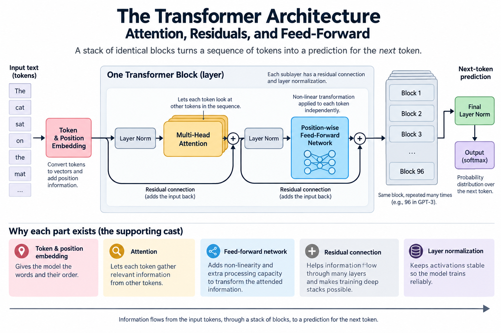
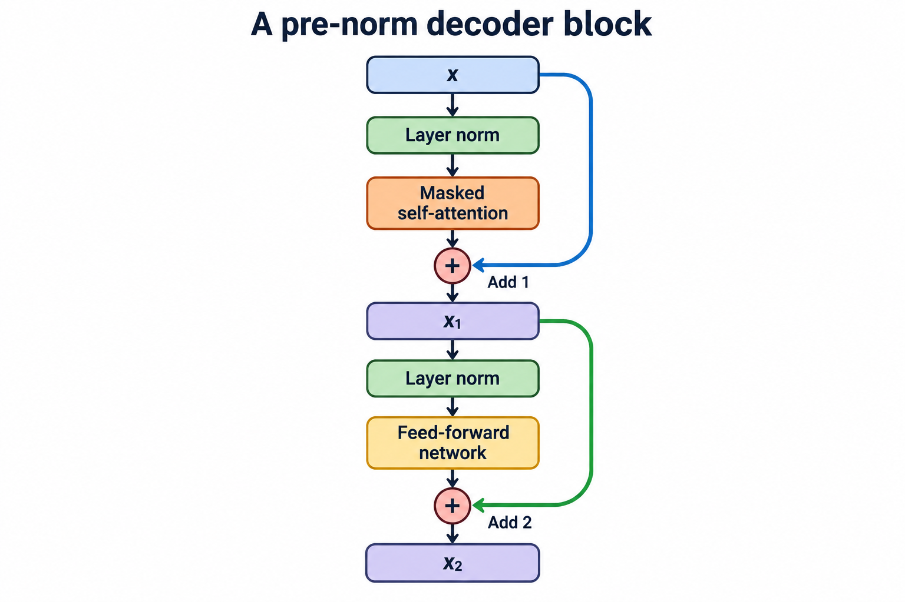
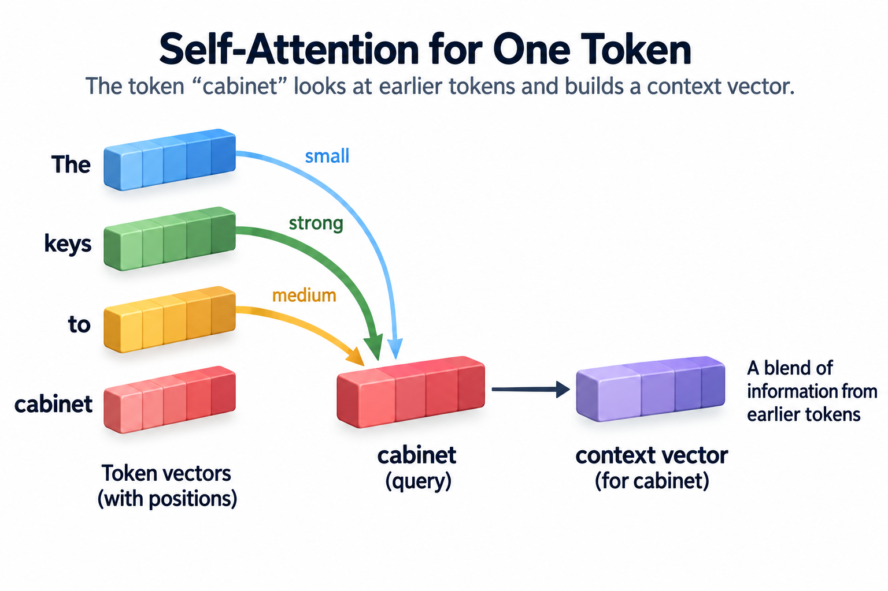
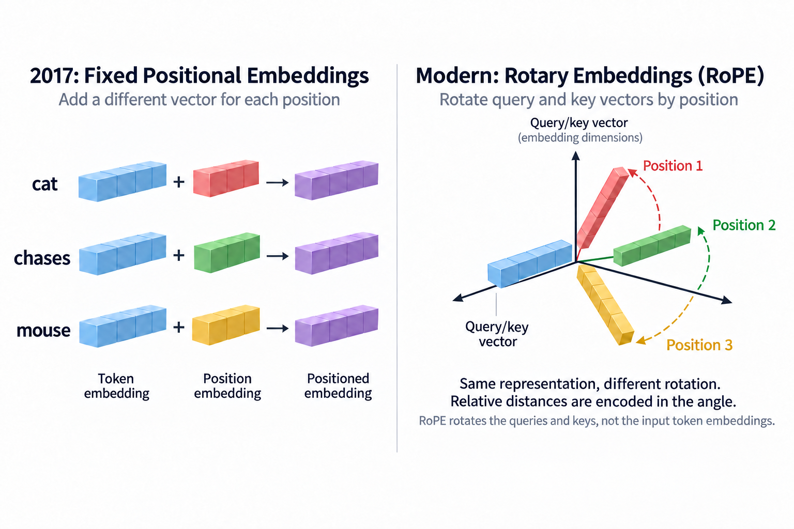
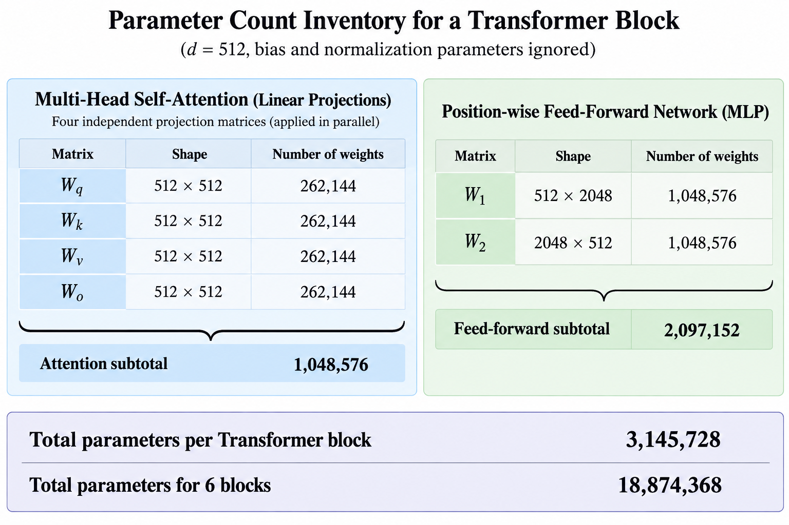

## Overview

GPT-3 is 96 copies of the same block, stacked. Many models build on related components, while sparse and hybrid designs can differ substantially. For models with undisclosed internals, their exact block design is unknown.

[Last article](/blog/attention-in-plain-words/) explained attention, the star mechanism. This 1 assembles the full machine around it, and explains *why* each supporting part exists, because every part earns its place.

## Deep dive

### The block

The equation diagram below illustrates a modern pre-normalized dense block. The original 2017 Transformer placed normalization after each residual addition. This figure deliberately shows the pre-norm variant. Follow each skip path to see which representation is added back, and follow the operator path to see why its output must return to residual width d.

In this simplified dense decoder, tokens become vectors, pass through **N related blocks**, and produce next-token scores. Its 2 main sublayers are:

**1. Attention: the tokens talk to each other.** Each position gathers allowed context under the attention mask, as covered last time. After this step, *it* knows it means "the animal."

**2. Feed-forward: each token thinks alone.** A small 2-layer network (the plain [multiply-add-squash kind](/blog/what-is-a-neural-network/)) processes each token *individually*, no cross-talk. If attention is the meeting, feed-forward is everyone going back to their desk to digest what they heard. Unglamorous, but it holds roughly 2-thirds of the model's weights, and much of an LLM's "knowledge" is widely believed to live here.

That alternation (gather context, process it, gather again with sharper questions, process again), repeated dozens of times, describes the main sublayers of this baseline. The grammar-to-meaning progression is an illustrative analogy, not an established layer-by-layer interpretability map.

### The supporting cast (each solves a real failure)

3 more components appear in the diagram, and none is decoration:

- **Positional information.** Attention treats input as an unordered set, so "dog bites man" and "man bites dog" would look identical. Fix: stamp each token's position into its vector before the blocks. (How you stamp it matters for long documents. Modern models use rotary variants, and a later series covers this.)
- **Residual connections.** Every block's output is *added to* its input rather than replacing it. Each block writes edits onto a running document instead of rewriting from scratch. This is ResNet's skip-connection trick, and it's what lets gradients flow through 96 blocks without [vanishing](/blog/rnn-lstm-and-the-wall/). Residual paths are important to the trainability of common deep Transformer designs.
- **Normalization.** Keeps each layer's numbers in a healthy range so training stays stable across dozens of blocks. Bookkeeping, but load-bearing bookkeeping.

### Walking 1 token through the stack

Let's trace the sentence "The keys to the cabinet ___" through a decoder-only model predicting the blank, to make the machinery concrete:

1. **Tokens become vectors.** Each word (really, each token, since [a later article](/blog/what-is-a-neural-network/) covers tokenization) is looked up in a learned table, yielding, say, a 12,288-number vector (GPT-3's width). Position stamps go in.
2. **Block 1, attention:** *keys* gathers that it's a plural noun heading the subject; *cabinet* gathers that it sits inside a prepositional phrase. This is an illustrative interpretation, not a measured trace of those layers.
3. **Block 1, feed-forward:** each token digests its gathered context alone, reweighting its own features in light of what it just learned.
4. **Blocks 2–95:** the alternation repeats, each round working with richer inputs. Somewhere in the middle blocks, the representation above *cabinet* has effectively encoded "the grammatical subject is *keys*, plural, despite the singular noun nearby", the classic agreement trap.
5. **The final vector at the last observed position** is multiplied against the token table 1 last time, scoring every word in the vocabulary. *are* outscores *is*. Then, a detail that surprises people, this final scoring layer is often the *same matrix* that embedded the tokens at step 1, used in reverse.

2 structural facts fall out of this walk. First, **width and depth dominate a simplified dense-stack estimate**: GPT-3 is 96 blocks of width 12,288, and that's where the 175B weights live. Second, the largest arithmetic terms in many of those steps are matrix multiplications. That is why [the entire AI hardware industry](/blog/blackwell-to-rubin-memory-math/) is an arms race in exactly 1 operation.

### Where the compute goes (a preview of the economics)

A rough but honest accounting for a GPT-3-class block: the feed-forward layer holds ~2-thirds of the weights and, at short sequence lengths, ~2-thirds of the compute. Attention's weight share is smaller, but its cost **grows with the square of sequence length** while feed-forward grows linearly. At long contexts, attention takes over the bill. That crossover explains a decade of engineering you'll meet in the other series: FlashAttention restructures the computation to dodge memory traffic, [DeepSeek's sparse attention](/blog/blackwell-to-rubin-memory-math/) prunes the all-pairs comparison, and the KV cache trades memory for recomputation. The architecture you're looking at *is* the cost model of modern AI.

### Common misconceptions

**"The Transformer was designed for chatbots."** It was built in 2017 for machine translation. The chatbot era required 2 additional bets that weren't obvious: that next-word prediction alone teaches broad competence (GPT-1's 2018 gamble), and that scale keeps paying ([the scaling laws](/blog/how-models-learn/)). The architecture enabled both; it anticipated neither.

**"Deeper blocks understand 'more abstract' things, like a neat hierarchy."** Directionally true, but real interpretability findings are messier: features smear across layers, some circuits span many blocks, and some late blocks do surprisingly mundane cleanup. Treat "early = syntax, late = semantics" as a useful cartoon, not a map.

**"N blocks means N different designs."** Blocks in this baseline share shapes with different learned weights. Modern sparse or hybrid models can alternate different block types. That uniformity is a *hardware feature*: 1 optimized kernel pipeline, run 96 times. Irregular architectures pay real performance taxes, which is 1 more reason regular ones keep winning.

### 1 blueprint, 2 famous variants

The 2017 original had 2 towers (an encoder reading the source sentence, a decoder writing the translation). The field then split it:

- **Encoder-only** (BERT-style): every token attends in both directions; great for *understanding* tasks like search and classification.
- **Decoder-only** (GPT-style): each token may attend to itself and earlier tokens, because the training game is "predict the next word," and peeking ahead would be cheating. This is the variant that ate the world. When people say "LLM" today they almost always mean a decoder-only Transformer.

That "attend to self and earlier positions" rule, called causal masking, has a huge practical consequence. Past tokens' computations can be cached and reused while generating, which is the KV cache that dominates the serving economics covered in [the performance series](/blog/goodput-vs-utilization/).

### What's changed since 2017 (and what hasn't)

The original blueprint dates to 2017, 9 years before this revision. Many dense models retain related sublayers, while sparse and hybrid systems can change the execution substantially. Several common changes can be named:

- **Positions**: fixed sine-wave stamps gave way to *rotary embeddings* (RoPE), which encode relative distance and extrapolate better to long contexts
- **Normalization**: moved *before* each sub-layer (pre-norm) and simplified (RMSNorm), so deep stacks train more stably
- **Feed-forward**: gated variants (SwiGLU) squeeze more capability per weight
- **Attention**: grouped-query and latent variants (GQA, [DeepSeek's MLA](/blog/blackwell-to-rubin-memory-math/)) shrink the KV cache that serving pays for
- **The biggest fork, Mixture of Experts**: replace each block's feed-forward with many parallel "experts" and route each token to a couple of them. A 1T-parameter MoE might activate only ~32B weights per token: capability of the full library, compute bill of a branch visit

Every one of these is an *efficiency* edit: same blueprint, lower cost per unit of capability. That's worth noticing. Post-2017 architecture research has largely been performance engineering wearing a research hat, which is exactly why this blog runs [a whole series on the co-design between models and silicon](/blog/blackwell-to-rubin-memory-math/).

### Count a simplified dense block

Let the residual width be d. In a standard full multi-head attention block, the query, key, value, and output projections each contribute approximately $$d^2$$ weights. Ignoring biases, their total is approximately $$4d^2$$. A 2-matrix feed-forward layer expanding to width 4 d and projecting back contributes approximately $$8d^2$$. This yields the familiar rough total of $$12d^2$$ per dense block.

With d equal to 512, that estimate is 3,145,728 weights per block before biases and normalization parameters. 6 such blocks contribute about 18.9 million weights. Embeddings and output projections add their own terms, and tied input/output embeddings change that accounting. Gated feed-forward layers, grouped-query attention, and sparse experts require different formulas.

This approximation explains why “two-thirds of weights in feed-forward” can be sensible for a specific conventional design, but it is not a universal architectural law, and a released model configuration provides widths, layer counts, head counts, expert settings, and vocabulary size: use those facts rather than transferring the ratio to every model carrying the Transformer label.

### Write the simplified parameter budget

For the conventional dense block just counted, a stack with $$L$$ layers, width $$d$$, vocabulary size $$V$$, and tied input/output embeddings has approximate parameter count

$$
P\approx12Ld^2+Vd.
$$

With 6 layers, width 512, and vocabulary 32,000, this gives 18,874,368 block weights plus 16,384,000 embedding weights, totaling 35,258,368. Untying the output table adds another 16,384,000. Biases and normalization are omitted.

The baseline design makes the width-squared cost visible: doubling width roughly quadruples block parameters, while doubling depth doubles them. Modern grouped-query, gated, sparse, and hybrid blocks change the coefficients or the entire accounting. Use configuration and implementation details to replace this illustrative budget, rather than treating it as a formula for every model named Transformer.

### Follow the prediction position precisely

For the prefix “The keys to the cabinet,” the final hidden vector at the last observed token predicts the distribution of the next token. There is not necessarily an extra blank-token representation. After selecting a token such as “are,” the model appends it and computes the next distribution.

Self-attention at a position normally includes that position and earlier positions, while excluding later ones. Training aligns each position's output with the next-token target. A 1-position shift error can leak the answer or train a different objective. The indexing convention therefore belongs in any runnable example.

The final vocabulary projection converts a hidden vector into logits, softmax then defines a probability distribution, some models tie the projection to input embeddings while others do not, and the selected output may come from greedy decoding, temperature sampling, or another policy. Those choices affect generated text without changing the learned block parameters.

### The diagram is a family reference, not every current model

The original encoder-decoder Transformer has decoder cross-attention to encoder outputs as well as causal self-attention. A decoder-only diagram omits that cross-attention. Modern architectures may additionally use local attention, sparse experts, recurrent state, different normalization, or shared state across layers.

RoPE injects positional information through rotations of query/key vectors rather than simply adding a position stamp to the input. It provides useful relative-position structure, but reliable context extension still depends on training and scaling choices. Residual connections help gradient flow. They do not make depth arbitrarily easy to optimize.

These distinctions motivate the Modern LLM Architectures series. Read the basic block as a vocabulary for comparing actual configurations. For any named current model, identify which parts of the diagram are disclosed, which have changed, and which details are unknown. Shared ancestry is not evidence of an identical backbone.

## Conclusion

- The Transformer is 1 block, attention (tokens confer) plus feed-forward (tokens digest), with residuals and normalization, stacked N times. GPT-3 is 96 of them.
- Every support part fixes a specific failure: positions restore word order, residuals let 96-deep gradients survive, normalization keeps training stable.
- Many LLMs use causal decoder-style Transformers: attend to self and earlier positions, which enables next-word training and the KV caching that defines inference economics.

Configuration files provide a useful bridge between this diagram and a real checkpoint. Read the layer count, hidden width, attention head counts, intermediate width, vocabulary size, and positional settings before estimating memory. Then verify the implementation for details that a configuration may not express, such as normalization placement or attention masks. 2 models described as transformers can differ materially in these choices. Treat the basic block as a reading guide: identify what corresponds to each component, then write down deviations explicitly. This habit prevents a familiar diagram from hiding the details that determine a particular model’s behavior.

### Sources

- Vaswani et al. (2017). ["Attention Is All You Need"](https://arxiv.org/abs/1706.03762) (the block figure is redrawn simplified from Figure 1)
- He et al. (2015). ["Deep Residual Learning"](https://arxiv.org/abs/1512.03385) (residual connections)
- Alammar. ["The Illustrated GPT-2"](https://jalammar.github.io/illustrated-gpt2/) (decoder-only walkthrough)

---

*Part of the [LLM Foundations & Mathematics](/series/llm-basics/) learning path. Browse its published articles by topic.*

- [Xiong et al., On Layer Normalization in the Transformer Architecture](https://arxiv.org/abs/2002.04745): pre-norm versus post-norm placement.
