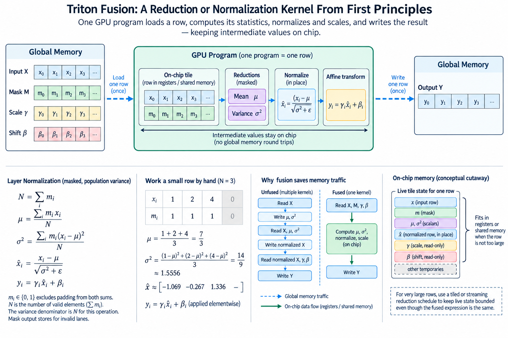
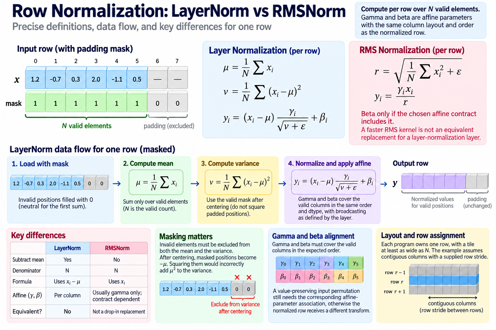

Fusion is valuable when it keeps useful intermediate state close to computation instead of writing it to memory and reading it back. Row normalization is a good example: mean, variance, normalization, and an affine transform all depend on the same input row. A kernel can load that row, calculate its statistics, and produce the output while retaining values on chip.

The challenge is that reductions introduce a population and numerical contract. Masks must exclude padding from both statistics. Accumulators need suitable precision. A larger row increases live state and can force a different schedule even when the source expression remains compact.

We will derive a fused layer-normalization path, work its masked statistics, and compare a stable mergeable reduction. The code is illustrative and assumes the stated layout. Numerical examples are calculations rather than hardware measurements.

## 1. State the normalization precisely



*Overview of the article’s core mechanism. The following sections explain the objects, relationships, equations, assumptions, and worked examples shown here.*


For one row with N valid elements, layer normalization uses

$$
\mu=\frac1N\sum_ix_i,\qquad v=\frac1N\sum_i(x_i-\mu)^2,\qquad y_i=(x_i-\mu)\frac{\gamma_i}{\sqrt{v+\epsilon}}+\beta_i.
$$

The variance denominator is N for this operation, not the N minus 1 used by some statistical estimators. Gamma and beta are affine parameters, and epsilon is part of the numerical definition. Preserve their layout, dtype, and broadcasting contract.

RMS normalization is a different operation: it uses the root mean square without subtracting the row mean, commonly with its own affine convention. A faster RMS kernel is not automatically an equivalent replacement for a layer-normalization layer.

Gamma and beta must cover the valid columns in the expected order. A value-preserving input permutation still needs the corresponding affine-parameter association, otherwise the normalized row receives a different transform.

Define supported row widths and layout. The example assumes contiguous columns with a supplied row stride. A transposed or column-strided view needs different addressing or an explicit conversion whose cost belongs in the comparison.




## 2. Assign one program a row

A simple Triton design gives program r ownership of row r and constructs a compile-time tile at least as wide as N. Logical columns are a range from 0 to BLOCK minus 1, with a mask for columns below N.

The program loads valid input values and fills invalid tile positions with a neutral value for the first sum. It then reduces across the logical tile while dividing by the valid count N. Each valid output position has one writer in the row program.

This design exposes row-level parallelism. Many rows can provide many programs, while one very wide row may require a different partition. The best mapping depends on row count, width, hardware, and compiled resource use.

Do not equate BLOCK with a CUDA thread count. The compiler maps logical tile values through supported layouts and execution resources. Increasing BLOCK can increase live values per execution unit even if launch parameters remain unchanged.

## 3. Mask variance after centering

Replacing invalid input loads with zero makes them neutral for summation. After subtracting the mean, however, those positions become negative mu. Squaring them would incorrectly add mu squared to the variance.

The centered tile therefore needs its own validity rule:

$$
z_i=\begin{cases}x_i-\mu,&i<N,\\0,&i\ge N,\end{cases}\qquad v=\frac1N\sum_i z_i^2.
$$

For an illustrative row of 3 valid ones in a 4-position tile, the correct mean is 1 and variance is 0. If the padded zero is centered without masking, it contributes 1 to the squared sum and produces an incorrect variance of 1/3.

This example isolates a common error: correct load bounds do not establish correct reduction statistics. The neutral value must remain appropriate through every transformation, and the denominator must describe the valid population.

## 4. Express the fused forward path

A simplified illustrative body uses

```python
cols = tl.arange(0, BLOCK)
valid = cols < N
x = tl.load(X + row * stride_x + cols, mask=valid, other=0).to(tl.float32)
mean = tl.sum(x, axis=0) / N
centered = tl.where(valid, x - mean, 0.0)
variance = tl.sum(centered * centered, axis=0) / N
scale = tl.rsqrt(variance + epsilon)
gamma = tl.load(Gamma + cols, mask=valid, other=1.0)
beta = tl.load(Beta + cols, mask=valid, other=0.0)
y = centered * scale * gamma + beta
tl.store(Y + row * stride_y + cols, y, mask=valid)
```

A complete wrapper supplies a supported nonempty width, device pointers, row ownership, launch configuration, and lifetime dependencies. BLOCK is a supported compile-time tile shape. The snippet omits those surrounding interfaces to focus on the statistics and fusion.

Input conversion to FP32 illustrates an accumulator choice, not a universal precision guarantee. Output conversion and affine arithmetic follow the required dtype contract. Verify behavior against a suitable reference for every supported representation.

## 5. Work a small row by hand

For x equal to 1, 2, 3, 4, the mean is 2.5. Squared centered values sum to 5, giving variance 1.25. With gamma 1, beta 0, and epsilon 0 for this positive-variance illustration, the normalized values are approximately negative 1.34164, negative 0.44721, positive 0.44721, and positive 1.34164.

Real implementations use the specified epsilon, especially for constant or near-constant rows. Do not replace it during a performance comparison. Epsilon can affect the output when variance is small, and moving it outside the square root defines a different operation.

Lower-precision input can lose distinctions before the reduction starts. Accumulating in FP32 cannot reconstruct information already rounded out of the stored values. A higher-precision reference should therefore clarify whether it compares the same quantized inputs or an earlier ideal input population. These are different numerical questions. Preserve the input representation and output conversion in the test record, especially for large common offsets and small variance.

Use this row and constant rows as deterministic checks. Add nonuniform affine parameters so tests reveal incorrect gamma or beta association. Uniform parameters can hide a column-ordering bug.

Test widths smaller than and not equal to the tile size. A width exactly matching BLOCK never exercises the centered-padding rule. Include output-stride cases if the interface claims they are supported.

## 6. Compare reduction methods and numerical conditioning

Computing variance as mean of squares minus square of mean can be concise, but large common offsets can cause cancellation in finite precision. Centered accumulation or a suitable stable reduction can behave differently. The numerical method is part of the implementation contract.

Welford-style statistics provide a mergeable state: count n, mean mu, and centered squared sum M2. For two groups A and B, let delta be mu_B minus mu_A and n their combined count. The merge is

$$
\mu=\mu_A+\delta\frac{n_B}{n},\qquad M_2=M_{2,A}+M_{2,B}+\delta^2\frac{n_An_B}{n},\qquad v=M_2/n.
$$

The formula connects partial reductions without subtracting two large nearly equal global quantities. Finite-precision ordering still matters, so it does not promise bitwise equality across schedules.

For groups 1, 2 and 3, 4, means are 1.5 and 3.5, each M2 is 0.5, and counts are 2. The merge gives M2 equal to 5 and variance 1.25, matching the full-row calculation.

## 7. Derive the traffic benefit of retaining values

A staged implementation can read input for mean, reread it for variance, and read it again for normalization, depending on how intermediates are organized. A fused row path can retain values and reduce those input rereads.

A simplified input-output budget for one fused row is

$$
D_{\mathrm{fused}}\approx N(b_x+b_y),
$$

before affine-parameter reads, statistics, and other overhead. For 2-byte input and output, that is 4N logical bytes. Gamma and beta can add traffic, with cache reuse across rows affecting physical movement.

This is not a claim that every unfused library performs exactly 3 reads or that every fused kernel reaches the minimum. Compiler choices, cache behavior, spills, and saved statistics change actual traffic. Inspect the executed path and memory level.

Fusion can also reduce launches and intermediate allocation. Measure those exposed costs separately from device bandwidth. A small row can be startup-sensitive, while a large memory-resident population can emphasize sustained movement.

## 8. Budget live tile state and large-row alternatives

The fused path retains input or centered values and several temporary expressions while calculating statistics and output. Tile width, compiler liveness, and layout determine register pressure. A larger tile can reduce parallelism or spill values to memory.

Source-level arrays are not a precise register count. Inspect compiled resource use and profiler evidence when pressure is a hypothesis. The apparent reduction in logical input reads can be offset by spilled intermediate traffic.

A very wide row can be partitioned into chunks with partial statistics, followed by a merge and output pass. That adds scratch state and dependencies but can provide more parallelism or fit on-chip limits. The stable merge formula supplies the mathematical connection.

Choose between one-program and multi-stage designs using row count, width distribution, memory, and timing. There is no universal maximum row width at which fusion remains optimal across versions and hardware.

## 9. Training adds saved-state and backward requirements

Inference forward performance does not establish training performance. Backward needs the information required by the derivative, which can include input, normalization statistics, and affine parameters under the selected implementation.

Saving statistics can reduce recomputation, while checkpointing or fusion can alter the lifetime of saved tensors. Their memory and execution costs belong in the training comparison. A forward-only microbenchmark excludes those effects.

Validate gradients with a suitable reference on representative small cases and the supported dtype policy. A correct forward result does not prove that a custom backward preserves the derivative or accumulation semantics.

Keep the distinction between layer normalization and RMS normalization in gradient comparisons too. They have different dependencies, so one derivative cannot be substituted for the other based on similar-looking forward expressions.

## 9-1. Derive the row input gradient

Let q be the normalized row, r the reciprocal square root of variance plus epsilon, and g_i the upstream output gradient multiplied by gamma_i. The input derivative can be expressed as

$$
\frac{\partial L}{\partial x_i}=\frac rN\left(Ng_i-\sum_jg_j-q_i\sum_jg_jq_j\right).
$$

The first correction accounts for the dependency through the row mean. The second accounts for the variance dependency. A backward kernel therefore needs reductions of g and of g times q, not merely an elementwise multiplication by the forward scale. This is why a fused forward body is insufficient to establish a training implementation.

Affine-parameter gradients aggregate contributions across rows. Their ownership requires a supported reduction or combining mechanism; every row program cannot write an ordinary update to the same parameter location unsafely. A multi-stage partial reduction can preserve ownership while adding scratch state and another execution boundary.

As a small check, if every g value in a row is the same, the input derivative is zero under the exact centered-row calculation. The sum of normalized values is zero, and the mean correction cancels the constant input direction. This invariant provides useful evidence alongside reference gradient comparisons, although finite precision can introduce small residuals.

## 10. Measure the actual fusion tradeoff

Compare the same shape population, dtype, epsilon, affine semantics, and output contract. Record compilation, launches, kernel time, physical traffic, resource use, and any saved-state memory. Keep warmup and cold behavior distinct.

Sweep row counts and widths, including partial tiles and large rows. A candidate can win on many narrow rows and lose on a few wide ones because available parallelism and register pressure differ. Weight the application distribution rather than one convenient maximum-throughput case.

A useful diagnostic report can show that input traffic decreased while register spills increased, or that launch overhead fell while device execution stayed similar. Those observations explain the mechanism and guide the next change. A single overall speedup does not reveal why the design works or where it stops working.

Preserve deterministic statistic tests, layout tests, and the intended ownership path. Repeated buffer reuse and surrounding stream dependencies remain part of correctness even when the reduction itself is mathematically valid.

Fused normalization is a reuse algorithm with a statistical population and numerical contract. Valid masks define the population, stable reductions define the statistics, and on-chip lifetime defines the traffic opportunity. Optimize the schedule only after those meanings are preserved, then measure whether retained state fits the hardware balance.

## Sources

- [Triton layer-normalization tutorial](https://triton-lang.org/main/getting-started/tutorials/05-layer-norm.html).
- [Triton language reduction API](https://triton-lang.org/main/python-api/triton.language.html).
- [PyTorch layer normalization](https://docs.pytorch.org/docs/stable/generated/torch.nn.LayerNorm.html).
