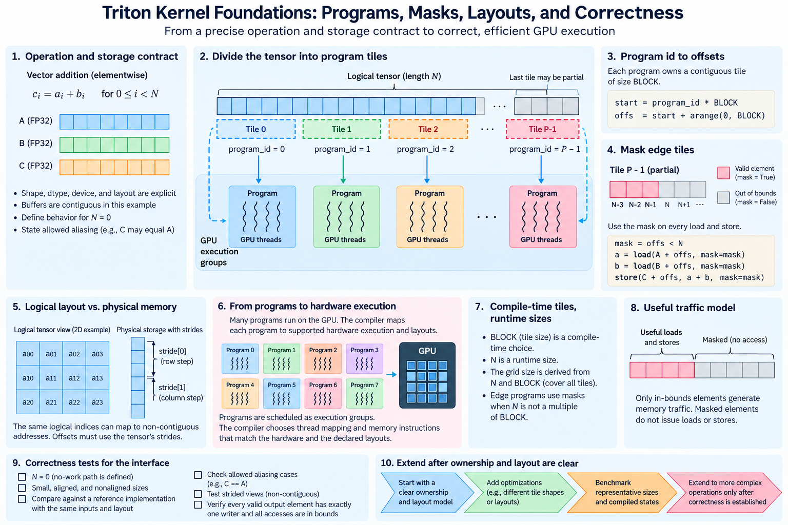
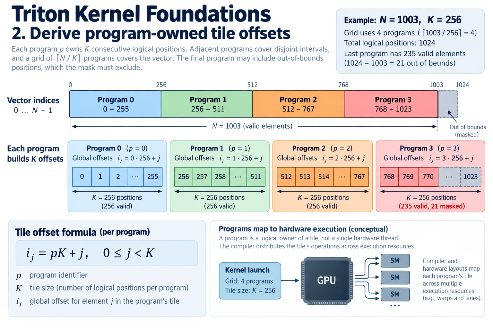
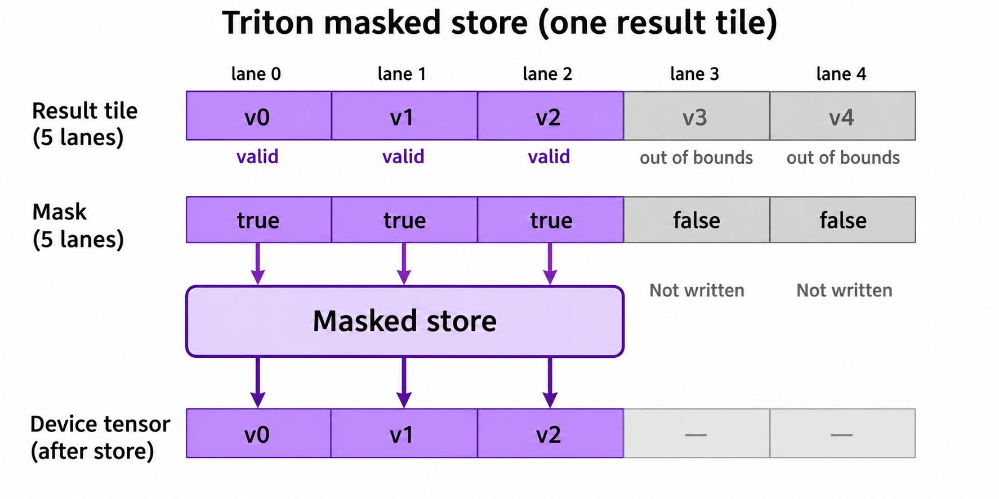
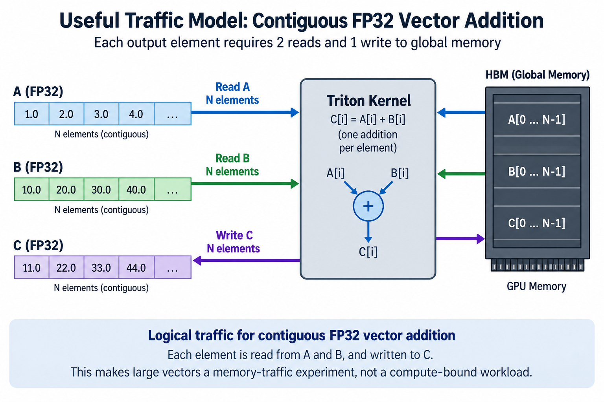
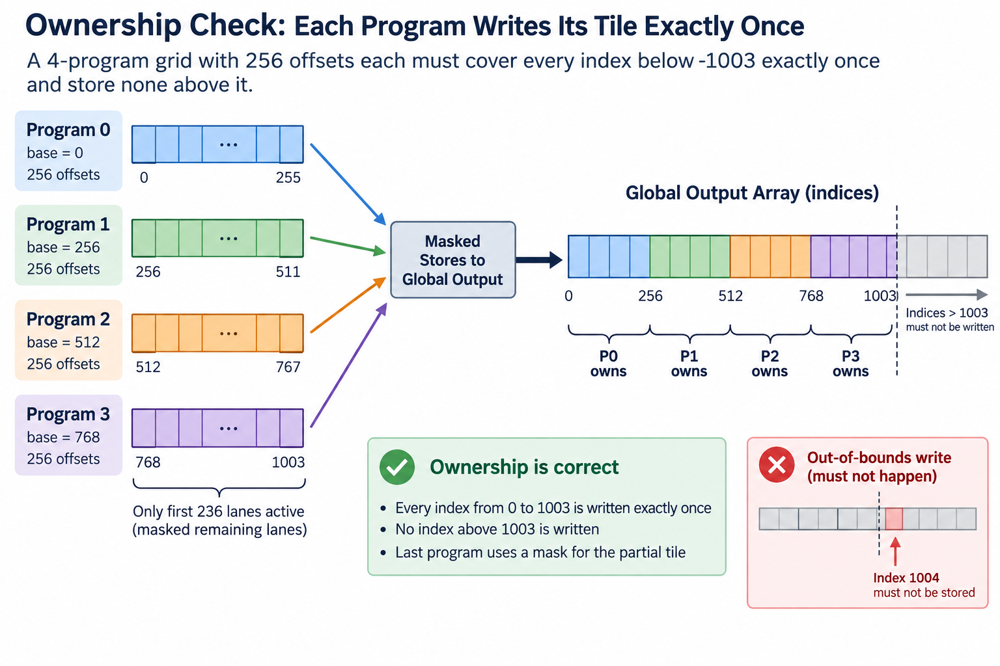

## Overview



Triton expresses GPU kernels through programs that operate on logical tensor tiles: instead of assigning 1 scalar expression manually to each CUDA thread, the author describes a collection of offsets, loads, and operations, and the compiler maps that tile onto supported hardware execution and layouts.

This model can make kernel construction concise, but it does not remove ownership or correctness requirements, and 3 of them survive: every required output still needs a valid writer, every memory access needs a supported address, and the tile's shape must match the real tensor layout. A compact expression can be wrong for a strided view or a partial final tile.

We will build vector addition from program ownership, then examine masks, strides, compilation, and measurement. Numerical examples are illustrative. The official tutorial and language documentation define the APIs supported by the installed Triton version.

## Deep dive

### 1. Start from a precise operation and storage contract

For length N vectors, the required result is c_i=a_i+b_i for every valid index. Assume separate contiguous FP32 device buffers for the initial example. Shape, dtype, device, and storage layout are part of the interface, not implicit properties guaranteed by the language.

A reference implementation should use the same logical inputs and output requirements. Include empty, small, aligned, and nonaligned lengths. The host path must define what happens for N=0 without creating an unsupported no-work launch.

Pointer aliasing changes the analysis when outputs can overlap inputs. Some simple elementwise cases can support selected aliasing, but a general interface should state the allowed relationships. Do not infer safety for arbitrary overlapping views from 1 contiguous demonstration.

Record 2 completion and lifetime requirements: inputs must be ready before the kernel consumes them, and outputs cannot be read or freed before completion. These dependencies remain necessary even when the kernel body is only a few expressions.

### 2. Derive program-owned tile offsets



Let program identifier p own K consecutive logical positions. Define a tile of offsets j from 0 to K minus 1 and global offsets

$$
i_j=pK+j,\qquad0\le j<K.
$$

Programs with adjacent identifiers own disjoint intervals, and a grid of ceiling N divided by K programs covers the requested vector. The final program can contain positions beyond N, which the mask must exclude.

For N=1003 and K=256, 4 programs cover 1024 logical positions. Program 3 owns offsets 768 through 1023, of which 235 are valid. The tile shape is 256 even though only 235 positions correspond to useful elements.

A program is not 1 hardware thread, and K is not simply a CUDA block width, because compiler layouts and launch configuration distribute tile operations across hardware execution resources, so keep logical ownership separate from assumptions about lane assignment.

### 3. Apply the mask to loads and stores



A minimal illustrative kernel is

```python
import triton
import triton.language as tl

@triton.jit
def add_tiles(A, B, C, N, BLOCK: tl.constexpr):
    offsets = tl.program_id(0) * BLOCK + tl.arange(0, BLOCK)
    valid = offsets < N
    a = tl.load(A + offsets, mask=valid, other=0.0)
    b = tl.load(B + offsets, mask=valid, other=0.0)
    tl.store(C + offsets, a + b, mask=valid)
```

The caller supplies compatible device buffers and a supported positive block size. For a nonempty vector, the grid has triton.cdiv(N, BLOCK) programs. This example illustrates ownership and masking rather than a complete allocation and synchronization wrapper.

Masking only the store is insufficient if the loads still access invalid tail positions. Every potentially out-of-range memory operation needs the corresponding predicate. The replacement value controls what inactive logical positions contribute to intermediate calculations.

Zero is harmless for this masked elementwise addition because invalid results are not stored. Reductions require a neutral value appropriate to the operation: 0 for summation differs from the value needed for a maximum. Correct masks do not automatically make the chosen replacement mathematically valid.

A masked sum and a masked mean illustrate why replacement values and statistics must be considered together. If a tile has 235 valid values equal to 1 and 21 masked values replaced by zero, its sum is 235. Dividing by the physical tile size 256 produces about 0.918, while the mean of the valid population is 1. The denominator must describe the intended valid count. A maximum similarly needs a replacement that cannot dominate valid values. This reasoning becomes part of the normalization contract, even though the same zero replacement was harmless in the elementwise addition example.

### 4. Separate logical shape from physical strides

The contiguous example addresses element i by pointer plus i, a strided vector instead requires pointer plus i times its element stride, and a matrix requires 2 strides, one for rows and one for columns, which can differ from its logical dimensions.

For row r and column c with element strides s_r and s_c, the address offset is

$$
o_{r,c}=r s_r+c s_c.
$$

A transpose can have the same element population but a different pair of strides. A subview can also begin at an offset other than 0, or contain gaps. The kernel must receive and use the actual supported layout or restrict its interface to contiguous inputs.

For an illustrative 3-by-5 matrix stored with row stride 8 and column stride 1, row 2 starts at element offset 16. Assuming row stride 5 would read a different location. Boundary masks protect logical row and column ranges; they do not correct an incorrect stride expression.

Validate noncontiguous inputs only if the interface claims support for them. A host wrapper can choose to make a contiguous copy, but that copy changes the end-to-end cost and should not disappear from a workload comparison.

### 5. Understand compile-time tile choices and runtime sizes

The tile shape used by operations such as arange must satisfy the language's compile-time and supported-size requirements. A compile-time block parameter lets the compiler construct and optimize that tile. The vector length can remain a runtime scalar used by the mask in this example.

A runtime N does not guarantee that the surrounding application never recompiles. Any of 6 things can affect compilation: specialization, dtype, device, layout, launch configuration, and integration guards. Preserve the actual compiled variants and cache behavior when measuring dynamic workloads.

Compilation and steady execution are separate costs. A 1-time JIT expense can be amortized over many launches, but it can dominate a short-lived workload. Measure cold and reused paths separately if both matter to the deployment.

A simplified amortized budget is

$$
\overline T\approx T_{\mathrm{compile}}/L+T_{\mathrm{launch}}+T_{\mathrm{kernel}},
$$

for L comparable uses of 1 compiled variant. Variant proliferation changes the accounting, so 1 large L should not be assigned to many rarely reused shapes.

### 6. Treat layouts as a compiler and hardware interaction

Logical tensor expressions must be distributed across lanes, warps, registers, and supported memory operations, and layout choice then affects 4 things, coalescing, reductions, communication between execution lanes, and register pressure, so concise source code does not establish an efficient mapping automatically.

Increasing tile size can reduce the number of programs or improve reuse in some kernels. It can also increase live values and reduce occupancy or cause spills. Launch parameters such as warp count interact with the compiled mapping rather than providing a universal linear speed control.

Inspect the generated execution and profiler evidence when a hypothesis requires it, since poor memory throughput can reflect 3 causes, access layout, insufficient work, or resource pressure, and a low bandwidth number alone does not identify which of the 3 is responsible.

Begin from supported simple layouts and introduce complexity only when the traffic or dependency model suggests a benefit. A vector operation with no cross-element reuse does not necessarily benefit from shared staging or elaborate synchronization.

### 7. Derive the useful traffic model



For contiguous FP32 vector addition, logical traffic is 2 reads and 1 write per element:

$$
D_{\mathrm{logical}}=12N,\qquad B_{\mathrm{effective}}=D_{\mathrm{logical}}/T.
$$

The kernel performs one addition per element, giving a low logical arithmetic intensity of 1 divided by 12 FLOP per byte. Large memory-resident vectors therefore serve as a memory-traffic experiment rather than a matrix-compute benchmark.

Caches, actual transactions, and write behavior can change physical traffic. Repeatedly operating on a small working set can report an effective rate that does not describe sustained HBM access. Preserve working-set size and cache policy in comparisons.

For an illustrative N=1000000, logical traffic is 12 MB. At an assumed achieved bandwidth of 300 GB/s, the payload component is 40 microseconds. Launch and other exposed work can matter substantially at that scale; the calculation is not a measured Triton result.

Measure the enclosing operation when it includes copies or layout conversion. A faster device kernel can lose its advantage if the wrapper adds a large contiguous materialization or repeated allocation.

### 8. Build correctness tests around the claimed interface

Use deterministic values and a reference with appropriate numerical precision. For vector addition, inputs a_i=i and b_i=2i produce an easily checked result 3i over the supported range. Include the final valid element and lengths that exercise a partial tile.

Test every dtype and layout the interface claims to support. Floating-point tolerances should reflect the operation and representation. A mask or pointer bug can produce large errors, while benign rounding needs a different interpretation.

Exercise repeated buffer reuse and the intended stream dependencies. 1 successful launch with never-reused allocations provides weak evidence for a sustained pipeline. Preserve the first failing shape, strides, dtype, and launch configuration. Include the expected valid population and the actual output layout in the diagnostic record.

Supported memory-checking and diagnostic tools can reveal invalid accesses beyond output comparisons. A tail mask should be tested explicitly because aligned inputs never exercise it. Do not treat a familiar tutorial as proof that a modified indexing expression remains safe.

### 9. Benchmark representative sizes and compiled states

Warm up the same compiled path, time actual device completion, and keep allocation or transfer costs separate unless they belong to the intended estimand. Record repeated observations and variation. Keep cold compilation observations separate from reused kernel timings.

Sweep small, large, aligned, and partial-tile sizes, because small vectors reveal startup, large vectors reveal sustained movement, and partial tiles reveal boundary execution, so a configuration that wins at 1 large point may lose across the application distribution.

Compare tile size and launch choices under fixed inputs and output semantics. Preserve diagnostics that identify the executed variant. More programs can improve parallelism until another resource limits progress, while fewer larger programs can change register and occupancy behavior.

A candidate wrapper that makes inputs contiguous should be compared both kernel-locally and end-to-end. The local result explains execution efficiency; the full result establishes whether the interface transformation benefits useful work.

### 10. Extend only after ownership and layout are clear



A reduction or normalization kernel adds dependencies among tile elements and requires 3 more things: valid neutral values, accumulator precision, and output statistics. A matrix kernel adds tile reuse and layout conversions. These extensions build on the same ownership and mask contract.

Keep the vector reference and representative tests as a baseline, but do not assume its performance model transfers unchanged. Reuse can increase arithmetic intensity, while reduction communication and register pressure can create different bottlenecks.

For a simple ownership check, a 4-program grid with 256 offsets each must cover every index below 1003 exactly once and store none above it. This logical check can be performed independently of hardware execution. The hardware test then verifies memory behavior, compilation, and timing under the actual supported runtime. Separating the proof from the measurement makes failures easier to locate.

## Conclusion

Triton foundations are about describing valid program-owned tiles and letting the compiler map them through supported layouts. Those tiles rest on 3 contracts: masks protect boundaries, strides preserve storage meaning, and lifetime preserves execution correctness. Optimization becomes meaningful when those contracts are explicit and the useful traffic and timing populations are measured consistently.

### Sources

- [Triton vector-add tutorial](https://triton-lang.org/main/getting-started/tutorials/01-vector-add.html).
- [Triton language API](https://triton-lang.org/main/python-api/triton.language.html).
- [Triton official implementation](https://github.com/triton-lang/triton).
