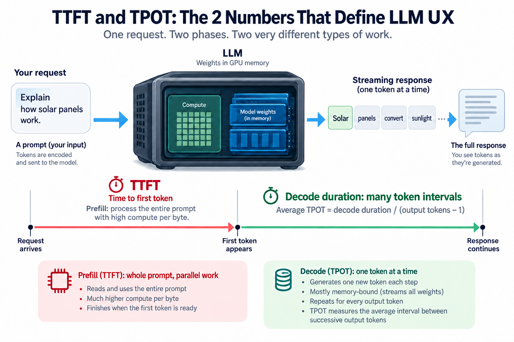
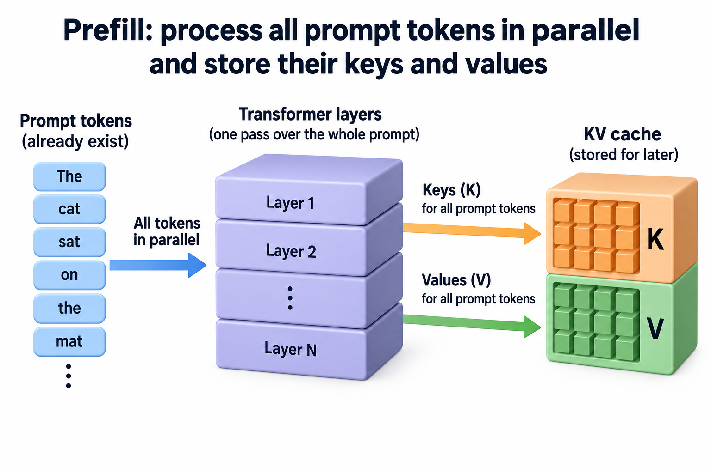
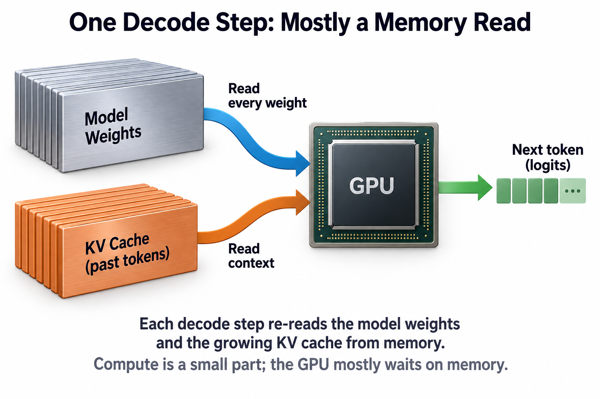
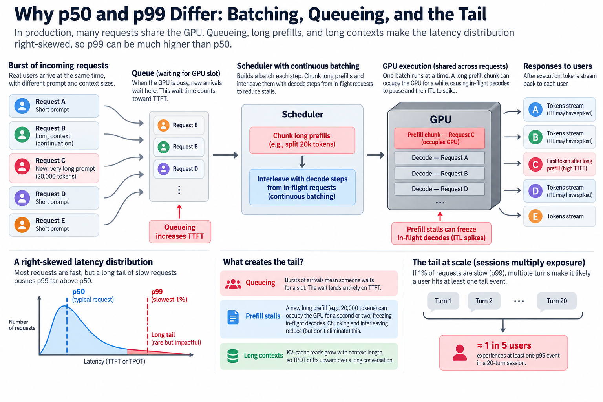

## Overview



14 gigabytes read, 14 gigaflops computed. That is the bill for producing a single output token from a 7-billion-parameter model in half precision: the GPU streams every weight in the network out of memory and performs, on average, just 1 multiply-add per byte it fetched. Meanwhile the *first* token of the same reply came from a phase that did 2 thousand times more math per byte. 1 request, 2 completely different physical regimes.

This is why serious inference dashboards never show 1 latency number. They show 2: **time to first token (TTFT)** and **time per output token (TPOT)**. Once you understand what each 1 physically depends on, a lot of confusing behavior — why long prompts feel sluggish, why streaming exists, why a beefier GPU sometimes changes nothing — becomes almost obvious.

## Deep dive

### Every request lives 2 lives



When your prompt arrives at an LLM server, the model processes it in 2 phases with different names and, more importantly, different bottlenecks.

**Prefill** handles the prompt. All of your input tokens already exist, so the model can process them in parallel: 1 giant pass through the network where every layer's matrix multiplications operate on the whole prompt at once. Along the way, the model computes and stores the key and value vectors for every prompt token — the **KV cache** — so that later tokens can attend to the prompt without recomputing it. (If keys and values are new to you, [Attention in Plain Words](/blog/attention-in-plain-words/) builds them up from scratch.) Prefill does an enormous amount of arithmetic on data that is already loaded, which makes it **compute-bound**: its speed is set by how many floating-point operations per second (FLOPS) your hardware can sustain.

**Decode** produces the reply. Autoregressive generation is strictly sequential: token 47 cannot be computed until token 46 exists, because token 46 is part of its input. So the model runs once per output token, and each of those runs pushes exactly *1* token through the network. The matrices are the same size as ever — the model must still read all its weights — but they now multiply a single vector instead of a big batch of them. Almost no arithmetic per byte fetched. Decode is therefore **bandwidth-bound**: its speed is set by how fast memory can feed weights (and the growing KV cache) to the compute units, in gigabytes per second.


The 2 headline metrics map directly onto these phases:

- **TTFT** is the time from sending the request until the first output token arrives. It is dominated by prefill, plus whatever queueing and scheduling delay the server adds. It grows with prompt length.
- **TPOT** is the average time between consecutive output tokens during decode. Its per-step cousin is the **inter-token latency (ITL)** — the individual gaps, whose average over the reply is the TPOT. Your reading experience, the speed at which text flows onto the screen, is 1/TPOT tokens per second.

End-to-end latency composes cleanly from the 2:

```
total latency ≈ TTFT + TPOT × (output tokens − 1)
```

That formula is worth memorizing, because it tells you which knob matters for which product. A classification endpoint returning 3 tokens lives and dies by TTFT. A chatbot writing 500-token answers is mostly a TPOT story.

### Why streaming exists

Suppose a reply takes 2.4 seconds to finish. If the server waits for the whole thing before responding, the user stares at a blank box for 2.4 seconds, which feels broken. If the server **streams** — sends each token the moment decode produces it — the user sees text starting at TTFT, a couple hundred milliseconds in, and then watches it flow at 1/TPOT.

Streaming does not make the model faster by a single microsecond. It changes *which* metric the user's patience is charged against: perceived responsiveness becomes TTFT instead of total latency. This is the entire reason chat interfaces type at you. As a bonus, humans read at roughly 3 to 5 words per second; once TPOT pushes generation comfortably past reading speed, further decode speedups are invisible in a chat UI, and a good operator will spend that slack on serving more users instead. How that trade is made is the batching story, which deserves its own article.

### A worked example you can do on a napkin



Let's put real numbers on a hypothetical but honest setup:

- **Model:** 7B parameters, FP16 (2 bytes per weight) → **14 GB** of weights.
- **GPU:** 2 TB/s of memory bandwidth, ~300 TFLOPS of dense FP16 compute — roughly A100-class.
- **Request:** 2,000-token prompt, 300-token reply.

**Step 1 — TTFT (prefill, compute-bound).** A useful rule of thumb: a forward pass costs about 2 FLOPs per parameter per token (1 multiply and 1 add per weight). So prefill costs

```
2 × 7×10⁹ params × 2,000 tokens ≈ 2.8×10¹³ FLOPs = 28 TFLOPs
```

At the 300 TFLOPS peak, that is 93 ms. Real kernels on real hardware sustain maybe half of peak on a good day, so call it **~190 ms of prefill**, and with tokenization and a little scheduling on top, a TTFT around **200 ms**. Notice the linear dependence: a 20,000-token prompt would push prefill toward 2 seconds. When your long-context chat "thinks" before answering, this is what it is doing.

**Step 2 — TPOT (decode, bandwidth-bound).** Each decode step must read every weight from memory:

```
14 GB ÷ 2,000 GB/s = 7.0 ms
```

It must also read the KV cache. For a 7B model with 32 layers and a 4,096-wide hidden state, keys plus values cost 2 × 32 × 4,096 × 2 bytes ≈ **0.5 MB per token of context**. Mid-generation our context is about 2,150 tokens, roughly 1.1 GB of cache, adding **~0.55 ms**. And the math? 1 token costs 2 × 7×10⁹ ≈ 14 GFLOPs, which at 300 TFLOPS takes **0.05 ms** — a rounding error.

```
TPOT ≈ 7.0 + 0.55 + 0.05 ≈ 7.6 ms  →  ~130 tokens/s
```


The GPU spends over 99% of each decode step *waiting for memory*. You could double its FLOPS and the token stream would not speed up measurably; double its memory bandwidth and TPOT nearly halves. This single fact explains why inference-oriented hardware generations chase bandwidth so aggressively — the arithmetic behind that chase is worked through in [Blackwell to Rubin memory math](/blog/blackwell-to-rubin-memory-math/).

**Step 3 — put it together.**

```
total ≈ 0.2 s + 299 × 7.6 ms ≈ 2.4 s
```

Without streaming: a 2.4-second blank stare. With streaming: text appears at 0.2 s and flows at 130 tokens/s, several times faster than anyone reads. Same computation, transformed experience.

1 more number ties the 2 phases together: **arithmetic intensity**, the FLOPs performed per byte moved. Our GPU needs about 150 FLOPs per byte (300 TFLOPS ÷ 2 TB/s) to keep its compute units fed. Prefill delivered ~1,900 FLOPs per byte of weights — comfortably compute-bound. Decode delivered ~1. Same weights, same model, opposite sides of the roofline.

### Use an exact timestamp identity

For request arrival $$t_0$$ and delivered token times $$t_1,\ldots,t_N$$, define $$\mathrm{TTFT}=t_1-t_0$$. For at least 2 outputs, mean time per output gap is

$$
\mathrm{TPOT}=\frac{t_N-t_1}{N-1},\qquad t_N-t_0=\mathrm{TTFT}+(N-1)\mathrm{TPOT}.
$$

A first-token delay of 0.2 seconds followed by 99 gaps averaging 0.03 seconds gives 3.17 seconds to the hundredth token. Single-token responses have no observed TPOT. The identity is exact for these delivery timestamps, even when individual gaps vary.

It also explains why averaging request TPOT and multiplying by an average output length generally fails: length and speed can be correlated. Compute complete request times directly before reporting their percentiles.

Compared with blending prompt processing and generation into 1 rate, separate metrics let engineers choose different interventions. Queue admission and prefill policy chiefly influence first-token waiting; scheduling interference and history reads influence gaps. Neither mapping is exclusive. If a session has 20 independent opportunities for a 1-percent tail event, the probability of at least 1 is approximately 18.21 percent. Correlated requests require a different calculation. A small request-level tail can therefore matter noticeably over a long interaction.

### Going deeper: percentiles, batching, and the tail



Everything above describes 1 request on an idle GPU. Production servers are neither idle nor fair, and this is where **p50 versus p99** enters.

A percentile is a point in the latency distribution: p50 (the median) is the experience of a typical request; p99 is the threshold that the slowest 1% of requests exceed. Inference latency distributions are heavily right-skewed, so the 2 can differ by an order of magnitude. A service can honestly report a 210 ms median TTFT while its p99 sits at 1.4 seconds.


Where does the tail come from? Mostly from requests interfering with each other:

- **Queueing.** A burst of arrivals means someone waits for a slot. That wait lands entirely on TTFT.
- **Prefill stalls.** Modern servers use *continuous batching*: many requests share each decode step, which is nearly free because the weights are read once for the whole batch. But when a new request's 20,000-token prefill lands, it can occupy the GPU for a second or 2 while every in-flight conversation's token stream visibly freezes. Their ITL spikes; the p99 eats it. Schedulers fight this by *chunking* prefills into slices and interleaving them with decode steps (this is the core idea of Sarathi-Serve, and vLLM enables it by default).
- **Long contexts.** KV-cache reads grow with context length, so TPOT itself drifts upward across a long conversation.

Percentiles matter more than they first appear because sessions multiply exposure. If p99 TTFT is 1.4 s and a chat session involves 20 turns, the chance a user hits at least 1 tail event is 1 − 0.99²⁰ ≈ 18%. Nearly 1 user in 5 experiences your worst-case behavior. Dean and Barroso called this "the tail at scale" in the datacenter context a decade before LLMs, and the logic transfers intact.

### Common misconceptions

**"A GPU with more TFLOPS will stream tokens faster."** For single-stream decode, usually not. Our worked example spent 0.05 ms computing and 7.5 ms reading memory per token; tripling the FLOPS attacks the 0.05. Extra compute *does* cut TTFT (prefill is compute-bound) and lets you batch more users at the same TPOT, which is valuable — but the tokens/s a single user sees is a bandwidth number. Check which regime you are in before buying hardware.

**"Streaming makes the model faster."** Streaming changes when bytes leave the server, not when tokens are computed; total generation time is identical. What it changes is which latency the user perceives — TTFT instead of the full 2.4 seconds. That distinction has teeth: if your downstream consumer is another program that needs the complete output (say, JSON to parse), streaming buys you nothing, and you should optimize total latency instead of first-token latency.

**"Our median latency is 210 ms, so users experience 210 ms."** The median describes 1 request in isolation. Users experience sessions, and sessions sample the whole distribution repeatedly. With the 20-turn arithmetic above, a service with a flawless p50 and an ugly p99 delivers an ugly experience to a sizable minority every single day. This is why serious SLOs are written against p95 or p99, and why teams track goodput-style measures ([throughput that meets the latency target](/blog/goodput-vs-utilization/)) rather than raw throughput.

### The bigger picture

TTFT and TPOT are where the transformer's architecture becomes something you can feel with your fingertips. The parallel-friendly attention design that made training scalable ([the same 1 picture](/blog/transformer-architecture-in-one-picture/) from earlier in this series) is also what makes prefill a single wide, compute-hungry pass. The autoregressive loop bolted onto it at inference time is what makes decode a memory-bandwidth treadmill. Every serving technique you will meet later — KV-cache paging, continuous batching, speculative decoding, prefill/decode disaggregation — is an attempt to move one of these 2 numbers without wrecking the other. And an [ML performance engineer's](/blog/what-does-an-ml-performance-engineer-do/) day often reduces to exactly that negotiation: which metric does this workload actually care about, and what is the cheapest way to buy it?

When a vendor quotes "tokens per second," now you know to ask 3 questions. Per user, or summed across the whole batch? At what prompt length? And at which percentile? The answers frequently shrink marketing numbers by an order of magnitude — most published throughput figures are aggregate, batched, short-prompt p50s.

## Conclusion

- 1 request has 2 phases with different physics: prefill is compute-bound and sets **TTFT**; decode is bandwidth-bound and sets **TPOT**. Total latency ≈ TTFT + TPOT × output tokens.
- You can estimate both from spec sheets: prefill time ≈ 2 × params × prompt tokens ÷ FLOPS; decode time per token ≈ (weight bytes + KV bytes) ÷ memory bandwidth. For a 7B FP16 model on an A100-class GPU: ~200 ms and ~7.6 ms.
- Report and design against percentiles, not medians: sessions sample the distribution many times, so a 1% tail becomes a double-digit share of user experiences.

### Sources

- Pope et al., ["Efficiently Scaling Transformer Inference"](https://arxiv.org/abs/2211.05102) — the canonical treatment of prefill/decode cost modeling and memory-bandwidth limits.
- Kwon et al., ["Efficient Memory Management for Large Language Model Serving with PagedAttention"](https://arxiv.org/abs/2309.06180) — KV-cache mechanics and the vLLM serving model.
- Agrawal et al., ["Taming Throughput-Latency Tradeoff in LLM Inference with Sarathi-Serve"](https://arxiv.org/abs/2403.02310) — chunked prefill and its effect on inter-token latency tails.
- [vLLM documentation](https://docs.vllm.ai/) — production definitions of TTFT, TPOT, and ITL metrics.
- Dean & Barroso, "The Tail at Scale," *Communications of the ACM*, 2013 — why percentiles, not averages, govern user experience at scale.
- NVIDIA Technical Blog, "Mastering LLM Techniques: Inference Optimization" — prefill vs. decode illustrated from the hardware side (vendor-published figures).

---

*Part of the [LLM Foundations & Mathematics](/series/llm-basics/) learning path. Browse its published articles by topic.*
