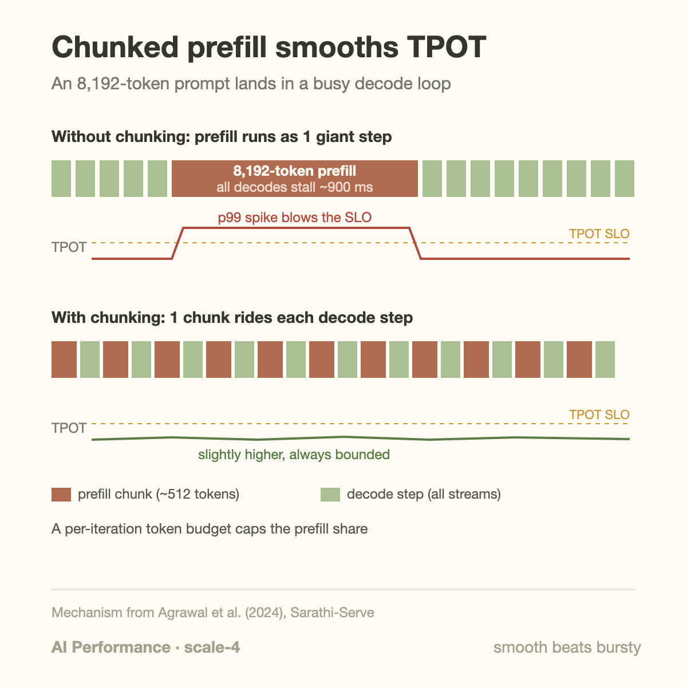
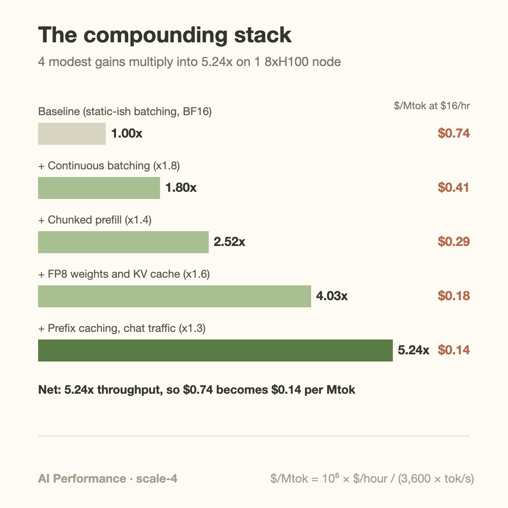

4 serving optimizations, none of them worth more than 1.8x on its own, multiply into a 5.2x throughput gain on unchanged hardware. On a rented 8xH100 node that turns $0.74 per million output tokens into $0.14. No new silicon, no smaller model, no quality cliff. Just configuration and scheduling work that most teams ship half of and then stop.

This post is about the arithmetic that makes such work worth doing: serving cost is a fraction with dollars on top and tokens on the bottom, and every optimization in the modern inference stack attacks the bottom. Because the optimizations touch mostly independent resources, their gains multiply rather than add. That multiplication is the entire economic story of inference tuning.

## Cost is throughput, inverted

Fix a deployment: 1 8xH100 node, rented at $2.00 per GPU-hour, so $16/hour for the node. The node's cost per million output tokens is

```text
$/Mtok = (node $/hour) / (tokens per hour / 1,000,000)
```

The numerator is set by your cloud contract or your datacenter's amortization schedule. You do not control it iteration to iteration. The denominator is useful token throughput, affected by tuning as well as arrival rates, workload, and service constraints. Double throughput and cost halves; there is no other term in the equation.

1 refinement before the knobs: the denominator should count only *useful* tokens, delivered within your latency objective. A tuning change that raises raw tokens/s while pushing p99 inter-token latency past the SLO has not made anything cheaper; it has produced tokens you can't sell. That distinction between raw throughput and goodput is the subject of [an earlier post](/blog/goodput-vs-utilization/), and it matters here because the second optimization below exists precisely to buy throughput without spending SLO.

## The 4 multipliers

**Continuous batching.** Static batching launches a batch of requests and waits for the slowest 1 to finish before admitting new work. Since output lengths vary wildly, the batch drains as short requests complete, and the GPU spends the tail of every batch mostly idle. Continuous batching, introduced as iteration-level scheduling in the Orca paper (OSDI 2022), re-forms the batch at every decode step: a request that finishes leaves immediately and a queued request takes its slot in the very next iteration. Batch occupancy stays near the configured maximum instead of sawtoothing toward 1. Orca reported over an order of magnitude gain versus the static-batching baseline of its day; against a competently configured static server, 1.5–2x is the realistic range, and every major engine (vLLM, SGLang, TensorRT-LLM) now does this by default.

**Chunked prefill.** In a continuous-batching engine, prefill and decode still fight over the same iterations. When an 8,192-token prompt arrives, the naive scheduler runs its whole prefill as 1 enormous batch step, and every in-flight decode stream stalls behind it, often for close to a second. Users see it as a stutter mid-generation; your monitoring sees it as a p99 TPOT spike. Chunked prefill, from the Sarathi line of work (arXiv:2308.16369, refined in Sarathi-Serve, arXiv:2403.02310), slices the prompt into fixed-size chunks of a few 100 tokens and co-schedules 1 chunk per iteration alongside all ongoing decodes. Each iteration carries a bounded token budget, so decode latency rises slightly and stays flat instead of spiking. The throughput win comes from the other direction too: decode-only iterations are memory-bandwidth-bound and leave compute idle, and piggybacked prefill chunks soak up exactly that idle compute. Sarathi-Serve reports up to 2.6x higher serving capacity under an SLO on a Llama-scale model; 1.3–1.5x is a fair expectation for mixed workloads.



**Low-precision inference (FP8, then FP4).** Decode is bound by bytes moved, not FLOPs: every step streams the full weight set and the KV cache through HBM. Casting weights from BF16 to FP8 halves the bytes per step, which directly speeds up bandwidth-bound decode, and on Hopper the FP8 tensor cores double peak matmul throughput for the compute-bound prefill side as well. The freed HBM is not a side benefit, it is the point: memory that stops holding weights starts holding KV cache, which raises the maximum batch size, which is where most of the measured 1.5–1.7x end-to-end gain actually comes from. FP4 on Blackwell repeats the trick; the format details and accuracy tradeoffs are covered in [the NVFP4 vs MXFP4 post](/blog/nvfp4-vs-mxfp4-the-4bit-format-war/).

**Prefix caching.** Production traffic is repetitive in a very particular way: thousands of requests share the same system prompt, and every turn of a conversation or agent loop re-sends the entire history. Prefix caching keeps the KV cache of previously computed prefixes in a pool (hash-block-based in vLLM's automatic prefix caching, radix-tree-based in SGLang's RadixAttention) and skips prefill compute for any request whose prefix matches. A cache hit turns thousands of prompt tokens from compute into a lookup. The gain is entirely workload-dependent: near 0 for 1-shot batch jobs, 1.2–1.5x for typical chat traffic, and far more for agentic loops where hit rates exceed 90%.

A fifth lever sits above the engine: prompt and context compression, trimming retrieval results, deduplicating context, and summarizing stale turns so fewer tokens need serving at all. It's application-layer work, so it doesn't appear in the engine benchmark, but it multiplies against everything below it in exactly the same way.

## A worked example: the stack, multiplied out

Take the $16/hour node serving a 70B-class dense model in BF16 with a static-ish baseline configuration at 6,000 aggregate output tokens/s. Baseline cost:

```text
6,000 tok/s x 3,600 s = 21.6 Mtok/hour
$16 / 21.6 Mtok  ≈  $0.74 per Mtok
```

Now apply a hypothetical stack with explicitly stipulated sequential gains:

| Step | Gain | Cumulative | Node tok/s | $/Mtok |
|---|---|---|---|---|
| Baseline | — | 1.00x | 6,000 | $0.74 |
| + Continuous batching | 1.8x | 1.80x | 10,800 | $0.41 |
| + Chunked prefill | 1.4x | 2.52x | 15,120 | $0.29 |
| + FP8 weights & KV | 1.6x | 4.03x | 24,190 | $0.18 |
| + Prefix caching (chat traffic) | 1.3x | 5.24x | 31,450 | $0.14 |

Each row is unremarkable on its own. A 1.3x gain is the kind of thing that gets deprioritized in sprint planning. But 1.8 x 1.4 x 1.6 x 1.3 = 5.24, and the same $16 now buys 113 million tokens per hour instead of 21.6 million. Annualize it: at steady 50% load, this node serves about 496 billion tokens a year, and the stack just cut the bill for that traffic from roughly $367,000 to $70,000 per node-year. Multiply by a fleet of 2 100 nodes and the "small" optimizations are a $59M line item.



The individual numbers are representative midpoints from the papers and engine benchmarks cited below, not guarantees. Your workload will land somewhere else on each 1. The structure, gains multiplying across independent levers, is the part that transfers.


A reproducible cost equation uses measured accepted output. Let $$p$$ be node price in dollars per hour and $$r$$ accepted output tokens per second under the service objective. Then

$$
c_{\mathrm{Mtok}}=\frac{10^6p}{3600r},\qquad
G_{\mathrm{joint}}=\prod_{j=1}^{m}\frac{r_j}{r_{j-1}}.
$$

The product is an identity when each ratio is measured sequentially on the already modified system, using equal traffic and quality. It is not an identity for speedups measured independently against the same baseline. With $$p=16$$ and $$r=6000$$, cost is approximately $0.74074 per million output tokens. Applying stipulated sequential factors 1.8, 1.4, 1.6, and 1.3 gives $$G=5.2416$$, $$r=31449.6$$, and approximately $0.14132 per million tokens.

The improvement method is a controlled sequence of bottleneck changes. Replay equivalent requests after each change and record accepted throughput, tail latency, quality, and memory high-water marks. A setting that improves raw output but breaches latency is excluded from this denominator. Run interaction experiments when 2 changes target the same work, particularly prefix caching and chunked prefill. At low arrival rates, a faster server may mostly gain idle time rather than additional sold tokens; realized savings require consolidation, fewer replicas, or a lower ownership cost. These examples are scenario arithmetic, not promised benchmark gains or rental quotes.


## Going deeper: why they multiply, and when they don't

The multiplication works because each lever attacks a different resource. Continuous batching attacks *idle slots*: it raises average batch occupancy. Chunked prefill attacks *interference*: it converts latency spikes into throughput headroom under a fixed SLO. FP8 attacks *bytes per token*: it moves less data per step through a bandwidth-bound loop. Prefix caching attacks *redundant work*: it deletes compute per request. 4 different denominators inside the denominator, largely orthogonal, so the gains compose.

Largely, not perfectly. 2 interaction effects are worth knowing.

First, some pairs are super-multiplicative. FP8 halves both the weight footprint and (with FP8 KV cache) the per-token KV footprint. On an 8xH100 node with 640 GB of HBM, a 70B model's weights drop from ~140 GB to ~70 GB, and the freed 70 GB becomes KV space. Continuous batching converts that extra KV headroom straight into occupancy, so measured together the pair often beats the product of their solo benchmarks. This is also why quantization benchmarks run at batch 1 understate its serving value so badly.

Second, some pairs overlap. Chunked prefill and prefix caching both attack the prefill side. If 80% of prompt tokens are cache hits, there is far less prefill left for chunking to smooth, and the chunking gain measured on cold traffic won't reappear on warm traffic. Same for prompt compression: shorter prompts shrink the very prefill work the other 2 levers optimize. The rule that follows is operational, not theoretical: benchmark the stack jointly, on traffic replayed from production, because the product of individually measured speedups is only an estimate of the jointly measured 1.

There is also a genuine cost inside chunked prefill worth naming. Each chunk's attention must read the KV cache of all previous chunks from HBM again, so total prefill FLOPs and bytes go *up* slightly as chunks shrink. Sarathi-Serve picks the token budget to balance this against TPOT: too large and decode stalls return, too small and prefill overhead grows. Engines expose this as a tunable (vLLM's `max_num_batched_tokens`), and it is one of the few single parameters that visibly moves both your p99 TPOT and your $/Mtok.

## Common misconceptions

**"The model already fits in memory, so quantization won't help."** Fitting was never the main prize. Decode reads every weight byte per token per batch; FP8 halves that traffic, and the freed HBM becomes KV cache, which raises the batch ceiling. The end-to-end serving gain from FP8 on a model that comfortably fit in BF16 is routinely 1.5x or more, precisely because the bottleneck is bytes per step and KV capacity, not whether the weights load.

**"Prefix caching is a chatbot trick for shared system prompts."** The heaviest hitters are agents, not chatbots. An agent loop re-sends the full accumulated context on every tool call, so a 20-step trajectory presents the same growing prefix 20 times; hit rates above 90% are normal, and Mooncake (Kimi's serving platform, arXiv:2407.00079) built its entire disaggregated architecture around a distributed KV cache pool for exactly this traffic. API pricing tells the same story: vendors including DeepSeek price cached input tokens at roughly a tenth of the regular rate (self-reported pricing, but the ratio reflects real cost structure).

**"5.2x throughput means users get responses 5.2x faster."** Almost none of this stack reduces the latency of a single request; most of it raises concurrency. Continuous batching and FP8-enabled bigger batches serve more streams at similar or slightly worse per-stream speed, and chunked prefill deliberately trades a small TPOT increase for smoothness. Throughput tuning and latency tuning are different problems with different knobs, which is why [TTFT and TPOT](/blog/ttft-and-tpot/) deserve their own dashboards. If a vendor quotes 1 big tokens/s number, ask which 1 it is.

## The bigger picture: power is the next denominator

Everything above assumed the numerator, $/GPU-hour, was fixed. At fleet scale that assumption gets interesting, because the binding constraint on new capacity is increasingly megawatts, not GPUs. When your datacenter is power-limited, a 5.24x throughput gain is not just a cost cut; it is 5.24x more product shipped through the same grid connection, capacity you could not have bought at any price. That reframing, tokens per megawatt as the fleet-level metric, is [its own post](/blog/tokens-per-megawatt/).

The stack also keeps going above the single node. Prefill and decode want different hardware configurations, and splitting them across machines (DistServe, arXiv:2401.09670; Mooncake; NVIDIA Dynamo) is the cluster-scale continuation of the same denominator-attacking logic. And below the engine sits the kernel layer, where the same multiplication holds: [DeepSeek's FlashMLA-class kernel work](/blog/when-a-kernel-cuts-api-prices/) stacked onto architecture and scheduling gains to support API prices competitors initially couldn't match. Every layer of the stack, from attention kernel to datacenter substation, is multiplying into the same fraction.

## Takeaway

- Serving cost is dollars over tokens, and only the denominator is yours to move: a 1.4x throughput gain **is** a 29% price cut, by identity, on the same hardware.
- The core stack (continuous batching, chunked prefill, FP8/FP4, prefix caching) attacks 4 different resources, so gains multiply: modest 1.3–1.8x levers compose into 5x and turn $0.74/Mtok into $0.14.
- Multiply carefully: some pairs compound (FP8 frees KV that batching converts to occupancy), some overlap (caching shrinks the prefill that chunking smooths), so benchmark the stack jointly on replayed production traffic.

## Sources

- Yu et al., "Orca: A Distributed Serving System for Transformer-Based Generative Models," OSDI 2022 — https://www.usenix.org/conference/osdi22/presentation/yu
- Agrawal et al., "Taming Throughput-Latency Tradeoff in LLM Inference with Sarathi-Serve," OSDI 2024 — https://arxiv.org/abs/2403.02310
- Agrawal et al., "SARATHI: Efficient LLM Inference by Piggybacking Decodes with Chunked Prefills" — https://arxiv.org/abs/2308.16369
- Zhong et al., "DistServe: Disaggregating Prefill and Decoding for Goodput-Optimized LLM Serving," OSDI 2024 — https://arxiv.org/abs/2401.09670
- Qin et al., "Mooncake: A KVCache-centric Disaggregated Architecture for LLM Serving" — https://arxiv.org/abs/2407.00079
- vLLM documentation (automatic prefix caching, chunked prefill) — https://docs.vllm.ai/

*Part of the **AI Performance Engineering** series. Previous: [The Prefill/Decode Disaggregation Story](/blog/the-prefill-decode-disaggregation-story/). Next: pushing the same denominator math down into the kernel layer.*
