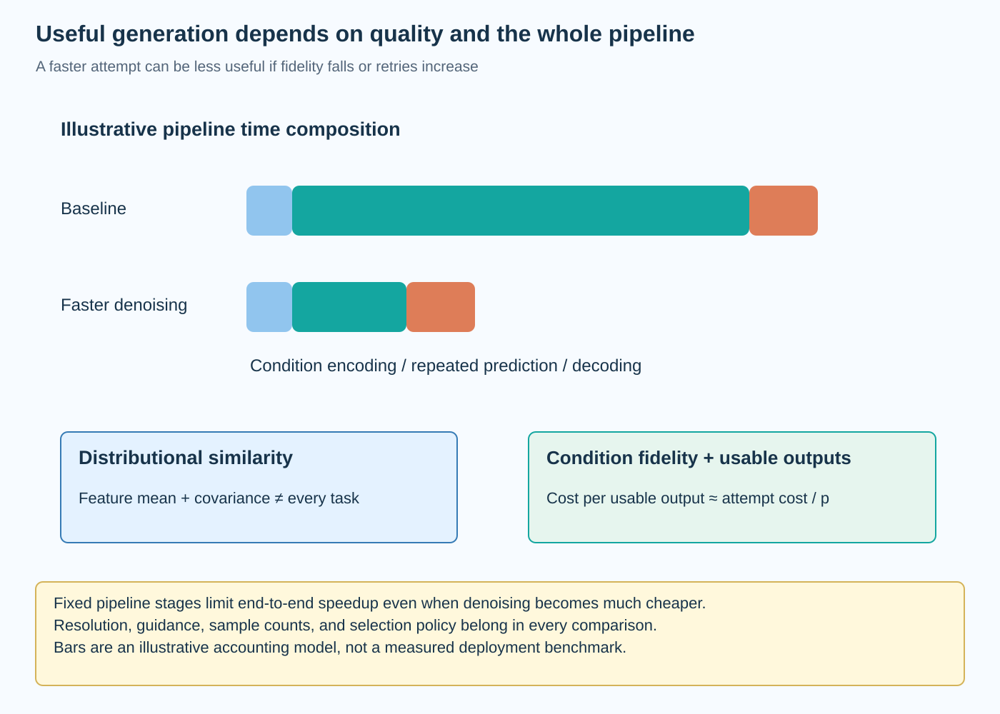
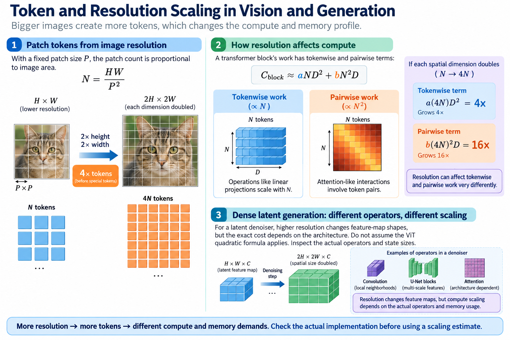
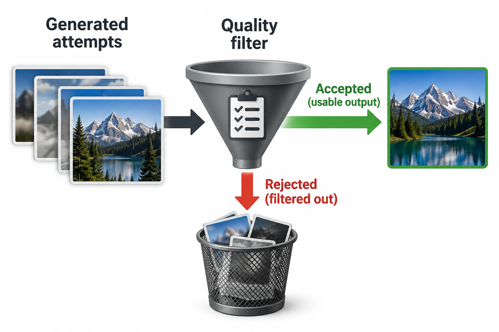

Efficient vision and generation should be evaluated as complete task systems. A smaller token sequence, fewer denoising evaluations, or reduced weight precision can save a specific resource while changing information, quality, or another pipeline stage. The useful result is an accepted operating point under a reproducible workload.

This guide brings patch design, token reduction, diffusion solvers, and step distillation into one controlled experiment. It derives cost and quality accounting and provides illustrative decisions. It does not report a trained-model or GPU benchmark; the protocol is intended to produce that evidence for an actual deployment.

*An original conceptual illustration. Numerical plots and examples are illustrative unless explicitly identified as measured evidence.*

## 1. Define the task and output requirement

Specify classification, dense prediction, unconditional generation, or conditional generation. Each requires different quality evidence. A classification accuracy comparison cannot establish that a generator follows prompts, and a distributional image metric does not fully assess segmentation boundaries.

Define the input population, preprocessing, resolution, output count, and any condition distribution. Preserve the model, tokenizer or encoder, decoder, and backend revisions.

Write the deployment constraint before selecting optimizations. It might concern batch throughput, single-request latency, peak memory, startup, or a combined envelope. That requirement determines which measurement and quality-resource frontier should guide the decision.

## 2. Preserve the complete pipeline baseline

For a classifier, include image decoding, preprocessing, backbone, and output head as appropriate to the service boundary. For conditional generation, include condition encoding, repeated prediction, decoding, and relevant postprocessing.

Measure stages separately for diagnosis and end-to-end execution for acceptance. A faster backbone can have little total effect if data processing dominates, while denoiser improvements can be limited by fixed decoder time.

Record warmup, compilation, allocation, and batching policies. Keep baseline and candidates under the same service boundary. Comparing a candidate's device-only time with a baseline's end-to-end request time does not isolate an efficiency mechanism.

## 3. Choose a controlled candidate matrix

For vision, candidates can vary resolution, patch size, token-reduction schedule, width, or numerical format. For generation, vary a supported solver, evaluation budget, guidance policy, or a step-distilled model.

Change one interpretable variable at a time where feasible and include combined candidates only when they address a specific hypothesis. Record preparation changes such as recovery training or distillation.

A lower resolution and a faster attention kernel are different interventions: one changes input information, the other can preserve a supported mathematical operation. The candidate matrix should make that distinction visible instead of labeling both simply as accelerated vision.

## 4. Account for token and resolution scaling

With fixed patch size P, the patch count is proportional to image area. Doubling each spatial dimension quadruples tokens before special-token handling.

$$
N=\frac{HW}{P^2},\qquad C_{\mathrm{block}}\approx aND^2+bN^2D.
$$

The equation explains why resolution can affect tokenwise and pairwise work differently. Actual latency also depends on implementation, dimensions, and memory.

For a dense latent denoiser, resolution similarly changes feature-map shapes, but its exact cost depends on architecture. Do not import the ViT quadratic formula into every diffusion network. Inspect the actual operators and state sizes before using a scaling estimate to predict resource use.

## 5. Count generation evaluations and fixed stages

A generator's total time can be organized into predictor evaluations, scheduler work, and fixed stages. Guidance can change the prediction work per update.

$$
T\approx\sum_{j=1}^{\mathrm{NFE}}T_{\mathrm{predictor},j}+T_{\mathrm{condition}}+T_{\mathrm{decode}}+T_{\mathrm{other}}.
$$

NFE means neural function evaluations under a documented counting convention. A higher-order step can require several evaluations, and batched conditional/unconditional guidance can change wall time without changing conceptual predictions.

Report update count, NFE, guidance, and complete runtime together. A claim of 4-step generation is incomplete if the system actually performs more network predictions or uses a different condition encoder than the baseline.

## 6. Work through the fixed-cost limit

Suppose an illustrative baseline takes 40 milliseconds in condition encoding, 400 in repeated denoising, and 60 in decoding. Its total is 500 milliseconds under this simplified serial model.

If denoising becomes 4 times faster while the other stages remain unchanged, the total becomes 200 milliseconds, for a speedup of 2.5. It does not become 125 milliseconds or achieve a total speedup of 4.

These invented timings explain pipeline accounting rather than measure a model. Actual stages can overlap, batch differently, or change numerical paths. Measure the complete service and identify whether reduced repeated work reveals a new bottleneck in fixed processing.

## 7. Measure memory at the intended envelope

Track model representation, live activations, temporary workspace, condition state, and any cached buffers. Peak allocation depends on tensor lifetimes and concurrency, not only the sum of model parameters.

$$
M_{\mathrm{peak}}=M_{\mathrm{resident}}+M_{\mathrm{simultaneously\ live\ runtime}}.
$$

The compact expression emphasizes that unrelated per-stage maxima should not automatically be added. Conversely, simultaneous requests can overlap buffers that were separate in a one-request test.

Report resolution, batch, concurrency, numerical format, and backend allocation policy with the peak. A reduced checkpoint can still fail capacity at a large resolution or under several concurrent generations. Test the documented maximum operating case.

## 8. Evaluate discriminative quality

For classification, report the required metric with sample counts and relevant slices. For detection and segmentation, preserve task-specific evaluation, thresholds, and spatial-output policy.

Token merging or pruning can affect small objects and boundaries differently from broad image categories. Include those diagnostics when the application depends on them. A single aggregate score can hide structured information loss.

Use independent held-out evaluation after selecting reduction schedules. Repeatedly choosing a configuration on one benchmark can overfit the recipe. Preserve preprocessing across comparisons or explicitly report a changed information budget such as resolution and cropping.

## 9. Understand distributional generation metrics

Fréchet Inception Distance compares Gaussian approximations to real and generated feature distributions under a specified feature extractor and preprocessing. A numerically convenient form uses a symmetric covariance product.

$$
\operatorname{FID}=\|\mu_r-\mu_g\|_2^2+\operatorname{tr}\left(\Sigma_r+\Sigma_g-2(\Sigma_r^{1/2}\Sigma_g\Sigma_r^{1/2})^{1/2}\right).
$$

The means and covariances are estimated from feature samples. The expression is a distributional feature statistic, not a direct measure of every image's correctness or condition fidelity.

Preserve feature-extractor revision, resizing, sample counts, reference population, and implementation. Finite-sample estimates and preprocessing differences can affect results. Comparing FID values computed under incompatible conventions does not establish a reliable quality ranking.

## 10. Work through a feature-statistic example

For an illustrative one-dimensional feature distribution with equal variances, the covariance term cancels. If the real mean is 0 and the generated mean is 1, the squared-mean contribution is 1.

If the means match but the standard deviations are 1 and 2, the one-dimensional covariance contribution is also 1. The statistic therefore responds to both location and spread under its Gaussian approximation.

This example is not an image benchmark. Different non-Gaussian distributions can share the same mean and covariance, so these statistics do not capture every distributional distinction. Use additional evidence when diversity, rare modes, or semantic correctness matters to the deployment.

## 11. Assess condition fidelity independently

A conditional generator can produce visually plausible images while failing the requested objects, relations, text, or attributes. Distributional similarity to a reference image population does not by itself establish prompt following.

Use task-appropriate condition evaluation and inspect a documented held-out condition set. Include compositional and difficult cases rather than only common prompts. Preserve the output-selection policy: reporting the best of many samples changes both quality and generation cost.

Human evaluation can add useful evidence when implemented with a clear protocol, blinding, and sample population. Automatic metrics and qualitative examples should retain their limits. Neither one attractive image nor one scalar score is a complete conditional-generation assessment.

## 12. Preserve stochastic evaluation policies

Record initial-noise seeds, sample counts, stochastic sampler settings, and guidance. Paired seeds can support diagnostics between candidates, but different samplers can produce different trajectories from related starting states.

Evaluate enough outputs to assess the relevant quality and diversity requirement. Do not discard failures without reporting the filtering policy and its cost. A generator that needs repeated attempts to obtain one acceptable image has a different effective operating point.

Separate timing repetitions from quality samples where appropriate. Repeating one fixed seed can characterize runtime variation but does not characterize the generated distribution. More timing data cannot repair a narrow condition population.

## 13. Measure execution with a matching statistic

Use sustained workloads for throughput and the intended concurrency for service latency. Report a variability summary appropriate to the requirement rather than selecting one unusually fast run.

Inspect numerical fallbacks, compilation, and kernel support. A low-bit artifact can execute correctly through an unexpected wider path. A token-reduction algorithm can save later work while introducing sorting and gathering overhead.

Measure complete graphs and include preprocessing when it is part of the service boundary. Theoretical operation counts help explain results but should not replace measured time when the question concerns deployment speed.

## 14. Include preparation and reuse

Token-reduction recovery, architecture changes, and step distillation can require additional training. A training-free solver change has a different preparation bill, though it still needs validation.

$$
C_{\mathrm{lifecycle}}=C_{\mathrm{prep}}+K C_{\mathrm{generation}}.
$$

K denotes the number of uses under a simplified stable-cost model. Choose consistent units and include teacher targets, training, search, and failed preparation where relevant.

A widely reused generator can justify substantial preparation for lower repeated cost. A one-off task can prefer a supported solver adjustment. Capacity or condition-quality benefits can also matter independently of a simple monetary calculation. State which objective supports the decision.

## 15. Select the accepted frontier

Compare candidate quality, latency, throughput, and peak allocation under the same operating conditions. Discard candidates that fail required constraints and retain tradeoffs among the feasible set.

A candidate with lower memory but worse latency can still be useful if capacity is the binding requirement. A faster generator that fails condition fidelity is not accepted under a fidelity constraint. Make those requirements explicit before selecting the winner.

All numerical examples in this guide are illustrative. No vision or generation model was executed on a GPU. The experiment protocol connects the series' mechanisms to the measurements needed for a real deployment rather than presenting invented acceleration or quality results.

## 16. Preserve a reviewable artifact record

Store the model and encoder-decoder revisions, exported graph, numerical formats, preprocessing, resolution, token or sampling schedule, guidance, data provenance, and measurement summary. Include the preparation lineage for a distilled model.

Verify that training-only modules are absent where expected and that the serving scheduler matches the trained predictor contract. Reevaluate after a backend or workload change that can affect the accepted operating point.

This record makes the result usable beyond one notebook. It connects spatial information, probabilistic generation, numerical integration, and systems execution while preserving the evidence and limits of each. The accepted configuration then represents a concrete task system rather than a generic claim of efficient AI.

## 17. Count usable outputs rather than only attempts

If an application accepts only a fraction p of generated outputs under a fixed quality rule, the expected number of independent attempts per accepted output is one over p. Under a simple constant-cost model, usable-output cost scales accordingly.

$$
C_{\mathrm{usable}}\approx\frac{C_{\mathrm{attempt}}}{p},\qquad p>0.
$$

Independence and constant cost are assumptions; retries can change prompts or budgets in a real system. The model nevertheless explains why a faster individual attempt can be less efficient when its acceptance rate falls substantially.

Report filtering, retries, and the selection criterion when they form part of deployment. Include verification work in the service boundary where required. This connects condition fidelity and artifact quality to effective throughput without pretending that every generated image is equally useful. A fair comparison uses the same acceptance requirement for baseline and candidates.

## Sources

- [Token Merging](https://arxiv.org/abs/2210.09461).
- [DPM-Solver](https://arxiv.org/abs/2206.00927).
- [Progressive Distillation](https://arxiv.org/abs/2202.00512).
- [Fréchet Inception Distance original paper](https://arxiv.org/abs/1706.08500).
- [Latent Diffusion Models](https://arxiv.org/abs/2112.10752).
