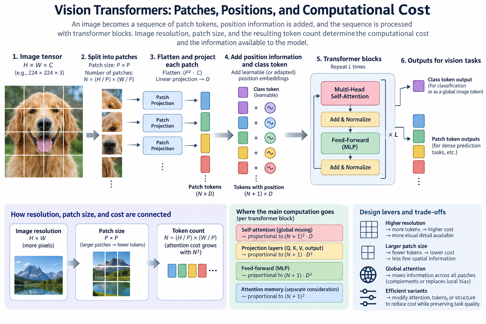
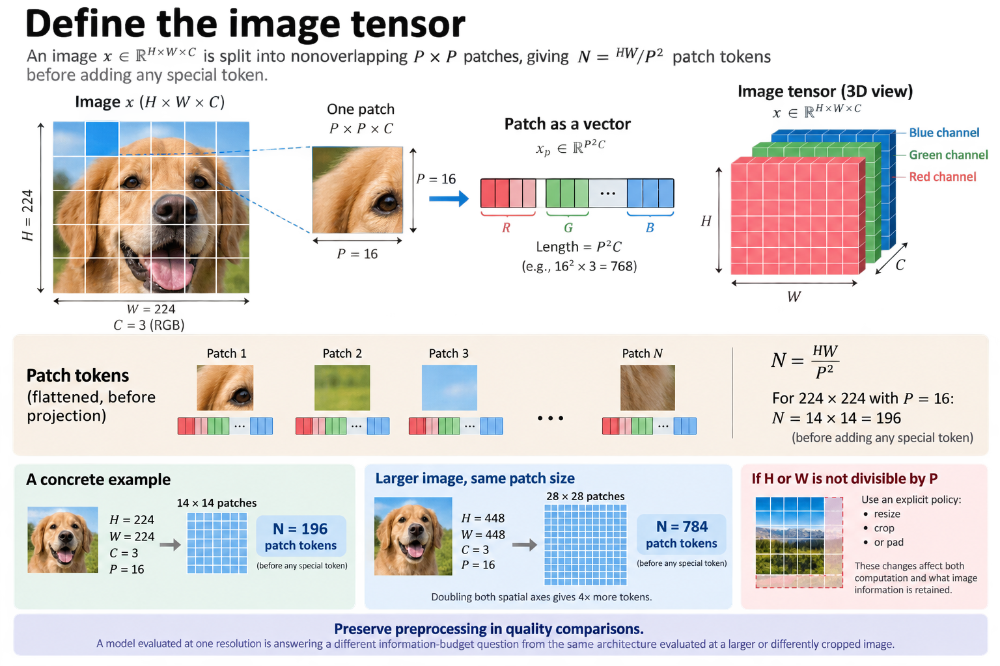
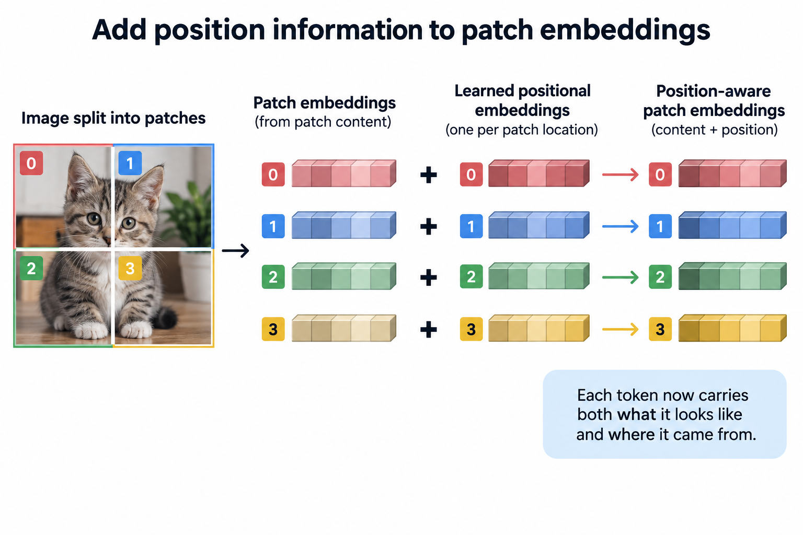
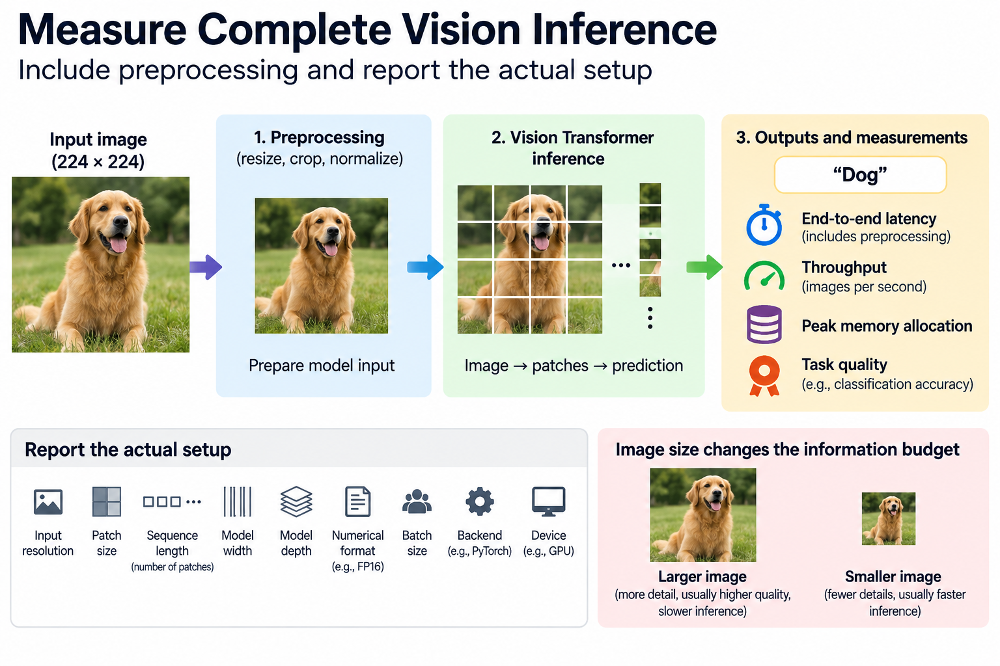
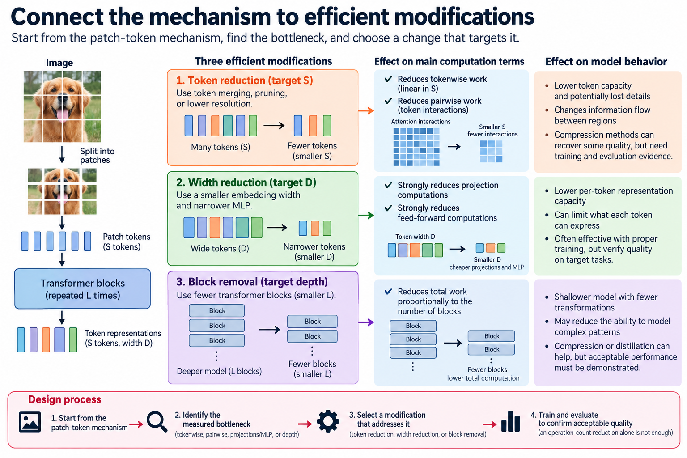
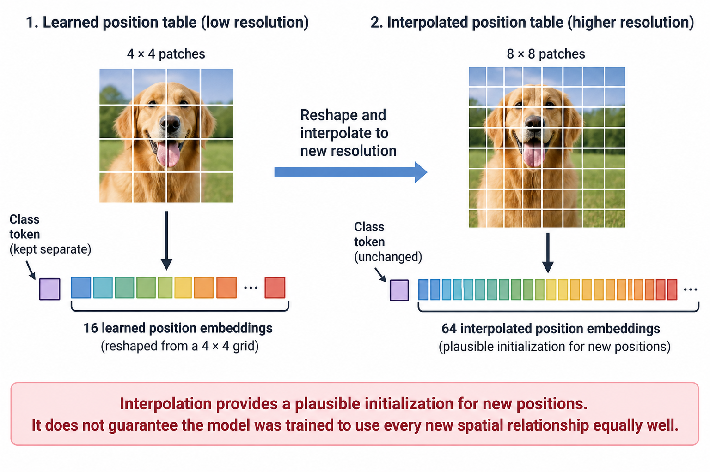
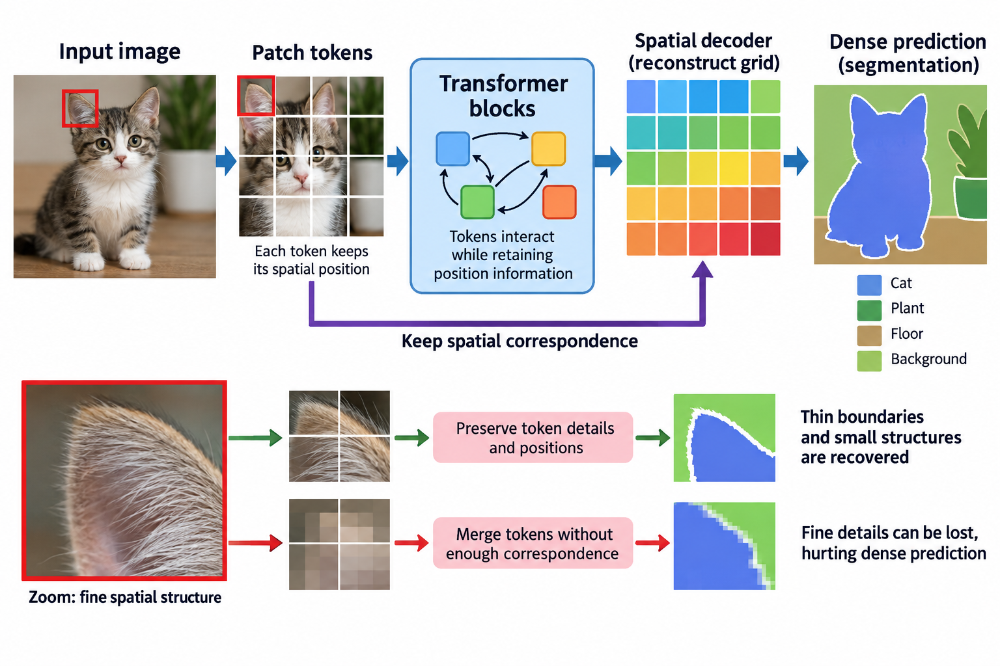

## Overview

A Vision Transformer turns an image into a sequence of patch tokens and processes that sequence with transformer blocks. This ties image resolution, patch size, attention cost, and the information available to the model directly together. That relationship is the starting point for efficient vision design.

This article derives the patch interface and the major computation terms, then explains position information and architectural assumptions. The original ViT work provides the primary design; the numerical examples here are illustrative. An efficient deployment still needs task-quality and backend measurements for its actual resolution and batch.

*An original conceptual illustration. Numerical plots and examples are illustrative unless explicitly identified as measured evidence.*

## Deep dive

### 1. Define the image tensor

Let an image have height H, width W, and C channels. A patch size P divides the spatial axes into nonoverlapping square regions, assuming for simplicity that both dimensions are divisible by P.

$$
x\in\mathbb R^{H\times W\times C},\qquad N=\frac{HW}{P^2}.
$$

N is the number of patch tokens before any special token. If the dimensions are not divisible, resizing, cropping, or padding needs an explicit policy. Those changes affect both computation and what image information survives.

Keep preprocessing fixed in quality comparisons. A model evaluated at one resolution answers a different information-budget question than the same architecture on a larger or differently cropped image.

### 2. Project each flattened patch

Flattening one P-by-P patch produces P squared C values. A learned linear projection maps that vector to an embedding of width D.

$$
x_p\in\mathbb R^{P^2C},\qquad z_p=x_pE+b,\quad E\in\mathbb R^{P^2C\times D}.
$$

The expression uses row-vector tokens; another orientation is equivalent when all axes are translated consistently. The projection can be implemented as a compatible convolution without changing the stated linear patch mapping.

P sets the spatial granularity that later blocks see. A larger patch reduces token count but folds more pixels into each initial embedding. That is an information and architecture change, not merely a backend optimization.

### 3. Work through a patch count

For an illustrative RGB image of 224 by 224 pixels and patch size 16, the grid contains 14 by 14 patches, or 196 tokens. Each flattened patch contains 768 pixel-channel values.

If the embedding width is also 768, the patch projection contains 589,824 weights before bias. Adding one class token gives a sequence length of 197 for an architecture that uses that convention.

Increase the image to 448 by 448 with the same patch size and you get 784 patch tokens. The token count quadruples because both spatial axes double. That increase hits linear tokenwise operations and pairwise attention differently, so count them separately.

### 4. Add position information

A transformer that operates only on token content does not automatically receive the original image coordinates. ViT adds learned positional embeddings to the patch embeddings.

$$
z_p^{(0)}=z_p+e_p^{\mathrm{pos}}.
$$

Position embeddings tie the sequence index to a location in the patch grid. The original paper studies positional alternatives and the effect of removing position information. Do not assume a raster ordering alone hands an attention block explicit spatial coordinates.

Changing resolution can require a positional-embedding adaptation policy, such as interpolation for a model with learned grid embeddings. Record that policy and verify shapes. It changes the input interface and should stay attached to the evaluated checkpoint.

### 5. Understand the class-token interface

The original classification design uses a learned class token whose representation feeds a classification head after transformer processing. Other vision architectures can pool tokens or use another output interface.

The extra token participates in attention, so it slightly changes the sequence length. More important, the readout choice defines how token information becomes a task prediction.

Do not assume every Vision Transformer uses the same special tokens or pooling. Inspect the actual configuration and weights. Efficient modifications that prune or merge image tokens must preserve the output interface the model expects, including any tokens with task-specific roles.

### 6. Derive attention shapes

For token matrix Z of sequence length S and width D, projections produce queries, keys, and values. Within a head of width d_h, attention compares every query with every key.

$$
A=\operatorname{softmax}\!\left(\frac{QK^\top}{\sqrt{d_h}}\right),\qquad O=AV.
$$

The score matrix has S-by-S entries per head. Softmax runs across keys for each query under the usual convention. The output combines value vectors with content-dependent weights.

The equation describes a global information interface, not a literal requirement to hold the entire matrix in device memory. Efficient attention kernels compute the same supported operation through tiling and recomputation, with different memory behavior.

### 7. Count pairwise attention work

Across heads totaling width D, the query-key multiplication and attention-value multiplication take approximately 4S squared D floating-point operations under the multiply-add convention.

$$
C_{\mathrm{pairwise}}\approx4S^2D.
$$

The estimate excludes softmax, projections, normalization, and other operations. It isolates the part that grows quadratically with sequence length.

When the patch count quadruples, this pairwise term grows by approximately 16 under fixed width and similar special-token handling. That does not mean total latency grows by exactly 16. Other terms, kernel utilization, and memory traffic all contribute, so measure the actual resolution change.

### 8. Count projections and feed-forward work

Query, key, value, and output projections add a token-linear term. A feed-forward sublayer with expansion ratio rho also scales linearly with sequence length but quadratically with width under a standard 2-layer design.

$$
C_{\mathrm{proj}}\approx8SD^2,\qquad C_{\mathrm{MLP}}\approx4\rho SD^2.
$$

These formulas describe a common dense block and exclude activation functions and biases. Architectures can use different feed-forward structures, so inspect the actual configuration.

At moderate token counts and wide embeddings, the tokenwise dense work can stay large. Calling attention quadratic does not prove it dominates every vision workload. Compute the terms and profile the implementation before choosing an optimization target.

### 9. Compare global mixing and local bias

Convolution builds spatial locality and weight sharing into its operator structure. Standard global self-attention can connect distant patch tokens directly and carries a different set of inductive assumptions.

The original ViT work discusses how scale and pretraining play into this design. The lesson is not that locality stops mattering. Architecture and data decide how useful spatial relationships get learned.

Efficient vision models can restore locality through windows, hierarchical structure, or hybrid components. Those choices change information flow and compute. Compare them under the task and data regime instead of treating global connectivity as an unconditional quality advantage.

### 10. Keep resolution and patch size distinct

Raising resolution while holding P fixed adds tokens and keeps finer image detail. Raising P while holding resolution fixed removes tokens but coarsens the initial representation.

Both affect cost, but they are different interventions. A larger patch is not the same as processing the original small patches with a faster attention kernel. It can discard or compress distinctions before any transformer block sees them.

Evaluate fine-detail tasks and the relevant image scales. Classification, detection, and segmentation can respond differently to token granularity. An efficient setting that works for one output task may fail another because the information requirement differs.

### 11. Examine attention memory separately

A naive implementation stores attention scores or probabilities with a term proportional to the number of heads times S squared. Tiled exact attention can reduce materialization under its supported operation.

$$
M_{\mathrm{scores}}\propto hS^2p.
$$

Here h is head count and p bytes per stored element. The proportionality describes one category, not complete peak allocation. Token activations, projections, feed-forward intermediates, and workspace remain.

Use the backend's actual memory path when evaluating capacity. A mathematical score matrix does not prove an allocation exists, and an efficient attention kernel does not remove every resolution-dependent memory term. Track activation lifetimes and measured peak allocation.

### 12. Verify the patch-position contract

A tiny synthetic image with known values can verify patch extraction order, channel layout, flattening, and projection. Distinct values in neighboring patches help reveal an incorrect raster mapping.

Check positional-embedding indices and any special token placement. A shape-compatible implementation can still attach the wrong location information to a patch. That error may not show up in a simple random-tensor dimension test.

Then compare model outputs with a known reference under the same preprocessing and numerical policy. Numerical correctness establishes the interface; held-out task evaluation shows whether an efficient modification preserves useful image behavior.

### 13. Measure complete vision inference

Report input resolution, patch size, sequence length, width, depth, numerical format, batch, backend, and device. Measure preprocessing separately when it matters, and include it in end-to-end latency when the deployment requirement includes it.

Track quality alongside latency, throughput, and peak allocation. A smaller image can speed up execution while changing the task's information budget. State that change explicitly instead of crediting the entire difference to an architecture optimization.

No vision-model execution or GPU benchmark was performed for this article. The patch counts and formulas are explanatory. The primary papers provide experiments under their own conditions; a new deployment needs measurements of its actual artifact.

### 14. Connect the mechanism to efficient modifications

Token reduction targets S, width reduction targets D, and block removal targets depth. They affect the computation terms differently. Cutting S reduces both linear tokenwise work and pairwise work. Cutting D hits projections and feed-forward layers hardest.

Each intervention also changes capacity or information flow. Compression methods can recover some quality, but that recovery needs training and evaluation evidence. A smaller operation count alone does not establish an acceptable student.

The useful design process starts from this patch-token mechanism, finds the measured bottleneck, and picks a modification that addresses it. The next article looks at token merging, pruning, and resolution choices through that lens.

### 15. Interpret positional adaptation carefully

Reshaping a learned position table into a grid and interpolating it to a new resolution gives a plausible initialization for the new positions. It does not prove the checkpoint was trained to use every new spatial relationship equally well.

Evaluate the actual resolution policy on relevant held-out images. Note whether the model is further adapted after interpolation and whether crops or aspect ratios change. These settings can affect quality independently of the attention kernel.

Also keep special-token embeddings out of the grid interpolation where the model expects that. A class token does not represent an ordinary image cell. Handling that distinction correctly makes the input interface reproducible and avoids a subtle bug that matching tensor shapes would hide.

### 16. Preserve task-specific spatial information

Classification can compress an image into one output vector. Dense prediction needs information tied to locations. Detection and segmentation therefore need an output architecture that preserves or reconstructs suitable spatial structure. A token sequence is not automatically a complete dense-prediction model.

If an efficient modification merges tokens, store enough correspondence to interpret features for the task. A classification pooling interface tolerates a changed token population differently from a decoder that expects a fixed spatial grid. The question that matters: which locations and distinctions remain available to the output head?

Fine structures make useful diagnostic cases. Small objects, thin boundaries, and nearby regions with different labels can expose limits that a broad classification score hides. Evaluate those cases under the actual resolution and patch policy. Global attention does not restore detail that was removed before embedding.

## Conclusion

This connects architecture to the information budget. Patch size sets the initial spatial interface, token processing changes how features communicate, and the head decides what must be reconstructed. Efficiency choices should preserve the information the complete task path requires while reducing a measured execution cost.

### Sources

- [An Image is Worth 16x16 Words](https://arxiv.org/abs/2010.11929).
- [Attention Is All You Need](https://arxiv.org/abs/1706.03762).
- [Swin Transformer](https://arxiv.org/abs/2103.14030).
- [FlashAttention](https://arxiv.org/abs/2205.14135).
