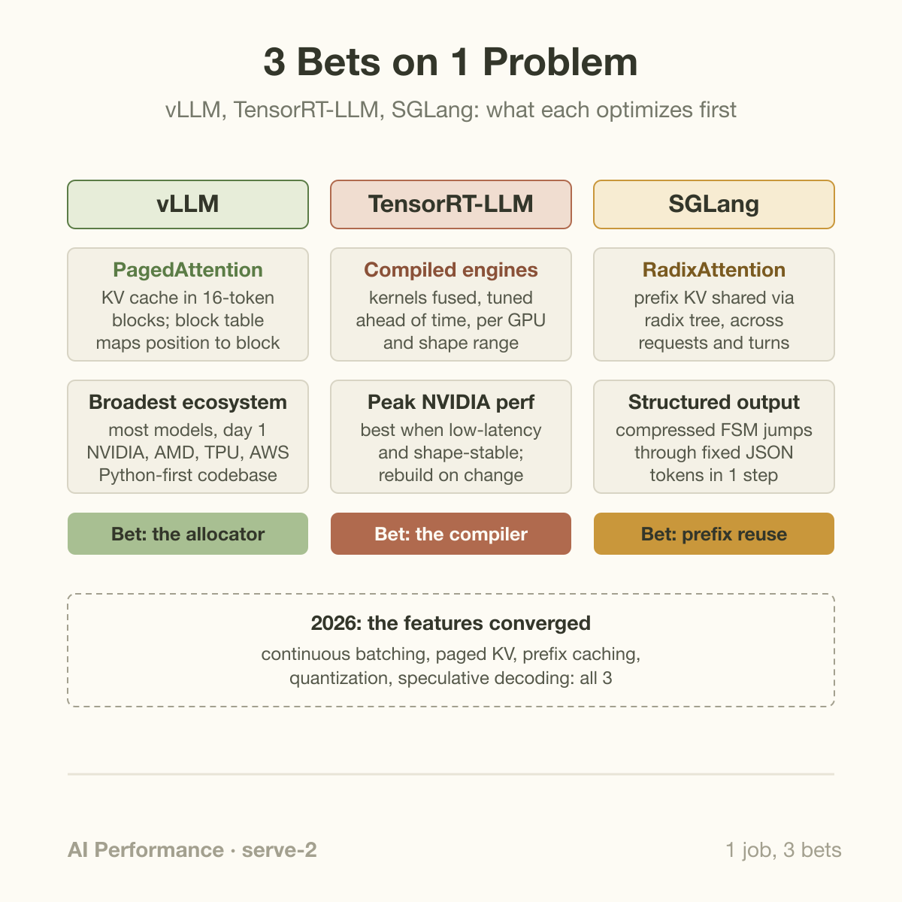
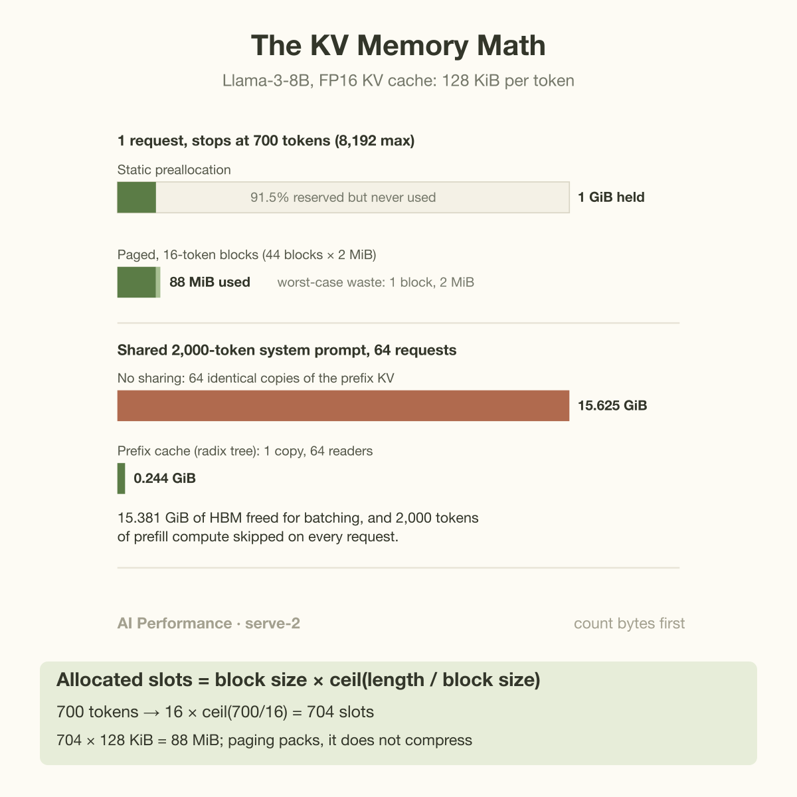

When the vLLM team profiled the LLM serving systems of 2023, they found that only 20-38% of KV-cache memory actually held token states. The other 60-80% was lost to fragmentation and over-reservation, which meant the largest single lever in serving performance at the time was not a faster kernel. It was a memory allocator. That finding, published as PagedAttention at SOSP 2023, kicked off 3 years of serving-framework competition that has now settled into 3 main camps: vLLM, TensorRT-LLM, and SGLang.

If you run inference in production, you have probably been asked "which one is fastest?" at least once this quarter. The honest answer is that the question is underspecified. The 3 frameworks started from genuinely different design bets, then spent 2024 and 2025 copying each other's best ideas, so the remaining differences are narrower than the benchmark-war blog posts suggest, and the differences that do remain depend almost entirely on the shape of your traffic. This article walks through what each framework actually is, works 1 memory example by hand so the design bets become concrete, and ends with guidance that does not require you to trust anyone's marketing numbers.

## 3 design bets

A serving framework does 3 jobs: schedule requests into batches, manage the KV cache, and launch GPU kernels. (If prefill, decode, and KV cache are fuzzy, start with [how an LLM generates text](/blog/how-an-llm-generates-text/).) Each framework made a different first bet on which job mattered most.

**vLLM** bet on memory management. PagedAttention stores the KV cache in fixed-size blocks (16 tokens by default) instead of 1 contiguous region per request, exactly like virtual memory pages in an operating system. A request's blocks live anywhere in GPU memory; a per-request block table maps logical positions to physical blocks. Fragmentation essentially disappears, so more concurrent requests fit, so continuous batching has more to batch. Around that core, vLLM built the broadest ecosystem of the 3: day-1 support for most new open models, every quantization format that matters, hardware backends beyond NVIDIA (AMD, TPU, AWS silicon), and a Python-first codebase that outside contributors can actually extend. It is the default choice in most open-source deployments for that reason, not because it wins every benchmark.

**TensorRT-LLM** bet on kernels. NVIDIA's framework historically compiled your model ahead of time into a TensorRT engine: operators fused, kernels selected per GPU architecture and per shape range, everything specialized before the first request arrives. When the engine matches your workload, this is how you extract peak performance from NVIDIA hardware, particularly in low-latency regimes where per-launch overhead and unfused epilogues show up directly in inter-token latency. The cost is flexibility. A compiled engine bakes in maximum batch size, sequence lengths, parallelism layout, and quantization choices, and changing them historically meant rebuilding the engine, which for a large model can take a long lunch. NVIDIA knows this is the pain point: since 2025 the project's default flow is a PyTorch-based runtime that trades a slice of that ahead-of-time specialization for vLLM-style operational flexibility, which tells you a lot about which properties users actually valued.

**SGLang** bet on redundancy across requests. Its signature mechanism, RadixAttention, keeps the KV cache of completed requests in a radix tree keyed by token prefix, so any new request that shares a prefix with anything recently served reuses those KV blocks instead of recomputing prefill. Multi-turn chat (every turn resends the conversation), agent loops (same system prompt and tools thousands of times), and few-shot evaluation are all prefix-heavy, and on such workloads the SGLang paper reported up to 6.4x throughput gains over the systems of the time (self-reported, as always). The second bet was structured output: SGLang compresses the finite-state machine that constrains JSON or grammar-guided decoding so that deterministic stretches of the output (braces, key names, whitespace) are emitted in 1 jump-forward step instead of 1 token per forward pass. Fast, schema-exact JSON became something of a calling card.

## A worked example: where the KV memory goes

Numbers make the bets concrete. Take Llama-3-8B with FP16 KV cache: 32 layers, 8 KV heads (grouped-query attention), head dimension 128.

KV bytes per token = 2 (K and V) x 32 layers x 8 heads x 128 dims x 2 bytes = **131,072 bytes = 128 KB per token**.

A 16-token vLLM block is therefore 16 x 128 KB = 2 MB.

Now serve a request that ends at 700 tokens (prompt plus output) on a system with an 8,192-token context limit.

**Pre-PagedAttention allocation:** reserve the maximum up front. 8,192 x 128 KB = 1 GB of KV memory held for the request's whole lifetime. The request actually used 700 x 128 KB = 87.5 MB. Utilization: 8.5%. This is the 60-80% waste the vLLM paper measured, and it directly caps batch size: an H100 with roughly 55 GB left for KV after 16 GB of weights fits only ~55 such reservations.

**Paged allocation:** allocate blocks as the sequence grows. 700 tokens needs ceil(700/16) = 44 blocks = 88 MB. Worst-case internal waste is 1 partially filled block, 2 MB. The same 55 GB of KV memory now holds ~625 such requests' caches, and the scheduler, not the allocator, decides how many run concurrently.

**Prefix sharing:** now add a realistic wrinkle: an agent service where every request begins with the same 2,000-token system prompt plus tool definitions. That prefix costs 2,000 x 128 KB = 250 MB of KV. With 64 concurrent requests and no sharing, you store it 64 times: 16 GB, nearly a third of your KV budget spent on identical bytes. With RadixAttention (or vLLM's automatic prefix caching, which does the same job), you store it once: 250 MB, freeing 15.75 GB for actual per-request state, and every request skips 2,000 tokens of prefill compute besides. That is the difference between a cache-hit TTFT of tens of milliseconds and a full prefill of a couple hundred, which is why prefix-heavy shops fell in love with SGLang early. ([TTFT and TPOT](/blog/ttft-and-tpot/) covers why that metric split matters.)

Notice what the example does not depend on: which framework's kernels are 7% faster on some microbenchmark. The memory math dominates, and all 3 frameworks now implement all 3 techniques.

## Going deeper: compile time versus run time

The durable philosophical difference among the 3 is not any single feature. It is *when decisions get made*.

TensorRT-LLM's classic flow makes decisions at build time. Ahead-of-time compilation sees the whole graph, so it can fuse attention epilogues, pick the best GEMM kernel per shape bucket from a tuned library, and lay out memory without runtime bookkeeping. The trade is that the engine is a closed artifact: fixed shape envelope, fixed parallelism, rebuilt when anything structural changes. This is a wonderful deal for a stable, high-volume endpoint (1 model, known traffic, NVIDIA fleet) and an ongoing tax during rapid iteration.

vLLM and SGLang make decisions at run time, then claw back the overhead selectively. Decode steps are launch-bound (hundreds of small kernels per token), so both frameworks capture them into CUDA graphs and replay the whole step as 1 unit; vLLM's V1 engine adds torch.compile for kernel-level specialization without a separate build step. SGLang leans on shared high-performance attention kernels (FlashInfer) rather than maintaining its own. The upshot for 2026: the JIT camp recovered most of the compiled camp's kernel advantage, while the compiled camp (via the PyTorch runtime) adopted the JIT camp's flexibility. Convergence from both directions.

The scheduler tells the same story. Continuous batching, the idea (from Orca, OSDI 2022) of admitting and retiring requests at token granularity instead of waiting for a whole batch to finish, is universal. So are chunked prefill (slicing long prompts into pieces interleaved with decode steps so a big prompt does not stall everyone's inter-token latency), speculative decoding, FP8/INT4 quantized inference, structured output, and paged KV itself. A feature-matrix comparison of the 3 frameworks in 2026 is mostly checkmarks all the way down, which is precisely why "which is fastest" has no context-free answer.

The remaining edges are real but situational: TensorRT-LLM in tightly specified low-latency deployments on NVIDIA silicon, SGLang when prefix reuse or structured output dominates, vLLM when model diversity, hardware diversity, or speed of adopting new research matters most.

Paged allocation and prefix reuse can be modeled without treating every advertised cache gain as universal. With block size b tokens, cache bytes per token m, and independent retained lengths L_i:

$$
M_{\mathrm{allocated}}=m\sum_i b\left\lceil\frac{L_i}{b}\right\rceil.
$$

This counts payload before metadata and excludes shared blocks. A 700-token request with b equal to 16 needs 704 slots. At 131072 bytes per token, it uses exactly 88 MiB, compared with 87.5 MiB of logical state. Reserving 8192 slots instead takes 1 GiB. The allocator improves packing; it does not compress a retained token.

Sharing requires identical tokenized prefixes under the same model, positions, adapters, and relevant execution contract. A 2-thousand-token prefix is 250 MiB in this example. 64 independent copies use 15.625 GiB; 1 shared copy uses about 0.244 GiB, saving 15.381 GiB when all blocks remain reusable. These binary-unit values clarify the rounded GB labels in the illustration. Include cold-cache runs, partially overlapping prefixes, and eviction in an engine comparison. Cache isolation and admission determine whether a repeated prompt actually becomes a hit; a theoretical shared-byte count is not a measured hit rate.

## Common misconceptions

**"TensorRT-LLM is always fastest on NVIDIA GPUs."** Only when its specialization has something to specialize against. In decode-heavy serving at scale, throughput is governed by HBM bandwidth for weights and KV reads; every framework's attention and GEMM kernels sit near the same bandwidth roofline, so the compiled engine's advantage compresses toward 0. Where TRT-LLM reliably shines is the latency-critical, shape-stable regime. Published head-to-heads regularly show different winners as concurrency, prompt length, and output length shift, and each project's own benchmark posts (all self-reported) pick the regime that flatters them.

**"PagedAttention is vLLM's moat."** It was, for about a year. Paged KV storage is now table stakes in every serious stack: TensorRT-LLM ships a paged KV cache, and SGLang's radix tree is built on top of paged blocks, extending the page-table idea across requests rather than replacing it. Conversely, prefix caching is no longer SGLang's moat either; vLLM enables automatic prefix caching by default. Ideas in this space have a diffusion half-life of months. Framework choice on the basis of a single named technique is almost always stale reasoning.

**"The benchmark in the announcement blog will transfer to my workload."** The single biggest determinant of serving throughput is the prompt/output length mix, and vendor benchmarks choose theirs. A 2,000-in/100-out RAG mix is prefill-dominated and rewards compute and prefix caching; a 100-in/1,000-out generation mix is decode-dominated and rewards memory bandwidth and scheduling; ShareGPT-style mixed traffic rewards batching flexibility. A framework can legitimately win 1 mix by 40% and lose another. If the benchmark's length distribution, hit-rate assumptions, and SLO definition do not match your traffic, the number is trivia.

## The bigger picture

The framework layer is where all the ideas from the rest of this series get operationalized. The prefill/decode asymmetry that these schedulers juggle is the same 1 that drove [prefill/decode disaggregation](/blog/the-prefill-decode-disaggregation-story/) from paper to silicon, and all 3 frameworks now slot into disaggregated deployments (NVIDIA's Dynamo orchestrates TRT-LLM, vLLM, or SGLang workers interchangeably, which is itself evidence of convergence). And the reason scheduler quality matters more than kernel micro-wins is the same reason [goodput beats utilization](/blog/goodput-vs-utilization/) as a metric: tokens served within SLO per GPU is what you are actually buying, and a smarter batching policy moves that number more than a faster GEMM.

Practical guidance, then. Shortlist by constraints first: hardware fleet, model lineup, ops tolerance for engine builds, need for schema-exact output. Then benchmark the shortlist on *your* traffic: your length distribution, your prefix hit rate, your SLO, at the concurrency you actually run. All 3 projects ship load-testing tools that replay real traces. A 1-day bake-off answers the question for your workload permanently; a blog post answers it for someone else's workload temporarily.

## Takeaway

- The 3 frameworks encode 3 bets: vLLM on memory management and breadth, TensorRT-LLM on ahead-of-time kernel specialization, SGLang on cross-request prefix reuse and structured output. Core features (continuous batching, paged KV, prefix caching, quantization, speculative decoding) have converged across all 3.
- Do the KV math for your own service: at 128 KB/token for an 8B model, paging turned 1 GB reservations into 88 MB actuals, and sharing 1 2,000-token prefix across 64 requests freed 15.75 GB. Memory arithmetic, not kernel speed, usually decides capacity.
- "Which is fastest" has no general answer because the prompt/output mix decides the winner. Trust no benchmark whose traffic shape you can't map to your own; run a 1-day bake-off instead.

## Sources

- Kwon et al., "Efficient Memory Management for Large Language Model Serving with PagedAttention," SOSP 2023 — https://arxiv.org/abs/2309.06180
- Zheng et al., "SGLang: Efficient Execution of Structured Language Model Programs" — https://arxiv.org/abs/2312.07104
- Yu et al., "Orca: A Distributed Serving System for Transformer-Based Generative Models," OSDI 2022 — https://www.usenix.org/conference/osdi22/presentation/yu
- vLLM project — https://github.com/vllm-project/vllm
- SGLang project — https://github.com/sgl-project/sglang
- NVIDIA TensorRT-LLM — https://github.com/NVIDIA/TensorRT-LLM

*Part of the **AI Performance Engineering** series. Previous: [The Prefill/Decode Disaggregation Story](/blog/the-prefill-decode-disaggregation-story/). Related: [Goodput vs. Utilization](/blog/goodput-vs-utilization/).*
