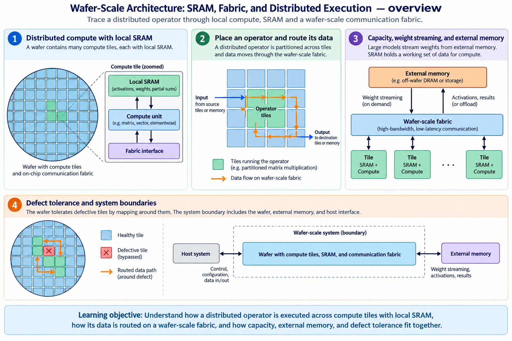
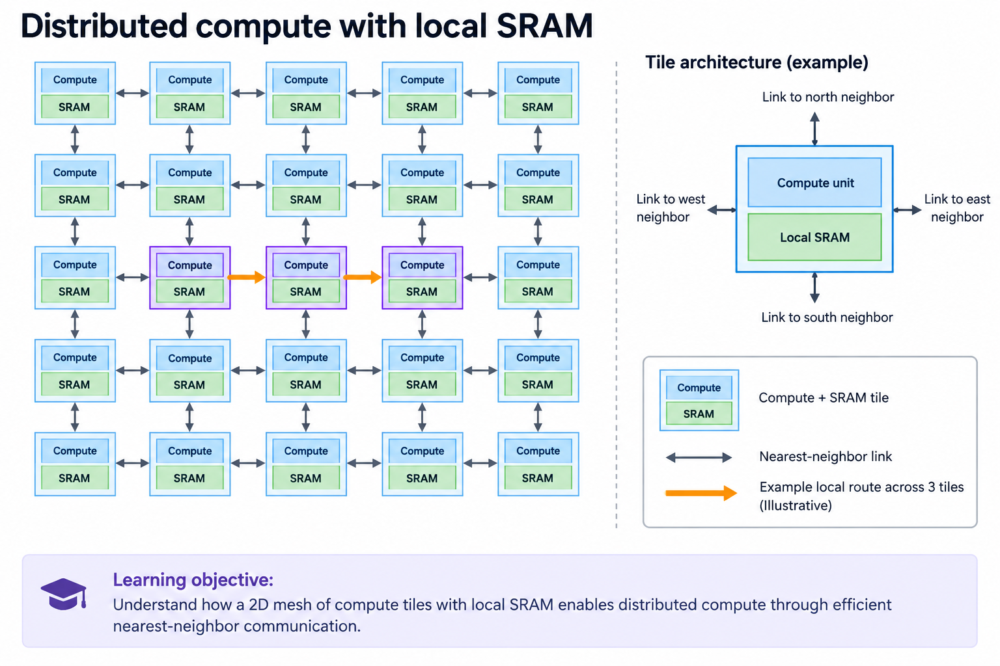
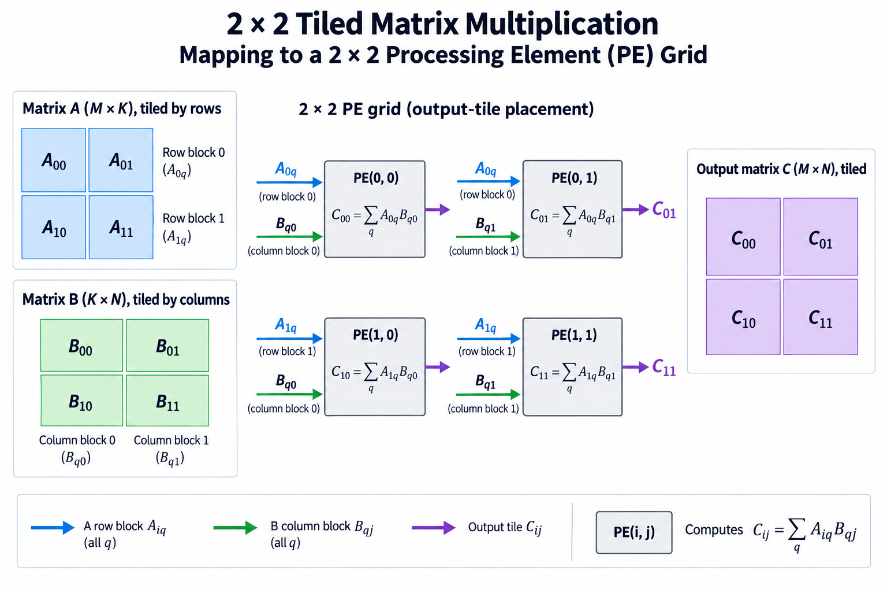
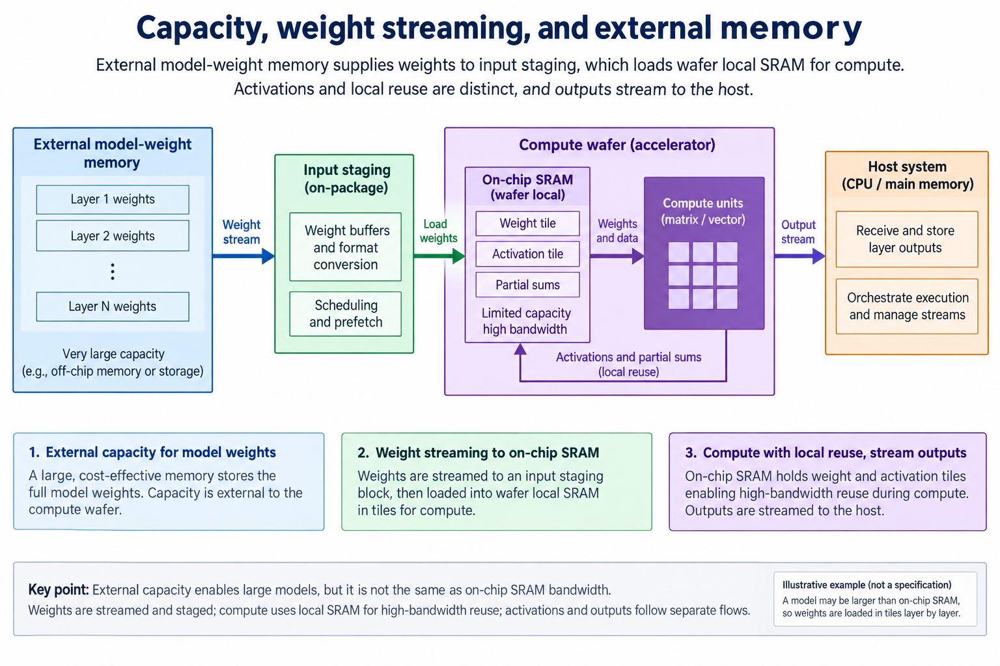
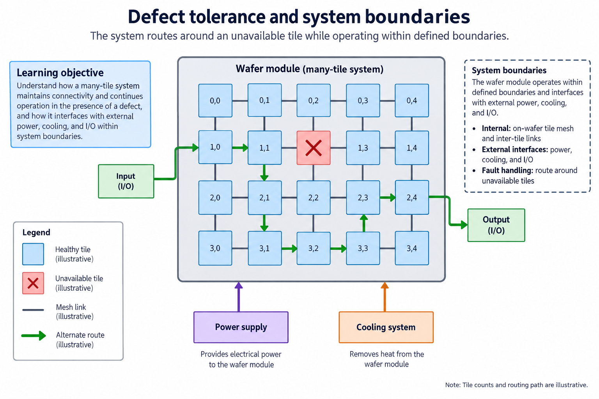

## Overview

Wafer-scale architecture expands a processor across a large connected field of compute tiles instead of assembling its principal compute from many separately packaged small chips. The overview pairs local arithmetic and SRAM with a communication fabric, compiler placement and external system resources. The important idea is locality across a very large structure; the wafer is not one uniform register file.

This article explains the calculation and data path rather than repeating a product ranking. It connects to [the existing Cerebras architecture discussion](/blog/the-wafer-scale-bet-cerebras/) and develops the distinction between local bandwidth, total capacity and external movement. All small meshes and rates in examples are illustrative.

The dated snapshot is 2026-09-13. Cerebras documents WSE-3 and also presents CS-4 using WSE-3 Turbo. Its CS-4 page describes first shipments beginning “this quarter”; that wording is not evidence of general availability in every location. Keep architecture disclosure and confirmed deployment separate.

## Deep dive

### Distributed compute with local SRAM

The mesh figure repeats a compute-plus-memory tile and connects neighboring tiles. An operation can reuse values in local SRAM while messages move other values through the fabric. Short local paths and parallel private memories provide a different organization from a GPU's external HBM feeding many execution units.

A distributed matrix operation assigns subproblems to tiles. Each tile performs local arithmetic and stores local state; communication provides operands or partial results required by other tiles. The arithmetic remains a sum of products, but mapping determines where those products occur and how intermediate values travel.

For an illustrative 2×2 output matrix, place one output element on each of 4 logical tiles. Broadcast or route row operands from $$A$$ and column operands from $$B$$, accumulate the two local products and collect $$[[19,22],[43,50]]$$ for the standard 2×2 example. This demonstrates a mapping, not the specific compilation strategy of a Cerebras runtime.

The [WSE-3 announcement](https://www.cerebras.ai/press-release/cerebras-announces-third-generation-wafer-scale-engine) describes many AI cores, local SRAM and a large fabric. Aggregate memory bandwidth sums simultaneous accesses over many locations. It does not mean one core can read all memory at that aggregate rate. A hot spot, long route or unbalanced operator can leave much of the distributed capacity idle.

Explain bandwidth with an access pattern: who reads which memory, at what distance, and with what contention? Capacity determines whether state fits; local bandwidth determines how fast nearby arithmetic can be fed; the fabric determines how nonlocal dependencies proceed. These properties must be considered together.

### Place an operator and route its data

The placement figure separates the compiler's assignment from the messages used during execution. A graph contains operators and dependencies. Placement maps work and state onto hardware locations; routing then connects producers and consumers. An efficient mapping keeps frequently reused state close and balances work without overloading shared paths.

Suppose 4 logical tiles each calculate 1 quarter of an output tensor. If one tile receives twice as much arithmetic as the others, the synchronized stage completes when that tile finishes. Equal tile counts do not imply balanced work. Irregular operators, variable-length inputs and sparse dispatch can change the balance during execution.

For a reduction, partitioning $$K$$ produces local partial outputs. The result $$C=C_0+C_1$$ requires communication and addition after both are ready. Partitioning independent output columns instead can avoid that particular reduction, but may require replicating input rows. One mapping trades reduction traffic for replicated input movement. The best choice depends on sizes, reuse and available routes.

A compiler also handles physical restrictions and the supported execution model. The educational mesh diagram does not disclose every instruction or routing decision in a commercial system. Use public architecture descriptions for those facts and label any inferred mapping as a conceptual example.

The [Cerebras chip description](https://www.cerebras.ai/chip) establishes the broad compute/memory/fabric organization. To evaluate an actual workload, inspect documented placement/profiling information and end-to-end results. A large aggregate compute count is only useful when the graph can distribute its arithmetic and satisfy its dependencies.

### Capacity, weight streaming, and external memory

The capacity figure adds external model storage because local SRAM is finite. A wafer can provide very high local access rates while a model's full weights or state live elsewhere. A streaming design brings the required portion onto the compute structure, reuses it and replaces it according to the execution schedule.

For an illustrative model with 10 billion 2-byte parameters, weight payload alone is 20 billion bytes, about 18.63 GiB. Activations, metadata, temporary buffers and any optimizer state add to the resident requirement. A local SRAM capacity figure must be compared with that complete requirement, not only the nominal parameter count.

Streaming cost depends on the reuse interval. If a 100-MB weight block is loaded once and used for many input examples, its external cost can be amortized. If it must be repeatedly reloaded for a dependency pattern with little reuse, external traffic can dominate. Local SRAM bandwidth does not remove the time to refill it.

Keep three budgets separate: local storage, fabric communication and external I/O. A large aggregate SRAM rate describes simultaneous local accesses; an external link rate describes movement into or out of the system; a request latency includes startup, serialization and synchronization. Mixing their units or scopes produces impossible throughput estimates.

Cerebras' [CS-4 page](https://www.cerebras.ai/cs4) describes newer system I/O and power organization around WSE-3 Turbo. Treat those as system-level disclosures, not a replacement for workload measurements. The practical question is whether the model's placement and streaming schedule expose enough reuse and parallelism to benefit from the wafer's local organization.

### Defect tolerance and system boundaries

The final figure shows an unavailable location and an alternative route. A large physical structure needs mechanisms for manufacturability and usable connectivity. Redundancy, repair and routing around defects can preserve a functioning logical system. The small example is conceptual; it does not specify a vendor's exact spare allocation or defect map.

A compiler/runtime must execute against the usable topology and supported resource set. If a route detours, its contention and latency can differ from a direct neighbor path. Logical regularity and physical regularity are therefore related but not identical. An architecture description should distinguish the abstraction exposed to software from manufacturing details that are not public.

The wafer module also requires power delivery, cooling and external I/O. Larger connected compute does not eliminate those physical constraints. Thermal and electrical limits can constrain sustained operation independently of a theoretical arithmetic rate. A system's measured power includes components beyond the compute wafer.

A useful review follows one operator through its local state, required messages and output boundary. Then ask how placement changes under load, how errors are handled, and what system resource limits sustained progress. Do not turn an undisclosed redundancy mechanism into an invented circuit diagram.

This design's innovation is a different locality and communication envelope for distributed AI execution. Its limitations include graph mapping, capacity, I/O, physical system constraints and software support. Those limitations are not unique to wafer-scale systems, but their tradeoffs occur at different boundaries than in a conventional many-package accelerator system.

### A bandwidth comparison with matching boundaries

Consider a hypothetical distributed memory system with 1,000 private SRAM banks, each sustaining 10 GB/s to its local compute. Summing the rates gives 10 TB/s if all banks are used concurrently. One task assigned to one bank still sees at most that bank's local rate, before its access pattern and port limits. A task reading remote banks also needs fabric bandwidth. The aggregate does not describe a global sequential read stream.

Compare this with a hypothetical external memory subsystem sustaining 1 TB/s across many clients. Its rate is measured at the shared external boundary. The private-bank aggregate and external boundary answer different questions; dividing them gives no valid application speedup. A workload that reuses local state may exploit the first organization well. A workload that streams new external state may be limited by refill.

To make the comparison useful, count useful arithmetic, local bytes, routed bytes and external bytes for the same operator. Specify where state resides before timing begins. If one system's benchmark excludes weight loading while the other's includes it, report that difference instead of presenting a single ratio.

Finally check capacity and synchronization. A mapping with excellent local bandwidth but insufficient resident state can require repeated streaming. A mapping with enough memory but one unbalanced reduction can wait on a small subset of resources. The workload trace, not the largest number in the specification, determines which architecture feature changes the result.

### A worked engineering decision

Take a large matrix operation and divide its output into independent subtiles. Each subtile still needs the matching A row block, B column block and all required reduction chunks. Physical proximity between processing elements does not change those dependencies. A mesh drawing becomes useful only when it identifies which values are resident, which are forwarded and which output ownership remains local.

Now imagine replacing a balanced partition with 1 that gives a small group of processing elements most of the work. The fabric and local storage can be sophisticated while those elements determine completion time. Load balance is consequently part of the computation mapping, not a separate administrative concern. Irregular operators and sparse access can produce a different balance from a dense matrix partition.

For communication accounting, name the boundary. Aggregate local SRAM bandwidth across a wafer is not equivalent to the bandwidth of 1 external link carrying a complete tensor. A local operand can be reused by adjacent compute without another external load, yet still consume local reads and fabric transfers. Count those traffic classes separately. Published aggregate figures describe a vendor-defined architecture quantity; they should not be substituted into an application latency formula without a compatible traffic model.

A useful compiler investigation records tile placement, communication routes or summaries made available by the tool, and the slowest stage in the execution schedule. Compare against the same numerical operation on the baseline mapping. Larger physical scale does not guarantee smaller latency for every small request, especially when the useful workload cannot occupy much of the machine.

The architectural departure is bringing an unusually large compute and SRAM fabric into 1 wafer-scale system. The diagrams here teach placement and data lifetime at that scale. They are not proprietary routing disclosures, package yield estimates, or measured CS-system performance.

## Conclusion

A wafer-scale processor calculates through distributed local arithmetic and communication. Its local SRAM, placement and routing are central to the design; external capacity and system I/O remain necessary parts of the full pipeline.

Use aggregate numbers only after identifying their scope. Then map a real operator, account for its local reuse and nonlocal dependencies, and measure the complete execution. The educational FPGA array provides a small visible starting point for this discipline, while wafer-scale systems extend the locality and physical scale in ways that require their own compiler and system analysis.

### Sources

- [Cerebras chip architecture](https://www.cerebras.ai/chip)
- [WSE-3 announcement](https://www.cerebras.ai/press-release/cerebras-announces-third-generation-wafer-scale-engine)
- [CS-4 / WSE-3 Turbo system](https://www.cerebras.ai/cs4)
