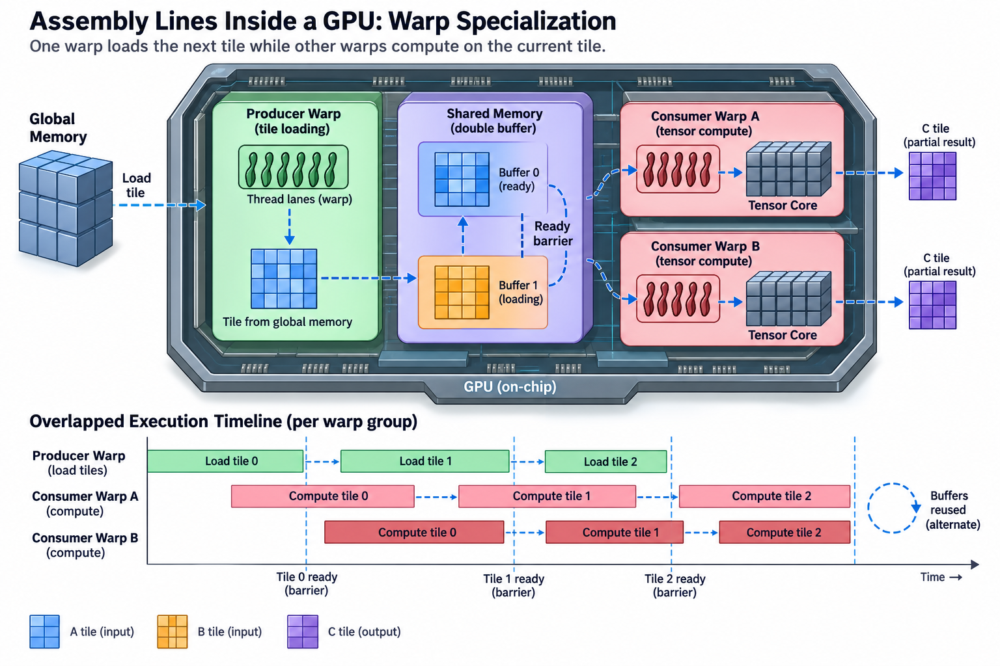
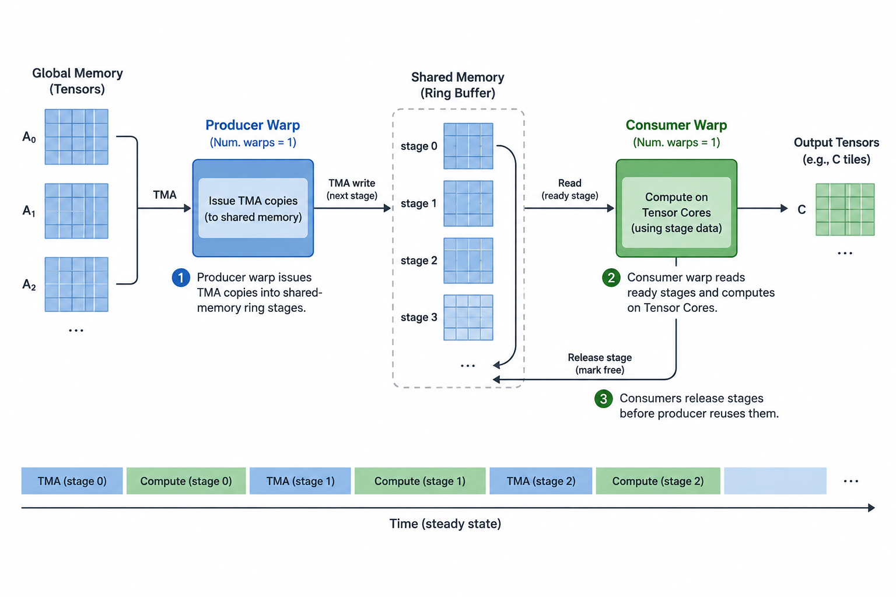
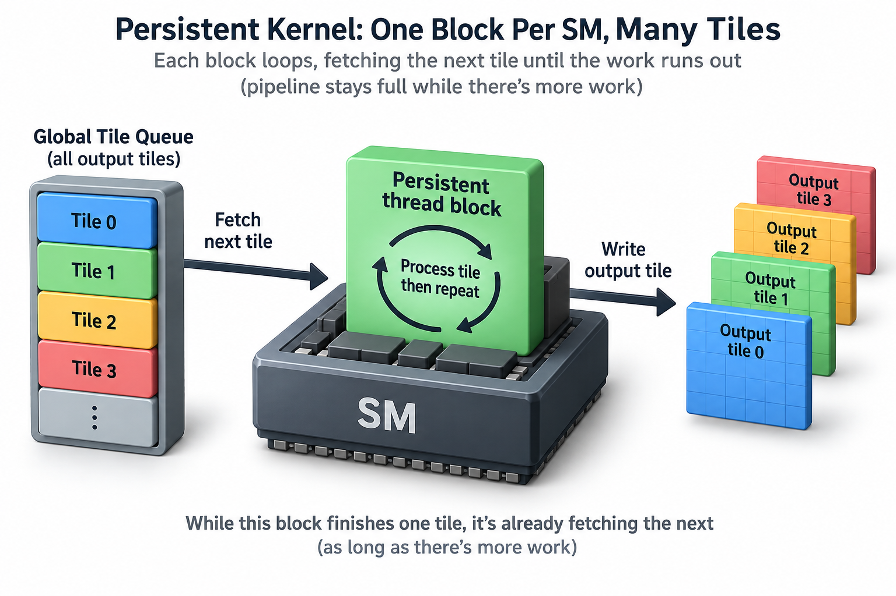
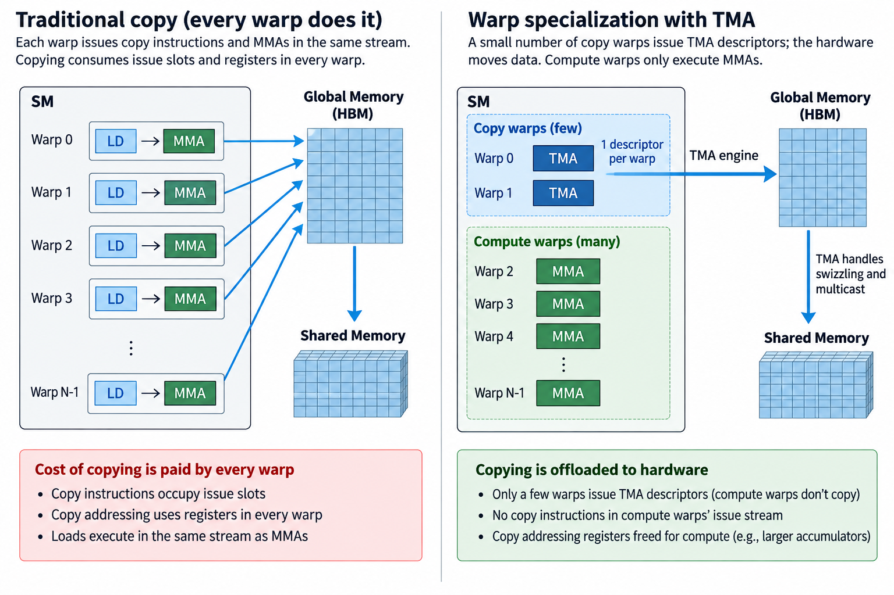

## Overview

FlashAttention-3 sustains roughly 740 TFLOPS of FP16 attention on an H100, about 75% of the chip's rated tensor-core peak, and in the kernel that does it, a third of the warps never execute a single multiply. They only fetch data. Other warps only compute. A few handle stores. This is not an accident of scheduling; it is the design. The fastest kernels on Hopper and Blackwell are organized like factory assembly lines, with each warp holding down 1 station, and the pattern has a name: warp specialization.

If you profile a naive kernel and a warp-specialized 1 doing the same math, the difference is not the instruction count. It is what each warp is *waiting* on. This article is about why splitting warps into producers and consumers wins, how the hardware makes it cheap, and how to reason about the speedup with pencil and paper.

## Deep dive

### From "every warp does everything" to stations on a line

The classic CUDA mental model is homogeneous. You launch a block of threads, every warp runs the same loop, and each iteration loads a tile from global memory to shared memory, syncs, computes on it, syncs again. Latency is hidden statistically. When 1 warp stalls on a memory load, the SM's schedulers pick another warp that is ready. This works, and for years the tuning advice was simply "raise occupancy so the scheduler has choices." (For why GPUs are built around this throughput trade, see [CPU vs GPU](/blog/cpu-vs-gpu-latency-vs-throughput-machines/).)

The model started cracking when tensor cores made compute extremely dense. A modern matrix-multiply-accumulate (MMA) instruction retires thousands of FLOPs, so a compute warp's inner loop is short and register-hungry. Big accumulator tiles live entirely in registers. Meanwhile the loads feeding those MMAs have to cover hundreds of nanoseconds of HBM latency (numbers in [The Memory Wall](/blog/the-memory-wall-latency-numbers/)). Ampere's answer was software pipelining inside each warp. A warp issues a global-to-shared copy with `cp.async` and the copy lands in the background, so you double- or triple-buffer tiles while computing on the previous one. Every warp is still a generalist. It interleaves copy instructions and MMAs in 1 instruction stream, and it pays for both jobs' registers at once.

Hopper enabled a more strongly separated producer-consumer design by shipping 2 pieces of hardware that decouple the jobs entirely:

- **TMA (Tensor Memory Accelerator).** A per-SM copy engine. 1 thread (not a warp, 1 thread) writes a small descriptor saying "move this tensor tile from global memory into shared memory," and the engine does the address arithmetic, bounds handling, and swizzling on its own. The engine removes most per-element copy instructions. Issuing descriptors and coordinating barriers still costs some instructions and registers.
- **Asynchronous warpgroup MMA (WGMMA).** Tensor-core instructions issued by a warpgroup (4 warps, 128 threads) that read operands directly from shared memory and complete asynchronously. The issuing warps can go wait on a barrier while the tensor core grinds.

Both engines report completion through **asynchronous barriers** (`mbarrier` objects living in shared memory). An mbarrier counts arrivals. For TMA it can also count *bytes*: a TMA load is pointed at a barrier, and the barrier flips when the expected transaction count has landed. Warps block on `mbarrier.wait` cheaply, consuming no issue bandwidth while parked.

With those pieces, the natural kernel shape is a bounded buffer straight out of an operating systems textbook. Shared memory holds a ring of K tile stages. **Producer warps** issue TMA loads into empty stages and arrive on "stage full" barriers. **Consumer warpgroups** wait on "full," run WGMMAs against the stage, then arrive on "stage empty" so the producer can reuse it. An epilogue or **storer** role drains accumulators back out, often via TMA stores. Producers and consumers never touch the same synchronization except through the ring's barriers.

Hopper adds 1 more feature that makes the split efficient rather than merely tidy: **register reallocation**. A warpgroup can resize its register allocation at runtime with `setmaxnreg`. Producer warps, which only babysit TMA descriptors, shrink to as few as 24-40 registers each. Consumer warpgroups grow to 224-240 to hold giant accumulator tiles. In FlashAttention-3's FP16 forward kernel the producer warpgroup drops to 24-32 registers while each consumer warpgroup takes ~160-240. That is exactly how the kernel affords 2 consumer warpgroups' worth of accumulators without spilling. The deadweight of "every warp carries every job's registers" is gone.

### A worked example you can check by hand

Take a Hopper-class GEMM tile and put real numbers on the pipeline. Say each thread block owns a 128×256 output tile of an FP16 matrix multiply, and iterates over the K dimension in slices of 64.

Start with the bytes per stage. 1 K-slice needs a 128×64 tile of A and a 64×256 tile of B:
- A: 128 × 64 × 2 B = 16 KB
- B: 64 × 256 × 2 B = 32 KB
- Total: **48 KB per stage**.

FLOPs per stage: 2 × 128 × 256 × 64 = **4.19 MFLOP**.

Compute time comes next. An H100 SXM has 132 SMs and ~989 TFLOPS of dense FP16 tensor throughput, so 1 SM contributes ~7.5 TFLOPS. 4.19 MFLOP / 7.5 TFLOPS ≈ **0.56 µs** of tensor-core work per stage.

Load time, worst case: HBM3 bandwidth is 3.35 TB/s, and divided evenly across 132 SMs that is ~25 GB/s per SM. 48 KB / 25 GB/s ≈ **1.9 µs**. Straight from HBM, the loader would be 3.4× slower than the math. Arithmetic intensity shows the same thing. The stage does 4.19 MFLOP on 48 KB, about 87 FLOP/byte, while the H100's ridge point is 989 TFLOPS / 3.35 TB/s ≈ 295 FLOP/byte.

Real GEMMs escape this because tiles are shared. Every block in the same output row needs the same A tiles, and every block in the same column needs the same B tiles. Most fetches therefore hit L2, which runs at several times HBM bandwidth, and TMA multicast (next section) removes duplicate HBM traffic outright. Suppose reuse brings the effective load cost to **0.5 µs per stage**. Now the pipeline math:

- **Monolithic kernel** (load, sync, compute, sync: serial per stage), 8 K-slices: 8 × (0.5 + 0.56) = **8.5 µs** per output tile.
- **Warp-specialized pipeline**: the producer's loads run under the consumer's MMAs, so steady state costs max(0.5, 0.56) per stage. Total ≈ 0.5 + 8 × 0.56 = **5.0 µs**, a 1.7× speedup from overlap alone, and the tensor cores are now busy essentially 90% of the tile's lifetime instead of 53%.

The ring depth falls out of the same numbers. Each stage must hide 1 load latency, so you want enough stages that the producer stays a step or 2 ahead. With 48 KB stages and Hopper's 228 KB of shared memory per SM, a 4-stage ring (192 KB) fits, and that is exactly the regime real CUTLASS Hopper kernels run in: huge shared memory buffers, few threads, low classical "occupancy," near-peak throughput.

Overlap has a startup and drain cost that a steady-state max alone misses. For n tile stages, load service time l, and compute service time c, an ideal 2-station pipeline has

$$
t_{\mathrm{serial}}=n(l+c),\qquad
t_{\mathrm{pipeline}}\approx l+c+(n-1)\max(l,c).
$$

With n equal to 8, l equal to 0.5 microseconds, and c equal to 0.56 microseconds, serial time is 8.48 microseconds and pipelined time is 4.98, a speedup of 1.70. This assumes independent engines, adequate buffering, and no extra synchronization cost. If load service remains 1.9 microseconds because data really stream from HBM without reuse, the pipeline remains load-limited; specialization cannot manufacture bandwidth.

Ring depth addresses latency as well as throughput. A stage must not be overwritten until every consumer has finished reading it. Use transaction-counted full barriers and consumer-completion empty barriers, including phase changes when the ring wraps. Measure stalls before increasing the stage count. Each 48-KiB buffer takes shared memory, which can reduce block residency. Multicast cuts duplicate-transfer cost where blocks genuinely share operands. Specialization improves instruction ownership and overlap. Compare the 2 mechanisms separately against a buffered generalist baseline, since asynchronous copies were already possible before Hopper.

### Going deeper: persistence, clusters, and ping-pong

Warp specialization solves overlap *within* a tile. 3 more mechanisms extend the assembly line across tiles and across SMs.

Persistent kernels come first. Instead of launching 1 block per output tile and eating scheduling gaps between waves, you launch exactly as many blocks as the GPU has SMs (132 on H100), and each block loops, asking a tile scheduler for the next tile until the work runs out. The pipeline never drains between tiles: while consumers finish tile *i*'s epilogue, producers are already prefetching tile *i+1*. This also kills the "wave quantization" tail, where a grid of, say, 200 tiles on 132 SMs runs 1 full wave and then a half-empty 1. Work-centric schedulers like Stream-K go further and split K-ranges across SMs so the last wave stays balanced.

Thread block clusters bring DSMEM and TMA multicast. Hopper added a level between block and grid: a cluster of blocks co-scheduled on the same GPC, where each block can read and write the *other* blocks' shared memory (distributed shared memory, DSMEM). For GEMM the killer feature is TMA multicast. 1 TMA request fetches a B tile from HBM once and deposits it into the shared memory of every block in the cluster simultaneously. In our worked example, a cluster of 4 blocks sharing B tiles cuts B's HBM traffic 4×. That is a large part of how the "effective 0.5 µs load" is actually achieved rather than assumed.

Ping-pong scheduling is the third mechanism. Specialization also overlaps *compute with compute*. In FlashAttention-3, attention needs both matrix multiplies (tensor cores) and softmax exponentials (the multi-function units, a much slower resource that is otherwise idle during GEMMs). FA3 runs 2 consumer warpgroups and uses barriers to stagger them: while warpgroup A runs its GEMMs, warpgroup B runs its softmax on the previous block, then they swap. The paper credits this overlap, on top of the producer-consumer TMA pipeline, for pushing FP16 forward from ~570 to ~620-740 TFLOPS depending on shape. Those figures are the authors' own benchmarks. They do line up with independent reproductions in vLLM and SGLang deployments.

On Blackwell the trend goes further, not back. The fifth-generation tensor core (`tcgen05`) takes its accumulators out of the register file into dedicated tensor memory (TMEM). An MMA is launched by a *single thread*, with completion again signaled through barriers. Kernels grow more roles: an MMA-issue warp, TMA load warps, epilogue warps moving TMEM to registers to global. The assembly line is winning so decisively that the hardware is being reshaped around it.

### Common misconceptions

"High occupancy is how you hide latency, so specialized kernels with few warps must be leaving performance on the table." Occupancy hides latency by giving the scheduler many interchangeable warps. Specialization hides it structurally, by making the copy engine and tensor core run concurrently by construction. A CUTLASS Hopper GEMM often runs 1 block of a few 100 threads per SM, single-digit-percent "occupancy" by the classic metric, at 90%+ of peak FLOPS. The registers and shared memory that low occupancy frees up are precisely what the fat accumulators and deep tile rings consume. Chasing the occupancy number would make the kernel slower.

"Warp specialization is just double buffering with extra steps." Double buffering on Ampere still charges every warp for both jobs: copy instructions occupy issue slots in the same stream as MMAs, and copy addressing burns registers in every warp. A `__syncthreads()` then stalls the whole block at every handoff. Specialization moves the copy job onto hardware (TMA) driven by warps you can nearly 0 out via `setmaxnreg`. It also replaces block-wide syncs with per-stage mbarriers, so a slow stage only stalls the warps that actually depend on it. The pattern composes in ways buffering cannot: ping-pong softmax/GEMM overlap is warp specialization with no memory copy in sight.

"TMA is basically a faster memcpy." TMA's bandwidth is the same HBM and L2 bandwidth everyone else gets. What it removes is the *instruction and register cost* of copying. 1 thread issues 1 descriptor instead of 128 threads each computing addresses, predicating bounds, and issuing loads per tile. The engine also handles swizzling into bank-conflict-free layouts plus multicast, so that no consumer issues an independent copy. On a kernel that was instruction-issue-bound or register-spilling, that is worth far more than any bandwidth delta. On a purely bandwidth-bound kernel, TMA alone speeds up almost nothing.

### Why this pattern matters beyond 1 kernel

Warp specialization is the microcosm of a theme that runs through this whole series: peak silicon is only reachable when you stop treating execution units as 1 pool and start choreographing them. DeepSeek's DeepGEMM and DeepEP kernels, which we covered in [When a Kernel Cuts API Prices 50%](/blog/when-a-kernel-cuts-api-prices/), lean on exactly these Hopper mechanisms, down to SMs partitioned into communication and compute roles. The disaggregation story repeats at every scale: prefill and decode get separate warps here, separate SMs in DeepEP, and [separate chips in Rubin CPX](/blog/prefill-gets-its-own-chip-rubin-cpx/). And it is a big part of why LLM-generated kernels still trail experts on [KernelBench](/blog/a-year-of-kernelbench/)-style tasks. Writing a correct producer-consumer pipeline with transaction-counted barriers and register reallocation is systems design, not loop translation.

For a performance engineer the practical takeaway is diagnostic. When Nsight Compute shows tensor pipes under 50% busy while memory is not saturated either, the kernel usually has an overlap problem rather than a resource problem. The fix is structural: give the loads their own warps, put barriers between the stations, and let the line run.

## Conclusion

- Hopper's TMA and async WGMMA turn loading and computing into independent hardware activities. Warp specialization is the software shape that exploits it. Producer warps feed a barrier-guarded shared-memory ring, consumer warpgroups drain it, and `setmaxnreg` shifts registers to where the accumulators live.
- The win is arithmetic you can do by hand. A serial kernel pays load + compute per stage, and a specialized pipeline pays max(load, compute). With TMA multicast and L2 reuse pulling effective load below compute time, tensor cores run at ~90% duty cycle instead of ~50%.
- Persistent blocks, thread block clusters with DSMEM, and ping-pong consumer scheduling extend the same overlap across tiles, across SMs, and across compute units. That is the pattern behind FlashAttention-3's 740 TFLOPS and near-peak CUTLASS GEMMs.

### Sources

- Shah, Bikshandi, Zhang, Thakkar, Ramani, Dao. *FlashAttention-3: Fast and Accurate Attention with Asynchrony and Low-precision*. https://arxiv.org/abs/2407.08608
- NVIDIA Developer Blog. *NVIDIA Hopper Architecture In-Depth* (TMA, thread block clusters, DSMEM, async barriers). https://developer.nvidia.com/blog/nvidia-hopper-architecture-in-depth/
- NVIDIA CUTLASS (warp-specialized Hopper/Blackwell GEMM kernels, ping-pong and cooperative schedules). https://github.com/NVIDIA/cutlass
- Osama et al. *Stream-K: Work-centric Parallel Decomposition for Dense Matrix-Matrix Multiplication on the GPU*. https://arxiv.org/abs/2301.03598
- CUDA C++ Programming Guide (asynchronous barriers, TMA/`cp.async.bulk.tensor`, cluster APIs). https://docs.nvidia.com/cuda/cuda-c-programming-guide/
- DeepSeek DeepGEMM (warp-specialized FP8 GEMMs in practice). https://github.com/deepseek-ai/DeepGEMM

*Part of the [GPU Programming & Performance](/series/gpu-performance/) learning path. Browse its published articles by topic.*
