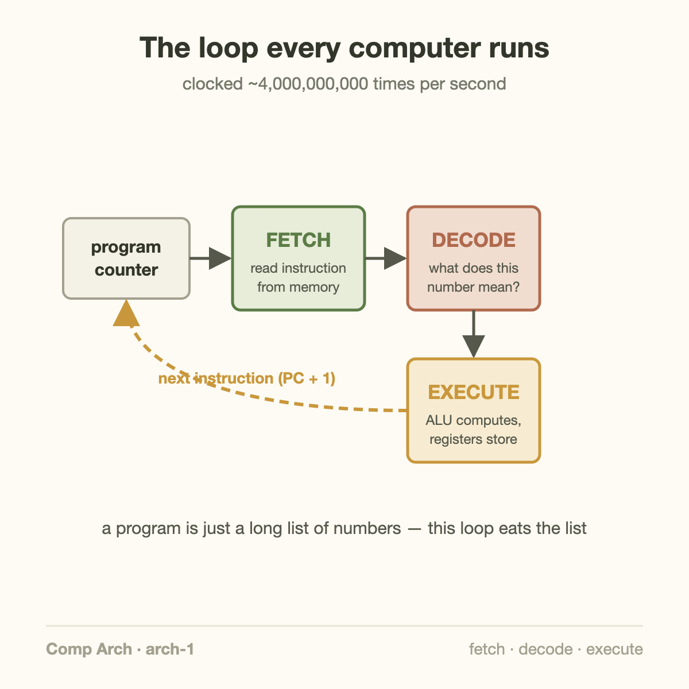
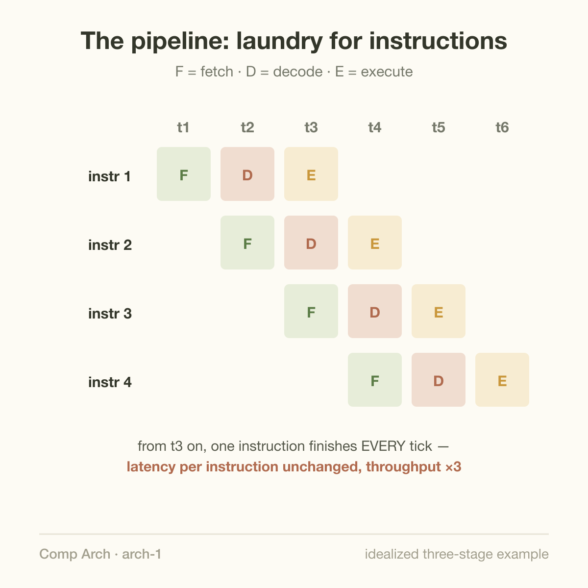

A modern CPU core completes instructions at a rate of several billion per second. The machinery behind that number is a loop simple enough to draw on a napkin — and a set of tricks for overlapping it that gets genuinely wild.

This article opens my Computer Architecture & ASIC series: a ground-up course, from how one instruction executes to how AI chips get designed. No electrical engineering background assumed. We start at the bottom.

## The loop every computer runs

Strip away sixty years of refinement and every CPU still does exactly three things, forever:

1. **Fetch** — read the next instruction from memory (instructions are just numbers, sitting at an address the *program counter* points to)
2. **Decode** — figure out what that number means: "add these two registers," "load from this address," "jump if zero"
3. **Execute** — do it, and store the result

That's the whole model of computation your laptop implements. A program is a long list of such instructions; the CPU is a machine that eats the list. When people say a chip runs at "4 GHz," they mean this machinery is clocked 4 billion times per second.

The natural next question: does one instruction really finish in a quarter of a nanosecond? No — and the way CPUs get *around* that is the first great idea of computer architecture.

## The laundry insight

Suppose each of the three steps takes one clock tick. Done naively — fetch, decode, execute, then start over — each instruction takes 3 ticks, and two-thirds of your hardware sits idle at any moment: the fetch circuitry rests while execute works, and vice versa.

Now think about laundry. Washing takes 30 minutes, drying 30, folding 30. You do *not* wait for load one to be folded before starting load two's wash. While load one dries, load two washes. Every 30 minutes, a finished load comes out — even though each load still takes 90 minutes end to end.

CPUs do exactly this. It's called **pipelining**:

While instruction 1 executes, instruction 2 is being decoded and instruction 3 fetched. Each instruction still takes 3 ticks of *latency*, but the machine completes one instruction *per tick* of throughput. Real designs slice the work much finer — 14 to 19 pipeline stages are typical in modern cores — because shorter stages let the clock tick faster.

Hold onto the distinction that just appeared, because it rules everything in this series: **latency** (how long one thing takes) versus **throughput** (how many things finish per second). Pipelining doesn't make any instruction faster. It makes the *stream* faster.

## Where it breaks

The laundry analogy hides a problem laundry doesn't have: instructions depend on each other. If instruction 2 needs the result of instruction 1, it can't execute until 1 is done — the pipeline stalls, and bubbles of idle hardware march through it. Worse, about one instruction in five is a *branch* — "if x, jump there" — and the pipeline can't fetch what comes next until it knows which way the branch went.

How CPUs fight back — by *predicting* branches and gambling on the outcome, correctly ~95% of the time — is the next article. The point for now: nearly all the complexity of a modern core exists to keep the simple loop from ever having to wait.

## What this means for AI chips

Here is why this matters for the rest of this blog. The pipeline is the smallest instance of the idea that dominates all high-performance hardware, including GPUs and TPUs: **hide latency by overlapping work**. A GPU serving an LLM overlaps memory loads with math; a training cluster overlaps gradient communication with computation; an inference server overlaps one user's prefill with another's decode. Same laundry insight, scaled from nanoseconds to datacenters.

And the pipeline's enemy — dependencies that force waiting — is the same enemy at every scale. Much of AI systems engineering is, at heart, dependency-breaking so that pipelines of every size stay full.

## Takeaway

- A CPU is a fetch-decode-execute loop clocked billions of times per second; a program is just the list it consumes.
- Pipelining overlaps the stages like laundry loads: per-instruction latency stays the same, but throughput approaches one instruction per tick. Modern cores use 14–19 stages.
- Latency vs throughput, and hiding latency by overlapping — the two ideas you just learned — govern every chip in this series, from CPUs to TPUs.

## Sources

- Patterson & Hennessy — *Computer Organization and Design* (the standard pipeline treatment)
- Onur Mutlu — [ETH Computer Architecture lectures](https://safari.ethz.ch/architecture/) (free, excellent)
- Agner Fog — [The microarchitecture of Intel, AMD and VIA CPUs](https://www.agner.org/optimize/) (real pipeline depths and timings)

---

*Part of the **Computer Architecture & ASIC** series — a ground-up course. Next: branch prediction, or why your CPU is a gambler that wins 95% of the time.*
