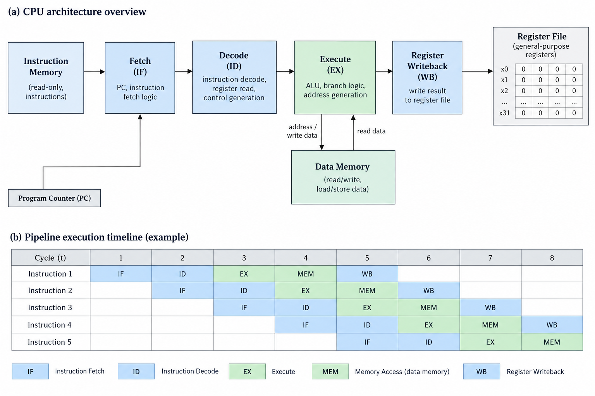
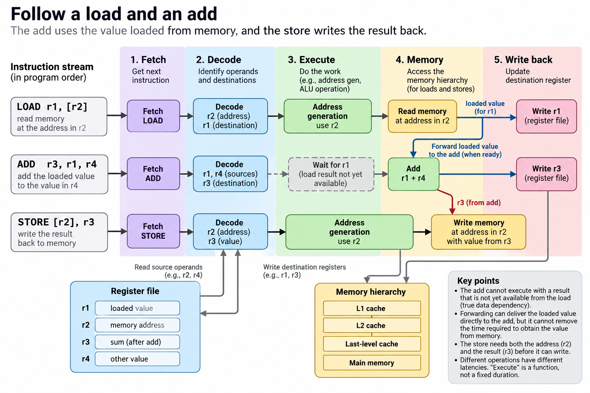
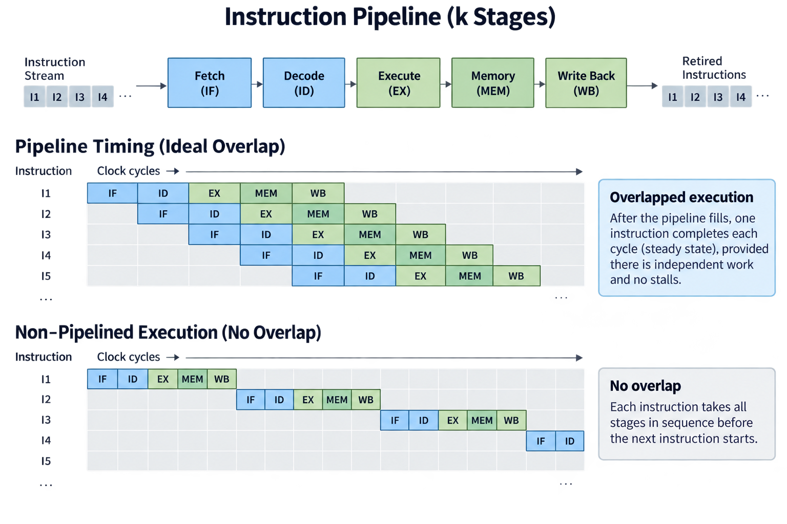
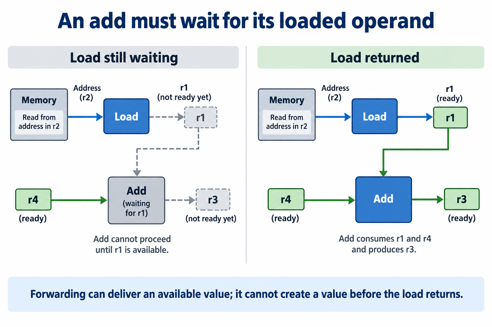
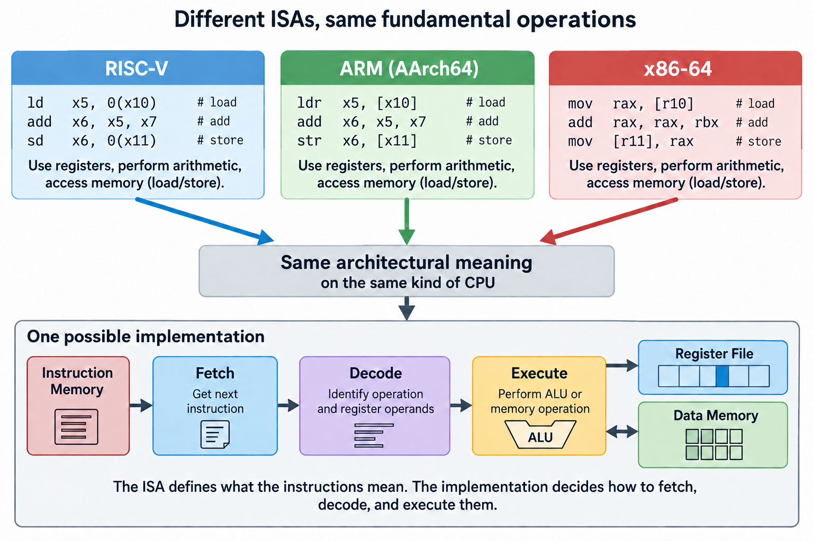

## Overview



A modern CPU core completes instructions at a rate of several billion per second, and the machinery behind that number is a loop simple enough to draw on a napkin, and a set of tricks for overlapping it that gets genuinely wild.

This article opens my Computer Architecture & ASIC series: a ground-up course, from how 1 instruction executes to how AI chips get designed. No electrical engineering background assumed. We start at the bottom.

## Deep dive

### The loop every computer runs

Strip away 60 years of refinement and every CPU still does exactly 3 things, forever:

1. **Fetch**: read the next instruction from memory (instructions are just numbers, sitting at an address the *program counter* points to)
2. **Decode**: figure out what that number means: "add these 2 registers," "load from this address," "jump if 0"
3. **Execute**: do it, and store the result


That's the whole model of computation your laptop implements: a program is a long list of such instructions, and the CPU is a machine that eats the list. When people say a chip runs at "4 GHz," they mean this machinery is clocked 4 billion times per second.

The natural next question: does 1 instruction really finish in a quarter of a nanosecond? No. The way CPUs get *around* that is the first great idea of computer architecture.

### The laundry insight

Suppose each of the 3 steps takes 1 clock tick, and suppose you do it naively, fetch, decode, execute, then start over: each instruction takes 3 ticks, and 2/3 of your hardware sits idle at any moment: the fetch circuitry rests while execute works, and vice versa.

Now think about laundry. Washing takes 30 minutes, drying 30, folding 30. You do *not* wait for load 1 to be folded before starting load 2's wash. While load 1 dries, load 2 washes. Every 30 minutes, a finished load comes out, even though each load still takes 90 minutes end to end.

CPUs do exactly this. It's called **pipelining**:


While instruction 1 executes, instruction 2 is being decoded and instruction 3 fetched, so each instruction still takes 3 ticks of *latency* while the machine completes 1 instruction *per tick* of throughput. Real designs can slice the work more finely to shorten stages and support higher clock frequencies; depths vary widely by implementation.

Hold onto the distinction that just appeared, because it rules everything in this series: **latency** (how long one thing takes) versus **throughput** (how many things finish per second). Pipelining doesn't make any instruction faster. It makes the *stream* faster.

### Where it breaks

The laundry analogy hides a problem laundry doesn't have: instructions depend on each other. If instruction 2 needs the result of instruction 1, it can't execute until 1 is done, so the pipeline stalls and bubbles of idle hardware march through it. Take a *branch*, "if x, jump there": the pipeline can't fetch what comes next until it knows which way the branch went.

How CPUs fight back, by *predicting* branches and speculating on the outcome with accuracy that depends on the workload and predictor, is the next article, and the point for now is that nearly all the complexity of a modern core exists to keep the simple loop from ever having to wait.

### What this means for AI chips

Here is why this matters for the rest of this blog: the pipeline is the smallest instance of the idea that dominates all high-performance hardware, including GPUs and TPUs: **hide latency by overlapping work**, so a GPU serving an LLM overlaps memory loads with math, a training cluster overlaps gradient communication with computation; an inference server overlaps 1 user's prefill with another's decode. Same laundry insight, scaled from nanoseconds to datacenters.

And the pipeline's enemy, dependencies that force waiting, is the same enemy at every scale, and much of AI systems engineering is, at heart, dependency-breaking so that pipelines of every size stay full.

### What an instruction can see

Before examining a pipeline, distinguish the software contract from the machinery that implements it. The **instruction set architecture**, or ISA, defines operations, visible registers, instruction encodings, and the behavior software can rely on, while the **microarchitecture** is a particular implementation: its pipeline, caches, execution units, predictors, and scheduling logic. 2 cores can run the same program while using very different internal designs.

A register is a small named storage location that instructions can access directly, so an arithmetic instruction might read 2 registers and place their sum in a third. A load reads a value from a memory address into a register; a store writes a register value to memory. The program counter holds the address of the current instruction, while branches and jumps change the next instruction location.

This view is deliberately incomplete: real ISAs include additional state and rules, such as exceptions and privilege modes, but it is enough to follow a small program. The CPU is not executing source-code sentences directly: a compiler translates those sentences into instructions whose effects are specified by the ISA, and the operating system supplies the environment in which the program runs.

### Follow a load and an add



Consider this conceptual sequence, using register names rather than the exact syntax of a particular ISA:

```text
LOAD  r1, [r2]       # read memory at the address in r2
ADD   r3, r1, r4     # add that value to the value in r4
STORE [r2], r3       # write the result back to memory
```

Fetch brings the load's encoded instruction toward the decoder, decode identifies its register operand and destination, and address-generation hardware computes the memory address. The load then gets the value through the memory hierarchy, the value eventually becomes available to the add, and the store needs the resulting sum and an address before it can write the requested value.

The add cannot invent the load result while memory is responding. This is a true data dependency. Forwarding can deliver a result from 1 pipeline stage to another without waiting for a register-file round trip, but it cannot remove the wait for a result that is not yet available. An independent instruction may execute while that wait continues, depending on the core's design.

This is also why “execute” is not a single fixed-duration action: integer addition, multiplication, a cache hit, and a memory access that misses several cache levels can have different latencies. The 3-stage picture describes functions, not a universal timing specification for modern processors.

### Put numbers on the laundry example



For an ideal pipeline with k stages, each taking 1 clock cycle, a stream of n independent instructions takes approximately k plus n minus 1 cycles. The first instruction must cross all stages; each following instruction then completes 1 cycle later:

$$
T_{\mathrm{cycles}} = k + n - 1.
$$

A nonoverlapped implementation taking k cycles per instruction uses kn cycles, so with 5 stages and 20 instructions, that is 100 cycles without overlap versus 24 cycles with ideal overlap. The speedup is about 4.17, not 5, because pipeline filling and draining still cost time. For a long uninterrupted stream, those fixed costs become less important.

The slowest stage, plus pipeline-register and timing overhead, sets the clock period. Splitting a long stage can allow a shorter clock period, but the new stage adds registers, control complexity, and potentially a larger penalty when work must be discarded, so a deeper pipeline does not automatically improve every program, and the design tradeoff weighs useful work per second, power, area, and the workload's dependencies.

For a real program, a useful performance identity is:

$$
T_{\mathrm{CPU}} = N_{\mathrm{instructions}}\times\mathrm{CPI}\times T_{\mathrm{clock}}
= \frac{N_{\mathrm{instructions}}\times\mathrm{CPI}}{f}.
$$

Here CPI is average cycles per retired instruction, and f is clock frequency. 1 billion instructions at CPI 2 on a 2 GHz core take approximately 1 second. Doubling frequency only halves that time if CPI and the instruction count remain unchanged, because memory delays, thermal limits, and different generated code can break that simple assumption.


You can write an ideal pipeline's throughput benefit as a finite-stream speedup. Let $$n$$ independent instructions pass through $$k$$ equal-duration stages, with no resource conflicts, data stalls, or control recovery. Relative to completing each instruction without overlap,

$$
S(n,k)=\frac{nk}{n+k-1},\qquad \lim_{n\to\infty}S(n,k)=k.
$$

For $$n=20$$ and $$k=5$$, speedup is $$100/24\approx4.1667$$. If the pipelined machine also pays 6 exposed stall cycles, its elapsed stream time becomes 30 cycles and speedup falls to approximately 3.3333. These are equal-clock toy comparisons; a new pipeline stage can also change the clock period and register overhead.

The method improves the baseline by assigning successive instructions to different active stages, and it preserves each instruction's dependency requirements while overlapping independent work. Splitting a stage buys frequency only if the resulting slowest stage plus register overhead is shorter. More stages increase fill cost and can increase branch-recovery cost, so useful retired work per second matters more than stage count. Start with this simple model, add only the stalls observed in a trace or performance counters, and avoid summing overlapping penalties twice. The distinction between elapsed instruction latency and steady-state completion rate still matters when comparing CPU pipelines with much larger GPU and server pipelines.

### 3 kinds of hazards



A **data hazard** appears when an instruction needs a result that is not yet available, and the load-add sequence above is an example. Forwarding, scheduling independent work, or waiting can resolve the timing problem, but the program's result must stay correct no matter which mechanism the design chooses.

A **structural hazard** appears when operations compete for a resource that cannot serve both at once, so in a simplified design, fetching an instruction and accessing data might contend for 1 memory port. Separate instruction and data paths or extra ports can reduce the conflict, but each solution costs hardware.

A **control hazard** appears when the correct next instruction depends on a branch whose outcome is not yet known, and a predictor can select a likely path so fetching continues. If the prediction is wrong, the core throws away the speculative work on that path and redirects to the correct one. Prediction accuracy and penalty depend on the program and the implementation; a single percentage cannot describe all processors.

These hazards explain why an ideal pipeline diagram is an upper-bound story. Real throughput includes bubbles, competing resources, and recovery. Measuring retired instructions per cycle connects the diagram to what the program actually accomplished.

### ARM, RISC-V, and x86 belong in this foundation



ARM, RISC-V, and x86 are useful concrete examples of the software contract. These ISA families belong in a foundation course. AArch64, the 64-bit execution state used by many ARM systems, RISC-V, and x86-64 all support arithmetic, memory access, and control flow, but their encodings, register sets, and architectural rules differ. Understanding that distinction keeps you from mistaking an ISA name for a complete description of a processor.

RISC-V is useful for teaching because its specification presents a base integer ISA and optional extensions. A small example can expose instruction fields and register operands without first explaining a large compatibility history. ARM is another good example of a load/store architecture and shows up in phones, servers, and the CPUs paired with some accelerators, while x86-64 offers a contrast in encoding and historical compatibility.

The labels “RISC” and “CISC” do not directly predict a modern chip's speed or energy use, because a high-performance implementation may decode architectural instructions into internal operations, execute several independent operations at once, and use sophisticated speculation, so a simple RISC-V core and a large out-of-order RISC-V core can have very different performance while implementing compatible instructions.

This opening article only needs the ISA-versus-implementation distinction, while a later article can compare a short load-add-branch sequence across families, then discuss extensions, privilege, memory ordering, and the cost of implementation. Keeping that comparison connected to 1 program makes it a lesson in architecture rather than a catalog of product names.

### Completion is not always commitment

Modern out-of-order cores can execute an independent instruction before an older stalled instruction, and they track dependencies and keep results internally until it is safe to make the architectural effects visible. **Retirement** or commitment advances the program's visible completed state in a controlled order, supporting correct behavior and precise exceptions.

Imagine an older load faults while a younger arithmetic instruction has already executed. The system must be able to report the fault as though the program reached the problematic instruction in its specified order. Internal bookkeeping separates speculative work from committed effects, which is a major reason a modern core is more complex than a literal 3-box loop.

For now, use the loop to understand what an instruction requires, the pipeline to understand overlap, and retirement to understand which work counts as completed program progress. Those 3 views remain useful when later articles add caches, speculation, vector operations, and accelerators.

## Conclusion

- A CPU is a fetch-decode-execute loop clocked billions of times per second; a program is just the list it consumes.
- Pipelining overlaps the stages like laundry loads: per-instruction latency stays the same, but throughput approaches 1 instruction per tick. Actual depth and completion rate depend on the design and workload.
- Latency vs throughput, and hiding latency by overlapping, the 2 ideas you just learned, govern every chip in this series, from CPUs to TPUs.

### Sources

- Patterson & Hennessy, *Computer Organization and Design* (the standard pipeline treatment)
- Onur Mutlu, [ETH Computer Architecture lectures](https://safari.ethz.ch/architecture/) (free, excellent)
- [RISC-V ISA specifications](https://docs.riscv.org/reference/isa/), the base ISA and extensions
- [Arm A-profile architecture](https://www.arm.com/architecture/cpu/a-profile), ISA and execution-state context
- Agner Fog, [The microarchitecture of Intel, AMD and VIA CPUs](https://www.agner.org/optimize/) (real pipeline depths and timings)

---

*Part of the [Computer Architecture & ASIC](/series/comp-arch/) learning path. Browse its published articles by topic.*
