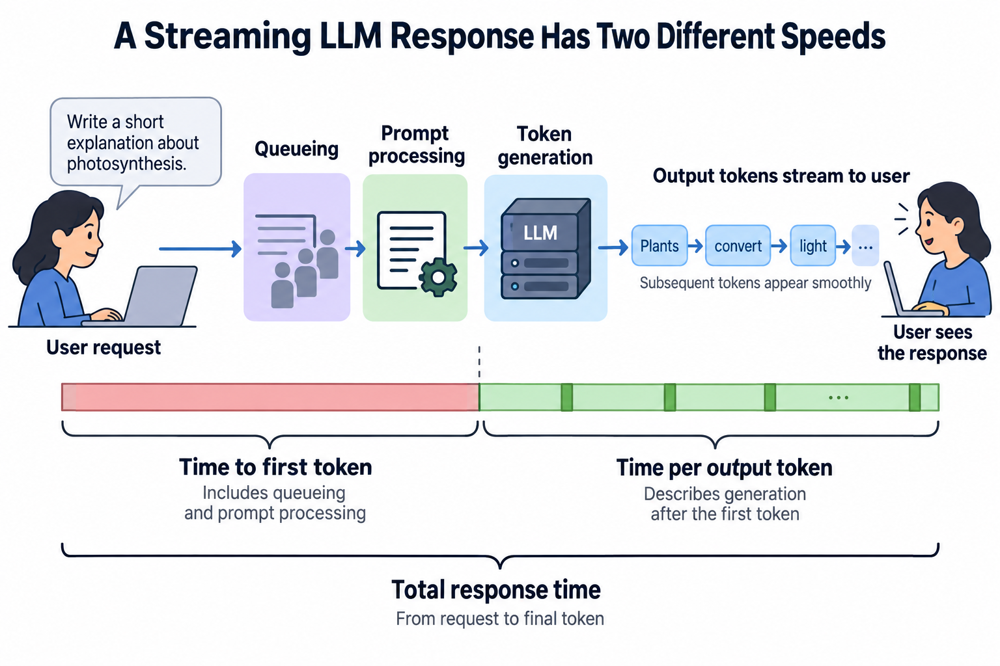
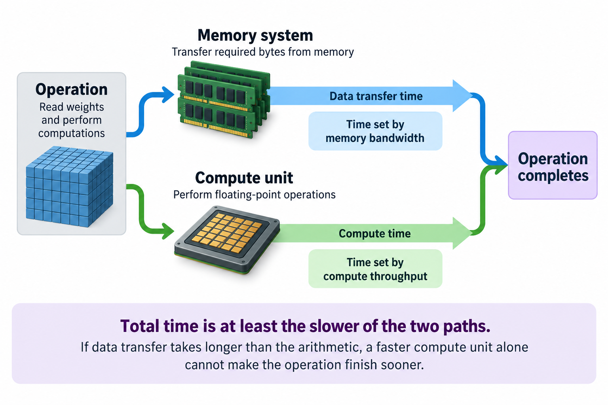

Imagine a company that has invested heavily in GPUs, yet its AI service still misses its latency and cost targets.

Closing that gap is a job title now — ML Performance Engineer, AI Systems Performance Engineer, inference optimization engineer, the names vary. It is one of the most leveraged and least understood roles in AI. This article opens my AI Performance Engineering series by explaining what the job actually is.

## Not making the model smarter

The most common misconception: performance work means improving the model's answers. It doesn't. The mission is to deliver the required model quality **faster and cheaper**. Many improvements preserve the model and its computation; numerical changes such as quantization require explicit quality validation.

That distinction matters because it defines the toolbox. Model quality is a research problem. Performance is a systems problem: hardware, memory, networks, schedulers, and the software that connects them.

## The triangle you can't escape

Every decision in this job trades between 3 quantities:

- **Latency** — how fast does 1 user get an answer?
- **Throughput** — how many users can we serve at once?
- **Cost** — what does each answer cost us?

The cruel part: they fight each other. The single biggest throughput lever is batching — processing many users' requests together. Waiting to assemble a batch can increase latency, and larger batches can increase step time. Faster hardware can improve capacity, but its unit cost depends on achieved useful throughput. Optimize any corner carelessly and the other 2 bite back.

A performance engineer's actual job description is 1 sentence: *find the point on this triangle that your product needs, and get there with the least hardware possible.*

## A day in the life

What does that look like concretely? Across a week, a performance engineer might:

- **Profile** a serving cluster with Nsight Systems and find GPUs idle 40% of the time, waiting for data
- **Tune** a batching scheduler so p99 latency stops spiking during traffic bursts
- **Quantize** a model from 16-bit to 8-bit weights, halving memory — then verify quality didn't move
- **Rewrite** 1 CUDA kernel that profiling showed was reading memory in a pattern the hardware hates
- **Do napkin math** on whether next quarter's model fits on current GPUs, or the company needs to buy more

Notice the range: from chip-level memory access patterns to fleet-level capacity planning. That breadth — hardware, systems software, and algorithms in 1 head — is exactly why the role is scarce and well paid.

## Why the money is real

The economics are blunt. Inference at scale is priced per token, and every efficiency gain drops straight to the margin. Public benchmarks make the stakes visible: [MLPerf](https://mlcommons.org/benchmarks/inference-datacenter/) publishes results under specified benchmark rules, models, and quality constraints. Those results illustrate achievable performance, but they do not establish a universal 2–3× software speedup over an unspecified baseline.

DeepSeek made the sharpest case in recent memory: constrained to export-compliant GPUs with roughly half the interconnect bandwidth of the H100, their team [engineered around the limitation](https://arxiv.org/abs/2412.19437) with custom communication kernels and pipeline tricks — and reported an efficient training design. Its reported training computation cost is a scoped figure, not the full cost of research, development, data, or deployment.

For a company running thousands of GPUs, a performance engineer who improves cluster efficiency by 20% is worth millions of dollars a year. Few roles have a cleaner line from work to money.

## What this series covers

Over the coming months, this series walks the whole stack in order, the way the problems actually nest:

1. **Foundations** — the metrics that matter, and why "100% GPU utilization" can hide massive waste (that's the next article)
2. **Hardware** — what a modern AI rack really is
3. **Cluster infrastructure** — the OS, network, and storage layers that starve GPUs
4. **CUDA kernels** — inside the GPU, where microseconds are won
5. **PyTorch** — framework-level speed without writing CUDA
6. **Inference** — batching, KV caches, quantization, and serving at planetary scale

## Define the promise before optimizing

“Faster” needs a unit and a workload. An interactive assistant might promise that the first token arrives within 2 seconds and subsequent tokens appear smoothly. A document-processing service might instead promise that a nightly queue finishes before morning. Both run inference, but the right configuration can differ because 1 protects individual waiting time while the other concentrates on sustained completion rate.

For streaming language models, separate **time to first token**, which includes queueing and prompt processing, from **time per output token**, which describes generation after the first token. Also record the total response time and the input and output lengths. A short answer and a long answer can have identical token generation rates while giving users very different experiences. Measuring only tokens per second hides that distinction.

The quality promise matters too. Some changes, such as removing redundant copies or overlapping independent transfers, can preserve the computation. Others, including quantization and approximate attention, change numerical behavior. Even 2 exact mathematical implementations may produce slightly different floating-point results. The job is therefore to deliver a defined quality level within performance and cost constraints, and to prove that the implementation meets all 3.

A useful experiment specification includes the model revision, precision, hardware, engine version, request distribution, concurrency, and service objectives. Without those details, “twice as fast” is difficult to reproduce and may describe a different problem. Keeping the specification small enough to repeat is more valuable than collecting a dashboard full of unexplained numbers.

## 2 equations that guide the investigation

The first equation is a lower bound on an operation's execution time. If it performs F floating-point operations and transfers D bytes through the limiting memory level, while sustainable compute and bandwidth are C and B, then:

$$
T_{\mathrm{operation}} \gtrsim \max\!\left(\frac{F}{C},\frac{D}{B}\right).
$$

This is an idealized bound, not a timing prediction. It omits launch overhead, dependency stalls, communication, and imperfect resource use. Nevertheless, it tells you where additional compute capacity can help. If reading the required bytes takes longer than doing the arithmetic, a faster arithmetic unit alone cannot remove the memory requirement. Changing data reuse or representation may matter more.

For a deliberately simple example, suppose an operation streams 16 GB of weights through a memory system that sustains 2 TB/s. The weight transfer takes at least 8 milliseconds. If its arithmetic needs only 1 millisecond at sustainable compute speed, doubling that compute speed changes the shorter term to half a millisecond while leaving the 8-millisecond bound intact. This is why performance engineers count bytes before celebrating peak FLOPS.

The second equation is Amdahl's law. Suppose a fraction p of the original runtime is improved by a factor s while the remaining fraction stays unchanged. Overall speedup is:

$$
S = \frac{1}{(1-p)+p/s}.
$$

If a kernel accounts for 10 percent of request time, making it 2 times as fast improves the request by about 5.3 percent. Even eliminating that kernel entirely cannot improve the original request by more than about 11 percent. A profiler identifies p; the optimization determines s. The equation stops attractive local improvements from being mistaken for large product wins.

The assumptions deserve attention. Once 1 bottleneck is removed, another can become dominant, and batching or scheduling changes may alter several runtime fractions at once. Use Amdahl's law to estimate a first experiment, then measure the new system rather than repeatedly applying an old profile.

## Follow 1 request through the stack

Imagine an assistant becomes slow when traffic rises. Start with the request timeline: admission, queueing, tokenization, host preparation, prompt processing, generation, and delivery. If most of the additional delay appears before GPU work starts, rewriting a GPU kernel is unlikely to address the cause. Queue length, admission policy, and the request mix become the first places to investigate.

Next examine a representative GPU timeline. Long gaps between kernels can suggest host scheduling, synchronization, or missing input data. Long kernels with steady memory traffic suggest a different problem. A communication operation on the critical path calls for topology and overlap analysis. The trace is evidence about this configuration, and the next experiment should discriminate between plausible explanations.

Suppose the trace shows that a CPU thread repeatedly asks for a GPU tensor's scalar value. The host must wait until that value is available, and the queue of future GPU work may drain. Moving nonessential logging out of the hot path is a reasonable experiment. The result should include end-to-end request time as well as the disappearance of the trace gap; a cleaner trace alone is not the product objective.

Finally replay realistic arrivals. A configuration that succeeds at fixed concurrency may behave badly under bursts. Long prompts can interfere with short requests, and the queue can amplify small changes in service time. The performance engineer therefore connects the microsecond explanation to the second-scale user result.

## Make improvements safe to operate

A change is useful only if the service can run it reliably. Measure warm-up time and model load time, not just steady state. Record memory headroom so a slightly longer prompt does not turn a successful benchmark into an out-of-memory failure. Check cancellation and unusual shapes when they are part of the product workload. These operational details determine whether the measured speedup survives deployment.

Compare the baseline and candidate using the same request set and conditions. Repeat measurements sufficiently to distinguish an improvement from noise. Preserve latency distributions rather than only averages: a lower mean can coexist with a worse tail. When results are close, report the uncertainty honestly and retain the simpler configuration unless the improvement justifies its maintenance cost.

Quality validation should match the proposed change. An exact scheduling change may need output and numerical consistency checks. A quantized model needs representative quality evaluation, including tasks sensitive to the precision reduction. A stochastic decoder requires distribution-aware or task-level evaluation; comparing 1 generated sentence is not enough to establish equivalence.

## Turn throughput into a capacity decision

Suppose a hypothetical node costs 16 dollars per hour and produces 20 million accepted output tokens in that hour. Its direct node cost is 80 cents per million tokens. If a validated change raises accepted output to 25 million tokens while preserving latency and quality, that cost becomes 64 cents per million. The arithmetic is useful precisely because the output definition and cost boundary are explicit.

That 20-percent unit-cost reduction does not automatically become a 20-percent smaller bill. The fleet may have spare capacity, reserved commitments, or insufficient traffic to exploit the speedup. Capacity changes require a demand model, redundancy allowance, and headroom for failures and bursts. Performance engineering supplies the measured capacity; operational planning decides how much of it can be converted into savings.

The strongest deliverable is consequently more than a patch. It is a reproducible baseline, a causal explanation, a validated improvement, and a recommendation about where that configuration should run. This combination lets another engineer maintain the result after the original investigator moves on.

A useful experiment also documents the rejected alternatives. If higher batching raises aggregate output while violating streaming latency, retain that result as evidence for an offline pool rather than accepting it for interactive service. This preserves the reason for the chosen operating point and prevents a later dashboard comparison from silently relaxing the original promise.

## Takeaway

- ML performance engineering delivers a defined quality level within latency, throughput, and cost objectives.
- Every decision trades between latency, throughput, and cost — the job is choosing your point on that triangle deliberately.
- The value is measurable through accepted output, reproducible benchmarks, and an explicit cost boundary.

## Sources

- [MLPerf Inference: Datacenter benchmark results](https://mlcommons.org/benchmarks/inference-datacenter/) — MLCommons
- [DeepSeek-V3 Technical Report](https://arxiv.org/abs/2412.19437) — the H800 engineering story
- [NVIDIA Nsight Systems](https://developer.nvidia.com/nsight-systems) — the profiler referenced throughout this series

---

*Part of the [AI Infrastructure Foundations](/series/ai-performance/) learning path. Browse its published articles by topic.*
