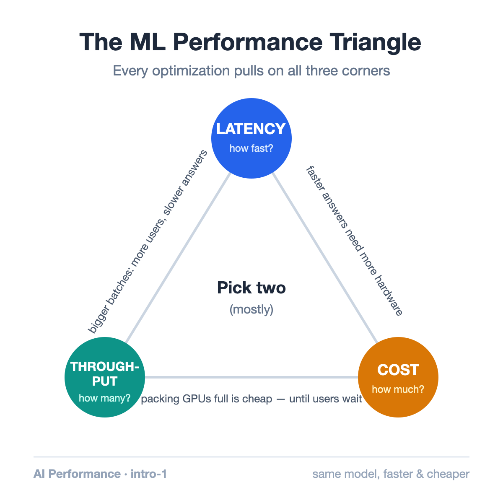
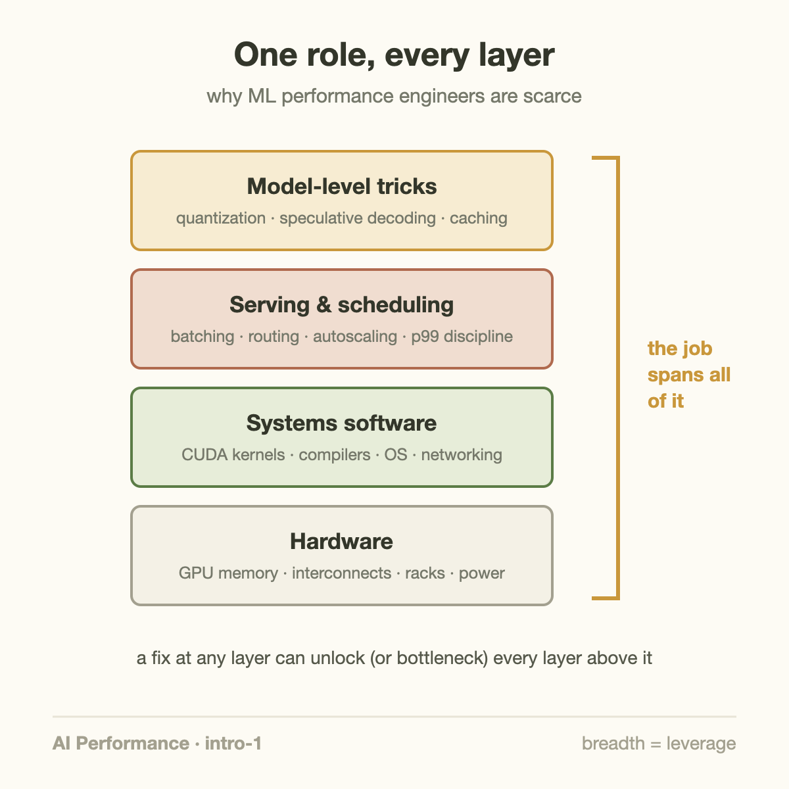

Your company just spent $2M on GPUs. They're running at 15% useful output.

Closing that gap is a job title now — ML Performance Engineer, AI Systems Performance Engineer, inference optimization engineer, the names vary. It is one of the most leveraged and least understood roles in AI. This article opens my AI Performance Engineering series by explaining what the job actually is.

## Not making the model smarter

The most common misconception: performance work means improving the model's answers. It doesn't. A performance engineer changes *nothing* about what the model says. The mission is to make the same model produce the same answers **faster and cheaper** — without touching a single weight.

That distinction matters because it defines the toolbox. Model quality is a research problem. Performance is a systems problem: hardware, memory, networks, schedulers, and the software that connects them.

## The triangle you can't escape

Every decision in this job trades between three quantities:

- **Latency** — how fast does one user get an answer?
- **Throughput** — how many users can we serve at once?
- **Cost** — what does each answer cost us?

The cruel part: they fight each other. The single biggest throughput lever is batching — processing many users' requests together. But doubling the batch can also double how long each user in it waits. Buying faster hardware improves latency and throughput, and wrecks cost. Optimize any corner carelessly and the other two bite back.

A performance engineer's actual job description is one sentence: *find the point on this triangle that your product needs, and get there with the least hardware possible.*

## A day in the life

What does that look like concretely? Across a week, a performance engineer might:

- **Profile** a serving cluster with Nsight Systems and find GPUs idle 40% of the time, waiting for data
- **Tune** a batching scheduler so p99 latency stops spiking during traffic bursts
- **Quantize** a model from 16-bit to 8-bit weights, halving memory — then verify quality didn't move
- **Rewrite** one CUDA kernel that profiling showed was reading memory in a pattern the hardware hates
- **Do napkin math** on whether next quarter's model fits on current GPUs, or the company needs to buy more

Notice the range: from chip-level memory access patterns to fleet-level capacity planning. That breadth — hardware, systems software, and algorithms in one head — is exactly why the role is scarce and well paid.

## Why the money is real

The economics are blunt. Inference at scale is priced per token, and every efficiency gain drops straight to the margin. Public benchmarks make the stakes visible: in [MLPerf](https://mlcommons.org/benchmarks/inference-datacenter/) results, well-tuned software stacks routinely deliver 2–3× more throughput on identical hardware than naive ones. Same silicon, same model — the difference is engineering.

DeepSeek made the sharpest case in recent memory: constrained to export-compliant GPUs with roughly half the interconnect bandwidth of the H100, their team [engineered around the limitation](https://arxiv.org/abs/2412.19437) with custom communication kernels and pipeline tricks — and trained a frontier-class model at a fraction of the typical cost. Skillful engineering beat brute-force spending.

For a company running thousands of GPUs, a performance engineer who improves cluster efficiency by 20% is worth millions of dollars a year. Few roles have a cleaner line from work to money.

## What this series covers

Over the coming months, this series walks the whole stack in order, the way the problems actually nest:

1. **Foundations** — the metrics that matter, and why "100% GPU utilization" can hide massive waste (that's the next article)
2. **Hardware** — what a modern AI rack really is
3. **Cluster infrastructure** — the OS, network, and storage layers that starve GPUs
4. **CUDA kernels** — inside the GPU, where microseconds are won
5. **PyTorch** — framework-level speed without writing CUDA
6. **Inference** — batching, KV caches, quantization, and serving at planetary scale

## Takeaway

- ML performance engineering = same answers, delivered faster and cheaper. The model is untouched; everything around it is fair game.
- Every decision trades between latency, throughput, and cost — the job is choosing your point on that triangle deliberately.
- The value is measurable in dollars: identical hardware, 2–3× different output, purely from engineering.

## Sources

- [MLPerf Inference: Datacenter benchmark results](https://mlcommons.org/benchmarks/inference-datacenter/) — MLCommons
- [DeepSeek-V3 Technical Report](https://arxiv.org/abs/2412.19437) — the H800 engineering story
- [NVIDIA Nsight Systems](https://developer.nvidia.com/nsight-systems) — the profiler referenced throughout this series

---

*Part of the **AI Performance Engineering** series. Next: Goodput — why your "100% utilized" cluster is mostly wasted.*
