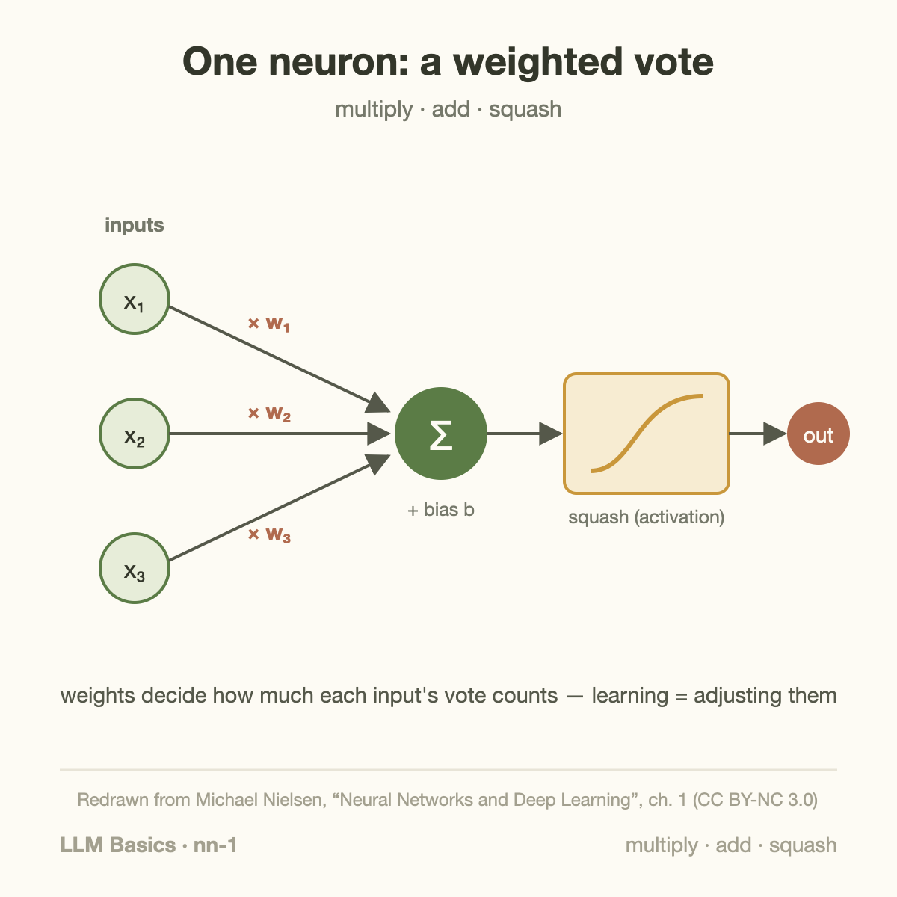
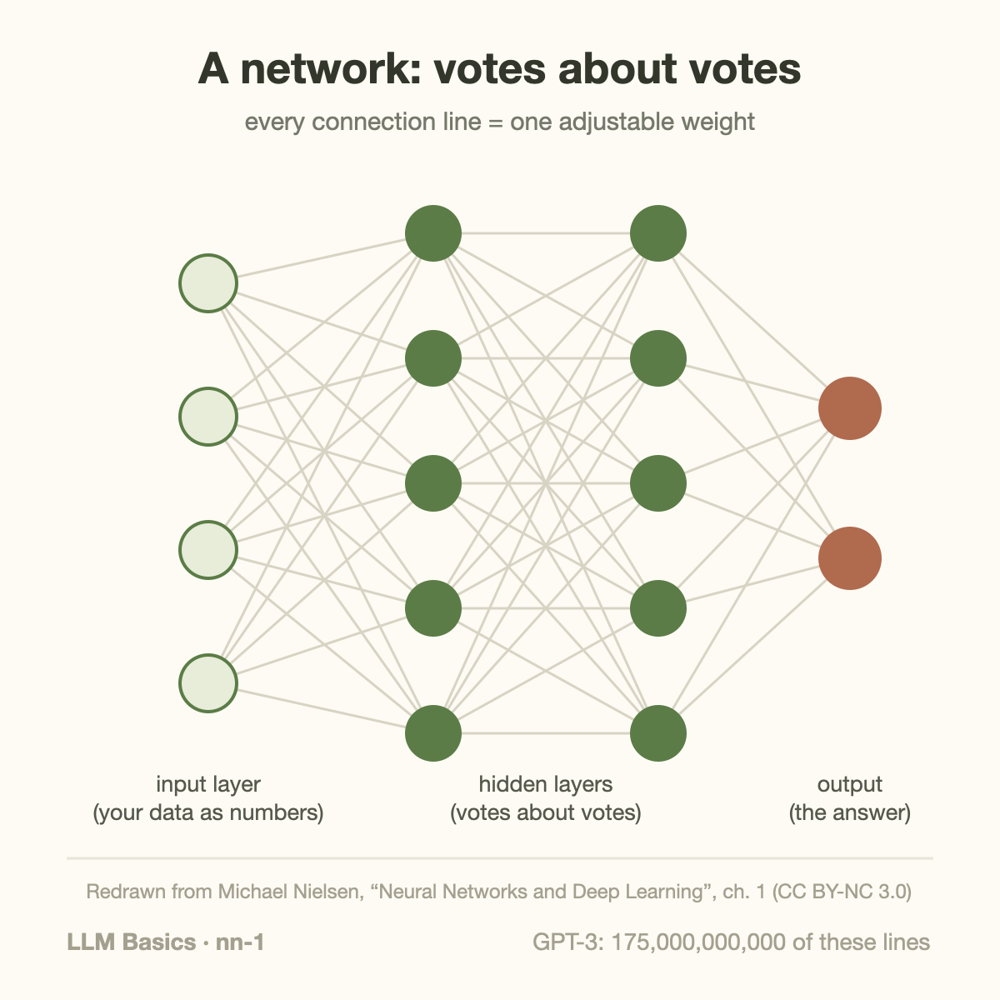

Multiply, add, squash. That three-step operation, repeated a few trillion times, is how a frontier LLM produces one word of its answer.

"Neural network" sounds like it involves something brain-like and mysterious. This article's goal is to remove the mystery completely: by the end, you'll see that the unit is arithmetic you learned in school, and the intelligence — such as it is — lives in how many of those units there are and how their knobs get set.

## One neuron: a weighted vote

The basic unit — an artificial neuron — takes some input numbers and produces one output number, in three steps:

1. **Multiply** each input by its own *weight* (a number the network can change)
2. **Add** the products together, plus one extra adjustable number called the *bias*
3. **Squash** the sum through a simple function so the output stays in a useful range

A useful mental model: a neuron is a **weighted vote**. Each input gets a say; the weight decides how much that say counts (and in which direction — weights can be negative). The bias sets how easy the neuron is to convince. The squashing step (the *activation function*) is what keeps stacked neurons from collapsing into one boring linear formula — it is the source of all the interesting behavior.

There is genuinely nothing else inside. No symbols, no rules, no little brain. Multiply, add, squash.

## A network: votes about votes

One neuron can only draw one straight boundary through its inputs — useful, but weak. The power move is stacking:

- The **input layer** is just your data as numbers: pixel brightnesses, audio samples, or (for LLMs) numeric codes for text pieces
- Each **hidden layer** neuron takes a weighted vote over the *previous* layer's outputs
- The **output layer** produces the answer: a digit label, a probability, or — in a language model — a score for every possible next word

Stacking is what buys abstraction. In an image network, first-layer neurons end up voting on edges, mid-layer neurons vote on combinations of edges (corners, textures), and late-layer neurons vote on combinations of *those* (ears, wheels, faces). Nobody programs this hierarchy — it falls out of training, which is the next article's subject.

The key vocabulary: every connection line in that picture is one **weight** — one adjustable number. "Training a network" means nothing more mystical than setting all those numbers.

## The only difference between this and GPT: count

Here is the part that surprises people. The network in the figure above might have a few hundred weights. GPT-3 has 175 billion. Modern frontier models have more. The *unit* is unchanged — multiply, add, squash — and has been essentially unchanged for decades.

Some rough numbers to calibrate the scale:

| Network | Weights | Can do |
|---|---|---|
| Digit reader (1998-class) | ~60 thousand | read handwritten zip codes |
| Image classifier (2012-class) | ~60 million | recognize 1,000 object types |
| GPT-3 (2020) | 175 billion | write prose, code, translate |

Same arithmetic, more of it, better-set knobs. When we cover [why GPUs matter](/blog/what-does-an-ml-performance-engineer-do/) elsewhere on this blog, this is the reason: the workload is trillions of multiply-adds, and GPUs are machines built to do exactly that in bulk.

## What the network "knows"

A trained network's entire knowledge is the list of its weight values. Copy the list, you've copied the model. That has two consequences worth internalizing now:

- **Learning = adjusting numbers.** There is no database of facts inside; there are weights whose values make useful outputs likely. How those values get found — gradient descent and backpropagation — is the next article.
- **Size = memory and bandwidth.** 175 billion weights at even one byte each is 175 GB that must be stored and, during use, *read*. Every performance topic on this blog ultimately traces back to moving these numbers around.

## Takeaway

- A neuron is a weighted vote: multiply inputs by weights, add a bias, squash. Nothing else is inside.
- A network is votes about votes: layers stack simple boundaries into abstractions. Every connection is one adjustable weight.
- From a 1998 digit reader to GPT-3, the unit never changed — the count went from thousands to hundreds of billions. The knowledge *is* the weights.

## Sources

- Michael Nielsen — [*Neural Networks and Deep Learning*](http://neuralnetworksanddeeplearning.com/chap1.html), ch. 1 (CC BY-NC 3.0; figures in this article are redrawn from it)
- LeCun et al. (1998). ["Gradient-Based Learning Applied to Document Recognition"](http://yann.lecun.com/exdb/publis/pdf/lecun-98.pdf) (LeNet, ~60k parameters)
- Brown et al. (2020). ["Language Models are Few-Shot Learners"](https://arxiv.org/abs/2005.14165) (GPT-3, 175B parameters)

---

*Part of the **Fundamental of LLM** series. Next: how the knobs get set — gradient descent and backprop in plain words.*
