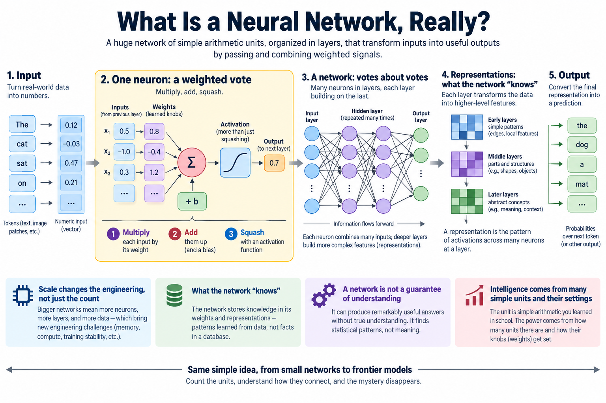
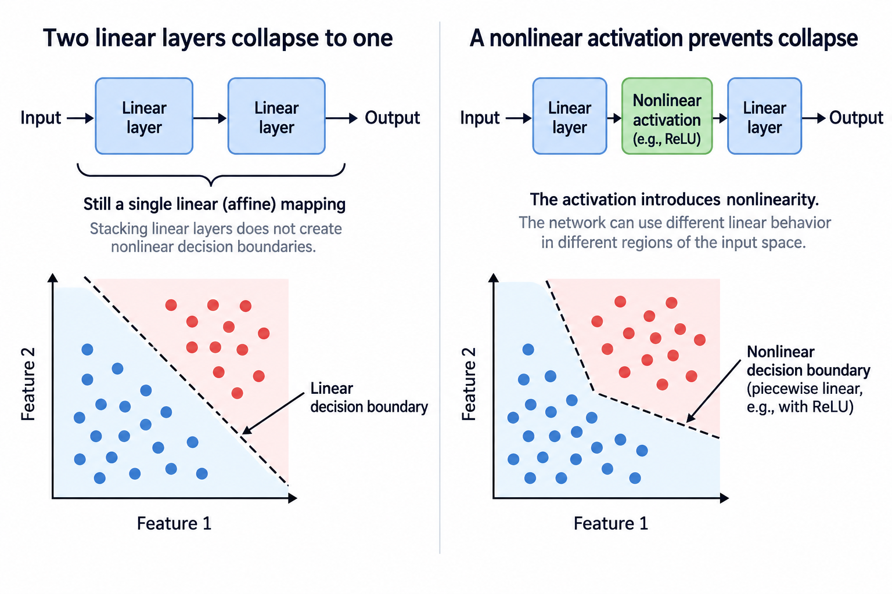
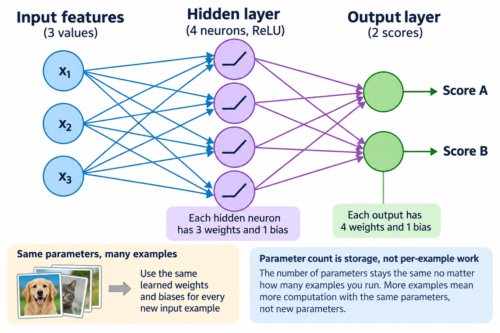
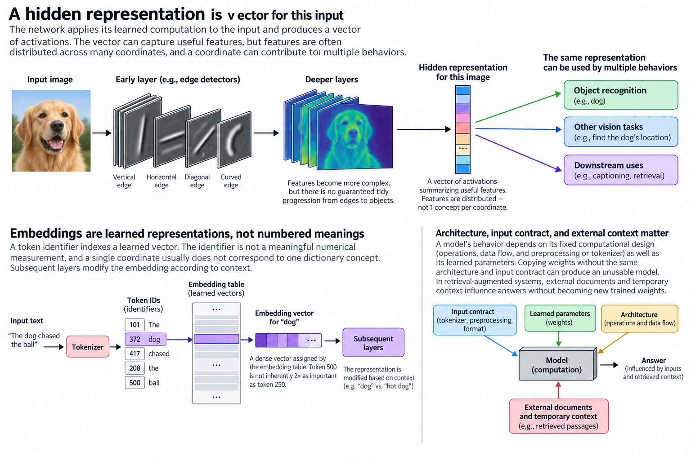

## Overview

Multiply, add, squash. That 3-step operation, repeated a few trillion times, is how a frontier LLM produces 1 word of its answer.

"Neural network" sounds like it involves something brain-like and mysterious. This article's goal is to remove the mystery completely: by the end, you'll see that the unit is arithmetic you learned in school, and the intelligence, such as it is, lives in how many of those units there are and how their knobs get set.

## Deep dive

### 1 neuron: a weighted vote

The basic unit, an artificial neuron, takes some input numbers and produces 1 output number, in 3 steps:

1. **Multiply** each input by its own *weight* (a number the network can change)
2. **Add** the products together, plus 1 extra adjustable number called the *bias*
3. **Squash** the sum through a simple function so the output stays in a useful range

A useful mental model: a neuron is a **weighted vote**. Each input gets a say; the weight decides how much that say counts (and in which direction, since weights can be negative). The bias sets how easy the neuron is to convince. The squashing step (the *activation function*) is what keeps stacked neurons from collapsing into 1 boring linear formula, and it is the source of all the interesting behavior.

There is genuinely nothing else inside. No symbols, no rules, no little brain. Multiply, add, squash.

### A network: votes about votes

1 neuron can only draw 1 straight boundary through its inputs, which is useful but weak. The power move is stacking:

- The **input layer** is just your data as numbers: pixel brightnesses, audio samples, or (for LLMs) numeric codes for text pieces
- Each **hidden layer** neuron takes a weighted vote over the *previous* layer's outputs
- The **output layer** produces the answer: a digit label, a probability, or (in a language model) a score for every possible next word

Stacking is what buys abstraction. In an image network, first-layer neurons end up voting on edges, mid-layer neurons vote on combinations of edges (corners, textures), and late-layer neurons vote on combinations of *those* (ears, wheels, faces). Nobody programs this hierarchy. It falls out of training, which is the next article's subject.

The key vocabulary: every connection line in that picture is 1 **weight**, 1 adjustable number. "Training a network" means nothing more mystical than setting all those numbers.

### Scale changes the engineering, not just the count

Here is the part that surprises people. The network in the figure above might have a few hundred weights. GPT-3 has 175 billion. Many later models use larger or sparse parameter sets; undisclosed models cannot be compared by assumed parameter count. The *unit* is unchanged, multiply, add, squash, and it has been essentially unchanged for decades.

Some rough numbers to calibrate the scale:

| Network | Weights | Can do |
|---|---|---|
| Digit reader (1998-class) | ~60 thousand | read handwritten zip codes |
| Image classifier (2012-class) | ~60 million | recognize 1,000 object types |
| GPT-3 (2020) | 175 billion | write prose, code, translate |

These models share learned numerical operations, but differ in architecture, objectives, data, and scale. When we cover [why GPUs matter](/blog/what-does-an-ml-performance-engineer-do/) elsewhere on this blog, this is the reason: the workload is trillions of multiply-adds, and GPUs are machines built to do exactly that in bulk.

### What the network "knows"

Learned weights are central to a trained network, but reproducing its behavior also requires the architecture, tokenizer, preprocessing, and runtime context. That has 2 consequences worth internalizing now:

- **Learning = adjusting numbers.** There is no database of facts inside; there are weights whose values make useful outputs likely. How those values get found, through gradient descent and backpropagation, is the next article.
- **Size = memory and bandwidth.** 175 billion weights at even 1 byte each is 175 GB that must be stored and, during use, *read*. Every performance topic on this blog ultimately traces back to moving these numbers around.

### Run 1 neuron with actual numbers

Consider a simple sensor example. Let the 2 inputs be temperature and vibration, already transformed into dimensionless standardized values. For 1 observation, use $$x_1=2$$ and $$x_2=-1$$. Give the neuron weights $$w_1=0.5$$ and $$w_2=-0.25$$, and bias $$b=-0.2$$. The number before activation is

$$
z=w_1x_1+w_2x_2+b=0.5(2)-0.25(-1)-0.2=1.05.
$$

A sigmoid activation maps this number to approximately 0.7408. That is a number between 0 and 1; it becomes an interpretable event probability only when the output is used and trained as a probabilistic classifier. A hidden sigmoid value is not automatically a meaningful probability about the world.

Now change vibration from minus 1 to 1 while holding temperature fixed. The pre-activation falls to 0.55, and the sigmoid output falls to approximately 0.6341. The negative vibration weight makes larger vibration input reduce this neuron's output. A trained model might learn the opposite sign; the example illustrates arithmetic, not a claim about machine failures.

Input scaling matters. A weight of 0.5 attached to a temperature measured in degrees cannot be compared directly with the same weight attached to a standardized temperature. Units, preprocessing, and the input distribution determine what a coefficient means. This is one reason inspecting raw weight magnitudes rarely gives a complete explanation of a prediction.

### Activation means more than squashing

The earlier shorthand “squash” is useful for sigmoid and tanh, but common activations need not keep their outputs in a bounded range. ReLU returns 0 for negative input and returns the input itself for positive input. GELU and gated activations behave differently again. The essential property is introducing a nonlinear transformation, not necessarily compressing every number between fixed bounds.

Why does nonlinearity matter? 2 purely linear layers collapse into 1: applying matrix A and then matrix B is equivalent to applying their product. Adding biases makes the mapping affine, but stacking affine mappings still produces an affine mapping. Depth alone does not create nonlinear decision boundaries.

A nonlinear activation between those layers prevents that collapse. The network can build input-dependent combinations of features. A ReLU network, for example, can have different linear behavior in different regions of input space. More regions can represent complicated patterns, although representational capacity alone does not establish that training will find a useful solution.

The common statement that 1 neuron draws 1 straight boundary also needs context. A sigmoid classifier on raw features has a linear decision boundary at a fixed threshold. If its inputs are already nonlinear features produced by earlier layers, that same last neuron can participate in a nonlinear boundary in the original input space. Always say which representation a geometric claim refers to.

### Count a small network before counting a frontier model

Suppose a fully connected network has 3 input features, a hidden layer of 4 neurons, and 2 output scores. Every hidden neuron receives 3 weights and 1 bias, so the first layer contains 16 parameters. Every output receives 4 weights and 1 bias, so the second layer contains 10. Total parameter count is 26.

In general, a dense layer mapping m inputs to n outputs contains $$mn+n$$ parameters when each output has a bias. Reusing that layer for 100 examples does not create new parameters. It creates more arithmetic with the same parameters.

This distinction connects model size to deployment. 20-6 parameters stored in FP32 require 104 bytes for the parameter values alone. Activations, input arrays, framework overhead, and training state require additional memory. At large scale, optimizer states and saved intermediate values can occupy more space than the weights themselves.

Also distinguish parameter count from work per example. A mixture-of-experts model may store many expert parameters while selecting only a subset for each token. Parameter count is a storage quantity; active computation depends on architecture, routing, sequence length, batching, and precision. Multiplying a headline parameter count by a fixed constant is only a rough estimate under stated assumptions.

The full layer equation makes shape and nonlinearity checks explicit. For input vector x with m features, weight matrix W with n rows and m columns, bias b with n entries, and elementwise activation phi:

$$
h=\phi(Wx+b),\qquad
h_{\mathrm{next}}=\psi(Uh+c).
$$

U maps the hidden representation to the next layer and c is its bias. If both activations are the identity, the composition becomes U W x plus U b plus c, a single affine map. A nonlinear hidden activation prevents that collapse. This is the substantive change from stacking linear regressions: different input regions can activate different combinations of learned features.

For a concrete ReLU example, choose x equal to (2,-1), W with rows (0.5,-0.25) and (-1,1), and b equal to (-0.2,0). The pre-activations are (1.05,-3), so h is (1.05,0). With U equal to (2,-1) and c equal to 0.1, an identity output is 2.2. Change the input enough to cross a ReLU boundary and the active linear rule changes. Capacity grows, but fitting that capacity still requires data, an objective, and validation; the equation alone does not guarantee learning or useful abstractions.

### What a representation actually is

A hidden representation is a vector produced by applying the learned computation to a particular input. It can summarize useful features without having 1 neatly named concept per coordinate. Individual features may be distributed across many coordinates, and a coordinate can contribute to more than 1 behavior.

In an image task, some early filters can resemble edge detectors. That does not mean every network learns a tidy progression from edges to objects, or that a language-model coordinate can be labeled with 1 dictionary concept. Architecture and training encourage useful structure; they do not guarantee a simple human-readable map.

Embeddings illustrate the same point. A token identifier indexes a learned vector, but the identifier is not itself a meaningful numerical measurement of a word. Token 500 is not inherently 2 times as important as token 250. The embedding table assigns a representation; subsequent layers modify it according to context.

The network also has a fixed computational design beyond its learned parameter values: which operations are applied, how data flow, and what preprocessing/tokenizer is used. Copying weights without the corresponding architecture and input contract can produce an unusable model. In retrieval-augmented systems, external documents and temporary context additionally influence answers without becoming new trained weights.

### A network is not a guarantee of understanding

A trained model is useful when its computation generalizes beyond the examples used to fit it. A flexible network can also memorize correlations that fail under new conditions. Predicting a label correctly on training data is evidence about fit, not proof of reliable behavior everywhere.

A practical evaluation separates training data, validation data used for development choices, and held-out test data used for a final assessment. The split must match the application. Randomly splitting near-duplicate documents can make a language task look easier than deployment really is, and splitting records from the same person across sets can leak identity-specific information.

For probabilistic outputs, inspect confidence as well as accuracy. A model can be correct most of the time while being dangerously confident on the remaining errors. Statistical-learning topics such as likelihood, calibration, and regularization explain how to reason about those distinctions more carefully.

The transferable foundation is therefore richer than “more weights means more intelligence.” Networks compose learned numerical transformations. Their usefulness depends on architecture, data, objective, optimization, and evaluation together. Scale changes capacity and cost, while those other choices determine what that capacity is used to learn.

## Conclusion

- A neuron is a weighted vote: multiply inputs by weights, add a bias, squash. Nothing else is inside.
- A network is votes about votes: layers stack simple boundaries into abstractions. Every connection is 1 adjustable weight.
- Parameter scale determines storage and part of the arithmetic cost; architecture, training data, and objectives also shape capability.

You can inspect a small network without treating it as a mysterious black box. Choose 1 input, record each layer output, and check its shape against the intended computation. Then change 1 input feature and observe which activations move. This does not fully explain a large model, but it exposes concrete operations and helps find mistakes such as transposed dimensions or missing biases. Keep the learned weights fixed during this exercise so that the comparison reflects inference rather than training. Once those operations are clear, training becomes a separate question: how to choose parameter values that work across many examples.

### Sources

- Goodfellow, Bengio, Courville, [Deep Learning, machine-learning basics](https://www.deeplearningbook.org/contents/ml.html) and [deep feedforward networks](https://www.deeplearningbook.org/contents/mlp.html).

- Michael Nielsen, [*Neural Networks and Deep Learning*](http://neuralnetworksanddeeplearning.com/chap1.html), ch. 1 (CC BY-NC 3.0; figures in this article are redrawn from it)
- LeCun et al. (1998). ["Gradient-Based Learning Applied to Document Recognition"](http://yann.lecun.com/exdb/publis/pdf/lecun-98.pdf) (LeNet, ~60k parameters)
- Brown et al. (2020). ["Language Models are Few-Shot Learners"](https://arxiv.org/abs/2005.14165) (GPT-3, 175B parameters)

---

*Part of the [LLM Foundations & Mathematics](/series/llm-basics/) learning path. Browse its published articles by topic.*
