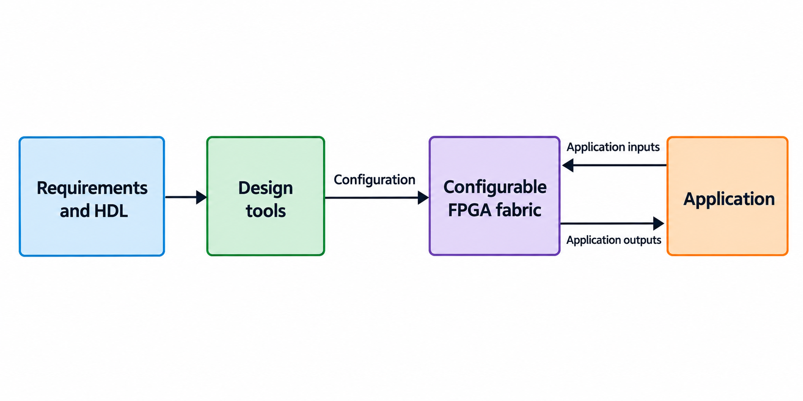
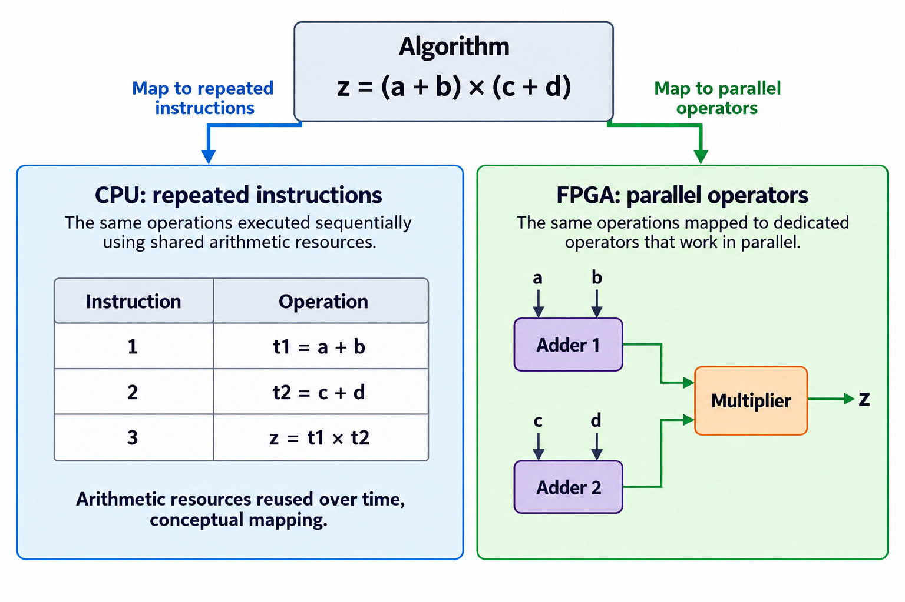
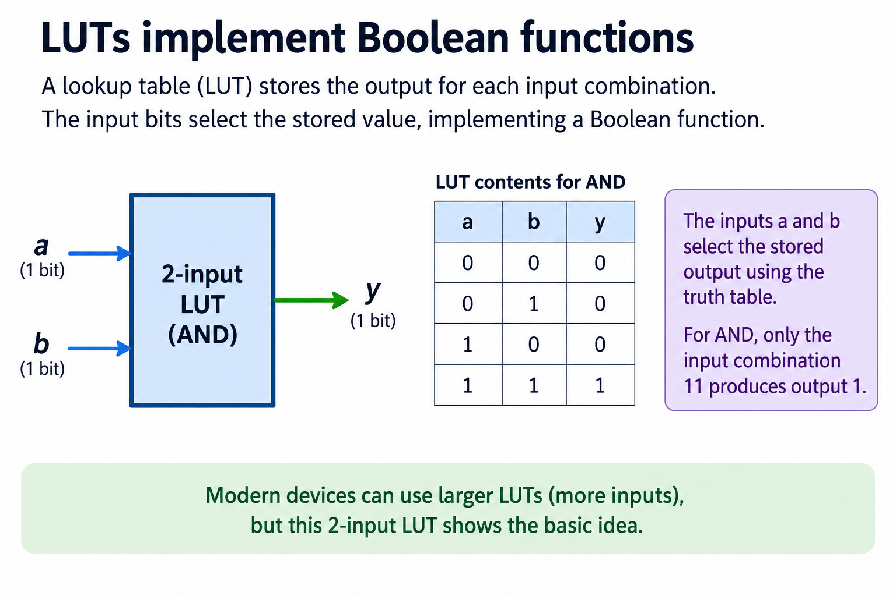
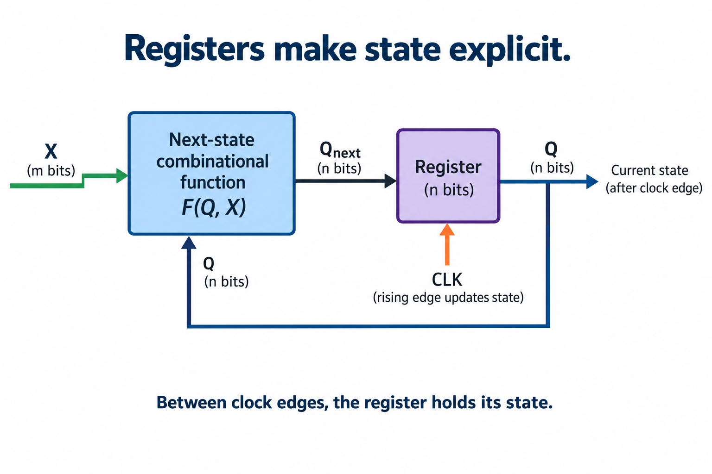
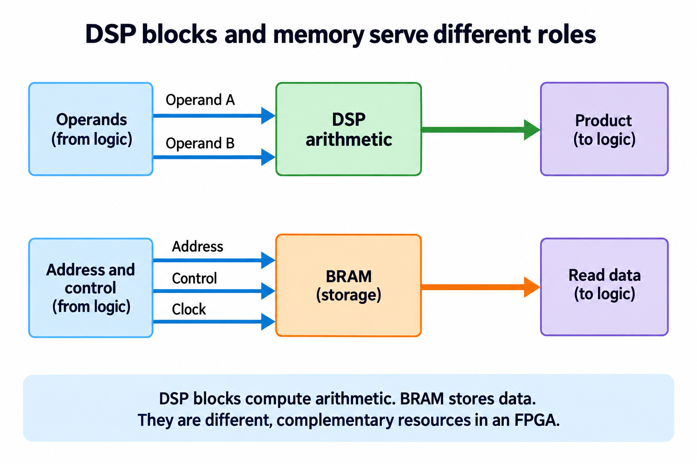
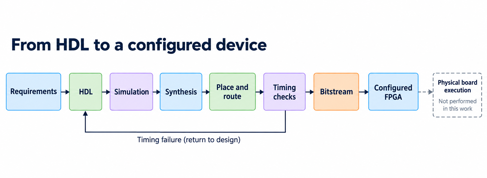

## Overview

An FPGA is a chip whose digital hardware can be configured after manufacture. The overview separates the design description, the configurable fabric, and the signals processed by that fabric. A design tool translates a hardware description into a configuration; the configured circuit then operates on inputs. This is different from asking a processor to execute a sequence of software instructions, although practical systems frequently use both approaches together.

This first lesson establishes vocabulary before the course introduces binary arithmetic and RTL. No electronics background is assumed beyond the idea that a digital signal represents a bit. You will learn what a lookup table does, why registers are necessary, how dedicated arithmetic and memory resources differ, and which steps connect a source file to a working device. These distinctions make later AI accelerator diagrams easier to read: a box may describe a calculation, retained state, storage, or a software-controlled interface.

The course uses small executable examples in the [foundations lab](/labs/fpga-fundamentals/foundations-lab.zip). Its evidence consists of arithmetic checks and RTL simulation, rather than a completed physical FPGA implementation. The separate [accelerator project](/blog/fpga-ai-spec-1-define-the-ai-accelerator/) develops an actual design around these ideas. Start with the fabric here, then follow the foundations reading order before choosing how much implementation detail you need.

## Deep dive

### Instructions versus spatial hardware

The figure compares 2 ways of arranging computation. On the processor side, instructions select operations performed by execution resources over time. On the FPGA side, configuration establishes operators and connections that remain present while input values change. The comparison concerns mapping, rather than an automatic performance advantage. A processor can also execute several operations in parallel, and an FPGA design can deliberately reuse 1 operator over many cycles.

Suppose an algorithm computes 2 independent sums and then multiplies their results. One hardware mapping contains 2 adders and a multiplier connected as a network. Another mapping contains one reused adder, registers for its intermediate results, and a controller that chooses the next operands. Both can implement the same arithmetic, but they require different control signals and different amounts of retained state. Writing the mathematical expression alone does not settle this choice.

A configured circuit is still subject to propagation delay. When an input changes, each gate or arithmetic block takes time to respond. A long chain of operators cannot be treated as instantaneous merely because its blocks are physically present. Registers can divide the chain into stages, while a shared operator needs a schedule that determines which input it processes at each clock edge. The timing lesson develops these consequences with explicit illustrative budgets.

Configuration also differs from application data. A bitstream establishes the circuit arrangement; operand values arrive later through the interfaces defined by that circuit. Sending a new tensor to an accelerator normally changes its stored data, not its logic configuration. Some systems support reconfiguration during operation, but that additional mechanism is outside this beginner example.

When reading an architecture drawing, ask whether each arrow carries data, control, or configuration. If a design reuses hardware, ask where intermediate values live and who selects their next destination. These questions expose missing registers and scheduling assumptions before a reader makes an unsupported claim about parallelism or speed.

### LUTs implement Boolean functions

A lookup table, or LUT, realizes a Boolean function by selecting a stored output bit using its input bits. In the teaching example, 2 inputs form an address with 4 possible combinations. The stored values are 0 for 00, 01, and 10, and one for 11. The selected output therefore implements the AND function. This is a truth table made into a configurable digital resource.

The small table should not be mistaken for a complete device specification. Actual FPGA families provide particular LUT sizes, packing rules, and connectivity. AMD's [7 Series overview](https://docs.amd.com/api/khub/documents/2LByHkO~nSZXcei2D55fTg/content) documents configurable logic resources alongside registers, dedicated arithmetic, and memories. The figure uses 2 inputs so every table entry can be inspected without relying on a specific part number.

Changing the stored table bits can change the function without manufacturing a different chip. For example, a 2-input XOR function stores one for 01 and 10 instead. The input wires still select an entry in the same way. Larger functions may fit inside one device LUT or require several LUTs and routing between them. A source-level operator does not guarantee that exactly one physical resource will be used.

A LUT's configured table is not the same thing as arbitrary application memory addressed by a processor. The configured bits define the logic function. Some device resources support additional modes such as distributed memory, but those modes have their own documented capacity and access rules. Treating all FPGA storage as interchangeable hides practical constraints.

A useful exercise is to write the 4 rows for OR and XOR, then check each input combination in the foundations lab, because the resulting evidence proves the selected Boolean function for this small input space and nothing beyond it: it does not establish how many physical LUTs a synthesis tool uses, where it places them, or how quickly the routed function settles, and those later questions need tool reports for a selected device and constraint set.

### Registers make state explicit

The feedback arrow in the figure supplies the current state to a next-state function. That function combines the current value Q with an input X and computes a proposed next value. A register captures the proposal at the defined active clock edge. Between active edges, its output remains the previously captured state. This is the basic separation between combinational calculation and clocked storage.

Consider a counter that increments only when enable is asserted. Its next-state function chooses either Q plus 1 or Q itself. The register holds the chosen value. The hold case is intentional retained state, rather than a missing assignment in a combinational procedure. Reset introduces another defined choice, such as returning the counter to 0, and its priority must be specified relative to enable.

The edge convention matters. In a chain of 2 registers updated on the same edge, the second captures the first register's old value. It does not immediately see the newly captured input. This behavior permits a pipeline to move 1 stage per edge. An explanation that counts procedural assignment lines as successive physical steps would describe the wrong hardware.

A clock is therefore a coordination signal, not a universal guarantee that every input arrives safely. Data still needs to satisfy setup and hold requirements at the receiving register. Inputs from independent clock domains need additional transfer protocols. The foundations course introduces these concerns separately so a learner can first establish what state should change before discussing whether its physical capture is reliable.

To trace a circuit, make a table containing state before the edge, inputs applied before that edge, and state after the edge. Keep these columns distinct. For the enabled counter, include reset, increment, and hold cases. A small table often reveals an ambiguous reset priority or incorrect pipeline expectation more clearly than a dense waveform. RTL simulation can check this transition contract, while physical timing analysis addresses whether a routed implementation can obey it.

### DSP blocks and memory serve different roles

The upper path in this figure sends operands to dedicated arithmetic resources. The lower path sends an address and control signals to memory, which returns stored data. A DSP block performs arithmetic according to the capabilities of the selected FPGA family. Block RAM retains bits and supports documented read and write behavior. Neither role should be inferred solely from the visual size of its box.

For an AI calculation, weights might be stored in block RAM and supplied to a multiplier mapped into a DSP block. A register can retain the accumulated sum. The complete operation needs all 3 roles: storage supplies operands, arithmetic computes a product or sum, and state preserves progress across cycles. The memory cannot be described as performing the multiplication simply because it stores the weights.

Dedicated blocks do not remove design decisions. A particular multiplier width may require several resources, additional logic, or a different mapping. A memory may have limited ports, a registered output, or a latency that the controller must account for. An architecture drawing with many simultaneous consumers must explain how the required reads are supplied. Replication, banking, broadcasting, and scheduling are distinct ways to solve that problem.

The [device overview](https://docs.amd.com/api/khub/documents/2LByHkO~nSZXcei2D55fTg/content) is a starting point for identifying resource categories. Before implementing a design, consult the detailed documentation for the exact memory and arithmetic primitives and inspect synthesis reports. This lesson deliberately avoids a vendor floorplan or a promised mapping because neither has been produced for the foundations lab.

As a first resource exercise, annotate a dot-product diagram with where inputs are held, where products are computed, and where the running sum is retained, then count how many operands must arrive in 1 cycle, because a design with 4 multipliers needs an operand delivery arrangement that supports those operations: resource counting becomes useful when it is connected to an interface and a schedule, and an isolated list of DSP and RAM totals cannot establish achievable throughput.

### From HDL to a configured device

The design flow begins with requirements, not a bitstream. Define the input representation, expected output, reset behavior, and acceptable timing or throughput before writing HDL. Simulation checks the described behavior against a testbench. Synthesis translates a supported hardware description into a network of target resources. Placement and routing assign resources and connections within the selected device. Timing analysis then evaluates the constrained paths in that implementation.

A bitstream is useful only after these steps produce an acceptable configuration. Programming a board adds further evidence: clock sources, reset sequencing, pin assignments, host communication, and observable outputs must work together. A simulation transcript cannot stand in for a measurement taken from a board. The figure keeps the physical step visible and marks it as unperformed in this course release.

Each failure points to a different question. A wrong simulation output may indicate arithmetic, state, or testbench errors. An unsupported synthesis construct may indicate that simulation-only code entered the DUT. A timing failure may require shorter logic paths, a different schedule, better constraints, or changes to placement-sensitive architecture. A board communication failure can occur even when arithmetic and internal timing are correct.

For a small learning project, keep a reproducible sequence: compile the DUT and testbench, run self-checks, inspect a waveform when needed, and record the tool command and result. If physical tools are later introduced, record the selected part, constraints, reports, and bitstream build rather than merely writing that the design was synthesized. The [Icarus getting-started documentation](https://steveicarus.github.io/iverilog/usage/getting_started.html) explains the compile-and-run distinction used by the included simulation lab.

The flow also gives a practical definition of completion. A tutorial about a Boolean function may finish with exhaustive simulation. A tutorial claiming a working FPGA accelerator needs implementation and board evidence appropriate to that claim. Keeping the evidence boundary explicit lets beginners make real progress without confusing a checked teaching model with a deployed hardware system.

## Conclusion

An FPGA design combines configurable logic, clocked state, dedicated arithmetic, storage, and routing. The important beginner skill is identifying which role each block serves and how values move through it. Configured parallel hardware can still reuse operators, wait for memory, or fail timing; its behavior depends on the arrangement and the contract.

Continue with [binary representation](/blog/binary-numbers-hardware-signedness-overflow/) to learn what a wire vector means before writing arithmetic. The later foundations lessons develop combinational functions, state, HDL, simulation, timing, safe crossings, and AI reductions. After that, the accelerator project can focus on implementation choices rather than repeatedly introducing the fabric. The lab accompanying this series provides executable functional evidence; device mapping, routed timing, and physical board operation remain separate steps requiring their own results.

### Sources

- [AMD 7 Series FPGA overview](https://docs.amd.com/api/khub/documents/2LByHkO~nSZXcei2D55fTg/content)
- [Icarus Verilog getting started](https://steveicarus.github.io/iverilog/usage/getting_started.html)
