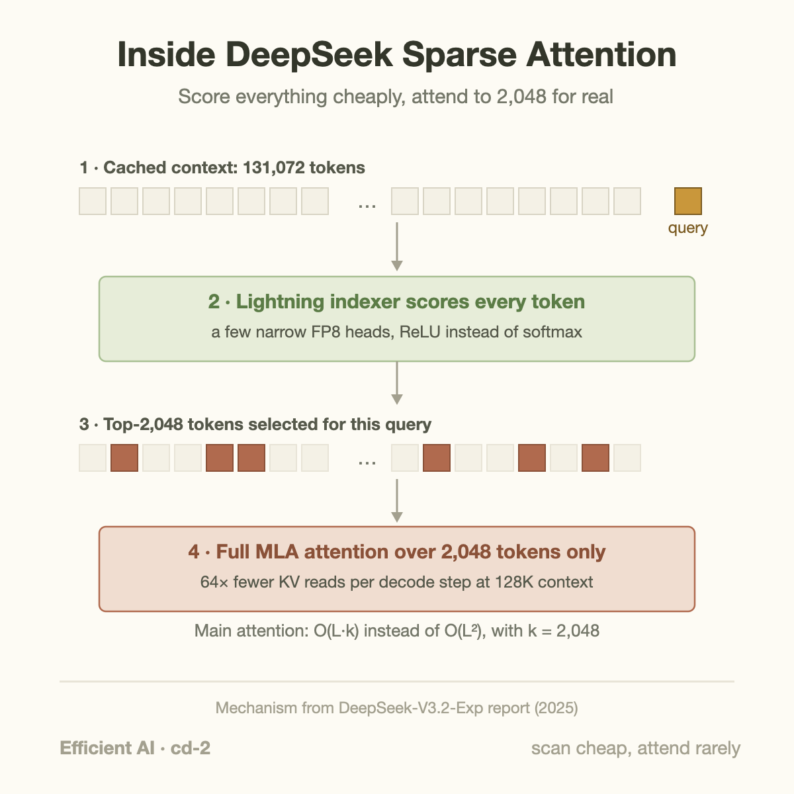
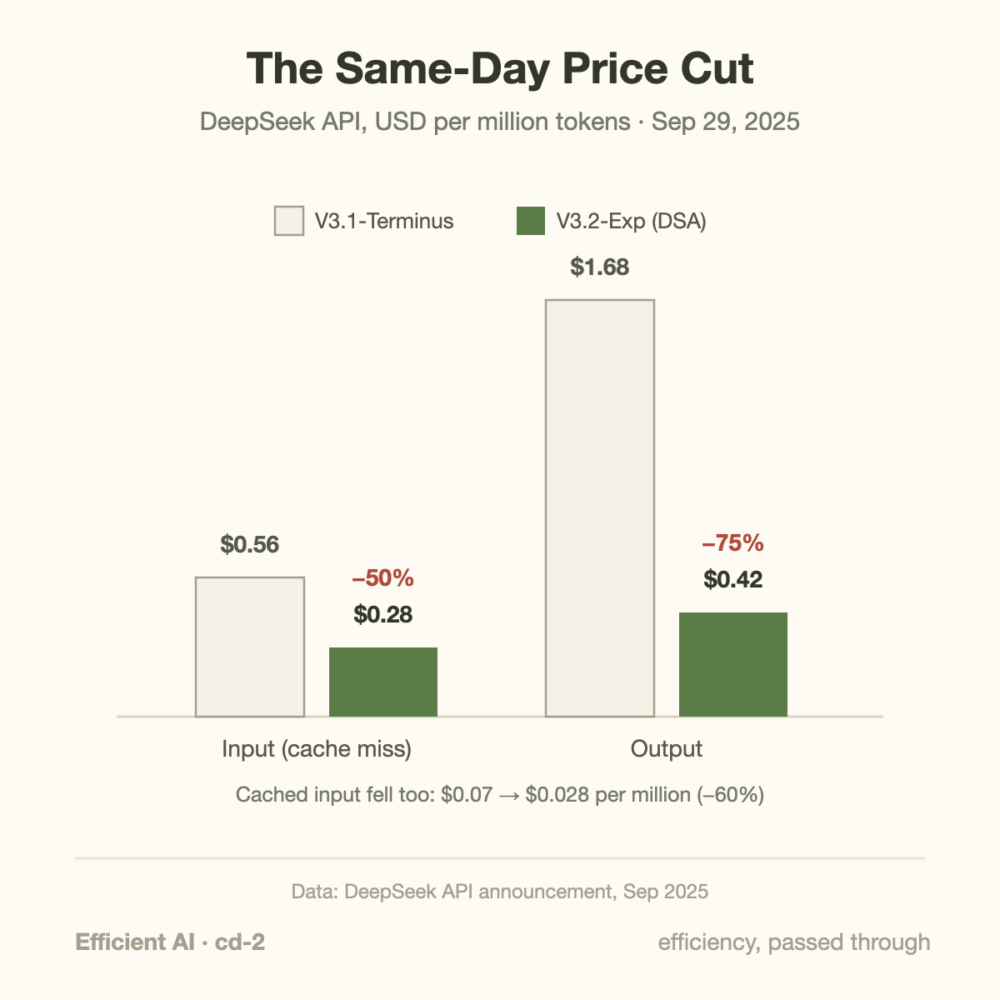
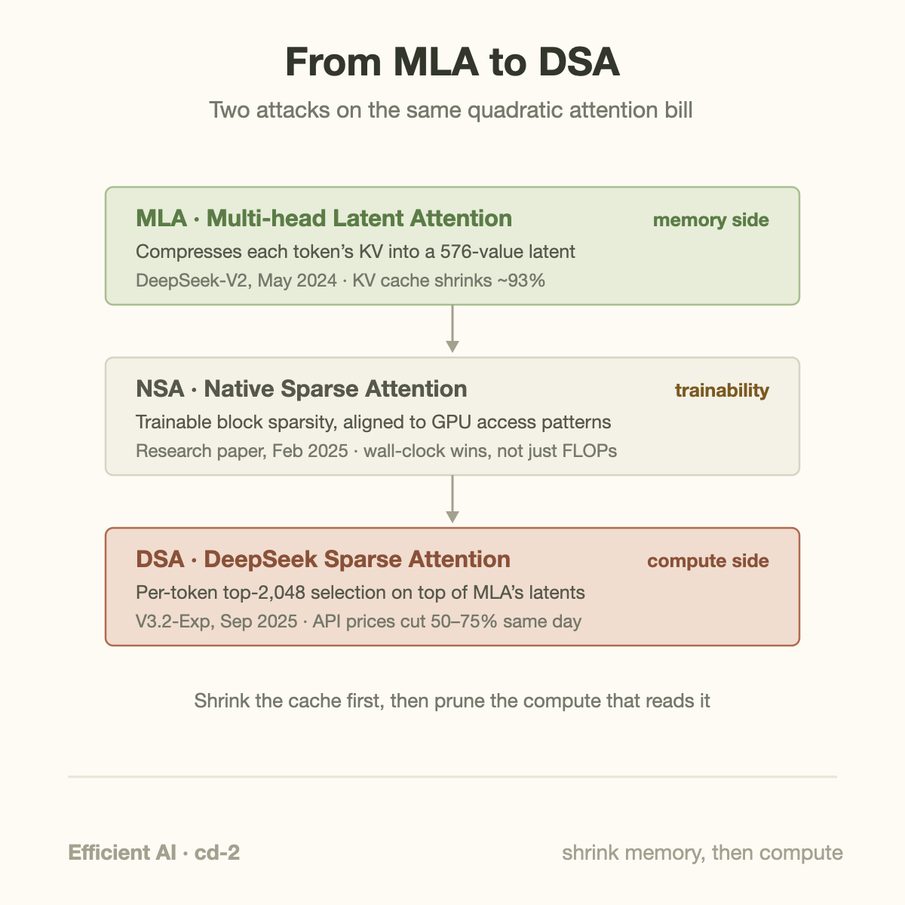

On September 29, 2025, the price of a million output tokens from DeepSeek's API dropped from $1.68 to $0.42. Input tokens fell from $0.56 to $0.28. The hardware serving those tokens did not change. The model's benchmark scores did not change in any meaningful way. What changed was the attention mechanism inside the model and the GPU kernels that run it, and DeepSeek published both, the same day, in the same release notes as the price cut.

That release, [DeepSeek-V3.2-Exp](https://api-docs.deepseek.com/news/news250929/), is the cleanest public demonstration of a claim this series keeps circling: kernels are not an implementation detail under the economics. Kernels *are* the economics. Most of the time the chain from "engineer makes attention faster" to "customer pays less" is hidden inside a company's margins. Here the entire chain was published at once — architecture, kernels, and price sheet.

This article walks through what DeepSeek Sparse Attention (DSA) actually does, why it cuts the bill, and what the episode says about where efficiency gains end up.

## The quadratic bill

Standard transformer attention has a property that dominates long-context economics: every token attends to every previous token. If you have read [attention in plain words](/blog/attention-in-plain-words/), you know the mechanism: each token's query is compared against every earlier token's key, the scores become weights, and the weights blend the values. It is the reason [transformers won](/blog/transformer-architecture-in-one-picture/), and it is also a bill that grows with the *square* of context length.

Concretely: at DeepSeek's 128K context limit (131,072 tokens), processing a full prompt requires roughly L²/2 query-key comparisons per attention layer per head. That is about 8.6 billion comparisons per head per layer, and DeepSeek-V3.2 has 128 heads and dozens of layers. Double the context and the bill quadruples. This is why long-context requests cost API providers disproportionately more than short ones, and why "attention alternatives" is one of the busiest research areas in efficient AI.

The observation behind every sparse-attention scheme is that most of those 8.6 billion comparisons produce weights near zero. A token generating step 90,000 of a long analysis genuinely needs a few thousand earlier tokens: the relevant section of the document, the recent reasoning, a handful of anchors. Full attention pays for all 90,000 anyway, because it has no way to know in advance which few thousand matter.

DSA's answer: add a tiny, fast module whose only job is knowing which ones matter.

## What DSA actually does

DeepSeek Sparse Attention splits attention into two stages, described in the [V3.2-Exp technical report](https://github.com/deepseek-ai/DeepSeek-V3.2-Exp).

**Stage one: the lightning indexer.** For each new query token, a small set of narrow indexer heads scores every cached token. This scan is still quadratic (it touches everything), but each comparison is radically cheaper than real attention: the indexer runs in FP8, uses a handful of narrow heads instead of 128 wide ones, and replaces softmax with a simple ReLU. It is a rough relevance estimate, built to be almost free.

**Stage two: real attention, top-k only.** The indexer's scores pick the top 2,048 tokens, and full-precision attention runs over those 2,048 alone. Everything else in the layer — the latent KV cache, the 128 query heads, the output projection — works exactly as before, just over a shortlist instead of the whole history.

The crucial word in "trainable sparse attention" is *trainable*. Fixed sparsity patterns (sliding windows, strided blocks) decide what to ignore before seeing your data. DSA's indexer is a learned component: it was trained to predict which tokens the full model would have attended to. Selection adapts to the content of every individual query.

The complexity story: main attention drops from O(L²) to O(L·k) with k = 2,048 fixed. The indexer keeps an O(L²) term, but with a constant so small it stays cheap deep into the six-figure context range.

## The worked example: count the pairs, then count the dollars

Take a 128K-token prompt, L = 131,072, and one attention layer.

**Full attention.** Causal attention computes about L²/2 ≈ 8.6 billion query-key pairs per head. Each pair also implies reading that token's cached key/value state.

**DSA.** Each query attends to at most 2,048 tokens: 131,072 × 2,048 ≈ 268 million pairs of *expensive* attention. That is a 32× reduction (L/2k = 131,072/4,096) in main-attention work. The indexer still scans all 8.6 billion pairs, but at FP8 with a few narrow heads, its cost per pair is a small fraction of real attention's.

Decode is where it bites hardest. When the model generates token 131,073, full attention must read the entire cached history for that layer: 131,072 tokens × 576 values each (DeepSeek's MLA latent, more on that below) ≈ 75 million values, per layer, for one new token. DSA reads 2,048 × 576 ≈ 1.2 million — 64× fewer. Since decode at long context is dominated by exactly these memory reads (the same bandwidth wall that drives the [Blackwell-to-Rubin memory math](/blog/blackwell-to-rubin-memory-math/)), cost per generated token stops climbing with context length and flattens once you pass 2,048 tokens of history.

Now the dollars. Consider a document-analysis call: 100K input tokens, 5K output.

- Before (V3.1-Terminus): 0.1M × $0.56 + 0.005M × $1.68 = $0.056 + $0.0084 = **$0.0644**
- After (V3.2-Exp): 0.1M × $0.28 + 0.005M × $0.42 = $0.028 + $0.0021 = **$0.0301**

A 53% cut on this workload. An agent platform making ten million such calls a month goes from $644,000 to $301,000. Cached input fell too, from $0.07 to $0.028 per million. And this was not an introductory promotion: when DeepSeek later promoted V3.2 to its main endpoint, the prices stayed.

## The lineage: MLA made DSA possible

DSA did not appear from nowhere. It is the third step in a lineage of DeepSeek attacking the attention bill, and the steps compose.

**MLA (May 2024).** [DeepSeek-V2](https://arxiv.org/abs/2405.04434) introduced Multi-head Latent Attention, which attacks the *memory* side of the bill: instead of caching full keys and values for every head, MLA compresses each token's KV state into a single 576-value latent vector, shrinking the KV cache by roughly 93% versus standard multi-head attention. That is what made 128K contexts affordable to *store*. But compute stayed quadratic — every query still touched every latent.

**NSA (February 2025).** DeepSeek's [Native Sparse Attention paper](https://arxiv.org/abs/2502.11089) demonstrated the other half: sparsity you train into the model from the start, with block layouts chosen so GPUs can actually exploit them. Earlier sparse-attention research had a credibility problem — theoretical FLOP savings that never became wall-clock savings because the access patterns fought the hardware. NSA's contribution was showing trainable sparsity that wins on real GPUs, not just in complexity notation.

**DSA (September 2025).** V3.2-Exp fuses the two ideas: fine-grained, per-token selection (sharper than NSA's blocks) running on top of MLA's compact latents. The combination is not accidental. Because MLA in its decode form behaves like multi-query attention — all 128 query heads share the same per-token latent — the 2,048 selected latents are fetched once and reused by every head. A sparse gather that would be scattered, bandwidth-wasting reads in a standard attention layout becomes a dense, reusable working set of about 1.2 million values. The architecture two generations back is what makes the sparse kernel efficient today.

## Going deeper: training a module whose output is a hard cutoff

A top-k selection is not differentiable — a token is in the shortlist or it is not, and gradients do not flow through "not". So how do you train the indexer to make good choices?

DeepSeek's recipe, from the technical report: continue pretraining from V3.1-Terminus in two stages. First, a short *dense warm-up*: the model runs full attention as before, while the freshly initialized indexer runs alongside it and is trained, via a KL-divergence loss, to imitate the real attention distribution — to predict where the full model actually looks. Only the indexer's weights update. Then the *sparse stage*: top-k selection switches on, the whole model trains for roughly a trillion tokens under sparse attention, and the indexer keeps aligning with the main branch while the main branch adapts to seeing only shortlists. The published benchmark table shows V3.2-Exp on par with V3.1-Terminus, small wins and small losses, from a continued-pretraining budget that is a rounding error next to a from-scratch run.

The kernel side is just as deliberate. Sparse attention has historically died in the gap between algorithm and silicon: GPUs want big, regular, coalesced memory reads, and "gather 2,048 arbitrary positions" is the opposite. DeepSeek shipped its answer in public — the kernels are open-sourced in [TileLang](https://github.com/tile-ai/tilelang), a Python-embedded DSL they recommend for readable prototyping, and as production CUDA in [FlashMLA](https://github.com/deepseek-ai/FlashMLA) and DeepGEMM (indexer logits, paged variants, the FP8 paths). The release notes read like a co-design manifesto in miniature: here is the architecture, here is exactly how we made it fast, here is the price that fell out.

One honest caveat belongs in any account of this story: "benchmark parity" is DeepSeek's own evaluation, on DeepSeek's chosen suite, for a model explicitly labeled experimental. The company itself kept V3.1-Terminus available through a comparison API for two weeks so users could check for regressions on their workloads. That is better epistemics than most launches, but parity on a published table is a vendor claim until third parties have hammered the edge cases, and long-context retrieval oddities are precisely where sparse attention would fail quietly.

## Common misconceptions

**"Sparse attention throws away context, so it must lose information."** DSA evicts nothing. The full 128K cache stays resident, and the top-2,048 selection is recomputed *per query token*. A passage the indexer skips at step 500 can be selected at step 501 the moment it becomes relevant. This is the key difference from sliding-window attention, where tokens outside the window are unreachable no matter what. The failure mode is subtler: the indexer must correctly *rank* relevance, and it is a small model that can misjudge.

**"A 50% price cut means inference got exactly 50% cheaper."** The mapping from kernel savings to price is not one-to-one. Attention is only part of total inference cost — MoE FLOPs, communication, and scheduling overheads do not shrink because attention did, and DSA's savings scale with context, so short chats save far less than 128K document jobs. DeepSeek's own cost-per-token curves show the largest gains at long context. The 50%+ figure is a *pricing decision* informed by fleet-average savings and, plausibly, by the competitive value of a headline. What the release proves is direction and rough magnitude, not a clean identity between one kernel and one price.

**"Prices fell because compute got cheaper."** No new GPUs were involved. This cut arrived on the same export-constrained hardware DeepSeek was already serving on, which is what makes it such a clean experiment: hardware constant, software changed, price halved. If anything the causality runs the other way — teams with constrained hardware have the strongest incentive to do this kind of engineering. Hardware price-performance does improve each generation, but that cycle takes years; this took one model revision.

## Where efficiency gains land

The bigger question this episode answers: when someone makes inference cheaper, who pockets the difference?

In a market with one dominant provider, efficiency gains land in margins. In a market where open-weight competitors publish their methods, gains get competed into prices, fast. DeepSeek did not just cut prices; it open-sourced the model weights, the technical report, and the kernels, which converts a private cost advantage into public infrastructure and forces everyone else's cost curve down too. Within weeks, the technique was reproducible by any serving team with strong kernel engineers. That is the same dynamic we saw with [Qwen3-Next's 9.3% training budget](/blog/the-9-percent-model-qwen3-next/): in the open-weight ecosystem, architectural efficiency is a competitive weapon whose blast radius includes the incumbents' pricing pages.

It also says something about what an efficiency team is worth. The engineers who built DSA's indexer kernels and gather paths did not speed up a benchmark; they moved a public price by half. If you want a concrete answer to "what does an [ML performance engineer](/blog/what-does-an-ml-performance-engineer-do/) actually produce," this is it, denominated in dollars per million tokens.

## Takeaway

- DSA replaces "attend to everything" with "cheaply score everything, attend to the top 2,048." At 128K context that is 32× less main-attention compute in prefill and 64× fewer KV reads per decoded token, at vendor-reported benchmark parity.
- The mechanism composes with its lineage: MLA (2024) shrank the memory side of the quadratic bill by ~93%; DSA (2025) shrinks the compute side, and MLA's shared latents are exactly what make DSA's sparse gathers hardware-friendly.
- The release shipped architecture, open-source kernels (TileLang + CUDA), and a 50–75% price cut simultaneously — the most legible public evidence that kernel engineering is not below the economics, it is the economics.

## Sources

- DeepSeek — [Introducing DeepSeek-V3.2-Exp](https://api-docs.deepseek.com/news/news250929/) (release notes, price cut, open-source links)
- DeepSeek — [DeepSeek-V3.2-Exp technical report and kernels](https://github.com/deepseek-ai/DeepSeek-V3.2-Exp) (DSA architecture, lightning indexer, training recipe)
- DeepSeek-AI — [DeepSeek-V2: A Strong, Economical, and Efficient Mixture-of-Experts Language Model](https://arxiv.org/abs/2405.04434) (Multi-head Latent Attention)
- Yuan et al. — [Native Sparse Attention: Hardware-Aligned and Natively Trainable Sparse Attention](https://arxiv.org/abs/2502.11089)
- [FlashMLA](https://github.com/deepseek-ai/FlashMLA) and [TileLang](https://github.com/tile-ai/tilelang) — production CUDA and DSL implementations of the kernels
- Ars Technica — [DeepSeek tests sparse attention to slash AI processing costs](https://arstechnica.com/ai/2025/09/deepseek-tests-sparse-attention-to-slash-ai-processing-costs/)

---

*Part of the **Efficient AI & Co-Design** series. Previous: [The 9% Model: Qwen3-Next](/blog/the-9-percent-model-qwen3-next/). Next: [how prefill/decode disaggregation went from rejected paper to default architecture](/blog/the-prefill-decode-disaggregation-story/).*
