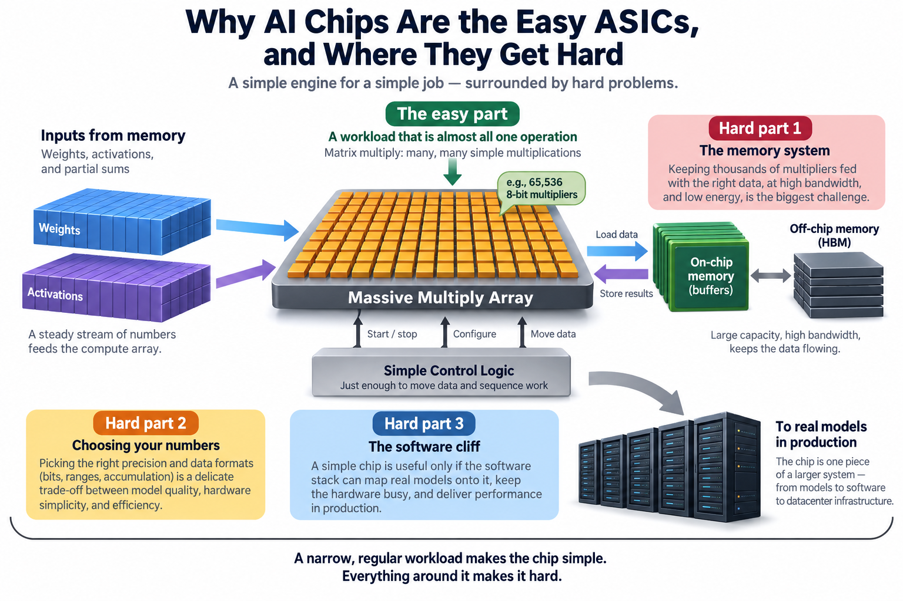
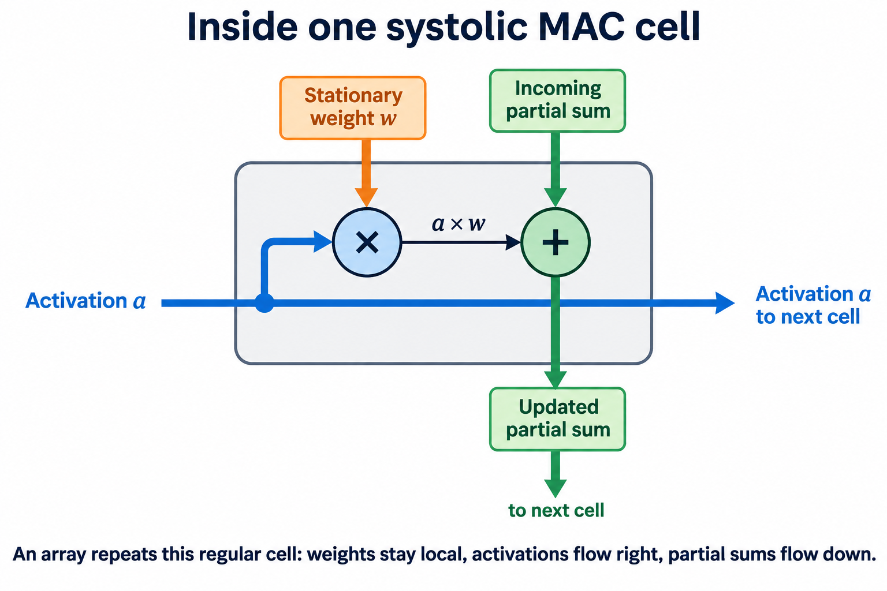
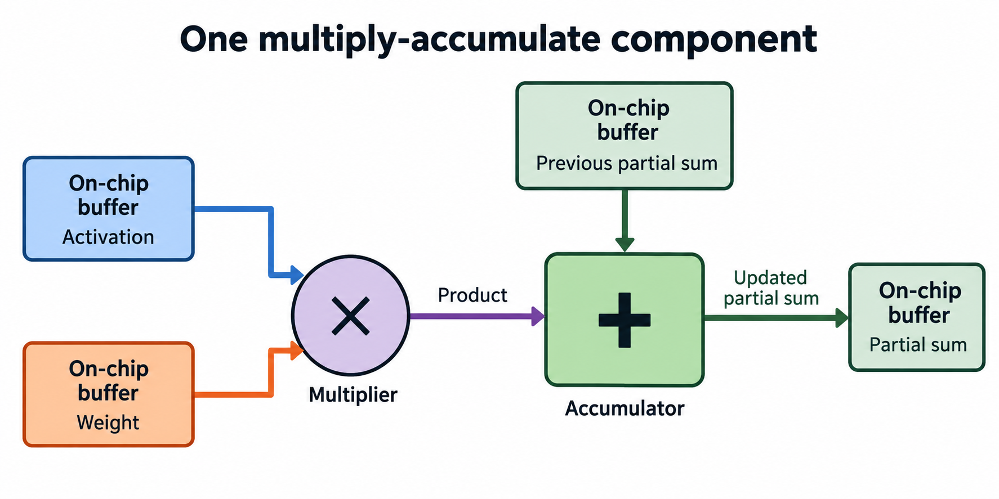
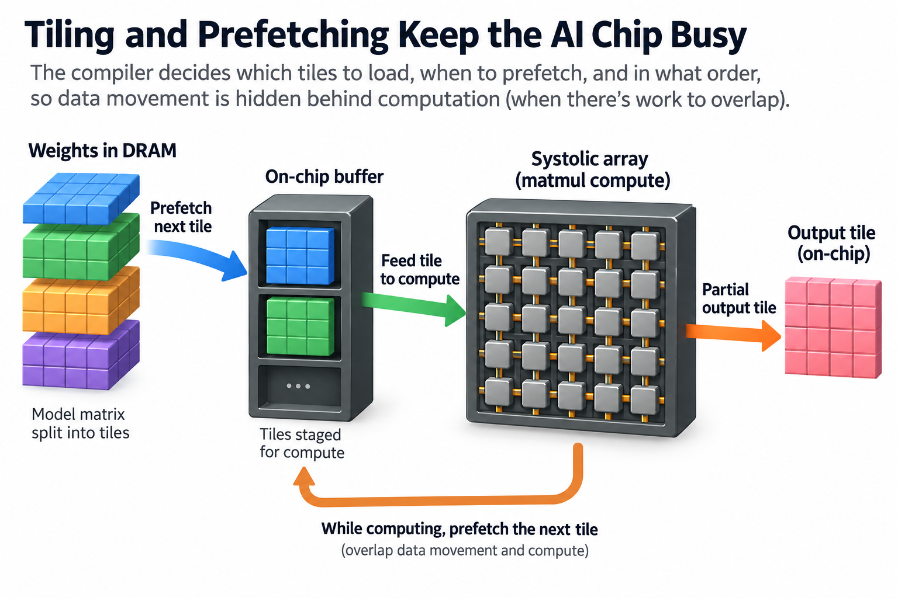

## Overview

Google's first TPU went from design start to serving production traffic in 15 months. That is a startlingly short schedule for a custom chip, and the chip itself explains it: 65,536 8-bit multipliers arranged in a square, fed by control logic so simple that the [ISCA 2017 paper](https://arxiv.org/abs/1704.04760) describing it lists the features it *lacks* as a selling point. No caches. No branch prediction. No out-of-order execution. No multithreading.

If custom silicon is so notoriously expensive and slow to build, how did 1 team ship a competitive datacenter chip on roughly the timeline of a software project? Because AI accelerators are, by the standards of the ASIC world, the easy case. The workload hands the architect a gift no other domain offers. This article is about that gift, and about the 3 places where the easiness abruptly stops.

## Deep dive

### The gift: a workload that is almost all 1 operation

Deep learning is dominated by dense linear algebra, and mostly by 1 kernel: matrix multiplication. Convolutions lower to matrix multiplies. The attention mechanism is a chain of them. The feed-forward blocks that hold most of a [transformer's](/blog/transformer-architecture-in-one-picture/) parameters are literally nothing else. Profile a training step and the bulk of the floating-point work lands in matmul, with a thin tail of element-wise operations and normalizations around it.

Matrix multiplication has 3 properties an ASIC designer dreams about.

**It is regular.** The same multiply-accumulate (MAC) step repeats millions of times with a memory access pattern known completely at compile time. Recall [what a CPU actually does](/blog/what-a-cpu-actually-does/): most of its silicon exists to *discover* parallelism and predict control flow in irregular programs at runtime. A matmul has no control flow to predict. All of that machinery can be deleted.

**It is parallel by construction.** You can lay down as many multipliers as area and power allow and keep essentially all of them busy. The design question stops being "how do I find parallelism?" and becomes "how many multipliers can I afford?"

**It reuses data heavily.** Multiplying 2 n-by-n matrices touches 2n² input numbers but performs 2n³ operations, so each value fetched from memory can, in principle, participate in n operations. That ratio, operations per byte, is called *arithmetic intensity*, and matmul's grows with matrix size. High intensity means a well-designed chip can keep thousands of multipliers fed from a modest stream of memory traffic, provided it holds data close and reuses it.

The architecture that exploits all 3 at once is the **systolic array**, an idea H.T. Kung and Charles Leiserson described around 1978-1982 and the TPU made famous. Picture a grid of MAC cells. Weights are preloaded, 1 per cell, and sit still. Activations enter from the left edge and step 1 cell rightward each clock cycle; partial sums step downward. Each cell does the same tiny job every cycle: multiply the passing value by its resident weight, add to the partial sum arriving from above, pass both along. Results emerge from the bottom edge in a steady rhythm, hence the name: data pulses through the array like blood through a heart.

The payoff is enormous. Intermediate values travel micrometers to a neighboring cell instead of round-tripping through register files and caches, which is where most of a general-purpose chip's energy per operation goes. 1 small state machine sequences the whole array, so control overhead amortizes across tens of thousands of multipliers. The hard problems that make CPUs take hundreds of engineer-years simply are not present.

### A worked example: the TPU v1 by hand

The numbers from the 2017 paper are worth redoing yourself, because they contain both the easy part and the first hard part.

**Peak compute.** The TPU v1's matrix unit is a 256 × 256 systolic array: 65,536 MAC cells. It runs at 700 MHz, and each MAC counts as 2 operations (a multiply and an add):

65,536 MACs × 2 ops × 0.7 GHz ≈ **92 × 10¹² ops/s**, or 92 TOPS of 8-bit arithmetic.

That figure came from a 28 nm chip drawing tens of watts, when a contemporary GPU delivered a small fraction of it. 1 die, 1 repeated cell. The easy part really is this easy.

**Now the catch.** The TPU v1 was fed by 2 DDR3 memory channels totaling **34 GB/s**. Divide peak compute by memory bandwidth:

92 × 10¹² ops/s ÷ 34 × 10⁹ bytes/s ≈ **2,700 operations per byte**.

That quotient is the chip's *ridge point*: a workload must perform about 2,700 operations for every byte it pulls from DRAM, or the multipliers stall waiting for data. This is the roofline model from Williams, Waterman, and Patterson, and applying it is a 1-line calculation with brutal implications.

Which workloads clear 2,700? Google's own paper answers candidly: the multilayer perceptrons and LSTMs that made up most of 2016 datacenter demand had far lower intensities, because at inference batch sizes their weight matrices stream from memory with little reuse. Those applications achieved roughly a tenth of peak. Only convolutional networks, with their high intrinsic reuse, came close to 92 TOPS.

So the first-generation TPU was, for most of its actual traffic, a memory-bound machine wearing a compute-monster's spec sheet. Google's fix in the TPU v2 was not more multipliers. It was High Bandwidth Memory, lifting the feed from 34 GB/s to roughly 600 GB/s per chip, a 17× jump that moved the ridge point down to where real workloads live.

Express the feeding requirement as a resource bound. Let $$F$$ be useful operations, $$D$$ bytes transferred from DRAM, $$I=F/D$$ arithmetic intensity, $$C$$ peak arithmetic rate, and $$\beta$$ DRAM bandwidth. Under an ideal overlap model,

$$
R_{\mathrm{ops}}\le\min(C,\beta I),\qquad I_* = C/\beta.
$$

Using the rounded historical TPU v1 figures, $$C=92\times10^{12}$$ operations per second and $$\beta=34\times10^9$$ bytes per second give $$I_*\approx2{,}706$$ operations per byte. A hypothetical kernel at intensity 100 has a bandwidth ceiling of 3.4 TOPS, only about 3.7% of that arithmetic peak.

The innovation is to co-design reuse, storage, and arithmetic instead of multiplying the number of MAC cells alone. A larger local buffer or better tile schedule can reduce external bytes per result; HBM increases the byte service rate. Those are distinct interventions. Check the compiler's transferred bytes and achieved throughput for representative matrix shapes, then compare with the same workload on the baseline. Larger arrays can lose utilization on narrow matrices, and more buffering consumes area that could hold arithmetic. The design problem is a balanced operating envelope, not “the multiplier array is never the problem.”

### Hard part 1: the memory system

That correction generalizes into the first law of accelerator design: **the multiplier array and its data supply must be designed together.**

Feeding it means HBM, and HBM means advanced packaging: stacks of DRAM dies sitting millimeters from the compute die on a silicon interposer, connected by thousands of wires per stack, assembled with technologies like TSMC's CoWoS. This is co-design across die, package, and DRAM vendor roadmaps, with a supply chain that has repeatedly been the industry's binding constraint, and on a modern accelerator the HBM stacks and packaging can rival the logic die in cost.

Above the DRAM sits the on-chip memory hierarchy, and here the ASIC diverges from the CPU philosophy completely. Caches guess what to keep. An AI chip does not need to guess, because the dataflow is known at compile time, so designers spend area on large *software-managed* buffers instead: the TPU v1 devoted 24 MiB (about a third of its die) to a unified activation buffer, and the pattern persists in every serious accelerator since. The catch is in that word "software-managed": someone now has to write the software that manages it. Remember that; it is the third hard part growing roots.

I covered where this arms race stands today, with capacity flat and bandwidth nearly tripling between generations, in [Blackwell to Rubin: memory math](/blog/blackwell-to-rubin-memory-math/).

### Hard part 2: choosing your numbers

A CPU designer inherits number formats from standards. An AI ASIC designer must *bet* on them, years ahead, in frozen silicon.

The stakes are quadratic: a multiplier's area grows roughly with the square of mantissa width, so halving precision roughly quadruples the multipliers per square millimeter, doubles the values per byte of precious bandwidth, and cuts energy per operation severalfold. Every generation of accelerators has ridden this curve downward: FP32 to FP16 and Google's bfloat16 (which keeps FP32's exponent range and sacrifices mantissa, a choice made precisely because gradients need range more than precision), then to [FP8 formats](https://arxiv.org/abs/2209.05433) with per-tensor scaling, and now to 4-bit formats like NVFP4 and the OCP microscaling types, where tiny blocks of values share a scale factor to survive on a handful of bits.

The bet is dangerous in both directions. Too conservative, and a rival with a narrower format ships twice your effective throughput on the same silicon. Too aggressive, and models fail to train or quantize accurately on your hardware, and no discount saves you. The 15-month TPU was possible partly because 8-bit inference was a well-understood target in 2015. Guessing what precision frontier training needs in 2028 is a research problem, and you must tape out your answer.

### Going deeper: the software cliff

Now the hardest part, the one that fills the graveyard.

A matmul array only hits its peak when data arrives in exactly the right order at exactly the right time, and nothing in the silicon arranges that. The compiler must take a model, a graph of thousands of tensor operations, and decide how to *tile* each 1: how to slice matrices into blocks that fit the on-chip buffers, in what order to walk the blocks to maximize reuse, when to prefetch the next tile so DMA engines hide DRAM latency behind computation, how to overlap the element-wise operations with the matmuls they follow, and how to partition all of it across chips. Every scheduling decision the systolic array's simplicity deleted from hardware reappears here, in software, multiplied by the diversity of every model anyone wants to run. A tile size off by a factor of 2 can halve delivered throughput; a missed overlap turns a 92 TOPS chip into a 9 TOPS chip. Peak FLOPS are printed on the datasheet, but [goodput is earned](/blog/goodput-vs-utilization/) kernel by kernel.

And the kernel surface is a long tail. Matmul dominates the FLOPs, not the operator count: real models carry hundreds of distinct operations, and researchers invent new ones (a novel attention variant, a new normalization) monthly. NVIDIA's answer to this tail is nearly 2 decades of CUDA libraries and armies of kernel engineers. Google's answer is the XLA compiler plus a decisive structural advantage: it controls both the hardware and the workloads, so the compiler only has to be great at what Google actually runs.

A startup has neither advantage, and the record shows what happens next. Nervana was acquired by Intel for a reported $400M in 2016 and cancelled in early 2020 with no volume product shipped. Wave Computing, once valued in the billions for its dataflow processor, filed for bankruptcy in April 2020. Graphcore built genuinely interesting silicon, struggled for years to make mainstream models run well on it, and was sold to SoftBank in 2024 for a price reported to be below the capital it had raised. These histories do not isolate a single cause; compiler coverage, financing, market timing, and commercial execution all matter alongside architecture. Sara Hooker's essay [The Hardware Lottery](https://arxiv.org/abs/2009.06489) names the general principle: hardware wins when the software ecosystem and research mainstream align with it, not merely when its architecture is clever.

The honest budgeting rule that follows: if you are planning an AI chip and your software team is not at least as large as your hardware team, you are planning half a product.

### The bigger picture, and closing the series

This series began with the machinery of general-purpose computing: pipelines, branch predictors, out-of-order engines, all of it silicon spent coping with *not knowing* what the program will do. The AI accelerator is the limiting case in the other direction: a workload so regular that nearly all of that machinery can be traded back for raw arithmetic. That trade is what "the easy ASIC" means. The TPU's authors could skip 40 years of CPU tricks because matmul never branches.

The product side of this story, what today's accelerators actually ship and how models are bending to meet them, is the territory of the Efficient-AI series, which picks up exactly where this article stops.

### Common misconceptions

**"More TOPS means a faster chip."** Peak TOPS describes the multiplier array; delivered performance describes the memory system and the compiler. The TPU v1's own paper shows its dominant workloads reaching roughly a tenth of peak because 34 GB/s of DDR3 could not feed 92 TOPS. Do the ridge-point division before trusting any headline number.

**"AI ASICs win because GPUs are bad at matrix math."** Modern GPUs are largely matrix machines themselves: since 2017, NVIDIA has filled its dies with tensor cores, which are small systolic-style MAC arrays, and most datacenter GPU FLOPs now come from them. The ASIC's edge is dropping generality overhead (graphics hardware, wide format support, flexible thread scheduling), a constant factor that shrinks each time GPUs specialize further. What the ASIC route really buys incumbents like Google and Meta is margin capture and workload co-design, not access to arithmetic GPUs lack.

**"If the silicon comes back working, the hard part is over."** Nervana, Wave Computing, and Graphcore all had working silicon, respectable architectures, honest benchmarks on hand-picked kernels. What they lacked was a compiler and kernel ecosystem that made *arbitrary customer models* fast without heroics. First silicon that boots is roughly the halfway mark of an AI chip program, and the second half has killed more companies than the first.

## Conclusion

- Dense linear algebra is the friendliest workload in the ASIC world: regular, massively parallel, and reuse-rich, so a systolic array of tens of thousands of MACs with minimal control logic gets you to spectacular peak numbers fast. The TPU v1's 15-month schedule is the proof.
- The genuine difficulties are conserved, not eliminated: feeding the array (HBM, packaging, software-managed buffers), betting on number formats years ahead (bf16 to FP8 to FP4), and above all building the compiler and kernel stack that turns peak into goodput.
- Judge an AI chip program by its software team and its ridge point, not its TOPS. History's shortest summary: working silicon is necessary, while software coverage and commercial execution determine whether it becomes a useful product.

### Sources

- N. Jouppi et al., "In-Datacenter Performance Analysis of a Tensor Processing Unit," ISCA 2017 — [arxiv.org/abs/1704.04760](https://arxiv.org/abs/1704.04760)
- S. Williams, A. Waterman, D. Patterson, "Roofline: An Insightful Visual Performance Model for Multicore Architectures," Communications of the ACM, 2009
- H.T. Kung, "Why Systolic Architectures?", IEEE Computer, 1982
- S. Hooker, "The Hardware Lottery," 2020 — [arxiv.org/abs/2009.06489](https://arxiv.org/abs/2009.06489)
- P. Micikevicius et al., "FP8 Formats for Deep Learning," 2022 — [arxiv.org/abs/2209.05433](https://arxiv.org/abs/2209.05433)

*Part of the [Computer Architecture & ASIC](/series/comp-arch/) learning path. Browse its published articles by topic.*
