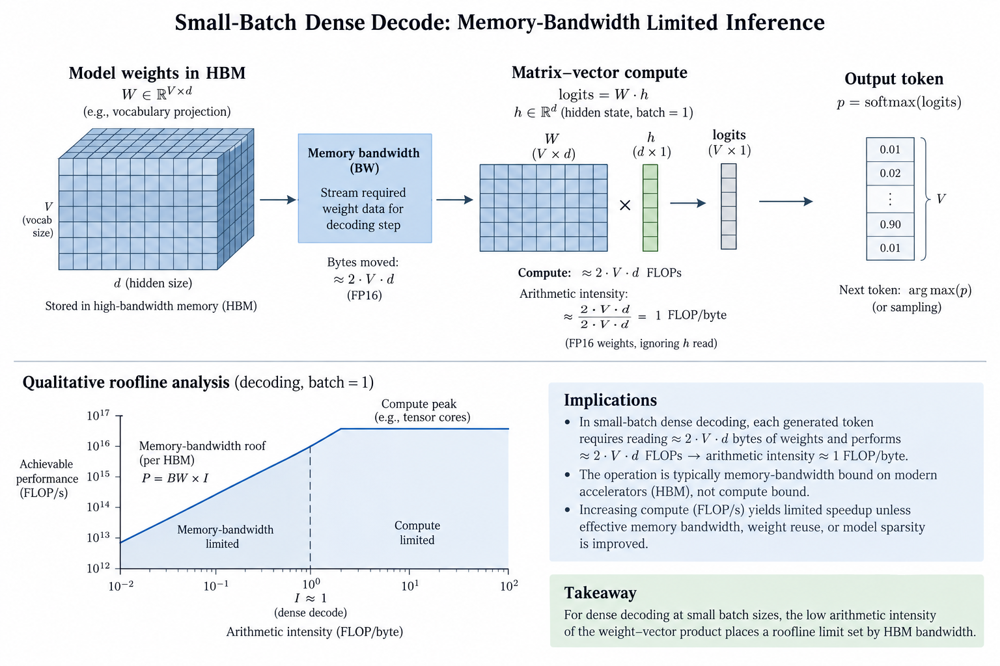
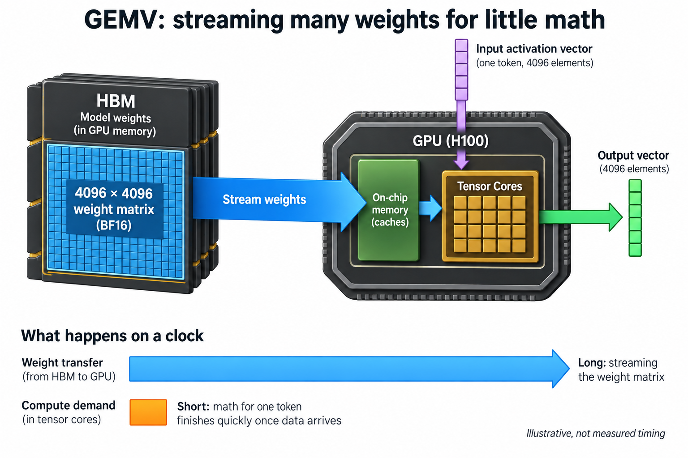
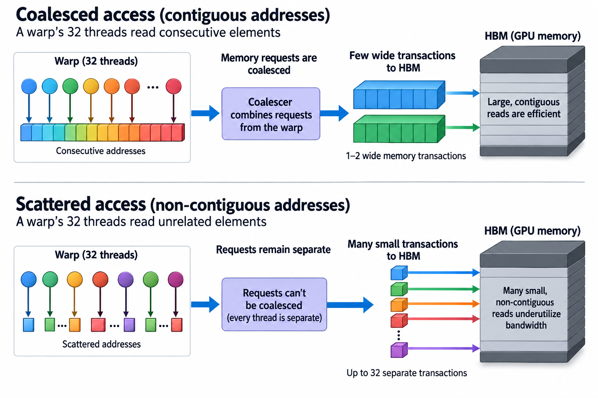
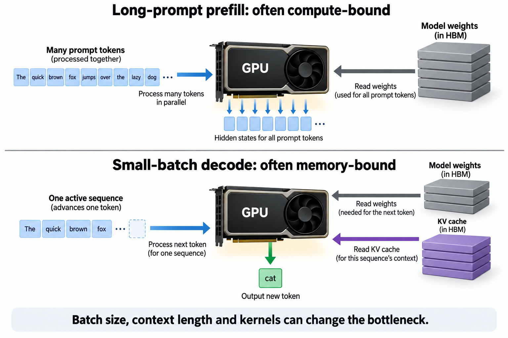

## Overview

An H100 SXM can execute roughly 989 trillion BF16 floating-point operations per second, but its HBM3 memory can deliver only 3.35 trillion bytes per second. Divide the 2 and you get the most consequential number in inference performance: about 295 floating-point operations must happen for every byte fetched from memory, or the math units starve. Decode-phase LLM inference delivers about 1. That factor of ~300 is why a GPU running "flat out" during token generation is, from the tensor cores' point of view, idle more than 99% of the time.

This article is the first in a set on CUDA and kernel-level execution. Before we can talk about writing fast kernels, we need a precise picture of what a GPU actually does with a workload, and why the answer for LLM decode is mostly "wait for memory."

## Deep dive

### How a GPU actually executes work

NVIDIA GPUs run a model called SIMT: single instruction, multiple threads. Threads are grouped into **warps** of 32, and a warp is the real unit of execution. All 32 threads in a warp execute the same instruction at the same time on different data. When you launch a kernel with a million threads, the hardware sees ~31,250 warps, distributed across the chip's streaming multiprocessors (SMs). An H100 has 132 SMs, and each SM can hold up to 64 resident warps at once.

The key design decision, and the thing that makes GPUs different from CPUs, is how they deal with latency. A load from HBM takes on the order of 400 to 800 cycles to come back. A CPU attacks that latency with big caches, prefetchers, and [out-of-order execution](/blog/out-of-order-execution/), spending enormous silicon area to keep 1 thread moving. A GPU does almost none of that. Instead, when a warp issues a load and can't proceed, the SM's warp scheduler simply picks a different resident warp that is ready and issues its instruction. The switch costs 0 cycles, because every resident warp keeps its own slice of the register file permanently. Nothing gets saved or restored.

This is latency *hiding*, not latency *reduction*. The load still takes 600-odd cycles; the GPU just arranges to have hundreds of other warps in flight so that somebody always has work. It works beautifully, with 1 condition attached: the warps that keep the pipes busy must eventually have arithmetic to do. If every warp is doing nothing but loading bytes and performing 1 multiply-add per byte, then latency is hidden but the machine is now limited by something no amount of warp switching can fix: the total number of bytes per second the HBM interface can deliver.

That's the pivot from a latency problem to a bandwidth problem, and it's where the 295 number comes in.

### Arithmetic intensity and the ridge point

The ratio of floating-point operations performed to bytes moved from memory is called **arithmetic intensity**, measured in FLOPs per byte. Every kernel has 1. Every chip has a break-even value: peak compute divided by peak bandwidth.

For an H100 SXM in BF16 (dense, without the 2:4 sparsity marketing multiplier):

- Peak compute: ~989 TFLOPS
- Peak HBM3 bandwidth: 3.35 TB/s
- Break-even intensity: 989 × 10¹² / 3.35 × 10¹² ≈ **295 FLOPs per byte**

A kernel whose intensity is above 295 is compute-bound: the memory system can keep up, and performance is set by the math units. A kernel below 295 is memory-bound: the tensor cores finish their work early and wait, and performance is set entirely by bandwidth. The classic way to draw this is the roofline model of Williams, Waterman, and Patterson: attainable performance as a flat compute ceiling joined to a sloped bandwidth line, meeting at the ridge point.

Where does LLM inference land? It depends dramatically on the phase. [Prefill](/blog/how-an-llm-generates-text/) processes the whole prompt at once, so every weight loaded from memory gets multiplied against hundreds or thousands of token activations. That's a matrix-matrix multiply (GEMM) with high intensity, comfortably compute-bound. Decode generates 1 token at a time, so each weight is used exactly once per forward pass. That's a matrix-vector multiply (GEMV), and its intensity is stuck near the bottom of the roofline.

Let's compute it exactly.

### Worked example: 1 GEMV, 2 clocks

Take a single 4096 × 4096 projection matrix, the shape of an attention output projection in a 7B-class model, in BF16, applied to 1 decode token on an H100 SXM.

**Bytes moved.** The weight matrix has 4096 × 4096 = 16.78 million parameters, at 2 bytes each: **33.55 MB**. The input activation vector is 4096 × 2 B = 8 KB, the output another 8 KB. Those 16 KB are noise next to 33.55 MB, so the traffic is essentially the weights: ~33.57 MB.

**FLOPs performed.** Each output element needs 4096 multiply-adds; there are 4096 outputs. That's 2 × 4096 × 4096 = **33.55 MFLOP** (counting a multiply-add as 2 operations).

**Arithmetic intensity.** 33.55 × 10⁶ FLOPs / 33.57 × 10⁶ bytes ≈ **1.0 FLOP per byte**. The hardware wants 295.

Now put both on a clock:

- Time to stream the weights: 33.55 MB / 3.35 TB/s ≈ **10.0 µs**
- Time for the tensor cores to do the math: 33.55 MFLOP / 989 TFLOPS ≈ **0.034 µs**

The compute finishes 295× faster than the memory can feed it. During those 10 microseconds, the math units are doing useful work for 34 nanoseconds. Utilization of the FLOP capability: about **0.3%**.

Scale this up and the whole decode story falls out. A 7B model in BF16 is about 13.5 GB of weights, and generating 1 token requires touching essentially all of them. At 3.35 TB/s, that read takes 13.5 GB / 3.35 TB/s ≈ **4.0 ms**, which caps single-stream decode at roughly **250 tokens per second** on an H100 no matter how clever the kernels are. Measured numbers land below that because attention, KV-cache reads, and kernel launch overheads eat into it, but the ceiling itself is pure bandwidth arithmetic. Compute capability never enters the formula.

This is also why batching is the single most powerful lever in inference serving. If 300 requests share a decode step, the weight matrix is loaded once and multiplied against 300 activation vectors: intensity rises to roughly 300 FLOPs per byte, right at the ridge point, and the GPU finally earns its TFLOPS. Everything in modern serving stacks, from vLLM's continuous batching onward, is an attempt to push decode up that slope.

### Going deeper: what it takes to even saturate the bandwidth

Saying "decode is bandwidth-bound" quietly assumes the kernel actually achieves 3.35 TB/s. That is not automatic. Bandwidth is a rate, and by Little's law, sustaining a rate across a long-latency pipe requires keeping enough requests in flight:

> bytes in flight = bandwidth × latency ≈ 3.35 TB/s × ~600 ns ≈ **2 MB**

2 megabytes of outstanding loads, continuously, across the whole chip. Divided over 132 SMs that's ~15 KB of in-flight data per SM at every instant, which is why memory-bound kernels still need high occupancy (many resident warps) and wide, coalesced accesses. A warp accessing 32 consecutive BF16 values produces 1 or 2 128-byte transactions; a warp whose threads scatter across memory produces up to 32 separate transactions for the same instruction, and effective bandwidth collapses well below the paper number. The SIMT model executes either pattern with identical instruction streams, which is exactly why profiling with Nsight Compute, not intuition, is how you find out which one you wrote.

There's a subtlety about occupancy worth flagging, because it inverts a popular rule of thumb. Occupancy, the fraction of the 64 warp slots per SM that are filled, is a *means* of hiding latency, not a performance metric. Volkov's classic GTC work showed kernels reaching peak throughput at 25% occupancy by giving each thread more independent work (instruction-level parallelism), so each warp had more memory requests in flight. Once the 2 MB of in-flight bytes is achieved, extra warps add nothing; before that, they're 1 of several ways to get there.

Use the roofline as a lower bound on service time rather than a direct reading of idle tensor-core cycles. For F floating-point operations and D actual HBM bytes, with peak compute C and peak bandwidth beta:

$$
t\ge\max\left(\frac{F}{C},\frac{D}{\beta}\right),\qquad
P_{\mathrm{attainable}}\le\min(C,\beta F/D).
$$

The 4096-square BF16 matrix-vector example has approximately 33.6 million operations and 33.6 MB of traffic. Its ideal memory term is 10 microseconds, compared with a 34-nanosecond compute term. That comparison does not mean the device physically performs all arithmetic in 1 34-nanosecond burst; loads and arithmetic are interleaved throughout execution.

The useful innovation in batching is reuse of a weight read across more outputs. It changes D per produced token while increasing F per iteration. Validate the predicted regime change by sweeping batch size at fixed context and observing memory throughput, tensor-pipe throughput, and iteration duration. If both resources remain lightly used, look for insufficient independent work, dependencies, or launch gaps. Intensity identifies a candidate ceiling, but only the trace establishes which mechanism currently prevents reaching it.

### Common misconceptions

**"nvidia-smi shows 100% GPU utilization, so the GPU is fully used."** The `nvidia-smi` utilization figure only reports the fraction of time *at least 1 kernel was resident* on the device. Our GEMV above would show 100% utilization while delivering 0.3% of peak FLOPS. The gap between "a kernel is running" and "the silicon is producing useful math" is the entire subject of [goodput measurement](/blog/goodput-vs-utilization/), and it's routinely a factor of 10 to 300.

**"Decode is slow because the GPU doesn't have enough compute."** It has vastly too much. The worked example shows compute finishing 295× ahead of memory. This is also testable with hardware: an H200 has essentially the same TFLOPS as an H100 but 4.8 TB/s of HBM3e, and single-stream decode speeds up by roughly the bandwidth ratio (~1.4×), not at all by the unchanged compute. Buying TFLOPS for a batch-1 decode workload is buying the wrong number on the spec sheet.

**"Warp switching makes memory latency free, so memory isn't the problem."** Warp switching hides *latency*; it cannot manufacture *bandwidth*. With enough warps, no cycle is wasted waiting on any individual load, yet the kernel still can't move more than 3.35 TB/s of data. Latency hiding determines whether you reach the bandwidth roof; arithmetic intensity determines whether the bandwidth roof is the one you hit. These are 2 different walls, and decode-phase inference hits the second 1 with the first fully solved.

### The bigger picture

Almost everything in this series so far converges on this one ratio. The FLOPs-per-byte gap is the GPU-scale incarnation of [the memory wall](/blog/the-memory-wall-latency-numbers/): compute throughput has compounded faster than memory bandwidth for 3 decades, and stacking DRAM into [HBM](/blog/from-dram-to-hbm/) narrowed the gap without closing it. The B200 moves to ~8 TB/s but also raises compute, so its ridge point stays in the hundreds of FLOPs per byte; the [Blackwell-to-Rubin memory math](/blog/blackwell-to-rubin-memory-math/) shows the ratio drifting, not disappearing.

It also explains why the industry is physically splitting inference in 2. Prefill sits above the ridge point and wants FLOPs; decode sits at intensity ≈ 1 and wants bandwidth. 1 chip cannot be provisioned optimally for both, which is the entire thesis behind [prefill/decode disaggregation](/blog/the-prefill-decode-disaggregation-story/) and prefill-specialized silicon like [Rubin CPX](/blog/prefill-gets-its-own-chip-rubin-cpx/). And it explains the appeal of 4-bit weight formats: halving bytes per parameter doubles decode's arithmetic intensity and its token-rate ceiling in 1 move, no faster memory required.

For a kernel engineer, the practical takeaway is a triage discipline. Before optimizing anything, compute the kernel's arithmetic intensity by hand, the way we just did. If it's far below ~295 (on Hopper; compute your own ridge for your chip and datatype), the tensor cores are spectators, and the only optimizations that matter are the ones that move fewer bytes or move them at full width: quantization, fusion to avoid round trips through HBM, coalescing, and batching. Shaving instructions from a kernel that's 99.7% memory-stalled optimizes the 0.3%.

## Conclusion

- The ridge point is the chip's contract: H100 SXM offers ~989 TFLOPS BF16 against 3.35 TB/s of HBM, so a kernel needs ~295 FLOPs per byte of memory traffic to be compute-bound. Know this number for every chip you run on.
- Decode-phase inference is a GEMV at ~1 FLOP per byte: streaming 1 33.5 MB weight matrix takes 10 µs while its math takes 0.034 µs, and a 7B BF16 model is bandwidth-capped near 250 tok/s per stream on an H100 regardless of kernel quality.
- Warp switching hides latency for free but creates no bandwidth; once a kernel saturates HBM, the only wins left are fewer bytes (quantization, fusion) or more math per byte (batching).

### Sources

- NVIDIA, *H100 Tensor Core GPU* specifications — https://www.nvidia.com/en-us/data-center/h100/ (vendor-reported peaks)
- NVIDIA, *CUDA C++ Programming Guide*, SIMT architecture and hardware multithreading — https://docs.nvidia.com/cuda/cuda-c-programming-guide/
- S. Williams, A. Waterman, D. Patterson, "Roofline: An Insightful Visual Performance Model for Multicore Architectures," *Communications of the ACM* 52(4), 2009 — https://doi.org/10.1145/1498765.1498785
- NVIDIA, *GPU Performance Background User's Guide* (math vs. memory limits, arithmetic intensity) — https://docs.nvidia.com/deeplearning/performance/dl-performance-gpu-background/index.html
- V. Volkov, "Better Performance at Lower Occupancy," GTC 2010 (instruction-level parallelism vs. occupancy)
- NVIDIA Developer Blog, "NVIDIA Hopper Architecture In-Depth" — https://developer.nvidia.com/blog/nvidia-hopper-architecture-in-depth/

*Part of the [GPU Programming & Performance](/series/gpu-performance/) learning path. Browse its published articles by topic.*
