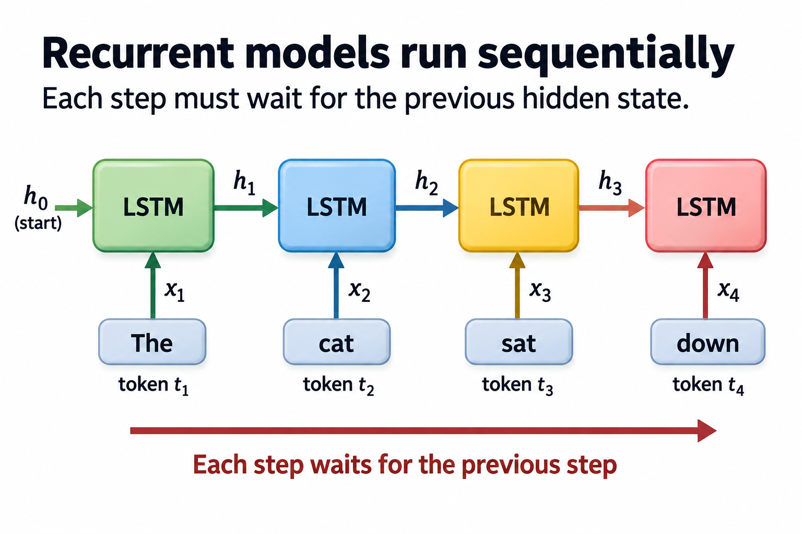
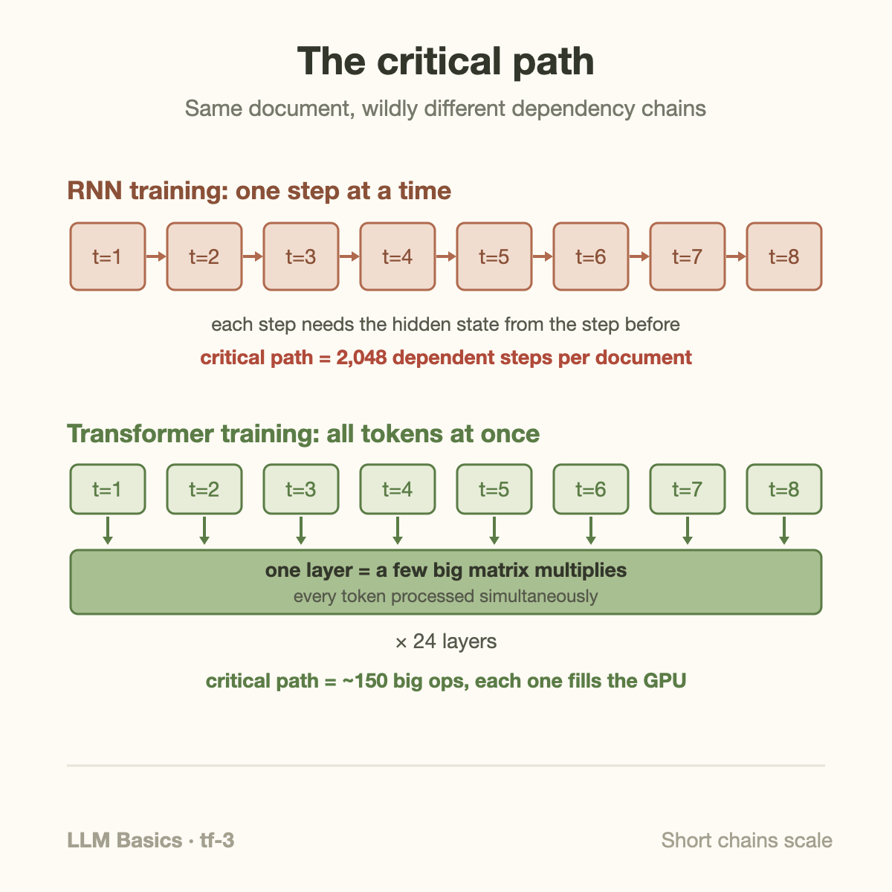
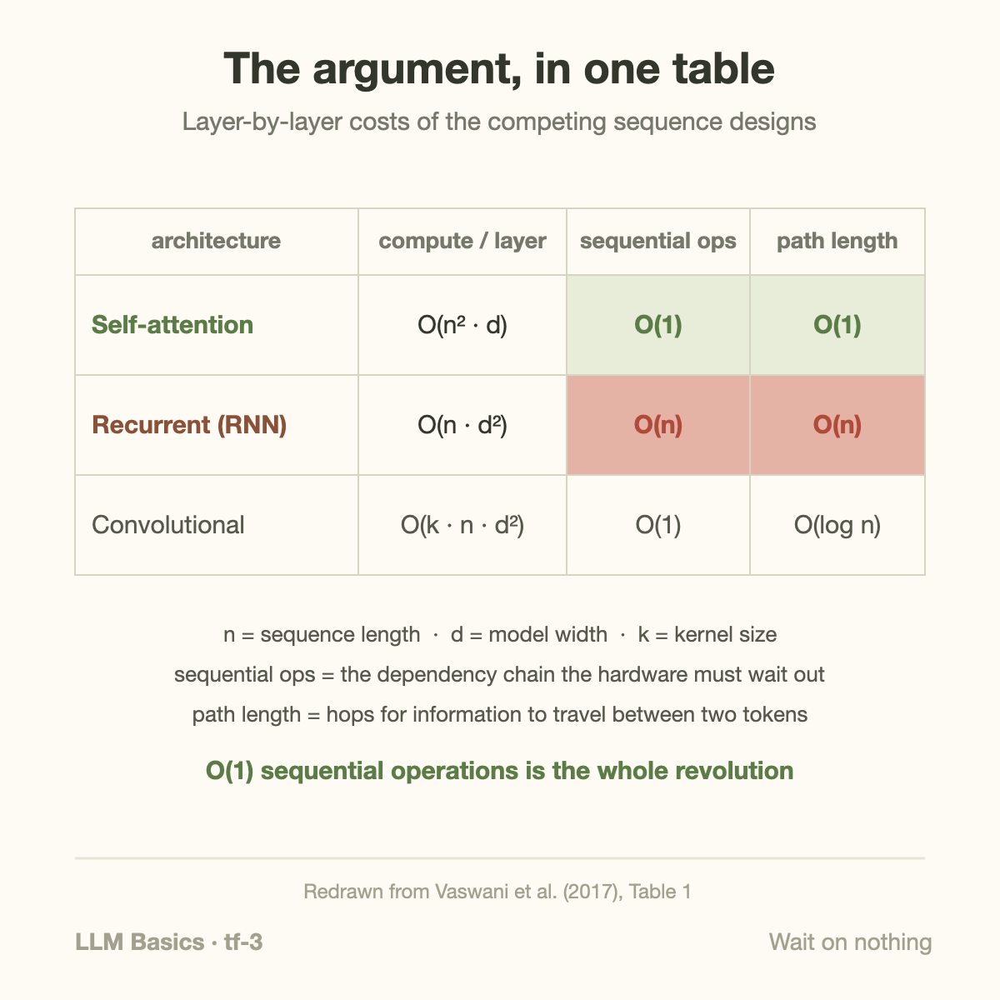
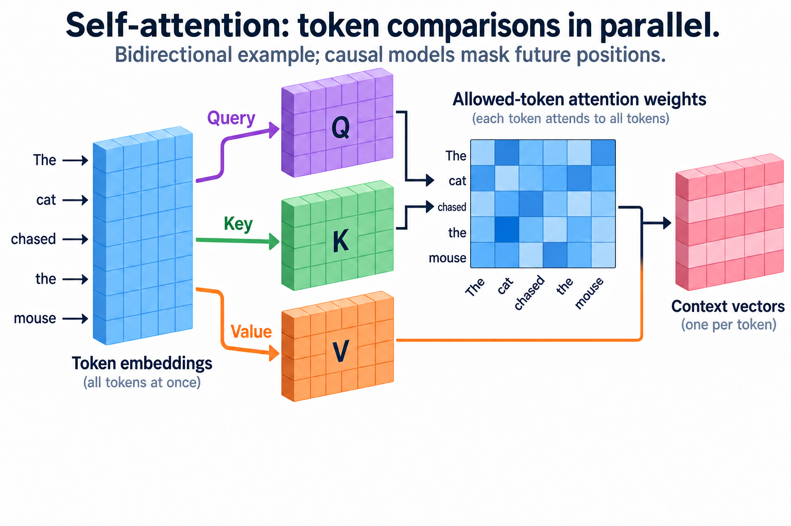
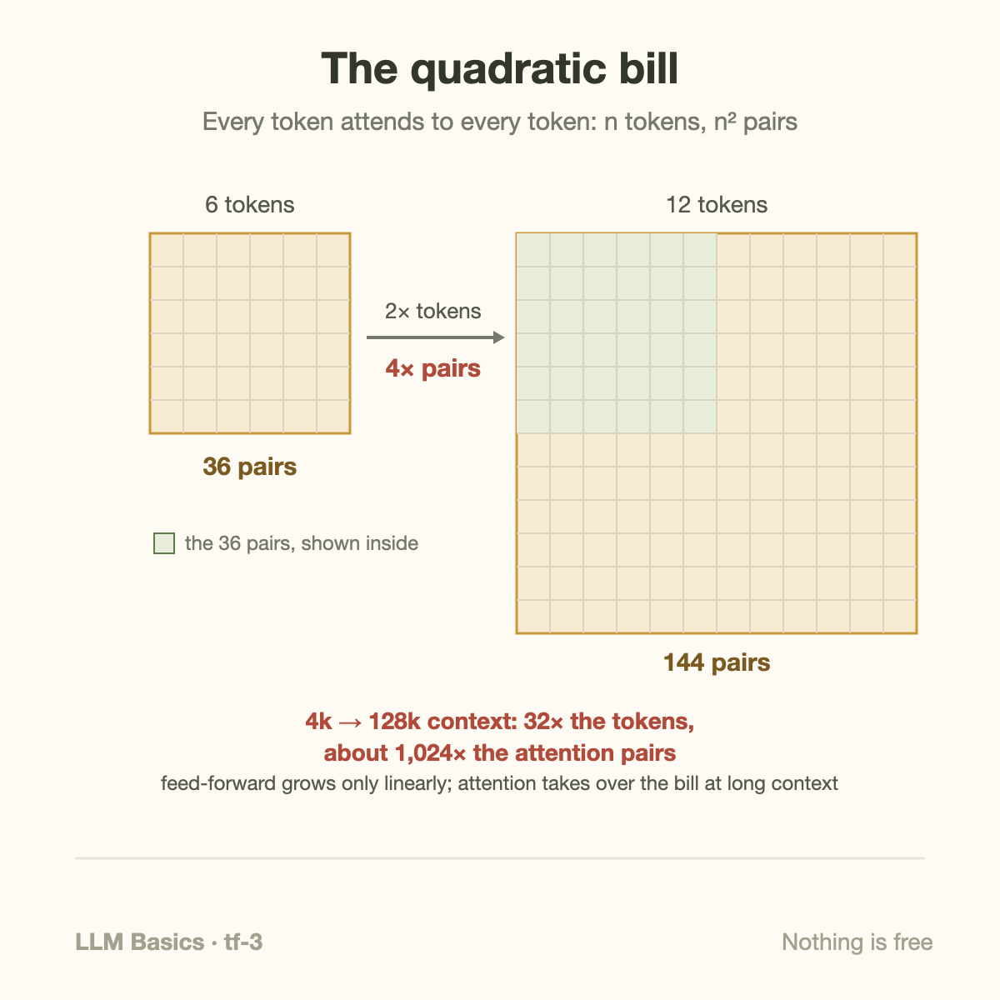

12 hours on 8 GPUs. That's what it took to train the original Transformer's base model in 2017, and it beat Google's production recurrent translation system, which had burned roughly **7 times the compute** to reach a *lower* score (3.3×10¹⁸ FLOPs and 27.3 BLEU versus 2.3×10¹⁹ FLOPs and 24.6, by the paper's own accounting).

Better quality for a seventh of the compute is a nice result. It is not, by itself, a revolution; architectures leapfrog each other all the time. The revolution was hiding in *why* the numbers came out that way, and the "Attention Is All You Need" authors said it plainly in their abstract: the new model was "more parallelizable." This article is about that 1 word, because it, not attention, is the real answer to why every frontier model today is a Transformer.

## The 2017 context: recurrence ruled, and it crawled

Rewind to early 2017. The state of the art in language was the LSTM (the gated recurrent network [from 2 articles back](/blog/rnn-lstm-and-the-wall/)), usually with an attention mechanism bolted on so the decoder could glance back at the source sentence. Google Translate's 2016 overhaul (GNMT) was exactly this: 8 layers of LSTMs plus attention, trained on ~96 GPUs for days per language pair.

Notice something: **attention already existed**. Bahdanau and colleagues had attached it to recurrent translation models back in 2014, and it's the part that made GNMT good. So the 2017 paper's contribution was not inventing attention. It was a *subtraction*: throw away the recurrence, keep only attention, and accept the consequences. The title is literal: attention is all you need, meaning the recurrent part can go.

Why would you want it to go? An LSTM has a structural property that no cleverness can remove: step *t* cannot begin until step *t−1* finishes, because its input includes the hidden state that step *t−1* produced. Reading a 2,048-token document therefore takes 2,048 *sequential* operations. Not 2,048 units of work (sequential work is fine if you can overlap it) but a **dependency chain** 2,048 links long, where every link waits for the previous 1.

A GPU is precisely the wrong machine for long dependency chains. It's a throughput device: tens of thousands of small arithmetic units that are only fast when you hand them 1 enormous, internally independent job, ideally a big matrix multiplication. Hand a GPU a chain of 2,048 tiny dependent steps and it idles between links, using a sliver of its silicon. This mismatch is old news, and it has a name worth knowing: Sara Hooker calls it the **hardware lottery** — research ideas win or lose partly on how well they fit the machines of their era. [CNNs won the 2012 lottery](/blog/cnn-how-machines-learned-to-see/) because convolutions map beautifully onto GPUs; AlexNet was 2 gaming cards exploiting that fit. In 2017 the Transformer bought a ticket for the same draw.

## What "parallelizable" actually means here

The Transformer processes a sequence [as 1 batch of matrix multiplications](/blog/transformer-architecture-in-one-picture/): every token's query-key comparisons happen simultaneously, every token's feed-forward pass happens simultaneously. Positions can be processed together within each sublayer, but projections, attention scores, softmax, and value aggregation still have dependencies. Layers also depend on prior layers — a chain as long as the network is deep, not as long as the document.

Training adds a second, subtler parallelism win. A language model's training game is next-token prediction, and a Transformer with causal masking computes the prediction for *every* position in 1 forward pass: the loss at token 1,000 and the loss at token 3 are evaluated together, in the same set of matmuls. 1 pass over a 2,048-token document yields 2,048 graded predictions. An RNN earns the same 2,048 training signals, but only by walking the chain end to end. Same pedagogy, wildly different wall-clock.

The paper itself compresses the argument into a small table, and it's worth redrawing because it's the most consequential table in modern AI:

2 columns matter. **Sequential operations**: O(n) for recurrence, O(1) for self-attention — the dependency-chain argument above. **Maximum path length**: how many hops information needs to travel between 2 tokens. In an RNN a fact from token 3 reaches token 2,000 only by surviving 1,997 rewrites of the hidden state, which is [why gradients vanish](/blog/rnn-lstm-and-the-wall/). In self-attention every token is 1 hop from every other, so the learning signal for long-range dependencies arrives intact. 1 design choice, 2 payoffs: the hardware runs full tilt, *and* the optimization problem gets easier.

## A worked example: counting the chain

Concrete numbers, small enough to check by hand. Take 1 training document of 2,048 tokens, and 2 models of similar size: an LSTM with hidden width 1,024, and a 24-layer Transformer of width 1,024.

**The LSTM's step cost.** Each step runs 4 gates, and each gate multiplies 2 1,024-wide vectors by 1,024×1,024 weight matrices. A matrix-vector product of that size is 2 × 1,024 × 1,024 ≈ 2.1 million floating-point operations; 8 of them per step is ≈ 16.8 MFLOPs. A modern accelerator does roughly 10¹⁵ FLOPs per second, so the *arithmetic* of 1 step is ~17 nanoseconds of machine time. But you can't buy it at that price: launching the work and waiting for the previous step's result costs on the order of microseconds. Charge a conservative 2 µs per link and the chain costs 2,048 × 2 µs ≈ **4.1 milliseconds**, during which the arithmetic units were busy for about 35 microseconds. That's under 1% utilization, in this intentionally naive launch model. Persistent kernels and larger batches can improve execution; they do not remove the recurrent dependency.

**The Transformer's chain.** Per layer, the work is a handful of big matmuls (the attention projections, the score matrix, the feed-forward), each shaped like [2,048 × 1,024] times [1,024 × 1,024], about 4.3 GFLOPs apiece. Call it 6 dependent matmuls per layer, 24 layers: a critical path of ~150 links instead of 2,048. And each link is now a *billions-of-operations* job that saturates the machine, instead of a 2-million-operation job that can't. Total arithmetic per pass is actually *higher* than the LSTM's (roughly 600 GFLOPs versus 34 GFLOPs for this document), and it finishes sooner anyway — with an ideal arithmetic floor near 0.6 ms; real latency requires measurement. The Transformer wins not by doing less work but by doing work in the shape the hardware wants.

1 more check you can do by hand: the paper says base-model training took 12 hours on 8 P100 GPUs and cost ~3.3×10¹⁸ FLOPs. A P100 peaks near 10¹³ FLOPs/second, so 8 × 43,200 s × 10¹³ ≈ 3.5×10¹⁸. The proximity of these rounded values is not a utilization measurement: the applicable precision peak, counted operations, and training accounting must be established. An RNN could burn the same 12 hours without ever coming close to that FLOP count, because it can't keep the machines fed.

## Distinguish total work from dependent work

A parallel execution has total useful work $$W$$ and a critical chain of $$S$$ dependent stages. If attainable work rate is $$C$$ and each stage requires at least $$\tau$$ seconds, a simplified lower bound is

$$
T\ge\max(W/C,S\tau).
$$

The stage model must describe actual dependencies; it is not a count of every kernel in every stream. For 2,048 dependent recurrent steps taking 2 microseconds each, the chain alone is 4.096 milliseconds. A wider operation can have much greater total work but a shorter sequence-position chain. Hardware helps the first term only when enough parallel work is available.

The Transformer changes dependencies across positions within a layer during training. Projections, score calculation, normalization, and value aggregation still have an order, and layers still depend on prior layers. Autoregressive generation also remains sequential across generated tokens.

This is more precise than saying recurrence cannot use a large cluster. Data parallelism, larger batches, persistent recurrent kernels, and pipeline methods can exploit substantial hardware. The difference is which dependencies remain inside each example. Compared with recurrent baselines, attention trades more pairwise work and memory for a shorter position-wise critical path. Its advantage depends on sequence length, batching, implementation, and quality, rather than following from an unlimited claim that all Transformer operations run at once.

## Going deeper: scaling laws made compute the currency

Parallel training would be merely convenient if bigger models weren't better. What made it *decisive* came 3 years later: the **scaling laws**. Kaplan and colleagues showed in 2020 that a language model's loss falls as a smooth, predictable power law in parameters, data, and training compute, across many orders of magnitude; the Chinchilla follow-up refined the recipe (scale model and data together). The strategic meaning: capability became *purchasable*. Spend 10× the compute, get a reliably better model — no new idea required.

Once loss is a function of compute, the only architectures that matter are ones that can *absorb* compute. Absorbing 10²⁵ FLOPs means spreading 1 training run across thousands of accelerators: copies of the model each chewing different data (data parallelism), layers split across devices (pipeline parallelism), single matmuls sharded across chips (tensor parallelism). Every one of those schemes leans on the same property — the work within a training step is a pile of huge, regular, mostly independent matrix products. Meta reports pre-training Llama 3 405B on up to 16,000 H100s at once (their number, self-reported, but the scale is in line with what every frontier lab describes). Try to picture the RNN version: 16 thousand GPUs, and somewhere inside each sequence, step 1,047 politely waiting for step 1,046. The cluster would be an expensive space heater.

So the causal chain behind "Transformers won" runs: scaling laws made compute the currency of capability; parallelism determines how much compute an architecture can spend; the Transformer is the most parallel sequence architecture we found; therefore the Transformer collects the winnings. Attention is the mechanism, but parallelism is the *reason*.

## The honest bill: what the trade cost

Subtraction has a price, and it's fair to state it as plainly as the win.

**Attention is quadratic in sequence length.** Every token scores every other token, so *n* tokens generate *n²* pairs. Double the context, quadruple that work; grow a 4k context to 128k (32×) and the pairwise work grows about a thousandfold. The RNN, whatever its faults, was linear: each new token cost the same as the last.

**Memory scales with context too.** Serving a Transformer means storing keys and values for every past token (the KV cache), which is why long-context inference is [a memory-bandwidth story](/blog/blackwell-to-rubin-memory-math/) and why so much post-2017 research (FlashAttention, grouped-query attention, sparse and latent attention) amounts to negotiating the quadratic bill down.

**And generation is still sequential.** Parallelism won at *training* time. At inference, a decoder-only model produces 1 token, appends it, and runs again; the dependency chain the Transformer evicted from training reappears at generation time. That asymmetry is why training and serving are almost different professions, and why serving economics gets [its own series](/blog/goodput-vs-utilization/) on this blog.

The field judged the trade obviously worth it: training is where the capability is bought, and quadratic-but-parallel beats linear-but-serial whenever compute is the constraint.

## Common misconceptions

**"Transformers won because attention understands language better."** Attention predates the Transformer by 3 years and was already inside the recurrent systems it dethroned; GNMT had attention. The 2017 novelty was *removing recurrence*, and the paper's stated motive was parallelization. Tellingly, the other strong 2017 contender, convolutional sequence-to-sequence (ConvS2S), made the same bet (no recurrence, parallel training) with a different mechanism. The common denominator of that generation's winners was hardware fit, not any 1 mechanism.

**"RNNs are dead."** Recurrence is having a genuine comeback — state-space models like Mamba and hybrids like RWKV are recurrent at inference, precisely *because* generation is sequential anyway and a recurrent decoder needs constant memory per new token instead of a growing KV cache. What they all keep is the non-negotiable part: a training formulation that parallelizes across the sequence. The lesson of 2017 was never "recurrence is bad math"; it was "serial training cannot spend modern compute."

**"The Transformer is simply the best architecture, full stop."** It's the best fit *for this hardware regime*. On a machine that rewarded long serial chains — imagine cheap, fast single-thread silicon instead of wide matmul engines — the trade would score differently, and the hardware-lottery argument says we'd likely be scaling something else. Architectures don't win in the abstract; they win on the machines that exist. The dependency runs both ways now: [chips are redesigned around the Transformer](/blog/blackwell-to-rubin-memory-math/) as much as models are designed around chips.

## The bigger picture: compute as destiny

This closes the Transformer topic, and it's worth saying what kind of story it turned out to be. Not primarily a story about linguistics, or even about [attention's elegant mechanics](/blog/attention-in-plain-words/) — a story about *economics*: the architecture that could turn dollars into FLOPs into capability at the steepest rate won, exactly as [the GPU had crowned CNNs](/blog/cnn-how-machines-learned-to-see/) a decade earlier. If you remember 1 sentence from this whole topic, make it this: **the Transformer won because it made training embarrassingly parallel, at the exact moment scaling laws made parallel compute the price of intelligence.**

It also sets up everything that follows. Given an architecture that can absorb any amount of compute, the questions become operational: what data do you feed it, what does a 10²⁵-FLOP training run actually look like, how does a raw next-token predictor become a helpful assistant, and what does it cost to serve? That's the LLM lifecycle — pretraining, fine-tuning, alignment, inference — and it's where this series goes next.

## Takeaway

- The Transformer's decisive property is a short critical path: training work is a few hundred huge matmuls per document instead of thousands of tiny dependent steps, so thousands of GPUs can be kept busy at once. Recurrence caps that spend structurally.
- Scaling laws turned compute into the currency of capability, which promoted "parallelizable" from an implementation detail to the kingmaking property of architectures.
- The win wasn't free: attention costs grow with the square of context length, and generation is still 1 token at a time — the 2 facts that define the efficiency and serving battles covered elsewhere on this blog.

## Sources

- Vaswani et al. (2017). ["Attention Is All You Need"](https://arxiv.org/abs/1706.03762) — training-cost comparisons from Table 2; complexity figure redrawn from Table 1
- Wu et al. (2016). ["Google's Neural Machine Translation System"](https://arxiv.org/abs/1609.08144) (GNMT, the recurrent baseline)
- Kaplan et al. (2020). ["Scaling Laws for Neural Language Models"](https://arxiv.org/abs/2001.08361)
- Hoffmann et al. (2022). ["Training Compute-Optimal Large Language Models"](https://arxiv.org/abs/2203.15556) (Chinchilla)
- Hooker (2020). ["The Hardware Lottery"](https://arxiv.org/abs/2009.06489)
- Grattafiori et al. (2024). ["The Llama 3 Herd of Models"](https://arxiv.org/abs/2407.21783) (16K-GPU training scale, self-reported)

---

*Part of the [LLM Foundations & Mathematics](/series/llm-basics/) learning path. Browse its published articles by topic.*
